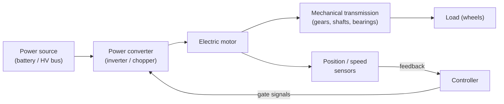
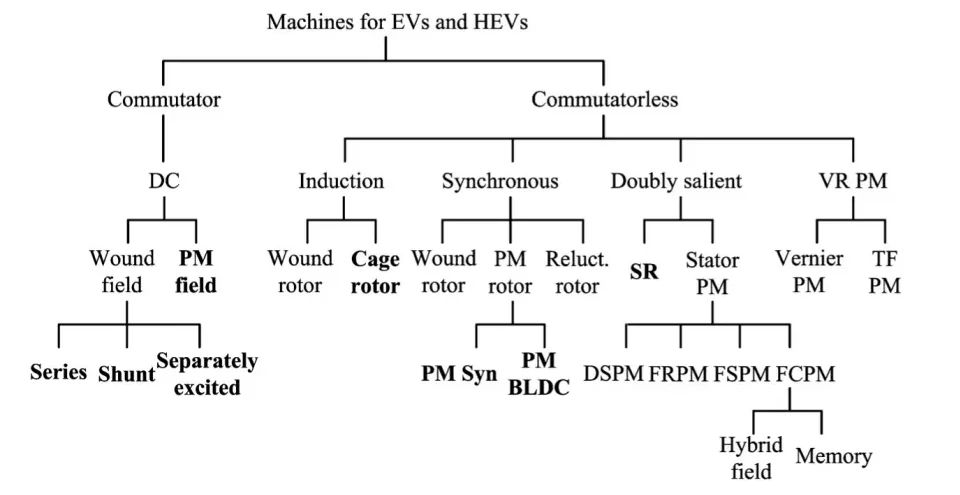
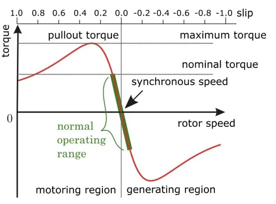
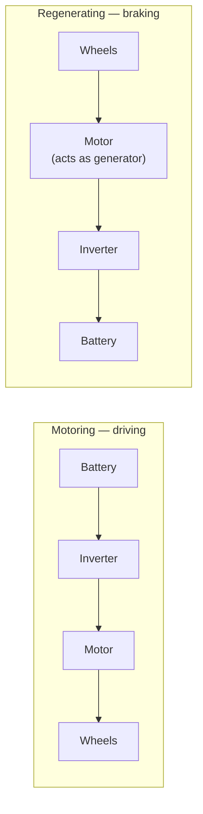
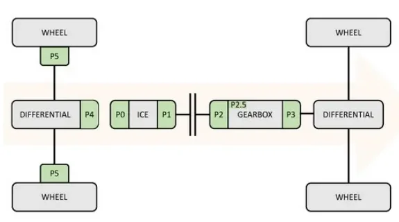

# Electric Motors

The electric machine is at the core of every electrified powertrain: it
converts the energy stored on board (battery or fuel cell) into motion, and
recovers braking energy as electricity. Understanding how these machines work
is a prerequisite for writing test cases for a traction inverter, calibrating
torque limits, or diagnosing faults on an e-axle.

This article covers the main machine families, how each one produces torque,
how the inverter controls them, and where the motor sits in hybrid layouts.
Topics:

- how an **electric drive** is structured and the electromagnetic principles
  every machine relies on,
- the three machine families used in vehicles — **direct current (DC)**,
  **induction** and **permanent-magnet brushless** (plus the switched
  reluctance motor),
- the **power converters** that feed them (rectifiers, choppers, inverters)
  and the **control strategies** behind them,
- **four-quadrant operation** and regenerative braking,
- where the motor sits in a hybrid powertrain (the **P0–P5** classification),
  and what real production electric vehicles (EVs) look like.

The focus is on operating principles and system-level behavior rather than
the full mathematical treatment.

## Why automotive traction is demanding

Before looking at the machines themselves, it helps to see why engineers
cannot simply use an industrial motor in a car. A traction machine faces much
stricter requirements than a motor sitting on a factory floor:

- **high torque and power density** — the machine must fit in the vehicle and
  add as little mass as possible;
- **wide speed range** — from low-speed creeping in traffic to high-speed
  cruising, usually with no multi-speed gearbox;
- **high efficiency over a wide torque/speed area** — every wasted percent is
  driving range lost;
- **wide constant-power operating region** (flux weakening at high speed);
- **low acoustic noise**;
- **reasonable cost**.

Every design trade-off in the rest of the article traces back to this
checklist.

## The electric drive system

The motor never works alone: an **electric drive** — an electromechanical
system that converts electrical energy into controlled mechanical motion —
always has the same six building blocks:

1. **Power source** — provides the energy (traction battery, high-voltage (HV)
   DC bus).
2. **Power converter** — interfaces the motor with the source and delivers
   adjustable voltage, current and/or frequency.
3. **Controller** — compares the speed/position command with the measured
   values and generates the control signals for the converter.
4. **Electric motor** — chosen for the power level, environment and
   performance the load requires.
5. **Feedback sensors** — return rotor position and/or speed to close the
   control loops.
6. **Mechanical components** — gears, shafts, belts, bearings that bring the
   motion to the load.

!!! tip "A useful mental model"
    The converter and controller bridge the gap between the battery's fixed
    DC voltage and the precisely timed, shaped currents the motor needs. When
    debugging a drive issue, the first question is usually whether the
    problem lies in the motor or in the conversion and control around it.

## Basic electromagnetic principles

Three physical laws suffice to understand every machine in this article:

- **Force on a conductor.** A conductor of length *l* carrying current *I* in
  a magnetic field *B* experiences a force F = B·I·l (direction given by the
  right-hand rule). Two conductors on opposite sides of a rotor loop form a
  *couple* — a pair of equal, opposite forces separated by a distance — whose
  moment is the **torque** τ that spins the rotor.
- **Induced electromotive force (EMF) — Faraday–Lenz law.** Whenever the
  magnetic flux through a loop changes, a voltage (EMF) is induced that
  opposes the change. In a spinning motor this **back EMF** always fights the
  supply current — it is what limits the current draw, and it is exactly what
  lets the same machine work as a generator when you brake.
- **Magnetic flux** Φ can be pictured as the number of field lines crossing an
  area; the denser the lines, the stronger the field and the torque.

Every electric motor also shares the same structure: a fixed **stator** and a
rotating **rotor**, separated by a thin **air gap** where the magnetic field
is most intense. Either part can carry windings or permanent magnets; torque
is always produced by the interaction of the two magnetic fields across the
air gap.

## Classification of traction machines

The family tree splits at the top between **commutator** machines (the classic
brushed DC motor, where current is mechanically switched in the rotor) and
**commutatorless** machines (induction, synchronous, reluctance — where an
electronic inverter does the switching). The rest of the article covers the
families that matter for EV and hybrid electric vehicle (HEV) propulsion,
roughly in the order the industry adopted them.

## The DC machine

### Structure and working principle

The DC (direct current) machine is the oldest type and the simplest to
analyze, so it is covered first. Its **stator** carries salient poles acting
as the field (inductor), built either with excitation windings carrying direct
current — connected so that consecutive poles have alternating polarity — or
with permanent magnets. The **rotor (armature)** is a cylinder of magnetic
material with slots on its periphery housing the active conductors, connected
in series to form a closed circuit.

The key component is the **commutator**, mounted on the rotor shaft. Without
it, a conducting loop in a magnetic field would only oscillate, because the
torque reverses every half turn. The commutator and the **brushes** sliding on
it reverse the armature current every half cycle, so the torque keeps the same
direction and the rotor spins continuously.

!!! warning "The brush–commutator system is the DC motor's weak point"
    Brushes wear, require continuous maintenance and produce unwanted
    sparking. This is why DC drives — although mature, cheap and simple to
    control — are no longer attractive for EV propulsion, where efficiency,
    power density and maintenance-free operation are mandatory. Small brushed
    DC motors remain common elsewhere in the vehicle (windows, seats, pumps),
    but not on the traction side.

### Equivalent circuit and governing equations

In steady state the armature is modeled as the back EMF **E** in series with
the armature resistance **R_a** (winding + brush contact):

- E = K_e · Φ · ω — the back EMF is proportional to excitation flux per pole
  and angular speed;
- T = K_e · Φ · I_a — torque is proportional to flux and armature current;
- V_a = E + R_a · I_a — the terminal voltage overcomes the back EMF plus the
  resistive drop.

From these, speed behaves as ω = (V_a − R_a·I_a) / (K_e·Φ): speed is roughly
proportional to armature voltage and falls slightly as load torque increases.
The key relationship: **voltage sets the speed, current sets the torque.**

### Speed regulation and braking

Three levers control the speed of a DC machine, effective in different ranges
and often combined:

| Method | Effect on the torque–speed characteristic |
|---|---|
| Armature voltage V_a | Shifts the no-load speed: the characteristic translates in parallel — higher V, higher ω. Only with separate excitation. |
| Excitation flux Φ | Field weakening: less flux → higher speed, less torque (constant-power region). |
| Armature resistance | Adds slope (speed droop under load); simple but dissipative. |

Armature **current** is controlled directly when maximum torque is demanded.

Regenerative braking follows from the same equations. If the back EMF E is
made larger than the supply voltage V, the armature current reverses while the
flux polarity stays the same: torque reverses sign and the machine becomes a
**brake**, absorbing energy from the load and returning it as electricity that
can be dissipated (rheostatic braking) or recovered (regenerative braking).
Combined with speed reversal, this gives **four-quadrant operation**:

| Quadrant | Speed | Torque | Operation |
|---|---|---|---|
| I | + | + | Forward motoring (accelerating) |
| II | − | + | Reverse braking (generating) |
| III | − | − | Reverse motoring |
| IV | + | − | Forward braking / regeneration |

Quadrant IV is the regenerative braking mode every EV depends on.

## Power converters for the DC machine

The converter choice follows the source: an **alternating current (AC)**
source calls for a rectifier built with naturally commutated devices
(thyristors), a **DC source** for a chopper built with forced-commutation
switches.

### AC/DC rectifiers

| Topology | Quadrants | Typical power range |
|---|---|---|
| Single-phase half-wave | I | light traction, just over 20 hp |
| Single-phase full-wave half-controlled | I | small/medium motors up to 75 kW (100 hp) |
| Single-phase full-wave fully-controlled | I–II (voltage reversible, current not) | small/medium drives |
| Single-phase dual converter (two bridges in anti-parallel, interlocked) | all 4 | up to ~15 kW |
| Three-phase half-controlled (semiconverter, freewheeling diode) | I | 15–150 hp |
| Three-phase fully-controlled | I–II | 15 kW up to several thousand kW |
| Three-phase dual converter (firing angles of the two bridges sum to 180°) | all 4 | 200–2000 hp |

The general pattern: moving from single-phase to three-phase bridges lowers
voltage/current ripple (smoother torque) and reduces the risk of discontinuous
conduction. The half-wave single-phase circuit needs only one power switch
plus a freewheeling diode across the motor — the diode dissipates the energy
stored in the motor inductance and gives the current a path while the switch
commutates — but it delivers poor motor performance.

### DC choppers

A **chopper** converts a fixed DC input into a variable DC output — the DC
equivalent of an AC transformer. Choppers offer high efficiency, fast response
and regeneration capability, and are built with semiconductor switches such as
power bipolar junction transistors (BJTs), metal-oxide-semiconductor
field-effect transistors (MOSFETs) and insulated-gate bipolar transistors
(IGBTs) — the device families used throughout power electronics.

| Class | Name | Quadrants | Behavior |
|---|---|---|---|
| A | step-down (buck) | I | output ≤ supply voltage |
| B | step-up (boost) | IV | output > input; stores energy in the inductor while the switch is on, returns it to the source when off — the regenerative braking path |
| C | buck-boost (half-bridge) | I–IV | S1/D1 act as buck, S2/D2 as boost |
| D | — | I–II | S1+S2 on → V_a = V (motoring); one switch + one diode → V_a = 0 (recirculation); both diodes → braking |
| E | full-bridge | all 4 | bidirectional current with positive or negative armature voltage — full motoring and regenerative braking in both directions, controlled by PWM duty cycle |

## The induction machine (IM)

The next family covers the AC machines, to which almost all modern traction
motors belong. The induction motor is the simplest and most reliable AC
machine: the most widely used motor in consumer and industrial markets,
available from a few watts to many kilowatts. Being commutatorless, it avoids
the DC motor's cost, maintenance and robustness problems in one stroke.

### Structure and working principle

The dominant type is the **squirrel-cage** IM:

- a **stator** with three-phase armature windings;
- a **rotor** made of conductive bars short-circuited by two end rings (the
  "cage");
- bearings, frame and end bells.

Feeding the three-phase stator windings creates a **rotating magnetic field**
in the air gap — a chain of north–south poles revolving around the stator at
the **synchronous speed** ω_s, fixed by the supply frequency and the number of
pole pairs p: ω_s = 2πf / p.

The operating principle gives the machine its name: the rotor turns *slower*
than the field (hence "asynchronous"). Because of this relative motion, the
flux linkage through the rotor cage changes and currents are **induced** in
the bars (Faraday's law) — no brushes, no wires to the rotor. These currents
build a rotor field that opposes the flux variation and interacts with the
stator field, producing torque. The normalized speed difference is the
**slip** s = (ω_s − ω_r) / ω_s.

### Torque–speed behavior

- At synchronous speed (s = 0) no current is induced in the rotor, so **no
  torque** is produced — torque requires relative motion between field and
  rotor.
- Rotor slower than the field (s > 0) → **motoring**; rotor faster (s < 0) →
  **generating**. The same machine brakes regeneratively the moment the wheels
  push it past synchronous speed.
- The peak of the curve is the **pullout torque**; nominal torque is
  conventionally half of it, and the machine normally works in the linear
  region between the positive and negative nominal torque.

The per-phase equivalent circuit models stator resistance and leakage
reactance (R_s, X_s), rotor resistance and leakage reactance referred to the
stator (R_r, X_r), and a magnetizing branch (R_m, X_m). It is the basis of the
motor models used in simulation tools.

### Control: from V/f to FOC

- **V/f (scalar) control** — keeps voltage proportional to frequency
  ("volts per hertz") so the flux stays constant. Simple and still common in
  industrial drives, but it acts only on the *magnitude* of the quantities,
  not their phase — dynamic performance is limited.
- **Field-Oriented Control (FOC)** — the three instantaneous AC quantities
  are projected, via the **Park–Clarke transformations** (ABC three-phase →
  αβ stationary two-phase → dq frame rotating with the rotor field), into two
  DC quantities: a flux-producing current component and a torque-producing
  one. Controlling them independently gives the induction machine
  DC-machine-like torque controllability — restoring for AC machines the
  "voltage sets speed, current sets torque" simplicity of the DC machine.

!!! tip "Why FOC dominates EV drives"
    FOC delivers high efficiency (stator and rotor fluxes aligned for best
    torque production), high dynamic response (voltages, currents and fluxes
    controlled in magnitude *and* phase), low torque ripple, independent flux
    and torque control, a wide constant-power range through flux weakening,
    and high starting torque with low starting current — with four-quadrant
    operation. Torque-control test cases in EV validation are typically built
    on FOC.

### The inverter

EV traction inverters are almost exclusively **voltage-fed** three-phase
full-bridge designs (current-fed inverters need a large series inductance and
are rarely used). Two switching strategies matter:

- **Sinusoidal pulse-width modulation (PWM)** — a sinusoidal modulating wave
  (amplitude A_s, frequency f_s) is compared with a triangular carrier
  (A_t > A_s, f_t ≫ f_s). When the modulating wave exceeds the carrier, the
  upper switch of that phase leg turns on; otherwise it turns off. The result
  is width-modulated pulses whose fundamental reproduces the wanted sine
  wave; implementable in analog or digital form.
- **Six-step (square wave)** — each switch is closed for half a period and the
  inverter changes state every T/6, cycling through the six active states
  (101), (100), (110), (010), (011), (001). The output amplitude depends only
  on the DC-link voltage V_CC and the switch states.

Practical selection rules for the IGBT-based inverters used in modern EVs:

- voltage rating **at least twice** the nominal battery voltage;
- current rating large enough to avoid paralleling devices;
- switching speed high enough to suppress motor harmonics and acoustic noise.

A note on variants: the wound-rotor IM is less attractive than the squirrel
cage (cost, maintenance, ruggedness), so "induction motor for EVs" effectively
means the squirrel-cage type — low cost and ruggedness outweigh its control
complexity. Production example: the 2020 Mercedes-Benz EQC uses two induction
motors.

## Permanent-magnet brushless machines

This is the dominant family in current production EVs. Permanent-magnet (PM)
brushless drives — above all the PM synchronous drive — are currently the most
attractive technology for EV propulsion and dominate market share, thanks to
high power density and high efficiency from high-energy magnet materials.
Their shortcomings are the cost and the thermal instability of the magnets.

The family splits in two by the shape of the back EMF at the air gap:

| | PMSM (PM synchronous machine) | BLDC (brushless DC) |
|---|---|---|
| Back EMF / current waveforms | sinusoidal | trapezoidal EMF, rectangular currents |
| Inverter | voltage-fed (VSI), PWM — typically space-vector modulation | current-fed style, stepwise (six-step-like) |
| Commutation | continuous, field-oriented | electronic, in strokes keyed to rotor position |
| Torque production | reaction torque (PM flux × q-axis current) + reluctance torque (L_d ≠ L_q) | each phase EMF is a bipolar trapezoid displaced 120° electrical; currents 120° positive / 120° negative keep synchronism without torque pulsations |
| Strengths | higher efficiency, lower torque ripple, more mature | higher power and torque density |
| Modeling | rotor d–q reference frame | d–q not applicable (nonsinusoidal flux) — per-phase state model |

Both share the same basic structure — a star-connected three-phase stator
winding and a rotor carrying permanent magnets — which is simpler than the
induction rotor (no cage bars or end rings). In the PMSM the rotor spins *at*
synchronous speed, locked to the stator field like two meshed gears. The BLDC
is best pictured as a DC motor turned inside out: **electronic commutation**
replaces the brushes and produces unidirectional torque the same way the
commutator did — which is why it inherits the "DC" name despite being an AC
machine.

Control follows the waveforms. The PMSM inherits the induction-machine
strategies (**FOC**, direct torque control), plus two important additions:
**flux weakening** — essential because the PM excitation cannot be turned down
at high speed — and **position-sensorless** control to eliminate the costly
encoder. The BLDC, driven with the stator flux kept near 90° from the rotor
flux, naturally gives maximum torque per ampere in the constant-torque region
using 120° two-phase or 180° three-phase conduction; for constant-power
cruising it needs **phase-advance angle control**, and sensorless schemes are
actively developed for it too.

## Switched reluctance motor (SRM)

The switched reluctance motor is less common in production but worth covering.
The SRM produces torque purely by **reluctance**: its rotor is a solid
salient-pole piece of soft magnetic material with **no magnets and no
windings** — the simplest possible rotor construction. Energizing a stator
phase pulls the nearest rotor pole into alignment (like a nail pulled toward
an electromagnet); switching the phases in sequence keeps the stator field
ahead of the rotor and drags it around. Simple, reliable and cheap with good
efficiency and power density — but noisy, with higher torque ripple, lower
power factor and poorer speed control, which is why it remains a niche
technology.

## Four-quadrant operation and regenerative braking

EV propulsion needs all four quadrants — forward motoring, forward
regeneration, backward motoring and backward regeneration. Quadrants I and IV
share the positive phase sequence A-B-C; III and II use the reversed sequence
A-C-B. The same hardware simply reverses the direction of energy flow:

!!! note "Regeneration and range"
    Forward regeneration converts braking energy back into battery charge and
    can increase driving range per charge by **over 10%** — one reason every
    EV traction inverter is designed for bidirectional power flow, and
    regenerative-braking test cases appear in nearly every EV validation
    plan.

## Choosing the motor: comparison

The following table compares the four machine families:

| | DC (brushed) | Induction (squirrel cage) | PMSM / BLDC | SRM |
|---|---|---|---|---|
| Power/torque density | low | poor | **high** | good |
| Efficiency | moderate | high at low–medium speed, poor at high speed | **high** | good |
| Robustness / maintenance | poor (brushes, sparking, wear) | **simple, robust, low maintenance** | maintenance-free but temperature-sensitive magnets | very simple, high reliability |
| Cost | cheapest | low | **high** (magnets) | low |
| Control complexity | simplest | complex (FOC) | more complex | moderate |
| EV role today | legacy | some EVs (e.g. Mercedes EQC) | **preferred technology** | niche |

## Where the motor sits: hybrid architectures (P0–P5)

In hybrids, engineers use the **Px** code to name the electric motor's
*position* in the powertrain — the number roughly tracks the distance between
the motor and the wheels, decreasing from P0 to P5. These codes appear in
every hybrid architecture discussion.

| Config | Motor position | Pros | Cons |
|---|---|---|---|
| **P0** | Belt-driven Starter Generator (BSG) replacing the alternator, e.g. Audi 48 V system (DC-DC, 12 V + 48 V batteries, integrated BSG) | Cheapest; no change to vehicle/transmission architecture; drops into the existing accessory belt | Belt mechanically ties the electric machine to the internal combustion engine (ICE) → friction losses; belt slip limits torque (12 V starter kept for cold starts); belt durability |
| **P1** | On the crankshaft, same speed as the engine | No belt: slightly better efficiency, more torque and faster response; electric creeping | Crankshaft/engine redesign; motor still on ICE side (no disconnection); higher cost |
| **P2** | Between engine and transmission, with a clutch to decouple the ICE (e.g. Porsche Panamera with ZF transmission) | Full-electric drive with clutch open; recuperation without dragging the ICE; electric creep and e-coasting | High integration cost; larger battery; conventional starter still needed for start & stop (S&S) |
| **P2.5** | Inside a dual-clutch transmission (DCT), on the even-gear shaft | Easy integration (same ICE); electric drive via the even shaft; combined ICE+motor modes | Requires a DCT; starter still needed unless combined with P0 |
| **P3** | Downstream of the gearbox | Minimized losses — the motor drives only the final part of the transmission | Transmission limits both propulsion and recuperation efficiency |
| **P4** | On the axle *not* driven by the ICE (e.g. Toyota Prius IV with induction motor + inverter) | Electric all-wheel drive (AWD) with no mechanical link to the engine; easy pure-electric mode; highest recuperation potential | Larger battery/motor/electronics; S&S inhibited without an engine-side motor |
| **P5** | In-wheel motors | No "distance" at all | Still limited production application |

Two practical notes:

- P2–P4 configurations place the motor after the clutch, which inhibits the
  classic **start & stop** function — hence combined **P1+P2 / P1+P4** layouts
  that add an engine-side motor to restore S&S and enable load shift and
  torque assist, at the price of exponentially higher complexity and cost.
- Typical fuel-efficiency gains: P1 around **10%**; P3/P4 up to **25%** on
  standard cycles (more in urban driving). In P0, power electronics are often
  integrated into the motor; from P1 up, liquid cooling is required (air
  cooling is not feasible for driveline-mounted machines).

The vehicle categories built on these blocks: **MHEV** (mild hybrid — ICE
drives, compact motor assists), **FHEV** (full hybrid — short full-electric
stretches at low speed), **PHEV** (plug-in hybrid — larger battery charged
from the grid, 40–60 km zero-emission urban range), **BEV** (battery electric
vehicle — the simplest powertrain, needs an onboard charger), and **FCEV**
(fuel-cell electric vehicle — same electric powertrain as a BEV, energy from
a fuel cell, e.g. Toyota Mirai).

## The traction battery in one page

Since the battery is the source every drive depends on, the lessons include a
compact primer:

- **Key quantities** — open-circuit voltage (terminals at zero current),
  capacity (Ah), mass energy density (Wh/kg or kJ/kg), power density (W/kg),
  cycle life (standard cycles until capacity falls below 80%), C-rate (current
  relative to capacity: 5000 mA out of a 500 mAh cell = 10C), state of charge
  (SOC — available / maximum capacity), nominal voltage (at 50% SOC, 0.2C
  discharge).
- **Chemistries** — lithium (traction; cell open-circuit voltage 2.5–4.3 V,
  >500 kJ/kg, cycle life 2500–12 000, but expensive and
  thermal-runaway-prone), lead-acid (12/24 V auxiliaries; cheap, robust, >99%
  recyclable, huge burst currents, ~140 kJ/kg, 50–100 cycles), nickel-metal
  hydride (NiMH — older hybrids such as pre-2015 Prius; safe and cheap but
  lower density). For contrast: gasoline stores ~44 000 kJ/kg.
- **Behavior** — terminal voltage and harvestable energy fall as discharge
  current rises; the simplest model is an ideal source with a series
  resistance (equivalent series resistance, ESR), both SOC- and
  temperature-dependent. Aging raises ESR (more self-heating, deeper voltage
  sag) and shrinks capacity. Ideal operating window is 20–30 °C; above 55 °C
  is dangerous; extreme cold can make lithium packs unusable or unchargeable.
- **Pack design** — cells in **series** raise voltage (packs up to 800 V; same
  current through every cell, so one weak cell jeopardizes the whole string);
  strings in **parallel** raise capacity/current (same voltage, but mismatched
  SOC or temperature causes back-currents and overload between packs on the HV
  bus). High voltage keeps ohmic losses low.
- **Battery management system (BMS)** — the electronic control unit that
  connects/disconnects the packs to the HV bus, balances cells, requests
  cooling/heating, estimates SOC and state of health (SOH — ESR is a
  degradation indicator), enforces max charge/discharge currents, and runs
  diagnosis: over/undervoltage, overcurrent, overtemperature, insulation
  measurement.

## Production EV reference points

The lessons close with real production vehicles — useful context when these
vehicles appear in test fleets:

| Vehicle | Power | Battery | DC fast charge |
|---|---|---|---|
| Audi e-tron | 370 kW AWD, 973 Nm | 95 kWh (86.5 usable), 400 V, liquid-cooled | CCS 150 kW, 0–100% in 50 min |
| Mercedes EQC 400 | 300 kW AWD | 84.5 kWh (80 usable), 400 V, air-cooled | CCS 110 kW, 10–80% in 40 min |
| Tesla Model S LR | 415 kW AWD | 100 kWh, 350 V, liquid-cooled | Supercharger V3 250 kW, 10–80% in 30 min |
| Porsche Taycan | 300 kW RWD | 93.4 kWh (83.7 usable), **800 V**, liquid-cooled | CCS 270 kW, 5–80% in 22 min |
| BMW iX3 | 210 kW RWD | 80 kWh (74 usable), 400 V, air-cooled | CCS 150 kW, 10–80% in 34 min |
| Renault Megane E-Tech | 96 kW FWD | 40 kWh usable, 352 V, liquid-cooled | CCS 85 kW |

(CCS is the Combined Charging System, the standard DC fast-charging connector
in Europe; AWD/RWD/FWD are all-/rear-/front-wheel drive.)

The table confirms the trend predicted in the battery section:
higher-voltage systems (the Taycan at 800 V) charge much faster, because the
same power needs less current.

!!! success "Key takeaways"
    - An electric drive consists of a source, converter, controller, motor,
      sensors and mechanical transmission; the converter adapts the source to
      the motor's needs.
    - In DC machines, voltage sets speed and current sets torque; when the
      back EMF exceeds the supply voltage (E > V), the machine works as a
      regenerative brake.
    - Induction machines are rugged and cheap; torque comes from slip, and
      FOC (via Park–Clarke dq transforms) gives them DC-like controllability.
    - PM brushless machines (PMSM/BLDC) are the most common traction
      technology — highest efficiency and power density — at the price of
      magnet cost and temperature sensitivity.
    - Traction inverters are voltage-fed IGBT full bridges rated at ≥ 2×
      battery voltage, switching with sinusoidal PWM / space-vector
      modulation or six-step, and must run all four quadrants — regeneration
      alone adds over 10% range.
    - The P0–P5 code identifies the position of a hybrid's motor, from belt
      starter-generator (P0) to in-wheel (P5); capability, cost and
      complexity grow toward the wheels.

!!! tip "Where this leads"
    With the machine-level foundations in place, see how these motors are
    arranged in complete vehicles in
    [HEV/BEV Architectures](../hev-architecture-bev/index.md) and
    [Hybrid Architectures](../hev-architecture-hybrid/index.md), and where
    the high-voltage system fits in the car in
    [E/E Architecture](../ee-architecture/index.md).
