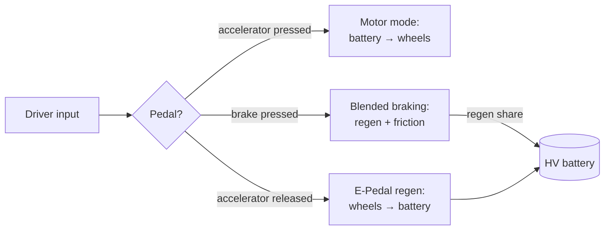
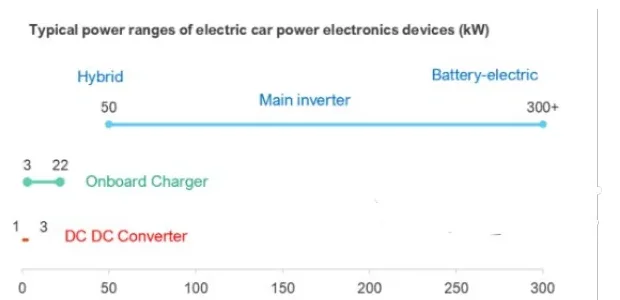
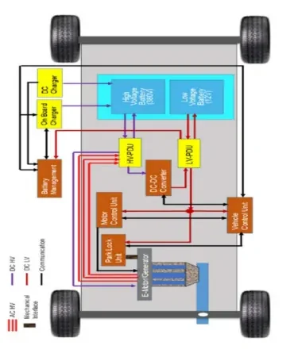
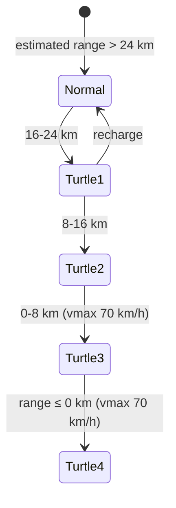

# Battery Electric Vehicle (BEV) Architecture

A **Battery Electric Vehicle** is a *pure* electric vehicle: the only traction
device is the electric motor, and the only energy source on board is the
chemical energy stored in rechargeable battery packs. There is no combustion
engine to fall back on — every aspect of propulsion, braking energy recovery
and charging is handled electrically.

Every BEV is built around four main component groups:

1. **Electric machine** — the traction motor (which also works as a generator)
2. **Battery packs** — the high-voltage traction battery plus a conventional
   low-voltage auxiliary battery
3. **Power managing units** — the power electronics between battery and motor
4. **Digital control system** — the control units that coordinate everything

This article walks through each group and closes with a real case study: the
Fiat 500-based **332 City BEV** and its sporty derivative, the **595e Abarth
BEV**.

## The electric machine: why a BEV needs no gearbox

An electric motor delivers its full drive torque from standstill and can spin
beyond **10,000 rpm**. That single fact eliminates most of the transmission
hardware an ICE vehicle needs:

- **No multi-gear transmission** — the torque/speed characteristic of the
  motor covers the whole vehicle speed range with a single fixed ratio.
- **No reverse gear** — to drive backwards it is enough to reverse the motor
  current phase; the motor simply turns the other way.
- **No clutch** — the motor can hold zero rpm under load without stalling.

The practical result for the driver is that a BEV is operated with just two
commands: the **accelerator pedal** and the **brake pedal**.

!!! note "Bidirectional machine"
    The same electric machine works in both directions of energy flow: as a
    **motor** (electric energy → mechanical torque) and as an **alternator**
    (mechanical rotation → electric current). Exploiting this bidirectionality
    is the key to energy efficiency in a BEV.

## Regenerative braking and one-pedal driving

In a conventional vehicle, braking means pressing pads against discs: kinetic
energy turns into friction heat and is lost to the environment. A BEV instead
**recovers** part of that energy: the traction motor reverses its operation,
acts as an alternator driven by the wheels, and converts kinetic energy back
into electric current that recharges the high-voltage battery.

Regeneration happens in two situations:

1. **Brake pedal applied** — classic *regenerative braking*. The braking
   torque requested by the driver is split between the electric machine
   (regeneration) and the friction brakes.
2. **Accelerator pedal released (coasting)** — the *E-Pedal*, also called
   **One-Pedal Drive**. Releasing the accelerator actively decelerates the
   vehicle through the motor instead of letting it coast freely.

The amount of energy recovered is proportional to the braking force — the
stronger the deceleration, the greater the generated current — and ultimately
depends on the vehicle's speed and the duration of the brake application.



With One-Pedal Drive active, releasing the accelerator is enough to bring the
vehicle to a complete stop: the deceleration is modulated according to the
current speed and how quickly the driver eases off the pedal. The brake pedal
becomes necessary only for emergency stops or very strong deceleration.

!!! tip "Why this matters for range"
    Regeneration is not a gadget — it directly extends the usable charge of
    the HV battery. Calibrating *how much* deceleration the motor provides on
    pedal release is one of the main levers the vehicle control unit uses to
    differentiate drive styles (see the case study below).

## The battery system

Every BEV actually carries **two** batteries:

| Battery | Role | Charged from |
|---|---|---|
| **HV traction battery** (EVB) | Powers the electric motor(s); lithium-ion for its high energy density relative to weight | The grid, via the onboard charger; also regenerative braking |
| **LV auxiliary battery** (typically 12 V) | Powers the ECUs and most vehicle actuators ("hotel" loads) | The HV battery, via the DC-DC converter |

Only the HV battery is connected to the charging grid. The 12 V battery is
maintained by the HV side — there is no alternator belt-driven by an engine
as in a conventional car.

Modern all-electric cars span a wide capacity range: from **6.0 kWh** (2012
Renault Twizy) up to **100 kWh** (2012 Tesla Model S / 2015 Tesla Model X).

## Power electronics: the power managing units

"Power electronics" covers everything between the battery pack and the
electric motor that regulates energy flow according to the instantaneous
demand. The three main components are:

- **Inverter** — a high-power DC→AC converter that feeds the battery's direct
  current to the three-phase traction motor. It is the most critical of the
  three: it operates at the highest power and directly enables traction.
- **Onboard charger** — an AC→DC rectifier that converts grid power into DC
  to charge the HV battery.
- **DC-DC converter** — steps the high traction voltage down to the low
  voltage needed by the 12 V battery, ECUs and auxiliary loads.



The power levels differ by roughly two orders of magnitude:

| Device | Typical power range |
|---|---|
| Main inverter | 50 kW (hybrid) → 300+ kW (battery-electric) |
| Onboard charger | 3–22 kW |
| DC-DC converter | 1–3 kW |

## The digital control system

A BEV concentrates its propulsion intelligence in a few typical control units:

- **PIM — Power Inverter Module.** The high-power DC→AC converter for the
  traction motor. It hosts two controllers:
    - **EVCU — Electric Vehicle Control Unit**: manages propulsion, device
      temperatures, auxiliary components, battery charging and the main
      vehicle actuators.
    - **MCP — Motor Control Processor**: manages the e-motor's kinematic
      parameters. Starting from accelerator and brake pedal information, it
      interacts tightly with the EVCU and reports the estimated shaft torque
      for torque compensation.
- **IDCM — Integrated Dual Charger Module.** Combines the onboard charger
  (AC→DC, from the grid) and the DC-DC converter (HV → 12 V for the auxiliary
  battery and all control units) in a single unit.
- **BPCM — Battery Pack Control Module.** Supervises the critical battery
  functions: voltage, temperature and current monitoring, **state of charge
  (SoC)** estimation and **cell balancing** of the lithium-ion cells.



```mermaid
flowchart TD
    GRID["Charging grid (AC)"] --> OBC["Onboard charger<br/>(in IDCM)"]
    OBC --> HV[("HV battery pack<br/>(supervised by BPCM)")]
    HV --> DCDC["DC-DC converter<br/>(in IDCM)"] --> LV[("12 V battery")] --> ECUS["ECUs & auxiliaries"]
    HV --> PIM["PIM: EVCU + MCP<br/>(inverter)"]
    PIM <-->|"3-phase AC"--> EM["Electric machine"]
    EM -->|"traction torque"| W(["Wheels"])
    W -->|"regenerative braking"| EM
```

## Case study: 332 City BEV vs 595e Abarth BEV

The **332 City BEV** (the electric Fiat 500) was the first fully electric car
from Fiat Chrysler Automobiles, unveiled in March 2020. Its sporty derivative,
the **595e Abarth BEV**, followed in March 2023 — same electric motor, but
with different regulation, firmer suspensions and more advanced stability
control systems.

### Technical comparison

| Feature | 332 City BEV | 595e Abarth BEV |
|---|---|---|
| Li-ion battery pack | 42 kWh → 320 km WLTP (up to 400 km); also 24 kWh → 180 km WLTP | 42 kWh → 225 km WLTP |
| Motor | Front-axle permanent magnet synchronous motor | Same motor, sport calibration |
| Max power | 87 kW (118 CV) | 120 kW (180 CV) |
| Max wheel torque | 2112 Nm (τ = 9.8) | 2400 Nm (τ = 10.22) |
| Max wheel radius | 28.8 cm | 29.2 cm |
| Vehicle mass | 1433–1493 kg | 1464–1524 kg |

The Abarth extracts more power and torque from the same hardware at the price
of range (225 km vs 320 km on the same 42 kWh pack) — a classic
performance-vs-efficiency calibration trade-off.

### Driver-selectable drive styles

The 332 was designed as a city car — fun but not sporty — so the driver
selects among three styles with a selector device:

| Drive style | 332 City BEV | 595e Abarth BEV |
|---|---|---|
| Comfort-oriented | **Normal** — good acceleration, 150 km/h max speed, OPD not active | **Turismo** — the only urban-oriented style, OPD active |
| Efficiency | **Range** — slower acceleration, One-Pedal Drive active | — |
| Range preservation | **Sherpa** — very slow acceleration, One-Pedal Drive active, 80 km/h max speed | — |
| Sporty | — | **Sport Street** — OPD active |
| Track | — | **Sport Track** — OPD not active |

!!! note "Drive style on the CAN bus"
    The selected drive style is broadcast as the signal
    `C1 BODY7.DriveStyleSts`, with values such as *Normal (0)*, *City (1)*,
    *Sport Fun (2)* and *Eco (4)*. When you trace vehicle behavior in CANoe or
    CANalyzer later in the bootcamp, this is the kind of signal you will
    monitor to correlate driver selection with powertrain response.

### SOC-related drive modes (driver-independent)

Independently of what the driver selects, the vehicle protects its battery
when the estimated range runs low. Both vehicles apply progressive
limitations ("turtle" modes) based on the estimated remaining range:

| Estimated range | Behavior |
|---|---|
| 16 km < range < 24 km | Previous drive style kept, speed limitation applied |
| 8 km < range < 16 km | Previous drive style kept, stronger speed limitation |
| 0 km < range < 8 km | Maximum speed clamped to 70 km/h |
| range ≤ 0 km | Maximum speed clamped to 70 km/h |



### OPD-disabling drive mode

Both vehicles also define a mode that disables One-Pedal Drive with a
non-aggressive pedal map. On the 332 this falls back to the **Normal** pedal
map; on the 595e it uses the **default** pedal map, which was calibrated on
the former *Eco* pedal map (since the 595 range does not offer that drive
style).

!!! success "Key takeaways"
    - A BEV has four pillars: electric machine, battery packs, power managing
      units, and the digital control system.
    - The electric machine's torque-from-zero and >10,000 rpm capability
      removes the gearbox, clutch and reverse gear; reverse is just a phase
      swap.
    - Regenerative braking and One-Pedal Drive turn the motor into an
      alternator on brake application or throttle release, recharging the HV
      battery — recovered energy scales with braking force, speed and
      duration.
    - Every BEV has two batteries: the HV traction pack (charged from the
      grid via the onboard charger) and a 12 V auxiliary battery (charged
      from HV via the DC-DC converter).
    - Key control units: PIM (with EVCU + MCP), IDCM (charger + DC-DC) and
      BPCM (battery monitoring, SoC, cell balancing).
    - Drive styles (Normal / Range / Sherpa vs Turismo / Sport Street / Sport
      Track) are calibrations of pedal map, speed limit and One-Pedal Drive —
      broadcast on CAN as `BODY7.DriveStyleSts` — and SOC-based turtle modes
      override them to protect a nearly empty battery.

!!! tip "Where this leads"
    The hybrid counterpart of this architecture — where an ICE and one or
    more e-machines share traction duties — is covered in
    [HEV Architecture Hybrid](../hev-architecture-hybrid/index.md), and the
    motor technology itself in [Electric Motors](../electric-motors/index.md).
