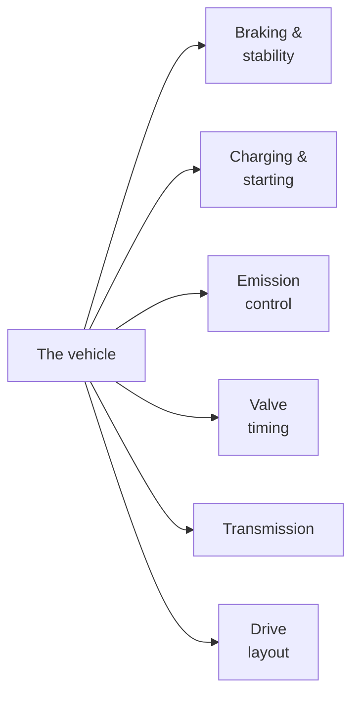
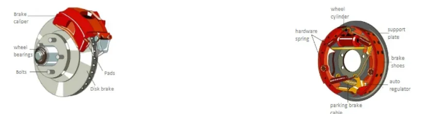
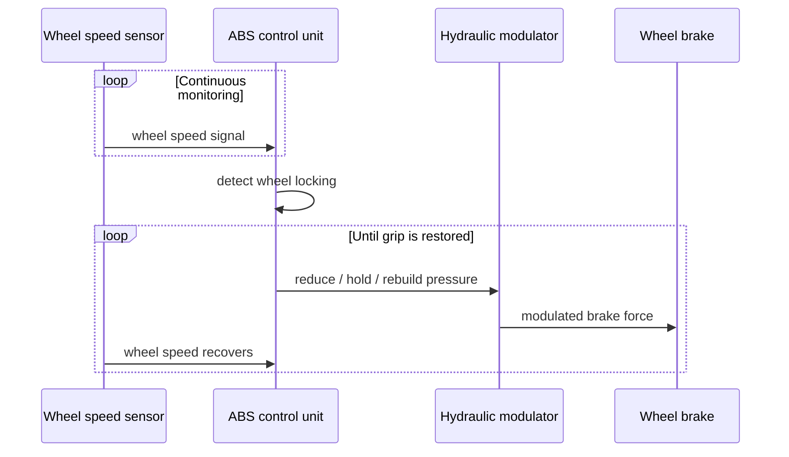
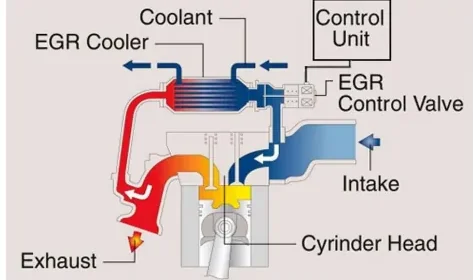
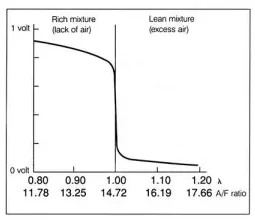
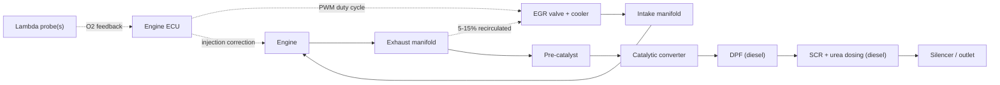
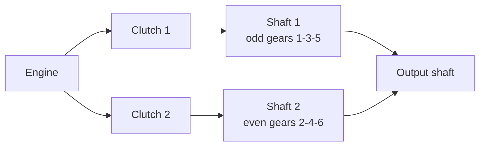

# Vehicle Subsystems

Before testing, calibrating or diagnosing an Electronic Control Unit (ECU) —
the small computers that run the vehicle's functions — you need to know what
those ECUs actually control. This article covers the subsystems used throughout
the bootcamp: the brakes and their electronic control functions, the charging
and starting hardware, the exhaust after-treatment chain, the valve train, the
transmission, and the drive layout. For each subsystem, the physical principle
is presented first, followed by how the electronic control layer operates on
top of the mechanics. The objective is to be able to explain, for each system,
what it does, what the ECU measures, and what it commands.

This article can be used as a reference to revisit whenever a later lesson
mentions one of these subsystems.

## Braking system

### Drum brakes and disk brakes

Both designs convert the driver's pedal force into friction that slows the
wheel, but they do it differently:

| | Disk brake | Drum brake |
|---|---|---|
| Principle | Caliper squeezes pads against a rotating disk | Shoes are pushed outward against the inside of a rotating drum |
| Actuation | Hydraulic pressure presses the pads with a force proportional to pedal effort | Wheel cylinder pushes the friction-coated shoes against the drum |
| Typical use | Front axle (most of the braking work), increasingly all four wheels | Rear axle of smaller cars; also integrates the parking brake cable |
| Behavior | Better heat dissipation and fade resistance | Self-energizing effect, cheap, good as a parking brake |

The hydraulic circuit is what translates pedal travel into clamping force: the
pressure of the brake fluid in the circuit rises with pedal effort, so the
force on the pads stays proportional to what the driver requests.

### Oversteer and understeer

Two terms describe how a car deviates from the trajectory the driver intends
in a curve. They matter because the stability systems below exist to correct
exactly these behaviors:

- **Oversteer** — the car turns *tighter* than intended; the rear axle loses
  adhesion and the tail steps out, which can lead to a spin if uncorrected.
- **Understeer** — the car runs *wider* than intended; the driver must lift off
  and straighten the steering momentarily to get back on line. It is more
  common on front-wheel-drive cars driven fast through a curve, or when the
  front wheels lock under braking.

### ABS — Antilock Brake System

A locked wheel cannot steer: it slides, and the tire's grip collapses. The
**Antilock Brake System (ABS)** exists to keep the wheels at the edge of
locking instead of beyond it.

Each wheel carries a speed pickup — a toothed **phonic wheel** (an angular
position transducer) read by an **inductive proximity sensor**. The ABS control
unit computes the rotational speed of every wheel from these signals. When it
detects that one or more wheels are decelerating far faster than the vehicle
can physically slow down — the signature of an imminent lock — it modulates the
hydraulic pressure to that wheel's brake, releasing and re-applying it many
times per second, while the driver keeps full braking and steering authority.

!!! note "ABS preserves steerability, not always the shortest stopping distance"
    The main benefit of ABS is that the wheels keep rolling, so the car remains
    steerable during emergency braking — the driver can brake *and* swerve. On
    some surfaces (gravel, deep snow) stopping distance can even increase, but
    the vehicle stays controllable.

### EBD — Electronic Brakeforce Distribution

The load on each wheel during braking is never equal: weight transfers forward,
so the rear wheels unload and have less grip on the asphalt. If they receive
the same brake force as the front, they lock first — and a locked rear axle
destroys the car's directional stability and can make it spin.

**Electronic Brakeforce Distribution (EBD)** uses the ABS hardware (wheel speed
sensors and the hydraulic modulator) to apportion brake force between the
axles. It lightens the braking force on one or both rear wheels — especially in
corners, where the inner rear wheel is most unloaded — so that lock-up is
avoided at the axle that can least afford it. EBD effectively applies ABS logic
*preventively* to the brake balance, rather than reactively to a locking wheel.

### ESC — Electronic Stability Control

**Electronic Stability Control (ESC)** is the system that directly corrects
oversteer and understeer. Bosch markets it as **ESP** (Electronic Stability
Program); other manufacturers use names such as DSC for functionally
equivalent systems.

When the car starts to skid — the measured yaw behavior no longer matches what
the steering angle implies the driver wants — ESC intervenes on two channels at
once:

1. **Engine torque reduction** — the control unit asks the engine management to
   cut power.
2. **Selective braking** — individual calipers are applied with different
   intensity, creating a corrective moment that pulls the car back onto the
   intended attitude.

### TCS / ASR — Traction Control System

The **Traction Control System (TCS)**, also called ASR, is the
acceleration-side counterpart of ABS: it prevents the drive wheels from
spinning when the driver asks for more torque than the surface can transmit —
typical on rain-soaked or icy pavement, or whenever one wheel loses traction.

Using the same wheel speed sensors as ABS, the controller identifies a spinning
wheel and intervenes, depending on the system design, on one or both of:

- **the brake** of the spinning wheel, so torque is effectively redirected to
  the wheel with grip,
- **the engine power output**, reducing torque until traction is restored.

### Hill Holder

Hill Holder addresses hill starts: when starting from a standstill on an
uphill grade, it keeps the brakes applied during the gap between the driver
releasing the brake pedal and the engine delivering enough torque to move off,
so the vehicle does not roll backwards.

### How the braking assistants fit together

| System | Situation it handles | Actuators used |
|---|---|---|
| ABS | Wheels locking under braking | Hydraulic brake pressure per wheel |
| EBD | Unequal axle loading, rear lock-up (especially in curves) | Hydraulic brake pressure per wheel |
| ESC | Skidding, oversteer/understeer | Individual brakes **and** engine torque |
| TCS/ASR | Drive wheels spinning under acceleration | Brake of spinning wheel and/or engine torque |
| Hill Holder | Rolling back on hill starts | Brake hold |

!!! tip "One hardware platform, many functions"
    ABS, EBD, ESC, TCS and Hill Holder share the same sensors (wheel speed),
    the same hydraulic modulator and largely the same ECU. When you later test
    one of them on a Hardware-in-the-Loop (HIL) rig or in the vehicle, you are
    really testing the whole braking-control platform from different functional
    angles — which is relevant when planning test cases.

## Charging and starting

### The alternator — and the Smart Alternator

The alternator's job is to keep the battery charged: the battery is needed to
start the engine and to power every electrical function on board. The
alternator produces alternating current (AC), and since AC cannot be stored, a
**rectifier bridge** converts it to direct current (DC) so the battery can
accumulate it.

A classic alternator draws mechanical power from the engine almost constantly.
A **Smart Alternator (SAM)** instead varies how much power it takes from the
engine depending on the vehicle's running state — for example charging
aggressively during deceleration (recovering energy that would otherwise become
heat in the brakes) and backing off during acceleration, when all engine power
should go to the wheels. This saves fuel, at the cost of much tighter
integration between the alternator, the battery sensor and the engine ECU.

### The starter motor

An internal combustion engine cannot start itself: it must first be cranked to
a rotational speed high enough for the combustion cycle to become
self-sustaining. The **starter motor** does this. It is an electric motor that
absorbs current from the battery and is mechanically coupled to the engine
shaft to spin it up; once the engine fires and runs on its own, the starter
disengages.

## Emission-control subsystems

Exhaust after-treatment is a chain of devices, each targeting specific
pollutants. Understanding which device does what — and what the ECU measures to
control it — is essential before you ever look at a Diagnostic Trouble Code
(DTC, the standardized error codes you will read in the MIL2 diagnosis
lessons) in this area.

### EGR — Exhaust Gas Recirculation

**Exhaust Gas Recirculation (EGR)** takes a small portion (typically **5–15%**)
of the exhaust gas and routes it from the exhaust manifold back into the intake
manifold, where it is aspirated into the cylinders with the fresh charge.

The recirculated gases are burnt and inert: they do not participate in
combustion. That is precisely the point — they dilute the combustible mixture,
which lowers the **peak combustion temperature**, and lower peak temperatures
sharply reduce the formation of **nitrogen oxides (NOx)**. The trade-off is a
reduction in the power the cycle can deliver.

The engine control unit drives the **EGR valve with a Pulse-Width Modulation
(PWM) signal** — a square wave whose *duty cycle* (the percentage of time it
stays on) sets how far the valve opens. By varying the duty cycle, the ECU
regulates exactly how much exhaust gas is recirculated for the current
operating point. Many systems add an **EGR cooler** (a small heat exchanger fed
by engine coolant) to drop the recirculated gas temperature, which improves the
NOx reduction further.

### The lambda probe — closed-loop mixture control

The **lambda probe** (oxygen sensor) measures the oxygen concentration in the
exhaust gas by comparing it against the oxygen in the ambient air at the other
end of the sensing element. From that, the ECU indirectly knows how much air is
in the exhaust — and therefore whether the mixture burnt rich or lean.

The measured quantity is the air/fuel ratio expressed as **λ (lambda)**:

| λ value | Mixture |
|---|---|
| λ = 1 | Stoichiometric combustion — exactly the air needed to burn all the fuel |
| λ < 1 | Rich — fuel excess (lack of air) |
| λ > 1 | Lean — air excess |

The probe reports this to the engine ECU as an electrical signal, and the ECU
uses it in a feedback loop to correct the amount of fuel injected into the
combustion chamber, hunting continuously around λ = 1 on petrol engines. This
is an example of **closed-loop control**, a pattern used throughout automotive
ECU software: measure, compare against a target, correct, repeat.

Three probe technologies exist:

- **Zirconium dioxide probe** — the sensing element's outer surface is exposed
  to the exhaust gas while its inner surface sees the atmosphere; the element
  generates a voltage that jumps across the stoichiometric point.
- **Titanium dioxide probe** — does not generate a voltage itself; a bias
  voltage is applied and the resulting output *current* varies with the oxygen
  concentration.
- **Double lambda probe** (one upstream and one downstream of the catalyst) —
  a single narrow-band probe gives only a two-stage signal (oxygen present or
  absent), so with one sensor the ECU must constantly correct injection and
  ignition to stay near stoichiometric. Adding a second probe downstream gives
  a more truthful sampling, lets the ECU monitor catalyst health, and makes the
  system more robust as the sensors' sensitivity drifts with aging.

### The catalytic converter

The catalytic converter sits in the exhaust line and promotes the chemical
completion of combustion: oxidation and reduction reactions that convert the
harmful exhaust gases into less harmful ones. It works best in a temperature
window of roughly **180–380 °C** and, together with the silencer, also
contributes to reducing exhaust noise.

There are three families of catalyst:

| Type | Also called | Acts on | Chemistry | Used on |
|---|---|---|---|---|
| Reducing | One-way | NOx | Rhodium (Rh) reduces nitrogen oxides to oxygen and nitrogen | Diesel engines |
| Oxidizing | Two-way / bidirectional | CO and unburnt hydrocarbons (HC) | Platinum and/or palladium oxidizes CO and HC | Spark-ignition engines |
| Three-way | Trivalent | NOx, CO and HC | A reducing stage followed by an oxidizing stage | Petrol/gas engines run at stoichiometric with lambda control |

The three-way catalyst only works near λ = 1 — which is exactly why petrol
engines pair it with closed-loop lambda control. Diesel engines run lean, so
they need the separate devices described next.

### DPF — Diesel Particulate Filter

The **Diesel Particulate Filter (DPF)** physically traps fine particulate
matter (soot) from diesel exhaust. It is combined with a pre-catalyst: exhaust
gas collected from the manifold passes through the pre-catalyst, then through
the filter itself, and continues towards the downstream exhaust components and
the outlet.

Because trapped soot accumulates, a **diagnosis and management software** in
the ECU continuously monitors the filter's state — loading, pressure drop,
temperature — to guarantee correct operation and to manage the filter's
maintenance (the regeneration events that burn the stored soot off). When you
later meet DPF-related diagnostic trouble codes, they come from exactly this
monitoring software.

### SCR — Selective Catalytic Reduction

**Selective Catalytic Reduction (SCR)** is the diesel answer to NOx. A reducing
agent — in practice a urea solution (AdBlue), which decomposes to ammonia — is
injected into the exhaust stream upstream of a dedicated catalyst. On the
catalyst surface the reductant reacts with the nitrogen oxides and converts
them to harmless nitrogen and water.

The subtle engineering point of SCR is the catalyst selectivity: it must make
**NO react with the available oxygen and not consume the ammonia (NH3)**
unproductively. SCR systems add their own sensors (NOx sensors, tank level,
dosing quality monitoring) that you will see in diagnostics later.

### How the chain fits together

Petrol engines center on the lambda-controlled three-way catalyst; diesels add
the DPF and SCR stages. EGR serves both by reducing NOx formation in the
cylinder in the first place.

## Valve timing

### Fixed versus variable timing

In a four-stroke engine, the **valve timing** defines when each valve opens and
closes relative to the crankshaft position. The camshaft is synchronized to the
crankshaft — via a chain, a belt, or gears — and the cam profiles fix the
opening points.

With **fixed timing**, the camshaft is a simple component with fixed lobe
geometry: the phasing is constant, the opening and closing moments never
advance or retard with engine speed, and the engine behaves the same way at
every rpm (revolutions per minute) — a compromise tuned for one operating
region.

With **variable valve timing (VVT)**, the valve events shift as engine speed
changes. The benefit is that performance, fuel consumption and emissions can
each be optimized in their own operating region instead of compromising on one.
It also allows a dual character for the engine: below a certain rpm or
electronic setting it stays "smooth" and economical; above it, the strategy
switches to a performance-oriented phasing.

### Mechanisms used to vary the timing

| Mechanism | What it does |
|---|---|
| Camshaft rotation (phaser) | Rotates the whole camshaft relative to its drive gear — shifts the timing without changing its amplitude |
| Double toothed gear | A gear interposed inside the drive gear slides along the shaft, changing the phasing |
| Cam effect variation | Changes how the cam lobe acts on the poppet valve, varying both lift amplitude and opening duration |
| Double cam | Two cams with different profiles per valve; a switchable element between lobes and valves selects the milder or wilder profile |
| Rocker arm | A single cam acts through a rocker arm whose geometry is modulated by a second lobe system, amplifying or reducing the lobe effect |
| Disengageable cams | Cams slide along the camshaft under electronic control; valves can be locked closed, letting the engine run on fewer cylinders (cylinder deactivation) |

Almost every manufacturer has a branded implementation — Toyota's VVT-i, Honda's
VTEC and BMW's Valvetronic are common examples. The one most relevant to this
course is Fiat's **Multiair**, covered next, as it is likely to appear on real
projects.

### Multiair — electro-hydraulic valve control

Multiair is Fiat's valve-opening control system (developed from 2002, first
seen on a production FIRE engine in 2009) for petrol and diesel engines. Its
ambition is to give a cam-driven engine the flexibility of a camless one.

In a conventional engine, the cam profile rigidly dictates the valve's opening
and closing law; even with a phase variator you can only shift that fixed law
within a restricted, rpm-dependent range. Multiair breaks this rigidity
hydraulically:

- The tappet between cam and valve is built as **two rigid elements joined by a
  pumping chamber filled with oil**, with an electronically controlled valve on
  the chamber.
- **Valve of the chamber closed:** the oil column is rigid, and the tappet
  follows the cam's profile exactly — full, conventional lift.
- **Chamber valve opened at the right moment:** oil escapes from the chamber,
  the tappet collapses against its spring, and the valve either never reaches
  full lift or closes earlier than the cam would dictate.
- If more power is suddenly requested, the control valve closes again, the oil
  is trapped, and the engine can exploit whatever cam profile remains — though
  the lift lost while oil leaked away cannot be recovered within that cycle.

Because the ECU commands the chamber valve cycle by cycle, the effective intake
valve law becomes a software parameter rather than a machined piece of metal —
which is why Multiair is a calibration-heavy subsystem when it comes to engine
control development, and a preview of the calibration work performed with tools
such as INCA in MIL3.

## Transmission

### Why a gearbox exists

The gearbox modifies the **torque characteristic** (not the power) coming out
of the engine — conceptually it works like a selectable speed reducer between
the engine and the wheels. By choosing among the available ratios, it varies
the relationship between engine speed and vehicle speed so the wheels always
get an appropriate drive torque.

This matters because the engine's optimal operating point depends on the
situation:

- **constant-speed cruising** favors mileage efficiency,
- **maximum speed, acceleration, overtaking and climbing** favor torque and
  power,
- **low-grip surfaces** (snow, ice) favor starting in a higher gear to limit
  wheel torque.

The driver (or an automatic controller) picks the ratio; the gearbox does the
rest. The three transmission families below differ mainly in *who* operates the
clutch and *how* the next ratio is prepared.

### MTA — Automated Manual Transmission

The **Automated Manual Transmission (MTA)**, also called a robotized gearbox,
starts from an ordinary manual gearbox and replaces the driver's hand and foot
with **actuators**: the electronics operate the clutch and perform gear
selection and engagement autonomously. The control unit sequences the whole
shift — clutch disengagement, ratio change, clutch re-engagement. By extension,
gearboxes designed from the start for automatic actuation but still using
manual-gearbox mechanics (gears coupled by sleeves and synchronizers) are also
considered robotized manuals.

### DCT — Dual Clutch Transmission

A **Dual Clutch Transmission (DCT)** contains **two input shafts, each with its
own clutch**, nested so that both connect to the output shaft. The trick is in
the ratio assignment:

- one shaft carries the **odd** gears,
- the other shaft carries the **even** gears.

Both shafts rotate simultaneously, but only the one whose clutch is engaged
transmits torque. While third gear is engaged, the second shaft already has
fourth **pre-selected**; the shift itself is only a swap of which clutch is
closed. The advantage is very fast shifting with virtually no torque
interruption.

### AT — Conventional Automatic Transmission

The classic **Automatic Transmission (AT)** uses an **epicyclic (planetary)
gear set**: several planetary systems in series, each able to produce a
different ratio when internal **brakes** hold one element — ring gear, sun
pinion or planet carrier — depending on which ratio is needed. Shifting is
typically governed by a hydraulic circuit whose pressure reflects vehicle speed
via a speed detector.

A hydraulic automatic transmission consists of three main parts:

1. **Torque converter** — sits between engine and gearbox where a manual car
   has its clutch. It multiplies torque at low speed and during acceleration
   and, crucially, it slips at idle: at minimum engine speed it transmits only
   a minimal, easily-overcome torque, which the driver holds with light brake
   pressure at a standstill.
2. **Epicyclic gear set** — provides the ratios.
3. **Actuators** — the hydraulic elements that engage the brakes and clutches
   inside the gear set.

## Drive layouts (traction)

The final subsystem group concerns which wheels actually receive the engine's
torque.

| Layout | Principle | Notes |
|---|---|---|
| **FWD** — Front Wheel Drive | Front wheels transmit the motion | Subdivided by engine placement: engine ahead of the front axle, or set back within the wheelbase. Compact and cheap; prone to understeer |
| **RWD** — Rear Wheel Drive | Engine torque goes to the rear wheels | Requires a longitudinal engine/transmission mounting; typical of sports cars with powerful engines |
| **4WD** — Four Wheel Drive | Torque is distributed equally to all four wheels (4×4) | Suited to uneven terrain and off-road use; gives stability to vehicles used beyond paved roads |
| **AWD** — All Wheel Drive | Torque is distributed to both axles and all wheels, automatically | The driver does nothing: an ECU assigns torque axle-by-axle as needed to maintain traction |

The decisive difference between 4WD and AWD is *how* the torque is split: a 4WD
transmission sends equivalent power to the front and rear axles, whereas an AWD
system **shifts the power between the axles as conditions require**. AWD suits
everyday conditions, some off-road vehicles and high-performance applications;
4WD is the choice for heavier-duty work.

!!! success "Key takeaways"
    - Six subsystem families were covered, each with mechanics underneath and an
      ECU control layer on top: measure, decide, actuate.
    - All braking assistants (ABS, EBD, ESC, TCS, Hill Holder) share one
      hardware platform: wheel-speed sensors plus a hydraulic modulator. ESC
      additionally cuts engine torque to correct oversteer and understeer.
    - Emission control is a chain: EGR prevents NOx in the
      cylinder (5–15% recirculation, PWM-driven), the lambda probe closes the
      mixture loop around λ = 1, the catalyst (one-/two-/three-way, best at
      180–380 °C) converts CO, HC and NOx, and diesels add a monitored DPF
      plus urea-based SCR.
    - Variable valve timing adapts valve events to rpm; Multiair turns the
      intake valve law into per-cycle software — an example of why calibration
      matters.
    - Transmissions differ in *who* works the clutch: MTA robotizes a manual,
      DCT pre-selects the next gear on a second clutch shaft, AT pairs a
      torque converter with planetary gears. FWD/RWD pick an axle; 4WD splits
      torque equally, AWD lets the ECU redistribute it continuously.

!!! tip "Where this leads"
    These subsystems reappear from the ECU's point of view in later modules:
    their signals travel on the buses covered in [CAN, LIN & Automotive
    Ethernet](../can-lin/index.md), and their faults surface as the Diagnostic
    Trouble Codes read in the [Diagnosis](../../mil2/diagnosis/index.md)
    lessons of MIL2.
