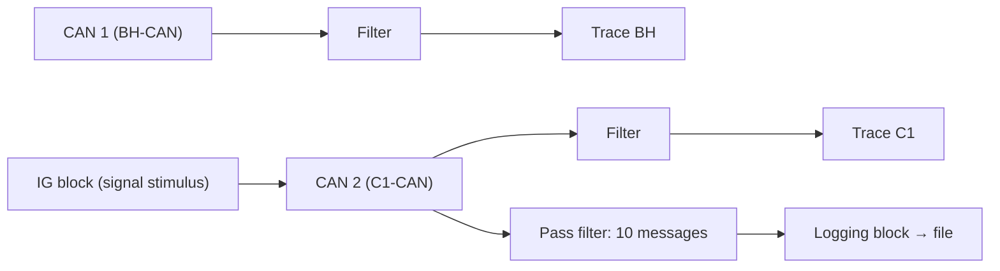
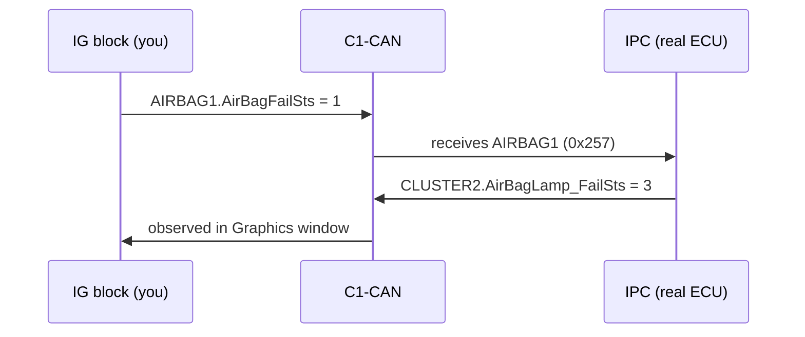

# CANalyzer Exercise: Trace Filters & the Interactive Generator

Time to get your hands on the bus. In the [CANalyzer topic](../../index.md) you
learned what Trace windows, filters and generator blocks *are* — in this
exercise you will actually drive them on the **P332 BEV platform** network
databases. You will work across **two CAN channels** at once — the body bus
(**BH-CAN**) and the powertrain bus (**C1-CAN**) — and by the end you will be
able to:

- open a dedicated **Trace window** per channel and filter each one
  differently,
- **inject signals** onto the bus with the **Interactive Generator (IG)
  block**, pretending to be any ECU you like,
- prove a real ECU *reacts* to your stimulus by watching its outputs in a
  **Graphics window**,
- record a clean **log file** and replay it later in **offline mode** to find
  the exact instant each signal changed.

These four skills — filter, stimulate, observe, log — are the everyday loop of
bus-level testing, and they come back in every HIL (Hardware-in-the-Loop) and
verification lesson after this one.

!!! note "Deliverable"
    For every step below, capture a **screenshot** that proves the result —
    the exercise sheet requires it, and your future self will thank you when
    writing the report.

## What you'll practice

Controlling a CANalyzer measurement end-to-end: observe selected traffic with
filters, stimulate the network with the IG block, and confirm that a real ECU
— the **IPC** (Instrument Panel Cluster, the dashboard in front of the driver)
— changes what it transmits in response to *your* simulated input.

## Setup

Before you start, make sure you have:

- **CANalyzer** open with a configuration containing **two CAN channels**
  (a real interface such as a VN16xx, or two virtual CAN channels).
- The two network databases, one assigned to each channel. A **DBC**
  (Database CAN) file is what lets CANalyzer decode raw frames into named,
  scaled signals:

  | Channel | Bus | DBC file |
  |---|---|---|
  | CAN 1 | BH-CAN | `P332BEV_BH_CAN_R1_20200902_..._.dbc` |
  | CAN 2 | C1-CAN | `P332BEV_C1_CAN_R1_20200902_..._.dbc` |

- The rest of the network alive (real ECUs or a remaining-bus simulation), so
  the IPC actually answers your stimuli.

Everything in this exercise lives in the **Measurement Setup** window —
right-click a branch and choose *Insert…* to add blocks. Here is the mental
map of what you will build:

The four block types you will use:

- **Trace window** — the live scrolling list of frames, decoded through the
  DBC.
- **Filter blocks** — a *pass filter* lets only selected messages through; a
  *stop filter* drops the selected messages and passes everything else. You
  will use both, and the contrast between them is the point of Steps 2 and 3.
- **IG block (Interactive Generator)** — double-click it to open a panel
  where you pick signals from the database, type physical values, and send
  them cyclically. This is your "pretend to be an ECU" tool.
- **Graphics window** — plots signal values over time, so a change becomes a
  visible step instead of a number in a table.
- **Logging block** — writes the (filtered) traffic to an ASC/BLF file for
  later analysis.

## Step 1 — One Trace window per channel

Insert two Trace windows in the Measurement Setup and rename them **Trace BH**
and **Trace C1**. Connect each one to its own channel branch so Trace BH shows
only body-bus traffic and Trace C1 only powertrain traffic. Start the
measurement and confirm both windows scroll independently — congratulations,
you are now watching two buses at once.

## Step 2 — Pass filter on Trace BH (IPC traffic only)

The IPC is one of the chattiest nodes on the body bus, which makes it a
perfect filter target. Configure a **pass filter** on Trace BH that shows
**only the messages transmitted and received by the IPC**. In the BH-CAN
database those are messages such as `CLUSTER5`, `CLUSTER6`,
`IPC_DISPLAY_INFO`, `IPC_VEHICLE_SETUP` … `TRIP_A/B/D` (transmitted), plus the
messages where the IPC is listed as a receiver.

When you are done, the flood of body-bus traffic should shrink to just the
IPC's conversation. That is the whole job of a pass filter: *keep the
selection, drop the rest*.

!!! tip
    You can also use the Trace window's own *Analysis filter* (right-click the
    trace → predefined filters) instead of a separate filter block — either
    way, the visible traffic must shrink to IPC-related frames only.

## Step 3 — Stop filter on Trace C1 (silence the BSM)

Now the mirror image. On the C1 bus the **BSM** (Brake System Module)
transmits `BRAKE1`, `BRAKE8`, `BRAKE10`, … Configure a **stop filter** on
Trace C1 that blocks every message the BSM transmits. Expected result: the
`BRAKE*` messages vanish while all other C1 traffic keeps flowing.

Compare the two steps deliberately — this is a distinction you will use
forever:

- Step 2 (**pass**): the filter *keeps* what you selected.
- Step 3 (**stop**): the filter *removes* what you selected.

## Step 4 — Stimulate the bus with the IG block

Here is where you stop observing and start driving. Insert an **IG block** on
the C1 channel and double-click it. Use *Add signals from database* to pull in
the four signals below, type in the values, and start the generator so the
frames go out cyclically. With each of these, you are effectively *impersonating*
the ECU that normally sends that message:

| Message (ID) | Sender you replace | Signal | Value to set |
|---|---|---|---|
| `AIRBAG1` (0x257) | ORC (Occupant Restraint Controller) | `AirBagFailSts` | `1` = *Fail_Not_Present_Lamp_Flashing* |
| `BRAKE1` (0x101) | BSM | `VehicleSpeedVSOSig` | **40 km/h** |
| `BCM_COMMAND` (0xFA) | BCM (Body Control Module) | `CmdIgnSts` | `4` = *RUN* |
| `ENGINE1` (0xFC) | EVCU (Electric Vehicle Control Unit) | `PowertrainPrplsnActv` | `1` = *Active* |

A few DBC facts that make entering values painless:

- `VehicleSpeedVSOSig` is a 13-bit raw value scaled by **0.0625 km/h per
  bit**. Because the DBC is assigned, CANalyzer does the conversion for you —
  just type `40` in the physical-value column and the tool writes raw 640 for
  you.
- `CmdIgnSts` is a 3-bit value table: 0=Initialization, 1=IGN_LK, 3=ACC,
  **4=RUN**, 5=START, 7=SNA (Signal Not Available).
- `AirBagFailSts` value table: 0=Fail_Not_Present_Lamp_Off,
  **1=Fail_Not_Present_Lamp_Flashing**, 2=Fail_Present_Lamp_On, 3=Not_Used.

!!! warning
    Setting a value in the IG panel does **nothing** until the generator is
    actually running. If the bus seems to ignore you, check that transmission
    is started.

## Step 5 — Verify in a Graphics window

Trust, but verify. Insert a **Graphics window** and drag the four signals from
Step 4 into it. Each trace should sit exactly at the value you set — a flat
line at 40 km/h, `CmdIgnSts` parked at RUN, and so on. This closes your first
loop: **stimulus (IG) → bus → observation (Graphics)**.

## Step 6 — The payoff: the IPC answers you

Now the genuinely fun part. The IPC *listens* to some of the signals you just
injected and reacts by changing what it transmits in `CLUSTER2` (0x256) — this
is exactly how the real dashboard decides which warning lamps to show. Run
these three tests and plot the IPC's response signals:

| # | IG stimulus (you) | Expected IPC response |
|---|---|---|
| 1 | `AIRBAG1.AirBagFailSts = 0` | `CLUSTER2.AirBagLamp_FailSts = 0` (lamp OFF, no fail) |
| 2 | `AIRBAG1.AirBagFailSts = 1` | `CLUSTER2.AirBagLamp_FailSts = 3` (BLINKING, fail not present) |
| 3 | `BRAKE8.ABSFailSts = 1` | `CLUSTER2.ABSLamp_FailSts = 2` (lamp ON) |

Take a moment to appreciate what just happened: you changed one signal, and a
physical ECU changed its behavior in response. **Stimulate an input, observe
the output, compare against the specification** — this is the core pattern of
HIL and verification work, and you have just done it by hand.

## Step 7 — Log a signal-change session

Analysis is only as good as your recording, so let's record a clean one:

1. Pick **10 signals** in the IG block, each from a **different message**.
2. Insert a **Logging block** preceded by a **pass filter** that keeps only
   the 10 messages carrying your signals — the log must contain nothing else.
   (Filtering *before* logging is what keeps the file small and focused.)
3. Start logging, then **change the signal values while recording** — ramp the
   vehicle speed, toggle fail statuses, have fun with it.
4. Stop the measurement and keep the log file.

## Step 8 — Replay the log in offline mode

Switch CANalyzer to **offline mode**, point the offline source at the log file
you just recorded, and start the measurement. The Trace and Graphics windows
now replay your session: every edit you made appears as a **step in the signal
trace**, and the time axis tells you the exact relative timestamp at which you
changed each signal. This is how you will document test results and hunt down
"when exactly did that value flip?" questions in real projects.

!!! warning "Online vs. offline"
    Offline mode replays the log file instead of reading the hardware — the IG
    block has no effect there, because you are analyzing, not stimulating.
    Remember to switch back before your next live session.

## Expected result checklist

Before you call it done, walk this list:

- Two Trace windows, each bound to its own channel.
- Trace BH shows IPC-related frames only; Trace C1 shows no `BRAKE*` frames.
- Graphics window confirms all four IG-driven values on the bus.
- The three IPC lamp reactions (table in Step 6) observed and plotted.
- A log file containing only the 10 selected messages, with visible value
  changes, and the change instants identified in offline replay.

## Common mistakes (everyone makes at least one)

- **Filter on the wrong channel** — the IPC messages for Step 2 live on
  BH-CAN; the BSM braking messages live on C1-CAN. Check the DBC assignment
  first.
- **Confusing pass and stop filters** — Step 2 keeps the selection, Step 3
  removes it. If your trace goes empty (or nothing changes), you picked the
  wrong filter type.
- **Entering raw instead of physical values** — with the DBC assigned, IG
  fields accept physical units; typing 640 when you mean 40 km/h is a
  conversion the tool already does for you (raw 640 × 0.0625 = 40 km/h).
- **Forgetting to start the IG transmission** — setting a value in the IG
  panel does nothing until the generator is actually running (cyclic send).
- **Looking for the IPC response in the wrong window** — `CLUSTER2` is
  transmitted *by the IPC*; make sure the Graphics window plots
  `AirBagLamp_FailSts`/`ABSLamp_FailSts`, not your stimulus signal.
- **Analyzing a log while still online** — offline replay requires switching
  the measurement source to the file, otherwise you keep seeing live traffic.

!!! success "Key takeaways"
    - Trace windows + pass/stop filters let you watch exactly the traffic you
      care about on each CAN channel — pass keeps, stop removes.
    - The **IG block** turns CANalyzer into a rest-bus simulator: you transmit
      real database messages with controlled signal values, impersonating any
      ECU.
    - Stimulate → observe → compare: changing `AirBagFailSts`/`ABSFailSts` and
      watching the IPC's `CLUSTER2` lamp status is the core test pattern you
      will reuse throughout HIL and verification work.
    - Logging with a pre-filter and replaying in **offline mode** is how you
      document results and pinpoint exactly when each signal changed.
    - You just controlled a live vehicle network end-to-end — that is real
      E/E test engineering, and it only gets more interesting from here.
