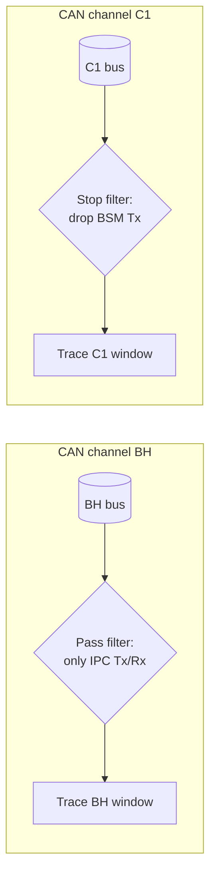
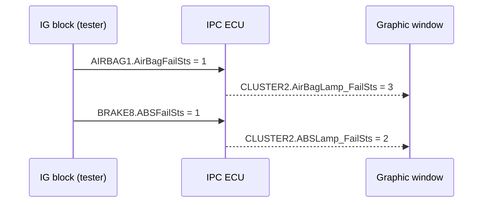

# CANalyzer Exercise — Trace Filters & IG Stimulation (Cluster)

This exercise applies the complete CANalyzer analysis chain to the
**instrument panel cluster (IPC)** of the P332 battery electric vehicle (BEV)
platform — the ECU that drives the warning lamps behind the steering wheel.

The exercise covers building a two-channel measurement setup, filtering a
busy bus down to the relevant messages, simulating other ECUs with the
Interactive Generator (IG) block, and verifying — with timestamps and
screenshots — that the cluster reacts to failure states as defined in the
network specification. These tasks reflect the standard day-to-day workflow
of E/E test engineering.

## Goal

After completing the six steps, you will be able to:

- configure **one Trace window per CAN channel** with channel-specific
  pass/stop filters,
- **stimulate signals** with the IG block and confirm them in a Graphic window,
- verify **closed-loop behavior**: a stimulated input signal must produce the
  expected output signal from the IPC,
- **log selected traffic** and replay it in offline mode to measure time
  deltas,
- document your work in a report with screenshots of every step.

**What you'll practice:** filtering, stimulation, stimulus–response
verification, logging, and offline time analysis — the core activities of
bus-level testing.

## Setup

| Item | Details |
|---|---|
| Tool | Vector CANalyzer |
| Databases | `P332BEV_BH_CAN_...E2A_plus_CR14698_14830_14888.dbc` (BH channel), `P332BEV_C1_CAN_...E2A_plus_CR14698_14830_14888.dbc` (C1 channel) |
| Channels | CAN 1 = BH (body high), CAN 2 = C1 |
| Stimulation | IG (Interactive Generator) block |
| Analysis | Trace windows, Graphic windows, logging block, offline mode |

The two **DBC (Database CAN)** files describe the same vehicle platform on two
different CAN channels. Assign each database to its own channel so that message
names, signals and value tables decode correctly in the trace — with no
database attached, a trace is just raw identifiers and hex bytes.

!!! tip "Screenshot everything"
    This exercise is graded on evidence: after each step, paste a screenshot of
    the relevant window into your report document. Capture screenshots as you
    go; collecting them at the end costs more time.

## Step 1 — Per-channel Trace windows and filters

Create **two Trace blocks** in the measurement setup, one per channel, and name
them `Trace BH` and `Trace C1`. Then give each one a different filter policy:

- **Trace BH → pass filter for IPC.** Show *only* messages transmitted or
  received by the IPC node. This configuration isolates a single ECU's
  traffic when debugging one controller on a busy bus.
- **Trace C1 → stop filter for BSM.** *Drop* all messages transmitted by the
  BSM node and leave everything else visible — the standard method for
  suppressing a high-traffic node that would otherwise flood the trace.

!!! warning "Pass vs. stop filter"
    A **pass filter** is a whitelist: only matching messages get through. A
    **stop filter** is a blacklist: matching messages are discarded and all
    others pass. Swapping the two is the most common reason a trace shows
    "nothing" or "everything" — if your window looks wrong, check the filter
    type first.

## Step 2 — Stimulate signals with the IG block

Add an **IG block** to the measurement setup and configure it to transmit these
four signals:

| Message | Signal | Value | Meaning |
|---|---|---|---|
| `AIRBAG1` | `AirBagFailSts` | `1` | Fail_not_Present_Lamp_Flashing |
| `BRAKE1` | `VehicleSpeedVSOSignal` | `40 km/h` | Vehicle speed |
| `BCM_COMMAND` | `CmdIgnSts` | `RUN` | Ignition in RUN |
| `ENGINE1` | `PowertrainPrplsnActv` | `1` | Powertrain propulsion active |

The four signals define a **plausible vehicle state** — ignition on,
powertrain active, vehicle moving at 40 km/h — with an airbag failure injected
on top. This matters because ECUs like the IPC often gate their behavior on
the ignition and speed signals, so a failure injected while the vehicle
appears switched off will be ignored.

## Step 3 — Verify the stimulation in a Graphic window

Verify the stimulus before evaluating any response. Open a **Graphic window**,
drag in the four signals above, and check that each trace settles on the value
you set in the IG block: `AirBagFailSts = 1`, speed at 40 km/h,
`CmdIgnSts = RUN`, `PowertrainPrplsnActv = 1`.

This confirms the IG block is transmitting and that the DBC decodes the frames
as expected. Verifying the stimulus first prevents time spent debugging a
fault that lies in the test setup rather than in the ECU.

## Step 4 — Closed-loop checks: how the IPC reacts

The IPC listens to failure-status signals from other ECUs
and drives its lamp-status signals in the `CLUSTER2` message accordingly.
Stimulate each input with the IG block and observe the IPC response in a
Graphic window:

| Stimulated input (IG) | Expected IPC response |
|---|---|
| `AIRBAG1.AirBagFailSts = 0` | `CLUSTER2.AirBagLamp_FailSts = 0` |
| `AIRBAG1.AirBagFailSts = 1` | `CLUSTER2.AirBagLamp_FailSts = 3` |
| `BRAKE8.ABSFailSts = 1` | `CLUSTER2.ABSLamp_FailSts = 2` |

This is **stimulus–response testing**: the tester simulates one ECU
(the airbag or brake controller) and checks that another ECU (the cluster)
translates the failure status into the correct lamp command. The encoded
values (`0`, `2`, `3`) come from the value tables in the DBC — e.g. `3` for
the airbag lamp means "lamp flashing" rather than a simple on/off, which is
why a raw on/off expectation would be misleading.

## Step 5 — Logging and offline time analysis

1. Pick **10 signals**, each from a *different* message, and configure a
   **logging block** so only those signals are recorded (reuse a pass filter
   to restrict the log).
2. Start the measurement and the log, then **change the signals one at a
   time** in the IG block while logging.
3. Stop, switch CANalyzer to **offline mode**, and load the log file as the
   source. Step through the trace and read the timestamps of your edits.
4. Measure the delta times between signal changes:
   - first change → third change: expected **Δt ≈ 4.35 s**,
   - first change → last change: expected **Δt ≈ 9.16 s**.

The exact deltas depend on the timing of the manual edits, so the measured
values only need to fall within this range. The purpose of this step is to
practice reading absolute and relative timestamps in an offline trace, a
routine part of log analysis.

## Step 6 — Report

Assemble a single report with the screenshot evidence and measured values for
every step: the two filtered traces, the IG configuration, the Graphic-window
verifications, the logged file, and the two delta-time measurements. The
report follows the standard for formal test documentation: every claimed
result must be backed by captured evidence.

## Common mistakes

- **Wrong filter type** — using a stop filter where a pass filter is needed
  (or vice versa) in Step 1; the trace then shows everything or nothing.
- **DBC on the wrong channel** — BH and C1 databases swapped, so signals
  decode incorrectly or not at all.
- **Trusting the IG without checking** — skipping the Graphic-window
  verification in Step 3, then wondering why the IPC does not react (the IG
  generator may not even be started).
- **Unrealistic vehicle state** — forgetting `CmdIgnSts = RUN`; many ECUs
  ignore failure inputs when the ignition is off.
- **Logging the whole bus** — the exercise wants a log containing *only* the
  10 chosen signals; without a filter, offline analysis becomes a
  time-consuming search.
- **Reading absolute time instead of delta** — Step 5 wants the *difference*
  between timestamps, not the timestamps themselves.

!!! success "Key takeaways"
    - One Trace window per channel keeps multi-bus analysis readable; pass
      filters whitelist, stop filters blacklist.
    - The IG block simulates other ECUs: stimulate a realistic vehicle state
      (ignition RUN, speed 40 km/h) plus the failure under test.
    - Verify the stimulus in a Graphic window before evaluating the response;
      this isolates test-setup faults from ECU faults.
    - The closed-loop checks confirm the IPC's failure handling:
      `AirBagFailSts = 1` produces `CLUSTER2.AirBagLamp_FailSts = 3`, and
      `ABSFailSts = 1` produces `CLUSTER2.ABSLamp_FailSts = 2`.
    - Restrict logging to the required signals, then use offline mode to
      measure delta times (≈ 4.35 s and ≈ 9.16 s between edits).
