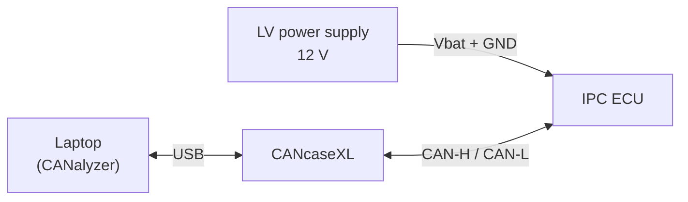
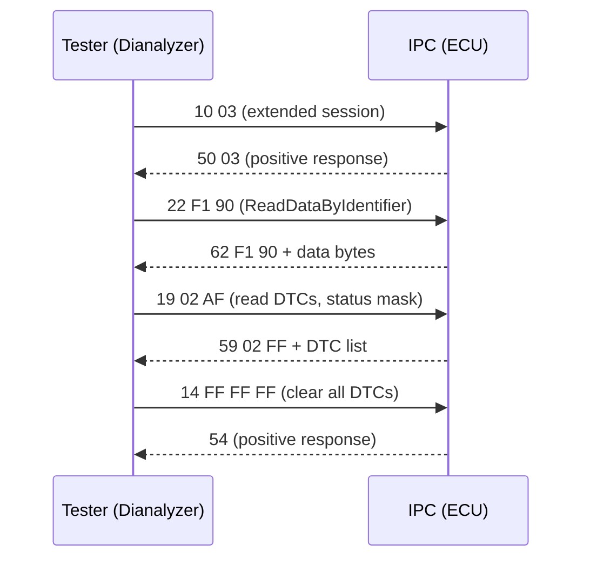

# CANalyzer Exercises — Bench, Log Analysis and Diagnostics

These three hands-on exercises take you from "I know what CANalyzer is" to
using it the way a test engineer does: wiring a real ECU on the bench,
keeping it alive with simulated bus traffic, mining a recorded log for a
driving anomaly, and running a full UDS diagnostic session. Work through them
in order — each one assumes the skills of the previous one.

!!! tip "Prerequisites"
    Make sure you are comfortable with the CANalyzer measurement windows,
    databases and replay blocks from the
    [CANalyzer](../index.md) topic, and with CAN frame/DBC basics from
    [CAN, LIN & Automotive Ethernet](../../../mil1/can-lin/index.md).

## Setup

### Hardware

| Equipment | Role |
|---|---|
| IPC (Instrument Panel Cluster) ECU | Device under test — the academy ECU available in the Napoli and Torino offices |
| CANcaseXL (CAN case) | USB CAN interface between the laptop and the ECU |
| LV power supply | Powers the cluster at battery voltage (12 V) |

### Software and files

- **CANalyzer** with the vehicle **DBC database** for the cluster
- **Dianalyzer** and **CANdelaStudio** (Exercise 3) — the diagnostic tester
  and the diagnostic-database authoring tool
- `Acquisizione_BOA.7z` (Exercise 2) — a recorded bus acquisition from a real
  vehicle drive
- The **ISO 14229 (UDS)** specification as reference for diagnostic services
  and DTC status bits (Exercise 3)

---

## Exercise 1 — IPC configuration and rest-bus simulation

**Goal.** Connect the cluster to CANalyzer, bring the communication up, and
make the instrument panel behave as if it were installed in a real vehicle.

### Procedure

1. **Wire the bench.** Connect the LV power supply to the ECU's battery and
   ground pins, and the CANcaseXL channel to the ECU's CAN-H/CAN-L pins.
   If the wiring is already done, identify and describe every cable before
   switching anything on.
2. **Configure CANalyzer.** Create a new configuration, assign the real
   CAN channel to the CANcaseXL hardware, set the correct **baud rate** for
   the cluster's bus, and attach the provided **DBC** so raw frames are
   decoded into named signals.
3. **Verify communication.** Start the measurement and confirm in the Trace
   window that the cluster is transmitting (e.g. its cyclic status frames).
4. **Answer the termination question.** The bench setup needs a **120 Ω
   termination resistor** between CAN-H and CAN-L. On a vehicle the two 120 Ω
   resistors sit at the ends of the bus; on a short bench harness the
   resistor still prevents signal reflections and defines the recessive bus
   level, so without it communication can be unreliable or absent.
5. **Simulate the rest of the bus.** The cluster expects to *receive* frames
   from other ECUs (vehicle speed, engine state, tell-tale requests, …).
   Use CANalyzer generator blocks / Interactive Generator (IG) blocks to
   transmit every frame the IPC subscribes to, with plausible cycle times.
6. **Explain why step 5 is needed.** A single ECU alone on the bus misses
   its expected inputs: it raises communication DTCs, lights warning lamps,
   and may go into a degraded state or stop communicating. Simulating the
   rest of the network (a *rest-bus simulation*) keeps it in a normal
   operating state — this is exactly what CANoe/CANalyzer do in every HIL
   setup.
7. **Turn off the warning lamps.** With the cluster powered but no valid
   data, several tell-tales are lit. Analyze the DBC, find the signals that
   command each lamp, and drive them to their "lamp off" values until the
   cluster face is clean.
8. **Build a plausible driving scenario.** Simulate a coherent set of
   values — a state of charge, a vehicle speed, gear **D (drive)** and any
   other information visible on the cluster — and check that the display
   shows them consistently.
9. **Write the report.** Document the wiring, the configuration steps,
   answers to the questions above and the results, with screenshots.

### Expected result

A cluster that powers up cleanly, communicates on the trace, shows **no
warning lamps**, and displays your simulated speed/state-of-charge/gear
scenario like a vehicle in normal driving.

!!! warning "Common mistakes"
    - **Missing 120 Ω termination** — intermittent or no communication.
    - **Wrong baud rate** — the trace stays empty or fills with error frames.
    - **No DBC attached** — you stare at raw hex instead of signal names.
    - Sending frames with **stale counter/checksum signals** — many ECUs
      reject frames whose rolling counter or CRC doesn't advance correctly.
    - Forgetting a frame the ECU expects — one missing message is enough to
      keep a lamp on or log a communication DTC.

---

## Exercise 2 — Log analysis (offline replay)

**Goal.** Analyze a real vehicle acquisition (`Acquisizione_BOA.7z`) offline
in CANalyzer and reconstruct what the driver and the vehicle were doing —
including spotting a potential problem in the recorded manoeuvre.

### Procedure

1. **Load the log** with a Replay Block (offline mode) and attach the
   matching DBC so signals decode.
2. **Graph the engine RPM** alone first: create a Graphics window containing
   only the RPM signal and observe its profile over the whole drive.
3. **Build a "vehicle story" graph.** Add only the signals that explain the
   dynamic state of the vehicle and the driver's actions — typically vehicle
   speed, accelerator pedal position, brake switch/pressure, gear, steering
   angle. Resist the temptation to plot everything: a readable graph with
   4–6 meaningful signals beats a rainbow of 20.
4. **Hunt for the anomaly.** Correlate the signals in time and identify the
   potential issue hidden in the manoeuvre (look for contradictions: pedal
   vs. RPM vs. speed, implausible transitions, flat-lined or frozen signals).
5. **Write the report** describing the activity and the issue you found,
   with screenshots of the decisive graph section.

### Expected result

A small set of graphs from which you can narrate the drive ("acceleration,
cruise, braking…") and a clearly argued identification of the suspicious
behaviour in the log.

!!! note "Analysis technique"
    Use cursors/measurement markers in the Graphics window to read exact
    values and time deltas at the moment the signals disagree — "signal X
    was at value Y for Z seconds while signal W…" is the kind of evidence a
    good report is built on.

---

## Exercise 3 — Diagnostic session on the IPC

**Goal.** Connect to the IPC and work through a complete UDS diagnostic
workflow using **Dianalyzer**, **CANalyzer** and **CANdelaStudio**: explore
the diagnostic database, read and write data by identifier, and manage DTCs.

### The main diagnostic services

The exercise asks you to identify the main UDS (ISO 14229) services. The
ones you will actually use here:

| Service | ID | Purpose in this exercise |
|---|---|---|
| DiagnosticSessionControl | `0x10` | Enter the session that unlocks the services below |
| ReadDataByIdentifier | `0x22` | Read RDIs (e.g. vehicle speed) |
| WriteDataByIdentifier | `0x2E` | Write RDI contents |
| ReadDTCInformation | `0x19` | Read DTCs, their status byte and snapshots |
| ClearDiagnosticInformation | `0x14` | Clear the error memory |
| RoutineControl | `0x31` | Execute routines |
| TesterPresent | `0x3E` | Keep the diagnostic session alive |

### Procedure

1. **Explore the database.** Open the diagnostic database in CANdelaStudio
   and extract: the list of all **RDIs** (readable data identifiers), the
   list of all **DTCs** with the DTC table, the list of all **I/Os**, and
   the list of all **routines**. These four inventories tell you everything
   the ECU allows a tester to do.
2. **Read an RDI.** Request one RDI and interpret the raw **hexadecimal
   response** byte by byte against its specification.
3. **Make the value move.** Put the IPC into the vehicle conditions that
   modify the selected RDI — i.e. simulate the relevant bus signals as in
   Exercise 1. Simulate a speed of **60 km/h**, request the associated RDI
   and analyze the response; repeat with **150 km/h**, **250 km/h** and
   **600 km/h** and compare.
4. **Write 3 RDIs.** Use WriteDataByIdentifier (`0x2E`) to write the
   contents of three RDIs, then verify each value by reading it back from
   the ECU (`0x22`).
5. **Work the DTCs.** Create a fault condition (e.g. by interrupting an
   expected signal), then:
   - evaluate the DTC **status byte**;
   - perform and describe the operations needed to set **bit 0 = 1**
     (*testFailed* — the fault is currently present) and **bit 2 = 0**
     (*pendingDTC* cleared);
   - **clear the error memory** with ClearDiagnosticInformation;
   - identify the **snapshot** (freeze frame) stored with the error and
     request the snapshot(s) via ReadDTCInformation.

### Expected result

Hex responses you can decode by hand, three RDIs written and read back
successfully, and a fault created, qualified via its status byte, snapshotted
and cleared — the complete create-read-verify-clear diagnostic loop.

!!! tip "DTC status byte cheat sheet"
    Bit 0 *testFailed* = fault present **right now**; bit 2 *pendingDTC* =
    fault seen but not yet confirmed; bit 3 *confirmedDTC* = fault confirmed
    and stored. A fault heals in stages: fix the cause and bit 0 goes to 0
    first, while confirmed/pending bits clear only after enough passing
    cycles or an explicit `0x14` clear request.

!!! warning "Common mistakes"
    - Requesting services in the **wrong diagnostic session** — negative
      response `0x7F ... 0x7E` (sub-function not supported in active session).
    - Letting the session **time out** (S3 timer) — keep it alive with
      TesterPresent (`0x3E`).
    - Reading the RDI response as one big number instead of decoding each
      byte against the database definition.
    - Trying to clear DTCs while the fault condition is **still active** —
      they come straight back.

!!! success "Key takeaways"
    - A bench ECU needs **12 V, 120 Ω termination, the right baud rate, and
      a rest-bus simulation** to behave normally.
    - Warning lamps are just signals — find them in the DBC and drive them
      off with the IG.
    - Offline log analysis = replay + a few well-chosen signals + cursor
      evidence, not plotting everything.
    - Diagnostics is a loop: explore the CDD (`RDIs/DTCs/IOs/routines`),
      read (`0x22`), write (`0x2E`), fault-manage (`0x19`/`0x14`) — and
      always keep the session alive.
