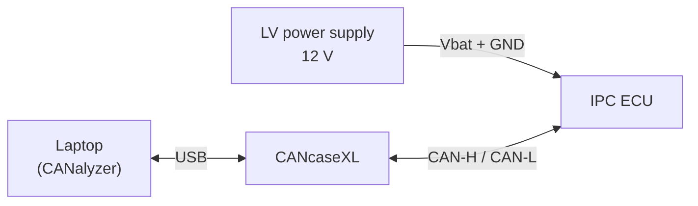
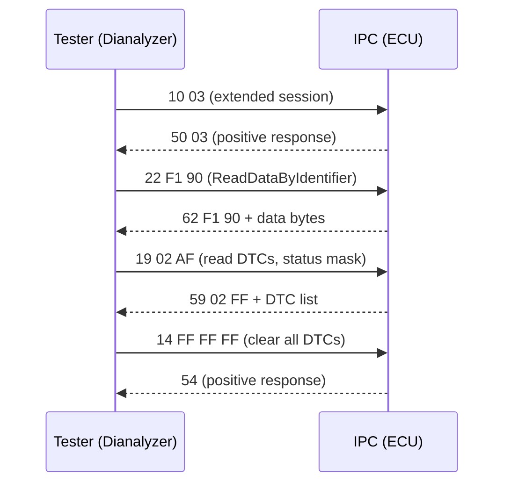

# CANalyzer Exercises — Bench, Log Analysis and Diagnostics

These three exercises apply the CAN (Controller Area Network), DBC (Database
CAN) and measurement-window concepts from the previous topics to real
hardware. They cover the three core CANalyzer tasks in test engineering:
bringing an electronic control unit (ECU) up on a bench, analyzing a
recorded bus log, and running a complete diagnostic session. By the end you
will be able to:

- wire an instrument cluster to **CANalyzer** and make it behave as if it
  were installed in a real car,
- reconstruct what a driver and a vehicle were doing from a recorded bus
  log — and argue, with evidence, where something went wrong,
- read data, write data and manage faults on an ECU over **UDS** (Unified
  Diagnostic Services).

Work through them in order: each exercise builds on the procedures of the
one before. The bench practices from the first exercise are reused
throughout the other two.

!!! tip "Prerequisites"
    Be comfortable with CANalyzer's measurement windows, databases and
    replay blocks from the [CANalyzer](../index.md) topic, and with CAN
    frame/DBC basics from [CAN, LIN & Automotive Ethernet](../../../mil1/can-lin/index.md).
    If either is unfamiliar, review it before starting the exercises.

## Setup

### Hardware

| Equipment | Role |
|---|---|
| IPC (Instrument Panel Cluster) ECU | Your device under test — the academy ECU kept in the Napoli and Torino offices |
| CANcaseXL ("CAN case") | The USB-to-CAN interface between your laptop and the ECU |
| LV (low-voltage) power supply | Feeds the cluster at battery voltage (12 V) |

The wiring is deliberately simple: power and ground to the cluster, CAN-H and
CAN-L to the interface, USB to the laptop. If a bench is already wired when
you arrive, trace every cable before switching anything on.

### Software and files

- **CANalyzer** with the vehicle **DBC database** for the cluster — this is
  what turns raw hex into named, scaled signals
- **Dianalyzer** and **CANdelaStudio** (Exercise 3) — the diagnostic tester
  and the tool for authoring its diagnostic database
- `Acquisizione_BOA.7z` (Exercise 2) — a bus acquisition recorded during a
  real vehicle drive; *acquisizione* is Italian for "recording"
- The **ISO 14229 (UDS)** specification as your reference for diagnostic
  services and fault status bits (Exercise 3)

---

## Exercise 1 — IPC configuration and rest-bus simulation

**Goal.** Connect the cluster to CANalyzer, bring the communication up, and
make the instrument panel behave as if it were installed in a real vehicle.

**What you'll practice:** the full bench bring-up routine — wiring,
configuring the tool, and simulating the rest of the vehicle so the ECU
operates in its normal state.

### Steps

1. **Wire the bench.** Connect the LV supply to the ECU's battery and ground
   pins, and the CANcaseXL channel to its CAN-H/CAN-L pins. If it is already
   wired, identify and describe every cable before powering up.
2. **Configure CANalyzer.** Create a new configuration, assign the real CAN
   channel to the CANcaseXL hardware, set the correct **baud rate** for the
   cluster's bus, and attach the provided DBC so frames decode into signals.
3. **Verify communication.** Start the measurement and watch the Trace
   window: you should see the cluster transmitting its cyclic status frames.
   An empty trace at this point means wiring, baud rate or termination — in
   that order of likelihood.
4. **Answer the termination question.** Yes, you need a **120 Ω resistor**
   between CAN-H and CAN-L. On a vehicle, two 120 Ω resistors sit at the two
   ends of the bus; on a short bench harness the resistor still matters,
   because it prevents signal reflections and defines the recessive bus
   level. Without it, communication can be unreliable — or simply absent.
5. **Simulate the rest of the bus.** The cluster expects to *receive* frames
   from the ECUs it lives with: vehicle speed, engine state, tell-tale
   requests, and more. Use CANalyzer's generator blocks / **IG** (Interactive
   Generator) blocks to transmit every frame the IPC subscribes to, with
   plausible cycle times.
6. **Explain why step 5 is needed.** Put the reason in your own words in
   the report: an ECU that misses its expected inputs raises communication
   **DTCs** (Diagnostic Trouble Codes), lights warning lamps, and may drop
   into a degraded state or stop talking altogether. Feeding it the traffic
   it expects — a *rest-bus simulation* — keeps it in its normal operating
   state. The same rest-bus simulation technique is used by CANoe/CANalyzer
   inside every **HIL** (hardware-in-the-loop) rig in the industry.
7. **Turn off the warning lamps.** Powered with no valid data, the cluster
   illuminates all of its warning lamps. Search the DBC for the signals
   that command each lamp and drive them to their "lamp off" values, one by
   one, until no lamp remains on.
8. **Build a plausible driving scenario.** Simulate a coherent set of
   values — a state of charge, a vehicle speed, gear **D** (drive) and
   anything else visible on the cluster — and check that the display shows
   consistent values.
9. **Write the report.** Document the wiring, every configuration step,
   your answers to the questions above, and the results, with screenshots.

### Expected result

A cluster that powers up cleanly, shows traffic in the trace, displays **no
warning lamps**, and presents your simulated speed/state-of-charge/gear
scenario as it would appear during normal driving.

!!! warning "Common mistakes"
    - **Missing 120 Ω termination** — intermittent or no communication.
    - **Wrong baud rate** — the trace stays empty or fills with error frames.
    - **No DBC attached** — frames appear as raw hex instead of signal
      names.
    - Sending frames with **stale counter/checksum signals** — many ECUs
      reject frames whose rolling counter or **CRC** (cyclic redundancy
      check) doesn't advance correctly.
    - Forgetting one frame the ECU expects — a single missing message is
      enough to keep a lamp on or log a communication DTC.

---

## Exercise 2 — Log analysis (offline replay)

**Goal.** Analyze a real vehicle acquisition (`Acquisizione_BOA.7z`) offline
in CANalyzer and reconstruct what the driver and the vehicle were doing —
including spotting a potential problem hidden in the recorded manoeuvre.

**What you'll practice:** selecting the signals that matter, reading them
against each other in time, and building a conclusion from measured values
instead of assumptions.

### Steps

1. **Load the log** with a Replay Block (offline mode) and attach the
   matching DBC so the signals decode.
2. **Graph the engine RPM** (revolutions per minute) alone first: a
   Graphics window with only the RPM signal, so you can absorb the shape of
   the whole drive without distractions.
3. **Build a "vehicle story" graph.** Add only the signals that explain the
   vehicle's dynamic state and the driver's actions — typically vehicle
   speed, accelerator pedal position, brake switch/pressure, gear, steering
   angle. Limit the selection: a readable graph with 4–6 meaningful signals
   is more useful than one with twenty.
4. **Find the anomaly.** Correlate the signals in time and find the
   potential issue in the manoeuvre. Look for contradictions: pedal versus
   RPM versus speed, implausible transitions, signals that flat-line or
   freeze when they shouldn't.
5. **Write the report** describing the activity and the issue you found,
   with screenshots of the decisive section of the graph.

### Expected result

A small set of graphs from which you can describe the drive — "acceleration,
cruise, braking…" — and a clearly argued identification of the suspicious
behaviour in the log.

!!! note "Analysis technique"
    Use cursors/measurement markers in the Graphics window to read exact
    values and time deltas at the moment the signals disagree. "Signal X
    held value Y for Z seconds while signal W did this…" is the kind of
    statement a good report is built on — measured evidence rather than
    impressions.

---

## Exercise 3 — Diagnostic session on the IPC

**Goal.** Connect to the IPC and work through a complete UDS (ISO 14229)
workflow using **Dianalyzer**, **CANalyzer** and **CANdelaStudio**: explore
the diagnostic database, read and write data by identifier, and manage DTCs.

**What you'll practice:** the create–read–verify–clear loop that diagnostic
engineers run every day, and the discipline of decoding hexadecimal
responses byte by byte against a specification.

### The main diagnostic services

The exercise asks you to identify the main UDS services. These are the ones
you will actually use here — learn to recognize their IDs on sight:

| Service | ID | Purpose in this exercise |
|---|---|---|
| DiagnosticSessionControl | `0x10` | Enter the session that unlocks the services below |
| ReadDataByIdentifier | `0x22` | Read RDIs (e.g. vehicle speed) |
| WriteDataByIdentifier | `0x2E` | Write RDI contents |
| ReadDTCInformation | `0x19` | Read DTCs, their status byte and snapshots |
| ClearDiagnosticInformation | `0x14` | Clear the error memory |
| RoutineControl | `0x31` | Execute routines |
| TesterPresent | `0x3E` | Keep the diagnostic session alive |

### Steps

1. **Explore the database.** Open the diagnostic database in CANdelaStudio
   and extract four inventories: the list of all **RDIs** (readable data
   identifiers), all **DTCs** with their DTC table, all **I/Os**, and all
   **routines**. Together these describe everything the ECU allows a tester
   to do.
2. **Read an RDI.** Request one RDI and interpret the raw **hexadecimal
   response** byte by byte against its specification.
3. **Make the value move.** Put the IPC into the vehicle conditions that
   change the selected RDI — i.e. simulate the relevant bus signals, exactly
   as in Exercise 1. Simulate a speed of **60 km/h**, request the associated
   RDI and analyze the response; repeat at **150 km/h**, **250 km/h** and
   **600 km/h** and compare. The 600 km/h value is deliberately implausible:
   driving a value past its valid range shows how the ECU encodes, saturates
   or rejects out-of-range data.
4. **Write 3 RDIs.** Use WriteDataByIdentifier (`0x2E`) to write the
   contents of three RDIs, then verify each one by reading it back from the
   ECU (`0x22`).
5. **Work the DTCs.** Create a fault condition — interrupting an expected
   signal works well — then:
   - evaluate the DTC **status byte**;
   - perform and describe the operations needed to set **bit 0 = 1**
     (*testFailed* — the fault is present right now) and **bit 2 = 0**
     (*pendingDTC* cleared);
   - **clear the error memory** with ClearDiagnosticInformation (`0x14`);
   - identify the **snapshot** (freeze frame) stored with the error and
     request the snapshot(s) via ReadDTCInformation.

### Expected result

Hex responses you can decode by hand, three RDIs written and successfully
read back, and a fault that you created, qualified through its status byte,
snapshotted and cleared — the complete diagnostic loop, start to finish.

!!! tip "DTC status byte cheat sheet"
    Bit 0 *testFailed* = fault present **right now**; bit 2 *pendingDTC* =
    fault seen but not yet confirmed; bit 3 *confirmedDTC* = fault confirmed
    and stored. A fault heals in stages: fix the cause and bit 0 falls to 0
    first, while the confirmed/pending bits clear only after enough passing
    cycles or an explicit `0x14` clear request.

!!! warning "Common mistakes"
    - Requesting services in the **wrong diagnostic session** — negative
      response `0x7F ... 0x7E` (sub-function not supported in active session).
    - Letting the session **time out** (S3 timer) — keep it alive with
      TesterPresent (`0x3E`).
    - Reading the RDI response as one big number instead of decoding each
      byte against the database definition.
    - Trying to clear DTCs while the fault condition is **still active** —
      they are set again immediately.

!!! success "Key takeaways"
    - A bench ECU needs four things to operate normally: **12 V, 120 Ω
      termination, the correct baud rate, and a rest-bus simulation**.
    - Warning lamps are driven by signals: locate them in the DBC and drive
      them to their "lamp off" values with the IG.
    - Effective log analysis uses a replay block, a small set of well-chosen
      signals, and cursor-backed measurements as evidence.
    - The diagnostic workflow covered the full loop: exploring the CDD
      (RDIs/DTCs/IOs/routines), reading (`0x22`), writing (`0x2E`), managing
      faults (`0x19`/`0x14`), and keeping the session alive with `0x3E`.
    - Together the exercises cover the standard CANalyzer workflow: bench
      bring-up, evidence-based log analysis, and a fault that is created,
      qualified through its status byte, and cleared by fixing its cause.
