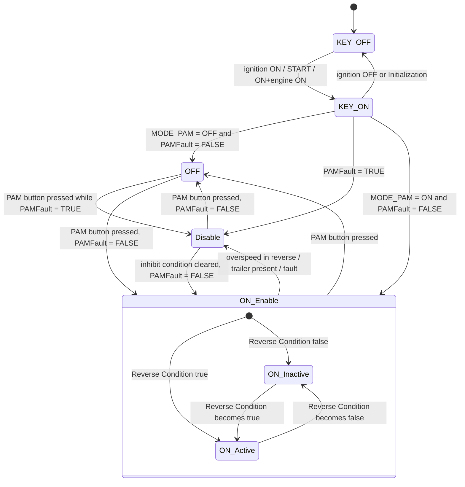

# CANoe Exercises — VF179 PAM State Machine & Test Cases

Welcome to the capstone exercise of the [CANoe](../index.md) lesson. Up to now
you have learned how CANoe shows you live bus traffic; this time *you* drive
the bus. You will take a real functional specification — **VF179**, the Vehicle
Function document for the Parking Assistance Module (PAM) on the 332 BEV
(Battery Electric Vehicle) platform — and turn its requirements into test cases
that actually run against the Electronic Control Unit (ECU) in CANoe.

This is not busywork: the requirement → state machine → test case workflow is
exactly what you will do for a living as an E/E (Electrical/Electronic)
verification engineer, and it comes back in
[VF analysis](../../../mil3/vf/index.md) and
[Test Cases](../../../mil3/testcases/index.md). Here you just get to do it
hands-on, on real CAN and LIN (Local Interconnect Network) signals.

**By the end of this exercise you will be able to:**

- read "shall"-style requirements and draw the state machine they describe,
- derive test cases that cover *every* state and transition — not just the
  happy path,
- stimulate inputs and check expected signal values in CANoe, and
- write test steps with timing and signal values precise enough that anyone
  can reproduce your verdict.

The exercise has two parts, straight from the assignment sheet:

1. **Draw the PAM state machine** described in VF179 chapter 1.11.1.1.2.
2. **Complete the test case file** `VF179_ParkingAssistanceSystem` so that every
   state and every transition of that state machine is covered.

## Goal

Practice the full verification loop on one well-defined feature: specification
in, executable tests out, each test traceable back to its requirement — with
the ECU's real bus behavior as the judge.

**What you'll practice:** requirement reading, state modeling, coverage
thinking, precise expected results, and disciplined test reporting.

## Setup

| Item | Why you need it |
|---|---|
| CANoe configuration with the PAM node (or a restbus simulation of its communication partners) | Executes the test and lets you stimulate/observe bus signals |
| VF179 specification (P332 BEV, Academy edition), chapter 1.11.1.1.2 "PAM State Machine" | The requirement under test |
| Test case template `VF179_ParkingAssistanceSystem` | The document to fill in — one worked example (test case 1) is provided |
| Network databases (DBC — Database CAN, and LDF — LIN Description File) mapping `TRANSM2`, `STATUS_PAM`, `PARK_INFO`, `LIN_BCM_IGW1`, `BRAKE1`, `BRAKE4` | To stimulate inputs and check outputs by signal name instead of raw bytes |

## Background: the PAM state machine

The Parking Assistance Module decides what to do based on a state machine with
five top-level states. Before drawing it, collect the variables the spec
defines in chapter 1.11.1.1.1 — these are the *conditions* on your arrows:

| Variable / condition | Meaning |
|---|---|
| **KEY ON** | Ignition is `Ignition_ON`, `Ignition_Start` or `Ignition_ON_Engine_ON` (from `PAM_OperationalModeSts.Info`) |
| **KEY OFF** | Ignition is `Ignition_OFF` or `Initialization` |
| **Reverse Condition** | Gearbox is not manual (`Gear_Box_Type ≠ "MTX"`) **and** `TRANSM2.ShiftLeverPosition = "R"` held for longer than `TReverseGear` |
| **Standstill Condition** | `BRAKE4.VehicleStandStillSts = "True"` |
| **MODE_PAM** | Internal, stored in NVM (non-volatile memory): the last activation state (`ON`/`OFF`) before KEY OFF; initial value at power-on is `OFF` |
| **PAMFault** | Internal failure flag: `TRUE` when a fault is present |

Translated from spec language into a diagram, chapter 1.11.1.1.2 looks like
this:

State entry actions are what make your expected results concrete — these are
the signal values you will assert:

- **KEY ON** — PAM initializes; all `STATUS_PAM` and `PARK_INFO` signals go to
  their default values, except `STATUS_PAM.PAMSystemSts` which initializes to
  `ON_Inactive`. For a time `TFilter` after key-on the gear signal
  `TRANSM2.ShiftLeverPosition` is not trusted and is treated as `"P"`. Then the
  last mode is reloaded from NVM as shown in the diagram.
- **ON_Inactive** — `PAMSystemSts = ON_Inactive`, `RearSensorSts = Active`,
  `PAM_LedControlSts = OFF`, `PARK_INFO.DisplayActivation = Not Active`,
  `MODE_PAM = ON` stored in NVM.
- **ON_Active** — same as ON_Inactive except `PAMSystemSts = ON_Active` and
  `DisplayActivation = Active`; `PARK_INFO` visual/acoustic alerts are driven
  according to the obstacle zone.
- **Disable** — `PAMSystemSts = ON_Disabled`, `PAM_LedControlSts = Continuous
  light`; `PAMAboveSpeed = True` only if speed > `SPEED_LIMIT` while in
  reverse. Pressing the PAM button with a fault present keeps PAM in Disable
  and blinks the LED for `PAM_LED_BLINK_TIME`.
- **OFF** — `PAMSystemSts = OFF`, `RearSensorSts = Active`,
  `PAM_LedControlSts = Continuous light`, `MODE_PAM = OFF` stored in NVM.

The state machine also leans on a handful of configuration parameters (chapter
1.13.1, first-trial values) — treat them as part of the requirements, because
your test timing depends on them:

| Parameter | Value | Unit | Used for |
|---|---|---|---|
| `TFilter` | range 0–5000 | ms | Gear-signal validation after initialization |
| `TReverseGear` | 400 | ms | Debounce before reverse is accepted |
| `SPEED_LIMIT` | 11 | km/h | Disable threshold in reverse |
| `PAM_LED_BLINK_TIME` | 5 | s | LED blink duration on rejected button press |
| `T_Filter_Alerts` | 100 | ms | Filter before updating warnings to a new zone |

!!! note "Timing parameters are part of the test"
    A test step like "set `TRANSM2.ShiftLeverPosition = P` and wait `TFilter`
    after Key ON" exists because the ECU deliberately ignores the gear signal
    during initialization. If you check too early, you test the filter, not the
    state machine — and both behaviors are requirements.

## Step-by-step procedure

1. **Read and model.** Go through VF179 §1.11.1.1.2 and draw the state machine
   (states, substates, transitions with guards). Cross-check your drawing
   against the diagram above — every "shall move to" in the spec must appear as
   exactly one arrow.
2. **Build a coverage matrix.** List every state and every transition. Each one
   must be reachable and checked by at least one test case. One test case can
   cover several transitions in sequence (as the worked example does), but no
   arrow may remain untested.
3. **Write the test cases.** For each test case fill the template sections:
   header (Author / Title / Description), **Step Name / Step Instruction**
   (A = precondition, then one row per action), **Expected Result** (one row per
   step, in terms of signal values), and **Requirement ID Link** (here: `PAM
   STATE 1.11.1.1.2`).
4. **Run in CANoe.** Stimulate the inputs in order — ignition state, gear
   position, PAM button (`LIN_BCM_IGW1.PAMRequestSts`), vehicle speed, trailer
   signal — respecting the filter times, and record what the ECU actually sends
   in the **Obtained Result / Note** columns.
5. **Verdict and sign-off.** Compare obtained vs. expected per step, fill
   **Final results**, and complete the approval row (date / approved by /
   comments). A mismatch is either an ECU bug or a wrong expected value —
   re-read the requirement before blaming the ECU.

## Worked example — test case 1: "PAM status set in OFF"

The provided example verifies the path *KEY ON → OFF → ON_Enable (via
ON_Inactive)* with no fault and the gear lever in Park. Study its shape — your
own test cases should look exactly like this:

| Step | Instruction | Expected result |
|---|---|---|
| A | Power OFF → Power ON → Key ON, no fault on the PAM | Initialization phase: `STATUS_PAM` and `PARK_INFO` signals at default values, `STATUS_PAM.PAMSystemSts = ON_Inactive` |
| B | Set `TRANSM2.ShiftLeverPosition = P` and wait `TFilter` after Key ON | PAM enters OFF (MODE_PAM was OFF in NVM): `PAMSystemSts = OFF`, `RearSensorSts = Active`, `PAM_LedControlSts = Continuous light` |
| C | Press the PAM button | `LIN_BCM_IGW1.PAMRequestSts = Pressed`; PAM enters ON_Inactive: `PAMSystemSts = ON_Inactive`, `RearSensorSts = Active`, `PAM_LedControlSts = OFF`, `PARK_INFO.DisplayActivation = Not Active` |

Requirement link: **PAM STATE 1.11.1.1.2**. Your job is to add the remaining
test cases: the reverse-gear transitions into and out of ON_Active, the Disable
paths (overspeed, trailer, fault), the fault-dependent button behavior, and the
KEY OFF transitions that exercise the NVM restore on the next key-on.

## Common mistakes

- **Checking signals during `TFilter`.** Right after key-on the gear position
  is forced to `"P"` internally; always wait out the filter time before
  stimulating or judging.
- **Forgetting NVM.** The state after key-on depends on `MODE_PAM` stored
  before the *previous* key-off. A test that ends in ON_Enable sets up a
  different power-on behavior than one that ends in OFF — chain your test cases
  deliberately or reset NVM between runs.
- **Vague expected results.** "PAM turns on" is not checkable. Write the exact
  signal values (`PAMSystemSts`, `RearSensorSts`, `PAM_LedControlSts`,
  `DisplayActivation`) the way the worked example does.
- **Testing states but not transitions.** Coverage means every *arrow* of the
  state machine, including the fault-dependent ones from OFF and Disable.
- **Missing requirement links.** Each test case must reference the requirement
  ID it verifies — that traceability is what makes the document a test
  specification rather than a lab notebook.

!!! success "Key takeaways"
    - You can now turn VF179 §1.11.1.1.2 into a five-state machine (KEY OFF,
      KEY ON, ON_Enable with ON_Inactive/ON_Active substates, Disable, OFF)
      driven by ignition, gear, PAM button, speed, trailer and the `PAMFault`
      flag.
    - State after key-on is restored from NVM via `MODE_PAM`, and gear input is
      filtered for `TFilter` — you know both must show up in your test steps.
    - A good test case is written in measurable signal values, waits for
      specified filter times, and links back to its requirement ID — and you
      have a worked example to copy the pattern from.
    - Full coverage = every state *and* every transition, including fault
      paths. You just did real requirement-to-test verification work.
