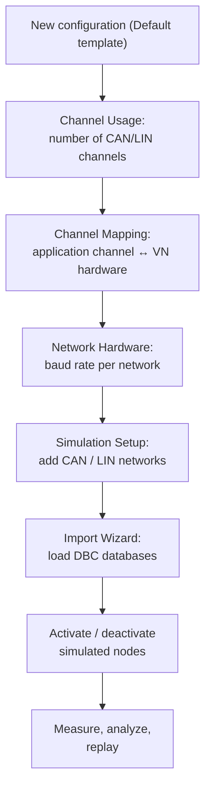
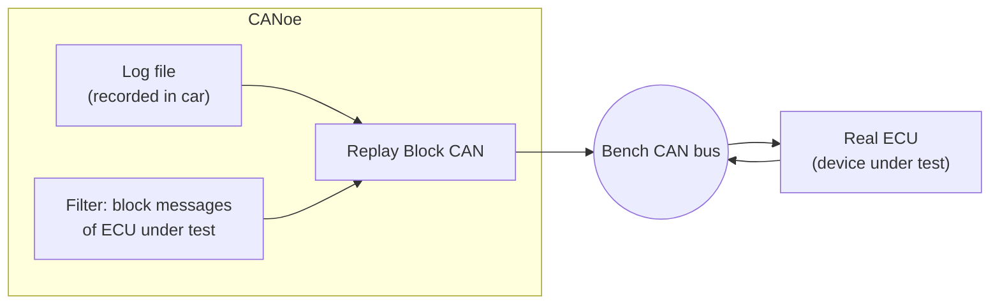

# CANoe — Configuring a Simulation Environment

[CANalyzer](../canalyzer/index.md) lets you *observe* a bus. **CANoe** goes one
step further: it lets you *build* the bus. On top of the same measurement and
analysis windows, CANoe adds a simulation layer — network nodes generated from
the communication database that transmit their messages as if the real ECUs were
on the bench. This makes it the standard tool for **rest-of-bus simulation**:
you connect one real ECU and CANoe plays the role of all the others.

This article walks through a complete CANoe configuration, in the order you
would actually build it: hardware channels, networks, database import, node
simulation, and then the analysis and replay features you use while testing.

## CANoe vs. CANalyzer

Everything you know from CANalyzer — Trace window, Graphics window, measurement
setup with analysis and logging blocks — works the same way in CANoe. The
differences:

- **CANoe is built around databases.** Where CANalyzer is mostly used to look at
  an existing bus, a CANoe configuration typically starts by importing the DBC
  files that describe the network, because the simulation is generated from
  them.
- **Simulation blocks live in the Simulation Setup**, not in the Measurement
  Setup. Program nodes (CAPL), interactive generators (IG) and replay blocks are
  inserted on the network diagram, next to the simulated ECUs.
- **CANoe can simulate ECUs.** It reproduces the *CAN messaging* of each node
  defined in the database — periodic frames, default signal values — but not the
  ECU's internal logic, unless you add that logic yourself in
  [CAPL](../capl/index.md).

## Building a configuration step by step

### 1. Create the configuration

Start from **File → New** and pick the **Default** template. The result is an
empty configuration (a `.cfg` file) that you fill in through the ribbon tabs.

### 2. Hardware configuration

Three dialogs under the **Hardware** ribbon define how CANoe talks to the
physical bus through the Vector hardware (VN16xx interfaces and similar):

| Dialog | What you set |
|---|---|
| **Hardware → Channel Usage → General** | How many CAN and LIN channels the configuration uses |
| **Hardware → Channel Mapping** | Which *application channel* (CAN 1, CAN 2, … in CANoe) is bound to which *physical channel* on the VN device |
| **Hardware → Network Hardware** | The baud rate of each network |

The channel mapping step matters because CANoe always works with *logical*
channels: your configuration says "CAN 1", and the mapping decides which real
transceiver on the VN box that is.

### 3. Baud rates

Under **Hardware → Network Hardware** you set the bit rate per network. For the
typical vehicle buses used in the course:

| Network | Baud rate |
|---|---|
| B-CAN (body) | 50 kBaud |
| BH-CAN (body high) | 125 kBaud |
| C-CAN (powertrain) | 500 kBaud |

!!! warning "Baud rate mismatch = silent bus"
    If the configured baud rate does not match the real bus, you will see no
    valid frames (or only error frames). Always confirm the rate from the
    network specification before blaming the wiring.

### 4. Add networks in the Simulation Setup

Open **Simulation → Simulation Setup** — the heart of a CANoe configuration.
This is a graphical view of the simulated bus topology:

- Right-click **CAN Networks → Add...** to create a new CAN network.
- Right-click **LIN Networks → Add...** to create a new LIN network.

You can create **more networks than you have hardware channels**. A network
with no mapped channel simply runs as pure simulation; unmapped channels are
disabled in the Channel Mapping dialog. This lets you build the complete
vehicle network on a laptop and only attach hardware to the buses you actually
need.

### 5. Import the databases

Each network needs its communication database (DBC for CAN, LDF for LIN).
CANoe's **Import Wizard** loads the database and attaches it to the network.
From that moment CANoe knows every ECU, message and signal on that bus — the
same decoding you get in CANalyzer, plus the ability to *simulate* the senders.

## Rest-of-bus simulation

After the import, the Simulation Setup shows one block per ECU defined in the
database, connected to the bus line:

Each of those blocks is a **simulated node**: when the measurement starts,
CANoe transmits the node's messages automatically, with the signal default
values taken from the database. Two things to keep in mind:

- Only the *messaging* is simulated — not the ECU's software. A simulated body
  control module sends its cyclic frames, but it will not "react" to anything
  unless you write CAPL code for it.
- You control each node individually: **select the node and click the switch
  (sweeper) bar** on its block to deactivate it. A deactivated node goes silent
  on the bus.

!!! tip "Working in the real vehicle"
    When you connect CANoe to a *real* bus, you do not want simulated nodes
    injecting duplicate traffic. Right-click the bus line and choose **Switch
    All Blocks to Real-Time Mode** to silence every simulation block in one
    shot. Do the opposite (**Switch All Blocks to Simulation**) when you go back
    to bench testing.

### Changing signal values on a simulated node

Simulated messages go out with default values. To change a signal at runtime,
open the **Node Panel** of the simulated ECU, edit the signal value, and reload
the message so the new value is transmitted. This is how you feed stimulus to a
real device under test — for example, driving a vehicle-speed signal to see how
an instrument cluster reacts.

## Measurement Setup

The **Measurement Setup** tab is essentially the same data-flow diagram you
know from CANalyzer: measurement start, analysis windows, filters and logging
blocks in series. The practical difference is *where* stimulus blocks live:

- In CANalyzer you insert an IG (Interactive Generator) in the measurement
  chain.
- In CANoe, **program nodes (CAPL), test modules and generator blocks are added
  in the Simulation Setup**, attached to the network they act on — see the
  insert menu in the replay-block figure below.

## Signal analysis in the Graphics window

Once the measurement is running, analysis works exactly as in CANalyzer. The
two options you will use most:

1. **Add signals to a Graphics window** to plot them over time.
2. **Show the individual samples**: right-click in the Graphics window →
   **Configuration → Diagram** and enable **Show Samples**, so every received
   data point is marked instead of just the interpolated curve.

With the **measurement cursor / time-difference button** in the toolbar (marked
"1" in the figure) you can measure the time between two samples — the classic
example from the lesson being the delay between the **ACC activation button
press** and the **response of the ACC system status signal**. This is how you
verify reaction-time requirements directly on the trace.

## Replay blocks: testing one ECU stand-alone

A common bench scenario: you captured a log in the car (`.asc`/`.blf`), and now
you want one ECU on the bench to behave as if it were still in the vehicle.

The recipe:

1. In the Simulation Setup, right-click the network and **Insert Replay Block
   CAN**.
2. Configure the block with the log file — CANoe re-transmits the recorded
   traffic on the bench bus.
3. **Add a filter that blocks the messages of the ECU you are testing.** Those
   messages exist in the log, but on the bench they must come from the *real*
   ECU, not from the replay — otherwise the device sees its own messages
   duplicated.

The same right-click menu is where you insert **CAPL test modules**, XML/.NET
test modules and interactive generators — everything that produces traffic or
runs tests attaches here, on the network it belongs to.

!!! note "Replay vs. simulation nodes"
    A replay block plays back *recorded* traffic exactly as it happened;
    simulated nodes generate traffic *from the database* with values you
    control. Use replay to reproduce a real scenario, and simulation nodes when
    you need to vary the stimulus.

!!! success "Key takeaways"
    - CANoe = CANalyzer + simulation. Program nodes, generators and replay
      blocks are configured in the **Simulation Setup**, not the Measurement
      Setup.
    - Configuration order: **Channel Usage** (how many channels) → **Channel
      Mapping** (logical ↔ physical) → **Network Hardware** (baud rate:
      B-CAN 50, BH-CAN 125, C-CAN 500 kBaud) → add networks → **Import Wizard**
      for the DBC.
    - You can define more networks than hardware channels; unmapped networks
      run as pure simulation.
    - DBC import creates one simulated node per ECU; CANoe sends its messages
      with default values, editable via the Node Panel. Toggle nodes with the
      switch bar, or silence everything with **Switch All Blocks to Real-Time
      Mode** before connecting to a real vehicle.
    - In the Graphics window, enable **Show Samples** and use the
      time-difference cursor to measure signal-to-response delays.
    - For stand-alone ECU tests, replay an in-vehicle log and **filter out the
      DUT's own messages** so they are not transmitted twice.

!!! tip "Where this leads"
    Simulated nodes that actually *react* to the bus are programmed in
    [CAPL](../capl/index.md), and the bus fundamentals behind these
    configurations (frames, arbitration, DBC files, vehicle bus speeds) are in
    [CAN, LIN & Automotive Ethernet](../../mil1/can-lin/index.md).
