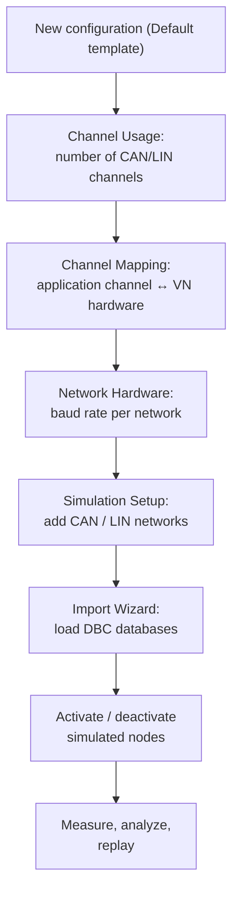
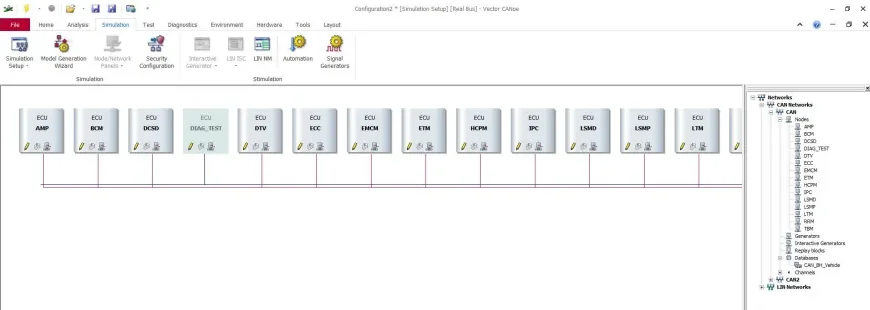
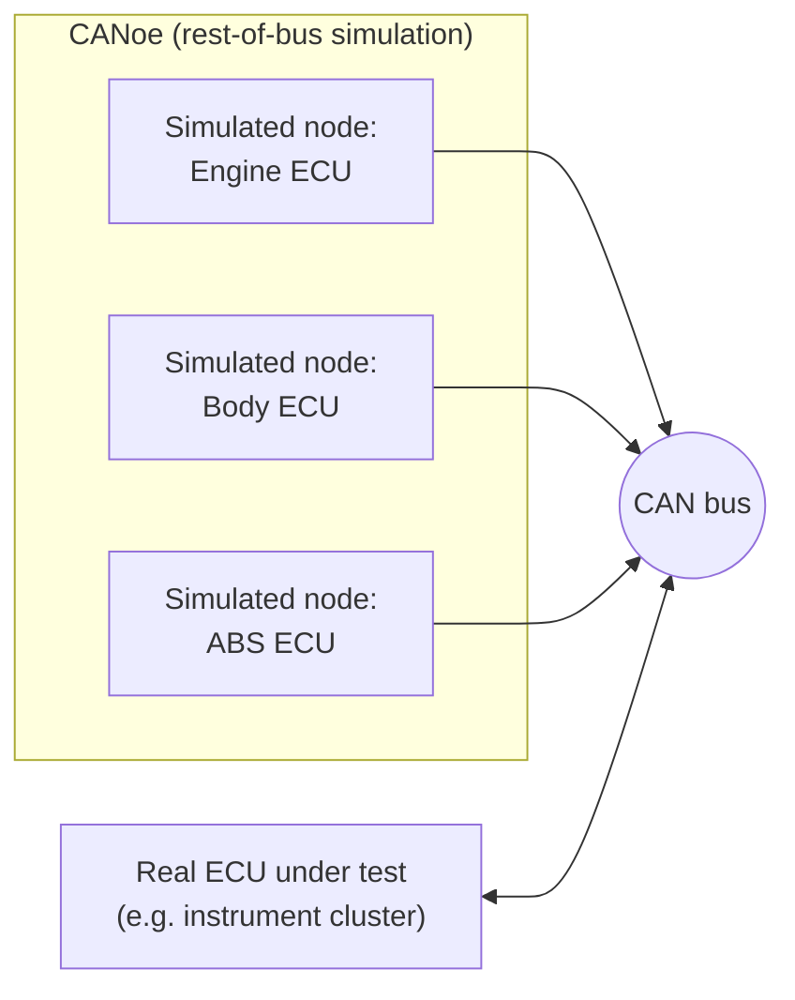
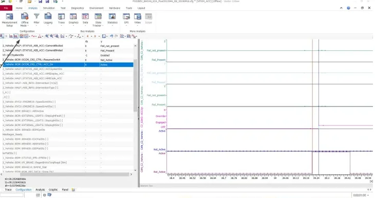
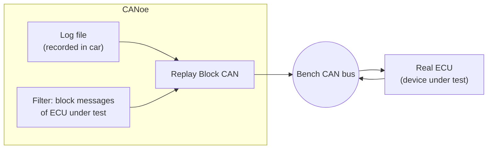
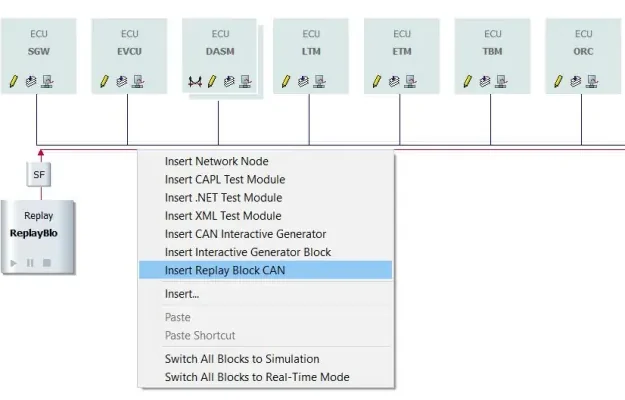

# CANoe — Configuring a Simulation Environment

Welcome to the tool you will probably live in for the rest of the bootcamp.
[CANalyzer](../canalyzer/index.md) lets you *watch* a bus; **CANoe** lets you
*build* one. On top of the same measurement and analysis windows, CANoe adds a
simulation layer — network nodes generated from the communication database
that transmit their messages as if the real Electronic Control Units (ECUs)
were on your bench. This is called **rest-of-bus simulation**: you connect one
real ECU, and CANoe plays the role of all the others.

Why does this matter? Because you will rarely have a whole vehicle at your
desk. Day to day, you will use CANoe to test ECUs that would otherwise sit
silent on a bench, waiting for messages only their missing neighbors could
send. By the end of this article you will be able to build a complete CANoe
configuration from scratch — hardware channels, databases, simulated nodes —
and use it to test a real ECU stand-alone.

## CANoe vs. CANalyzer

Everything you already know from CANalyzer — Trace window, Graphics window,
the measurement setup with its analysis and logging blocks — works exactly the
same way in CANoe. That familiarity is a gift: you are not learning a new
tool, you are unlocking a new superpower in one you know. The differences:

- **CANoe is built around databases.** Where CANalyzer mostly looks at an
  existing bus, a CANoe configuration typically starts by importing the DBC
  (Database CAN) files that describe the network, because the simulation is
  generated from them.
- **Simulation blocks live in the Simulation Setup**, not in the Measurement
  Setup. Program nodes (CAPL), Interactive Generators (IG) and replay blocks
  are inserted on the network diagram, right next to the simulated ECUs.
- **CANoe can simulate ECUs.** It reproduces the *CAN messaging* of each node
  defined in the database — periodic frames, default signal values — but not
  the ECU's internal logic, unless you add that logic yourself in
  [CAPL](../capl/index.md) (Communication Access Programming Language,
  Vector's C-like scripting language).

## Building a configuration step by step

Here is the whole workflow at a glance, in the order you would actually build
it. Don't worry about memorizing it now — each step is explained below.

### 1. Create the configuration

Start from **File → New** and pick the **Default** template. The result is an
empty configuration (a `.cfg` file) that you fill in through the ribbon tabs.

### 2. Hardware configuration

Three dialogs under the **Hardware** ribbon define how CANoe talks to the
physical bus through the Vector hardware (VN — Vector Network — interfaces
such as the VN16xx family):

| Dialog | What you set |
|---|---|
| **Hardware → Channel Usage → General** | How many CAN and LIN channels the configuration uses |
| **Hardware → Channel Mapping** | Which *application channel* (CAN 1, CAN 2, … in CANoe) is bound to which *physical channel* on the VN device |
| **Hardware → Network Hardware** | The baud rate of each network |

The channel mapping step matters more than it looks. CANoe always works with
*logical* channels: your configuration says "CAN 1", and the mapping decides
which real transceiver on the VN box that is. This is what lets you move a
configuration between a bench box and a laptop without rewriting anything —
you just remap the channels.

### 3. Baud rates

Under **Hardware → Network Hardware** you set the bit rate per network. For
the typical vehicle buses used in the course:

| Network | Baud rate |
|---|---|
| B-CAN (body) | 50 kBaud |
| BH-CAN (body high) | 125 kBaud |
| C-CAN (powertrain) | 500 kBaud |

!!! warning "Baud rate mismatch = silent bus"
    If the configured baud rate does not match the real bus, you will see no
    valid frames (or only error frames) — and no obvious error message telling
    you why. This is one of the most common beginner traps: always confirm the
    rate from the network specification *before* blaming the wiring.

### 4. Add networks in the Simulation Setup

Open **Simulation → Simulation Setup** — the heart of a CANoe configuration.
This is a graphical view of the simulated bus topology:

- Right-click **CAN Networks → Add...** to create a new CAN network.
- Right-click **LIN Networks → Add...** to create a new LIN network.

You can create **more networks than you have hardware channels**. A network
with no mapped channel simply runs as pure simulation; unmapped channels are
disabled in the Channel Mapping dialog. This is a quietly powerful feature: it
lets you build the *complete* vehicle network on a laptop and attach hardware
only to the buses you actually need.

### 5. Import the databases

Each network needs its communication database (DBC for CAN, LDF — LIN
Description File — for LIN). CANoe's **Import Wizard** loads the database and
attaches it to the network. From that moment CANoe knows every ECU, message
and signal on that bus — the same decoding you get in CANalyzer, plus the
ability to *simulate* the senders.

## Rest-of-bus simulation

After the import, the Simulation Setup shows one block per ECU defined in the
database, connected to the bus line:

Each of those blocks is a **simulated node**: when the measurement starts,
CANoe transmits the node's messages automatically, with the signal default
values taken from the database. Put one real ECU on the bus instead of its
simulated counterpart, and the device genuinely cannot tell it left the car:

Two things to keep in mind:

- Only the *messaging* is simulated — not the ECU's software. A simulated body
  control module sends its cyclic frames, but it will not "react" to anything
  unless you write CAPL code for it.
- You control each node individually: **select the node and click the switch
  (sweeper) bar** on its block to deactivate it. A deactivated node goes
  silent on the bus.

!!! tip "Working in the real vehicle"
    When you connect CANoe to a *real* bus, you do not want simulated nodes
    injecting duplicate traffic. Right-click the bus line and choose **Switch
    All Blocks to Real-Time Mode** to silence every simulation block in one
    shot. Do the opposite (**Switch All Blocks to Simulation**) when you go
    back to bench testing.

### Changing signal values on a simulated node

Simulated messages go out with default values. To change a signal at runtime,
open the **Node Panel** of the simulated ECU, edit the signal value, and reload
the message so the new value is transmitted. This is how you feed stimulus to
a real device under test — for example, driving a vehicle-speed signal to see
how an instrument cluster reacts. It feels like magic the first time: the
cluster has no idea the "car" is a laptop.

## Measurement Setup

The **Measurement Setup** tab is essentially the same data-flow diagram you
know from CANalyzer: measurement start, analysis windows, filters and logging
blocks in series. The practical difference is *where* stimulus blocks live:

- In CANalyzer you insert an IG (Interactive Generator) in the measurement
  chain.
- In CANoe, **program nodes (CAPL), test modules and generator blocks are
  added in the Simulation Setup**, attached to the network they act on — see
  the insert menu in the replay-block figure below.

!!! note "A simple rule of thumb"
    Measurement Setup = *watching* the traffic. Simulation Setup = *creating*
    traffic. If a block produces messages or runs tests, it belongs on the
    network diagram.

## Signal analysis in the Graphics window

Once the measurement is running, analysis works exactly as in CANalyzer. The
two options you will use most:

1. **Add signals to a Graphics window** to plot them over time.
2. **Show the individual samples**: right-click in the Graphics window →
   **Configuration → Diagram** and enable **Show Samples**, so every received
   data point is marked instead of just the interpolated curve.

With the **measurement cursor / time-difference button** in the toolbar
(marked "1" in the figure) you can measure the time between two samples. The
classic example from the lesson: the delay between the **Adaptive Cruise
Control (ACC) activation button press** and the **response of the ACC system
status signal**. This is how you verify reaction-time requirements directly on
the trace — no stopwatch, no guesswork, just the bus telling you the truth.

## Replay blocks: testing one ECU stand-alone

A scenario you will meet constantly: you captured a log in the car
(`.asc`/`.blf`), and now you want one ECU on the bench to behave as if it were
still in the vehicle. The recipe:

1. In the Simulation Setup, right-click the network and **Insert Replay Block
   CAN**.
2. Configure the block with the log file — CANoe re-transmits the recorded
   traffic on the bench bus.
3. **Add a filter that blocks the messages of the ECU you are testing.** Those
   messages exist in the log, but on the bench they must come from the *real*
   ECU, not from the replay — otherwise the device sees its own messages
   duplicated. Forgetting this filter is a rite of passage; now you can skip
   it.

The same right-click menu is where you insert **CAPL test modules**, XML/.NET
test modules and interactive generators — everything that produces traffic or
runs tests attaches here, on the network it belongs to.

!!! note "Replay vs. simulation nodes"
    A replay block plays back *recorded* traffic exactly as it happened;
    simulated nodes generate traffic *from the database* with values you
    control. Use replay to reproduce a real scenario, and simulation nodes
    when you need to vary the stimulus.

!!! success "Key takeaways"
    - You can do this: CANoe is CANalyzer plus simulation, and the simulation
      is generated for you from the DBC import.
    - Stimulus lives in the **Simulation Setup**, analysis in the Measurement
      Setup — that one distinction answers most "where do I put this block?"
      questions.
    - Configuration order: **Channel Usage** → **Channel Mapping** (logical ↔
      physical) → **Network Hardware** (B-CAN 50, BH-CAN 125, C-CAN 500
      kBaud) → add networks → **Import Wizard** for the DBC.
    - DBC import gives you one simulated node per ECU, sending default values
      you can edit live in the Node Panel. Silence everything with **Switch
      All Blocks to Real-Time Mode** before touching a real vehicle.
    - Two classic pitfalls, now avoided: wrong baud rate (silent bus) and a
      replay block without a filter on the DUT's own messages (duplicated
      traffic).
    - With rest-of-bus simulation and a log file, you can test any ECU on your
      bench as if the whole car were around it.

!!! tip "Where this leads"
    Simulated nodes that actually *react* to the bus are programmed in
    [CAPL](../capl/index.md), and the bus fundamentals behind these
    configurations (frames, arbitration, DBC files, vehicle bus speeds) are in
    [CAN, LIN & Automotive Ethernet](../../mil1/can-lin/index.md).
