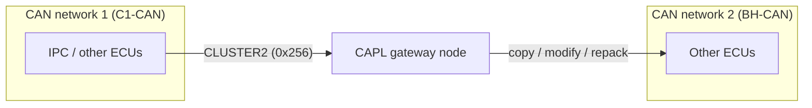
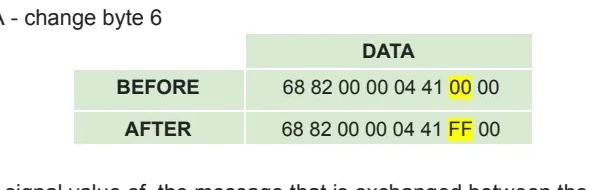
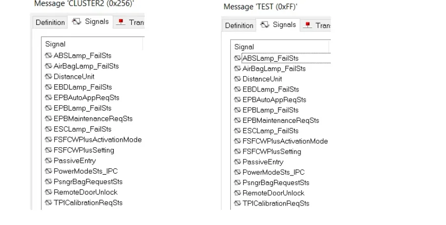

# CAPL Exercise: Building a CAN Gateway

A **gateway** is an ECU (or, in the lab, a simulated node) that sits between two
CAN networks and forwards traffic from one to the other. Real vehicles use
gateways to separate buses with different speeds and criticality — for example
the instrument panel computer (IPC) bridging the body bus and the powertrain
bus. In this exercise you build one yourself in CAPL, then use it to manipulate
the forwarded traffic: modify a byte, modify a signal, and republish a message
under a new identifier.

## Goal

- Write a CAPL program that copies messages (single or multiple) from one CAN
  network to the other, acting as a gateway.
- Modify one data byte and one signal value of a forwarded message.
- Create a new `TEST` message in the second network's database and fill it with
  the content of a message coming from the first network.



## Setup

You need a CANoe (or CANalyzer with a full CAPL node) configuration with **two
CAN channels** and the two database files supplied with the exercise:

| File | Network |
|---|---|
| `P332BEV_C1_CAN_R1_20200902_E2A_plus_CR14698_14830_14888.dbc` | CAN 1 (C1-CAN) |
| `P332BEV_BH_CAN_R1_20200902_E2A_plus_CR14698_14830_14888_(1).dbc` | CAN 2 (BH-CAN) |

Preliminary actions:

1. Configure the hardware/simulation setup with **2 CAN channels** and assign
   each DBC to its CAN network in the configuration (**Simulation Setup** →
   right-click the network → assign database).
2. In the **Simulation Setup**, insert a **programming (CAPL) node** between the
   two networks — this node is your gateway.
3. Open the node's CAPL program in the **CAPL Browser** and write the forwarding
   code (see below).
4. Start the measurement and check the result in the **Trace** window.

!!! tip
    If you have no real traffic source, add an **IG (Interactive Generator)**
    block or a second CAPL node on CAN 1 that sends the source message
    cyclically — otherwise the gateway has nothing to forward and the Trace
    stays empty.

## Step 1 — Forward a message between the two networks

The core of a CAPL gateway is an `on message` handler that re-sends the received
frame on the other channel. For a single message (e.g. `CLUSTER2`, ID `0x256`,
sent by the IPC on CAN 1):

```c
variables
{
  message CAN2.CLUSTER2 fwdMsg;   // frame to be sent on CAN 2
}

on message CAN1.CLUSTER2
{
  fwdMsg.dlc = this.dlc;          // preserve payload length
  // copy the payload byte by byte
  fwdMsg.byte(0) = this.byte(0);
  // ... bytes 1..7, or copy signal by signal (see step 3)
  output(fwdMsg);                 // goes out on CAN 2
}
```

To forward *multiple* messages, either add one handler per message or use a
generic handler (`on message CAN1.*`) that copies identifier, DLC and data bytes
into a raw `message` variable and re-outputs it on CAN 2.

!!! warning "Avoid the echo loop"
    If you write symmetric handlers (`CAN1.* → CAN2` and `CAN2.* → CAN1`) for
    the same identifier, your own forwarded frame triggers the opposite handler
    and bounces back forever, flooding both buses. Forward each identifier in
    **one direction only**, or guard the handlers.

**Check:** in the Trace window you should see the original frame on CAN 1 and,
immediately after, the same identifier and data on CAN 2, sent by your gateway
node.

## Step 2 — Modify the message in transit

### Change a raw byte

Overwrite one payload byte before calling `output()`. First look in the **CANdb++
Editor** at the byte layout of the message you are modifying, because the signal
byte order matters:

- **Motorola (big-endian):** bytes are laid out left to right, from byte 0.
- **Intel (little-endian):** the opposite order.

The exercise example uses a Motorola-layout message and flips byte 6 from `00`
to `FF`:



```c
on message CAN1.CLUSTER2
{
  // ... copy the frame as in step 1 ...
  fwdMsg.byte(5) = 0xFF;          // byte(5) = the 6th byte, zero-based index
  output(fwdMsg);
}
```

### Change a signal value

Because a DBC is associated with each network, you can address signals by name
instead of counting bits — this is usually safer than raw byte edits:

```c
on message CAN1.CLUSTER2
{
  // ... copy the frame ...
  fwdMsg.PowerModeSts_IPC = 2;    // force one signal to a chosen value
  output(fwdMsg);
}
```

CAPL applies the signal's scaling and byte order from the DBC automatically, so
you set the *physical* value, not the raw bits.

## Step 3 — Republish under a new identifier (the `TEST` message)

Gateways often *repack* data rather than forwarding frames one-to-one. To
practice this:

1. Open the **CAN 2 DBC** in the CANdb++ Editor and create a new message named
   `TEST` — give it its own free identifier (the exercise uses `0xFF`) and set
   the DLC.
2. Pick the source message on CAN 1 (e.g. `CLUSTER2`, `0x256`) and add the
   **same signals** to `TEST` in the CAN 2 database, so the republished frame
   decodes correctly in the Trace window.
3. Extend the CAPL handler to fill `TEST` from the incoming frame:

```c
variables
{
  message CAN2.TEST testMsg;
}

on message CAN1.CLUSTER2
{
  testMsg.ABSLamp_FailSts    = this.ABSLamp_FailSts;
  testMsg.AirBagLamp_FailSts = this.AirBagLamp_FailSts;
  testMsg.DistanceUnit       = this.DistanceUnit;
  // ... repeat for every signal you added to TEST ...
  output(testMsg);
}
```

The CANdb++ Editor view below shows the idea: `CLUSTER2 (0x256)` on CAN 1 on the
left, and the new `TEST (0xFF)` message carrying the same signal list on the
right.



**Check:** the Trace now shows `TEST` on CAN 2, and because its signals exist in
the CAN 2 DBC, the decoded signal values match those of `CLUSTER2` on CAN 1.

## Common mistakes

- **No DBC on one channel** — named access (`fwdMsg.SignalName`) fails to
  compile, or the Trace shows raw hex only. Assign both DBCs before writing code.
- **Identifier collision for `TEST`** — choose an ID that is unused on CAN 2;
  `0xFF` is the exercise's suggestion, not a rule.
- **DLC mismatch** — if `TEST` has a smaller DLC than the source message,
  trailing signals are silently lost; match the signal layout to the DLC.
- **Byte vs. signal confusion with byte order** — editing `byte(5)` hits a
  different signal depending on whether the layout is Motorola or Intel; verify
  in CANdb++ before hard-coding byte indices.
- **Gateway loops** — bidirectional handlers for the same ID create an infinite
  ping-pong (see the warning in step 1).
- **Nothing to forward** — without a transmitting node or IG block on CAN 1, the
  gateway never fires and the Trace stays empty.

!!! success "Key takeaways"
    - A CAPL gateway = an `on message` handler that copies a frame (bytes or
      signals) into a `message` variable bound to the other CAN channel and
      calls `output()`.
    - You can modify traffic in transit: raw bytes with `byte(n)` (mind the
      Motorola/Intel byte order) or named signals with DBC-based access.
    - Repacking into a new `TEST` message requires editing the target DBC in the
      CANdb++ Editor: create the message with a free ID, then add the same
      signals so the Trace decodes it.
    - Always verify in the **Trace** window: original frame on CAN 1, forwarded
      (and modified) frame on CAN 2.

!!! tip "Where this leads"
    The same forwarding and signal-manipulation techniques are used to build
    restbus simulations and to inject test traffic in the later HIL and test
    automation lessons. Review [CAPL](../../index.md) for the language basics
    and [CANalyzer](../../../canalyzer/index.md) for Trace and IG blocks.
