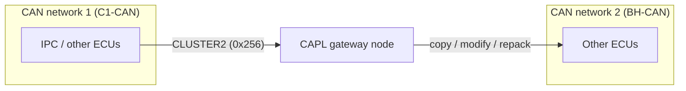

# CAPL Exercise: Building a CAN Gateway

Welcome to your first hands-on CAPL (Communication Access Programming Language)
project — and it's a good one. A **gateway** is an ECU that sits between two CAN
(Controller Area Network) buses and forwards traffic from one side to the other.
Every real car has them: they let a fast, safety-critical powertrain bus and a
slower body bus coexist without drowning each other in traffic. The instrument
panel computer (IPC), for example, often bridges exactly these two worlds.

In this exercise you *become* the gateway. By the end, you'll be able to:

- forward CAN messages from one network to another with a small CAPL program,
- deliberately manipulate traffic in transit — change a raw byte, change a named
  signal,
- repackage a message under a brand-new identifier so it looks native on the
  second bus.

These are the exact techniques behind restbus simulation and fault injection,
so what you practice here pays off for the rest of the bootcamp.

## What you'll practice

Three gateway skills, in increasing order of cleverness: **copy** a message
across the bus boundary, **modify** it on the way through, and **repack** its
signals into a new message the second network understands.



## Goal

- Write a CAPL program that copies messages (single or multiple) from one CAN
  network to the other, acting as a gateway.
- Modify one data byte and one signal value of a forwarded message.
- Create a new `TEST` message in the second network's database and fill it with
  the content of a message coming from the first network.

## Setup

You need a CANoe (or CANalyzer with a full CAPL node) configuration with **two
CAN channels**, plus the two DBC (Database CAN) files supplied with the exercise
— remember, a DBC is what turns raw identifiers and bytes into named, scaled
signals:

| File | Network |
|---|---|
| `P332BEV_C1_CAN_R1_20200902_E2A_plus_CR14698_14830_14888.dbc` | CAN 1 (C1-CAN) |
| `P332BEV_BH_CAN_R1_20200902_E2A_plus_CR14698_14830_14888_(1).dbc` | CAN 2 (BH-CAN) |

Four steps and you're ready to code:

1. Configure the hardware/simulation setup with **2 CAN channels** and assign
   each DBC to its CAN network (**Simulation Setup** → right-click the network →
   assign database).
2. In the **Simulation Setup**, insert a **programming (CAPL) node** between the
   two networks — that node *is* your gateway.
3. Open the node's program in the **CAPL Browser** and write the forwarding code
   below.
4. Start the measurement and watch the result in the **Trace** window.

!!! tip
    A gateway with no traffic is a sad gateway. If nothing is transmitting on
    CAN 1, add an **IG (Interactive Generator)** block or a second CAPL node that
    sends the source message cyclically — otherwise your handler never fires and
    the Trace stays empty. This is the most common "my code doesn't work" moment,
    and it isn't the code.

## Step 1 — Forward a message between the two networks

The heart of a CAPL gateway is wonderfully simple: an `on message` handler that
re-sends whatever it receives, addressed to the other channel. Here's the pattern
for a single message — `CLUSTER2` (ID `0x256`), sent by the IPC on CAN 1:

```c
variables
{
  message CAN2.CLUSTER2 fwdMsg;   // frame to be sent on CAN 2
}

on message CAN1.CLUSTER2
{
  fwdMsg.dlc = this.dlc;          // preserve payload length
  // copy the payload byte by byte
  fwdMsg.byte(0) = this.byte(0);
  // ... bytes 1..7, or copy signal by signal (see step 3)
  output(fwdMsg);                 // goes out on CAN 2
}
```

Two details do the heavy lifting: declaring the variable as
`message CAN2.CLUSTER2` ties the outgoing frame to channel 2, and `this` inside
the handler always means "the message that just woke me up."

To forward *multiple* messages, either write one handler per message, or use a
generic handler (`on message CAN1.*`) that copies identifier, DLC and data bytes
into a raw `message` variable and re-outputs it on CAN 2.

!!! warning "Avoid the echo loop"
    If you write symmetric handlers (`CAN1.* → CAN2` and `CAN2.* → CAN1`) for
    the same identifier, your own forwarded frame triggers the opposite handler
    and bounces back forever, flooding both buses. Forward each identifier in
    **one direction only**, or guard the handlers.

**Check:** in the Trace window you should see the original frame on CAN 1 and,
immediately after, the same identifier and data on CAN 2, sent by your gateway
node. Seeing that pair appear is your first real "I built a gateway" moment.

## Step 2 — Modify the message in transit

Forwarding is useful; *tampering on purpose* is where it gets fun. This is the
foundation of fault injection: change one thing, watch the system react.

### Change a raw byte

Overwrite one payload byte before calling `output()`. But first, open the
message in the **CANdb++ Editor** and check its byte layout, because it decides
which byte your index actually hits:

- **Motorola (big-endian):** bytes are laid out left to right, from byte 0.
- **Intel (little-endian):** the opposite order.

The exercise example uses a Motorola-layout message and flips byte 6 from `00`
to `FF`:


```c
on message CAN1.CLUSTER2
{
  // ... copy the frame as in step 1 ...
  fwdMsg.byte(5) = 0xFF;          // byte(5) = the 6th byte, zero-based index
  output(fwdMsg);
}
```

(Yes, `byte(5)` is the sixth byte — CAPL counts from zero. Everyone trips on
this once.)

### Change a signal value

Because each network has a DBC attached, you can address signals **by name**
instead of counting bits — and you should, because it's both clearer and safer:

```c
on message CAN1.CLUSTER2
{
  // ... copy the frame ...
  fwdMsg.PowerModeSts_IPC = 2;    // force one signal to a chosen value
  output(fwdMsg);
}
```

CAPL applies the signal's scaling, byte order and bit position from the DBC for
you, so you write the *physical* value and never touch the bit layout. Reach for
raw bytes only when you truly need them.

## Step 3 — Republish under a new identifier (the `TEST` message)

Real gateways rarely forward frames one-to-one — they *repack* data into
messages that make sense on the target bus. That's your final skill. Three
moves:

1. Open the **CAN 2 DBC** in the CANdb++ Editor and create a new message named
   `TEST` — give it a free identifier (the exercise suggests `0xFF`) and set
   the DLC.
2. Pick your source message on CAN 1 (e.g. `CLUSTER2`, `0x256`) and add the
   **same signals** to `TEST` in the CAN 2 database, so the republished frame
   decodes properly in the Trace window.
3. Extend your CAPL handler to fill `TEST` from the incoming frame, signal by
   signal:

```c
variables
{
  message CAN2.TEST testMsg;
}

on message CAN1.CLUSTER2
{
  testMsg.ABSLamp_FailSts    = this.ABSLamp_FailSts;
  testMsg.AirBagLamp_FailSts = this.AirBagLamp_FailSts;
  testMsg.DistanceUnit       = this.DistanceUnit;
  // ... repeat for every signal you added to TEST ...
  output(testMsg);
}
```

The CANdb++ Editor view below shows the idea: `CLUSTER2 (0x256)` on CAN 1 on
the left, and the new `TEST (0xFF)` message carrying the same signal list on
the right.


**Check:** the Trace now shows `TEST` on CAN 2, and because its signals live in
the CAN 2 DBC, the decoded values match those of `CLUSTER2` on CAN 1. Same
data, new identity — that's repacking.

## Common mistakes

Everyone hits at least one of these — now you'll recognize them instantly:

- **No DBC on one channel** — named access (`fwdMsg.SignalName`) fails to
  compile, or the Trace shows raw hex only. Assign both DBCs before writing
  code.
- **Identifier collision for `TEST`** — choose an ID that is unused on CAN 2;
  `0xFF` is the exercise's suggestion, not a rule.
- **DLC mismatch** — if `TEST` has a smaller DLC than the source message,
  trailing signals are silently lost; match the signal layout to the DLC.
- **Byte vs. signal confusion with byte order** — editing `byte(5)` hits a
  different signal depending on whether the layout is Motorola or Intel; verify
  in CANdb++ before hard-coding byte indices.
- **Gateway loops** — bidirectional handlers for the same ID create an infinite
  ping-pong (see the warning in step 1).
- **Nothing to forward** — without a transmitting node or IG block on CAN 1,
  the gateway never fires and the Trace stays empty.

!!! success "Key takeaways"
    - A CAPL gateway is just an `on message` handler that copies a frame (bytes
      or signals) into a `message` variable bound to the other CAN channel and
      calls `output()` — you can write one from memory now.
    - You can shape traffic in transit: raw bytes with `byte(n)` (mind the
      Motorola/Intel byte order) or named signals with DBC-based access — the
      safer, clearer option.
    - Repacking into a new `TEST` message takes two edits: create the message
      with a free ID in the CANdb++ Editor, then add the same signals so the
      Trace decodes it.
    - The Trace window is your proof: original frame on CAN 1, forwarded (and
      modified) frame on CAN 2. If you can see both, your gateway works.

!!! tip "Where this leads"
    The same forwarding and signal-manipulation techniques power restbus
    simulations and test-traffic injection in the later HIL and test automation
    lessons. Review [CAPL](../../index.md) for the language basics and
    [CANalyzer](../../../canalyzer/index.md) for Trace and IG blocks.
