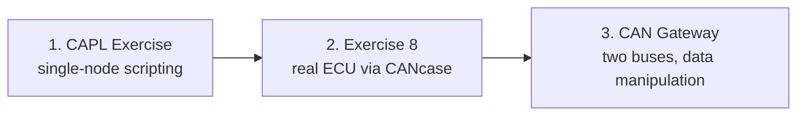

# CAPL Exercises

This section collects the hands-on CAPL labs of the MIL2 module. After the
[CAPL](../index.md) theory lessons, these exercises put you in front of
CANoe/CANalyzer with the real **P332 BEV platform databases** and ask you to
write event-driven scripts that behave like real ECUs — sending cyclic frames,
reacting to received messages, and even bridging two CAN buses.

All three labs revolve around the same scenario: the **IPC** (Instrument Panel
Cluster) ECU and the body/chassis CAN networks it talks to, described by the
P332BEV DBC files attached to each exercise folder.

## What you need before starting

| Item | Notes |
|---|---|
| CANoe **or** CANalyzer | Any of the two works; exercises reference both |
| P332BEV **BH-CAN** DBC | Body-high network database, attached to every lab |
| P332BEV **C1-CAN** DBC | Chassis network database, needed by Exercise 8 and the Gateway lab |
| CANcaseXL + a real ECU | Only for Exercise 8, where your transmitted frame must actually be received by hardware |

Common ground for every lab: create a configuration, attach the DBC(s) to the
CAN channels, insert a **Program/Network node**, and open the CAPL Browser to
write the code. Verify everything in the **Trace** and **Write** windows.

## The three labs

### 1. [CAPL Exercise — Simulating the IPC environment](capl-exercise/index.md)

You simulate the part of the vehicle network that communicates with the IPC
ECU. The script must send the `STATUS_UBSS_BH` message cyclically (period taken
from the DBC), react to a keyboard key by sending `TELEMATIC_VEHICLE_SETUP2`
with `PowerLevelReq = 0x3`, and keep a counter of the mismatches between the
`PowerLevel` signal received in `IPC_VEHICLE_SETUP` and the requested value.
It also has to survive error conditions: stop transmitting on **Bus Off**, and
print a summary line to the Write window when the measurement ends. This is the
most complete single-node CAPL workout — timers, `on key`, `on message`,
signal access and error handling in one script.

### 2. [Exercise 8 — CAPL with real hardware](capl-exercise8/index.md)

A shorter lab that connects the toolchain to the physical world: configure
trace observation and logging, plot two signals of interest in a Graphics
window, print the payload of a received CAN message, and transmit a frame with
correct timing that a **real ECU connected to the CANcase** actually receives.
Measurement lifecycle messages ("Started" / "Stopped") round it out.

### 3. [CAN Gateway — Bridging two CAN buses](capl-exercise-gateway/index.md)

The advanced lab: a CAPL node acting as a **gateway** between the C1-CAN and
BH-CAN networks. You copy messages from one bus to the other, verify routing in
the Trace window, then modify data in transit — first a raw byte (paying
attention to **Motorola vs. Intel byte order**, checked in the CANdb++ Editor),
then a scaled signal value. Finally you extend the DBC with a new `TEST`
message and signals, and repack the routed content into it.

## Suggested order

Do them in order: the first lab teaches the CAPL event handlers and timer
patterns, the second adds hardware and measurement analysis, and the gateway
lab combines both while adding byte/signal-level data manipulation.

!!! tip "Habits that pay off in all three labs"
    - Always check the message's **cycle time in the DBC** instead of guessing a
      timer period.
    - Use the **Trace window** as your source of truth: if your transmitted
      frame does not appear there, the node or channel setup is wrong, not the
      CAPL.
    - When editing signals in the gateway lab, confirm the byte order
      (Motorola/Intel) in CANdb++ before touching data bytes.

!!! success "Key takeaways"
    - The labs progress from single-node simulation, to real-hardware
      interaction, to a two-bus gateway with in-transit data modification.
    - Everything is anchored to the P332BEV BH-CAN and C1-CAN databases — read
      IDs, periods and signal layouts from the DBC, never hardcode blindly.
    - Trace + Write windows are your debugging tools; Bus Off handling and
      measurement start/stop hooks are part of correct CAPL behaviour.
