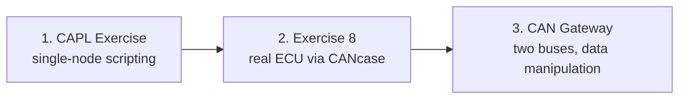

# CAPL Exercises — Hands-On Lab Series

This series of three labs applies CAPL (**Communication Access Programming
Language**, Vector's C-like scripting language) in practice. Following the
[CAPL theory lessons](../index.md), the labs are carried out in
CANoe/CANalyzer using the real **P332 BEV (Battery Electric Vehicle) platform
databases**, and each lab requires a script that behaves like a real
**ECU (Electronic Control Unit)** — sending cyclic frames, reacting to
messages arriving on the bus, and bridging two CAN (Controller Area Network)
buses together.

By the end of this series you will be able to:

- write event-driven CAPL nodes using timers, `on key`, `on message` and
  signal access — the everyday patterns of restbus simulation,
- connect your toolchain to real hardware and verify your frames actually
  reach a physical ECU,
- build a two-bus **gateway** that forwards, modifies and repackages live
  traffic.

**Focus of the exercises:** reading identifiers, periods and signal layouts
from the database, and verifying every behavior in the Trace window.

## The scenario

All three labs are based on the **IPC (Instrument Panel Cluster)** ECU — the
computer behind the dashboard — and the body/chassis CAN networks it
communicates with. The networks are described by the P332BEV **DBC (Database
CAN)** files attached to each exercise folder: `BH-CAN` for the body-high bus,
`C1-CAN` for the chassis bus. These files are the reference for every message
name, cycle time and signal layout used in the exercises.

## Setup — what you need before starting

| Item | Notes |
|---|---|
| CANoe **or** CANalyzer | Either works; the exercises reference both |
| P332BEV **BH-CAN** DBC | Body-high network database, attached to every lab |
| P332BEV **C1-CAN** DBC | Chassis network database, needed by Exercise 8 and the Gateway lab |
| CANcaseXL + a real ECU | Only for Exercise 8, where your transmitted frame must actually be received by hardware |

Every lab starts the same way: create a configuration, attach the DBC(s) to
the CAN channels, insert a **Program/Network node**, and open the CAPL Browser
to write your code. The **Trace** and **Write** windows are then used to
verify the behavior.

## Lab 1 — [Simulating the IPC environment](capl-exercise/index.md)

The first complete CAPL node. **Goal:** simulate the portion of the vehicle
network that communicates with the IPC. The lab uses a single script covering
four event-driven tasks:

1. Send the `STATUS_UBSS_BH` message cyclically for the whole measurement,
   using the exact period from the DBC (a self-re-arming timer plus `output()`).
2. When the **"2" key** is pressed, send `TELEMATIC_VEHICLE_SETUP2` with the
   `PowerLevelReq` signal set to `0x3`.
3. Each time `IPC_VEHICLE_SETUP` arrives, compare its `PowerLevel` signal
   against the requested value: increment the counter `Count1` on every
   mismatch, decrement it on every match — and never let it go below zero.
4. Stop transmitting if a **Bus Off** condition occurs, and at the end of the
   measurement print a summary line to the Write window reporting how many
   times `PowerLevel` differed from `PowerLevelReq`.

This is the most complete single-node exercise of the series, combining
timers, key events, message handlers, signal access and error handling in one
script.

## Lab 2 — [Exercise 8: CAPL with real hardware](capl-exercise8/index.md)

A shorter lab that connects the toolchain to physical hardware. **Goal:** run
a real measurement through the CANcaseXL and script on top of it — configure
trace observation and logging, plot two signals of interest in a Graphics
window, print the payload of a received CAN message, and transmit a frame with
correct timing that the **real ECU** on the other end actually accepts without
faulting. Measurement lifecycle prints (`"Started"` / `"Stopped"`) complete
the exercise. Where Lab 1 covers the CAPL language constructs, this lab covers
the hardware workflow: configure and observe the measurement first, then add
scripting.

## Lab 3 — [CAN Gateway: bridging two CAN buses](capl-exercise-gateway/index.md)

The advanced lab. **Goal:** implement a gateway between the C1-CAN and BH-CAN
networks. You start by copying messages from one bus to the other and
verifying the routing in the Trace window. Then you modify traffic in transit
— first a raw byte (checking the **Motorola vs. Intel byte order** in the
CANdb++ Editor before making any change), then a scaled signal value by name.
Finally you extend the DBC with a new `TEST` message and signals, and repack
the routed content into it so it appears native on the second bus. These three
operations — copy, modify, repack — are the basis of restbus simulation and
fault injection.

## Suggested order

Complete the labs in order: Lab 1 teaches the CAPL event handlers and timer
patterns, Lab 2 adds hardware and measurement analysis, and the Gateway lab
combines both while adding byte- and signal-level data manipulation. Each lab
builds on the skills developed in the previous one.

!!! tip "Practical recommendations"
    - Always read the message's **cycle time from the DBC** instead of
      guessing a timer period — a wrong period floods the bus or trips
      timeout faults in the receiving ECU.
    - Use the **Trace window** to verify behavior: if a transmitted frame
      does not appear there, the problem is in the node or channel setup,
      not in the CAPL code.
    - Before editing bytes in the Gateway lab, confirm the byte order
      (Motorola/Intel) in CANdb++ — `byte(5)` hits a different signal
      depending on the layout.

!!! success "Key takeaways"
    - The three labs progress from single-node simulation to real-hardware
      interaction to a two-bus gateway with in-transit data manipulation.
    - Message IDs, cycle times and signal layouts are read from the P332BEV
      BH-CAN and C1-CAN DBC files rather than hardcoded.
    - Cyclic transmission is implemented with timers and `output()`; event
      handling uses `on message` and `on key`.
    - The Trace and Write windows are used to verify behavior; Bus Off
      handling and measurement start/stop hooks are required for a script to
      behave like a real ECU.
