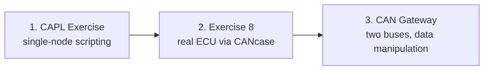

# CAPL Exercises — Your Hands-On Lab Series

Time to stop reading about CAPL (**Communication Access Programming Language**,
Vector's C-like scripting language) and start writing it. After the
[CAPL theory lessons](../index.md), these three labs put you in front of
CANoe/CANalyzer with the real **P332 BEV (Battery Electric Vehicle) platform
databases** and ask you to make a script behave like a real **ECU (Electronic
Control Unit)** — sending cyclic frames, reacting to what arrives on the bus,
and even bridging two CAN (Controller Area Network) buses together.

By the end of this series you will be able to:

- write event-driven CAPL nodes using timers, `on key`, `on message` and
  signal access — the everyday patterns of restbus simulation,
- connect your toolchain to real hardware and verify your frames actually
  reach a physical ECU,
- build a two-bus **gateway** that forwards, modifies and repackages live
  traffic.

**What you'll practice:** thinking like the ECU you're simulating — reading
identifiers, periods and signal layouts from the database, and proving every
behavior in the Trace window.

## The scenario

All three labs revolve around the **IPC (Instrument Panel Cluster)** ECU — the
computer behind the dashboard — and the body/chassis CAN networks it talks to.
The networks are described by the P332BEV **DBC (Database CAN)** files attached
to each exercise folder: `BH-CAN` for the body-high bus, `C1-CAN` for the
chassis bus. Those files are your source of truth for every message name,
cycle time and signal layout you'll touch.

## Setup — what you need before starting

| Item | Notes |
|---|---|
| CANoe **or** CANalyzer | Either works; the exercises reference both |
| P332BEV **BH-CAN** DBC | Body-high network database, attached to every lab |
| P332BEV **C1-CAN** DBC | Chassis network database, needed by Exercise 8 and the Gateway lab |
| CANcaseXL + a real ECU | Only for Exercise 8, where your transmitted frame must actually be received by hardware |

Every lab starts the same way: create a configuration, attach the DBC(s) to
the CAN channels, insert a **Program/Network node**, and open the CAPL Browser
to write your code. From then on, the **Trace** and **Write** windows are how
you prove it works.

## Lab 1 — [Simulating the IPC environment](capl-exercise/index.md)

Your first complete CAPL node. **Goal:** simulate the slice of the vehicle
network that talks to the IPC. One script, four event-driven skills:

1. Send the `STATUS_UBSS_BH` message cyclically for the whole measurement,
   using the exact period from the DBC (a self-re-arming timer plus `output()`).
2. When the **"2" key** is pressed, send `TELEMATIC_VEHICLE_SETUP2` with the
   `PowerLevelReq` signal set to `0x3`.
3. Each time `IPC_VEHICLE_SETUP` arrives, compare its `PowerLevel` signal
   against your requested value: bump a counter `Count1` on every mismatch,
   decrease it on every match — and never let it go below zero.
4. Behave like a good network citizen: stop transmitting if a **Bus Off**
   condition occurs, and at the end of the measurement print a summary line to
   the Write window reporting how many times `PowerLevel` differed from
   `PowerLevelReq`.

This is the most complete single-node workout of the series — timers, key
events, message handlers, signal access and error handling in one script.

## Lab 2 — [Exercise 8: CAPL with real hardware](capl-exercise8/index.md)

A shorter lab that connects everything to the physical world. **Goal:** run a
real measurement through the CANcaseXL and script on top of it — configure
trace observation and logging, plot two signals of interest in a Graphics
window, print the payload of a received CAN message, and transmit a frame with
correct timing that the **real ECU** on the other end actually accepts without
faulting. Measurement lifecycle prints (`"Started"` / `"Stopped"`) round it
out. If Lab 1 taught you the language, this one teaches you the discipline:
observe first, then script.

## Lab 3 — [CAN Gateway: bridging two CAN buses](capl-exercise-gateway/index.md)

The advanced lab, and the most fun. **Goal:** become the gateway between the
C1-CAN and BH-CAN networks. You start by copying messages from one bus to the
other and verifying the routing in the Trace window. Then you modify traffic
in transit — first a raw byte (checking the **Motorola vs. Intel byte order**
in the CANdb++ Editor before touching anything), then a scaled signal value by
name. Finally you extend the DBC with a new `TEST` message and signals, and
repack the routed content into it so it looks native on the second bus. Copy,
modify, repack: the three moves behind restbus simulation and fault injection.

## Suggested order

Take them in order: Lab 1 teaches the CAPL event handlers and timer patterns,
Lab 2 adds hardware and measurement analysis, and the Gateway lab combines
both while adding byte- and signal-level data manipulation. Each lab assumes
the previous one's instincts.

!!! tip "Habits that pay off in all three labs"
    - Always read the message's **cycle time from the DBC** instead of
      guessing a timer period — a wrong period floods the bus or trips
      timeout faults in the receiving ECU.
    - Treat the **Trace window** as your source of truth: if your transmitted
      frame doesn't appear there, the node or channel setup is wrong, not the
      CAPL.
    - Before editing bytes in the Gateway lab, confirm the byte order
      (Motorola/Intel) in CANdb++ — `byte(5)` hits a different signal
      depending on the layout.

!!! success "Key takeaways"
    - Three labs, one ladder: single-node simulation → real-hardware
      interaction → a two-bus gateway with in-transit data manipulation.
    - The P332BEV BH-CAN and C1-CAN databases anchor everything — read IDs,
      periods and signal layouts from the DBC, never hardcode blindly.
    - Timers + `output()` for cyclic frames, `on message`/`on key` for
      reactions: that small toolkit carries you through all three labs.
    - Trace and Write are your proof of work — and Bus Off handling plus
      measurement start/stop hooks are what makes CAPL behave like a real ECU.
