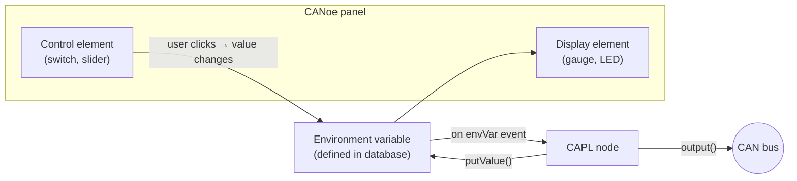

# CAPL In Depth — Language, Events and Functions

This article reworks the material from two classroom CAPL sessions (April 2021)
into a single reference. It covers the language from the ground up — what CAPL
is and where it lives inside CANoe, its syntax and semantics, the event-procedure
model, symbolic access to database objects, panels and environment variables,
and the built-in function catalog.

!!! note "Relationship to the main CAPL topic"
    This content intentionally overlaps with the main [CAPL](../../index.md)
    article. Read it as a second pass over the same ground, with extra attention
    to the **syntax pitfalls** that bite beginners: statically allocated local
    variables, `cancelTimer()` misuse, `putValue()` infinite loops, and the
    limits of environment variables.

## What CAPL is and where it runs

**CAPL** (Communication Access Programming Language) is a C-based, event-driven
programming language that exists only inside the Vector tool environment —
**CANalyzer**, **CANoe** and **vTESTstudio**. Its main job is programming
**network node modules**: the simulated ECUs that sit on the buses of a CANoe
simulation and behave like real controllers.

Typical applications:

- analyze specific messages or specific data in the traffic;
- create and modify the tool's measurement environment;
- build a custom module tester (manufacturing tester, diagnostic or service
  tool);
- create a **black box** that simulates the rest of the network around a real
  ECU (rest-bus simulation);
- program a **functional gateway** between two different networks.

### CAPL nodes in the Simulation Setup

In CANoe, each network (CAN, LIN, …) gets its own **Simulation Setup** window.
The nodes drawn on a network are programmable with CAPL, and the window shows,
for every network, the programmed nodes, the interrupt generators, and the
attached **databases** — DBC for CAN, LDF for LIN, XML for MOST, FIBEX for
FlexRay, ARXML for AUTOSAR.


Three icons on a node block tell you what you can do with it:

| Icon | Action |
|---|---|
| Pencil | Open / edit the node's CAPL program in the CAPL Browser |
| Sheets | Compile the CAPL program |
| Computer | Open the node's panel (does not affect the CAPL program) |

### The CAPL Browser

CAPL code is written in the **Vector CAPL Browser**. Its tree on the left
organizes the program into fixed sections:

- **includes** — external files;
- **variables** — global declarations;
- **System** — `on start`, `on timer xyz`, and other system events;
- **Value Objects** — `on signal_update xyz` and similar;
- **CAN** — `on message` procedures;
- **Diagnostics** — `on diagRequest` and related;
- **Functions** — user-defined functions.

On the right, the browser offers the **CAPL function help** and the **Symbols**
view of the linked database (messages, signals and environment variables), so
you can drag database objects straight into the code instead of typing their
names.

## CAPL vs. C

CAPL's syntax is C, but its execution model is different and its feature set is
deliberately smaller:

- CAPL is **event based, not interrupt driven** — there is no `main()`.
- Not supported: header files, the preprocessor, macro definitions
  (`#define`), file inclusion, conditional compilation, **pointers**,
  **structures**, **enumerations**, **unions**, `typedef`, `sizeof`,
  `extern`, `register`, and the standard C library (CAPL instead links against
  dedicated **CAPL DLLs**).
- No string data type: use **character arrays** instead.
- `void` exists only as a function return type.
- On the plus side: you do **not** need to declare a function prototype before
  calling a user-defined function.

## Syntax and semantics

### Comments, naming and case

Comments are C-style (`//` line and `/* … */` block). Names for variables,
arrays and functions may use letters and digits, but must not start with a
digit, and **CAPL is case sensitive** — `value`, `Value` and `VALUE` are three
different objects. Reserved C/CAPL keywords cannot be used as names.

!!! tip "Adopt a naming standard"
    Because everything is case sensitive, pick one naming style and stick to it.
    If CAPL programs are shared in a team, agree on an internal coding standard
    before the inconsistencies start costing debugging time.

### Data types

The basic types are integer, character and floating point; `message`, `timer`
and `msTimer` behave like data types as well, because a declaration of one of
them creates a variable that stores and operates on that kind of data.

| Type | Meaning |
|---|---|
| `char`, `byte` | 8-bit character / byte |
| `int`, `word` | 16-bit integer / word |
| `long`, `dword` | 32-bit integer / double word |
| `float`, `double` | synonyms — both are 64-bit IEEE floating point |
| `message` | CAN message object |
| `timer` | Timer with **second** resolution |
| `msTimer` | Timer with **millisecond** resolution |

Arithmetic is performed with 32-bit resolution for integers and 80-bit
resolution for floating point. Note that `float` **signals defined in a
database** are 32 bits, even though CAPL's own `float` is 64.

### Declaration and initialization rules

- **Global variables** are declared in the `variables` block (the Global
  Variables window of the CAPL Browser) and are visible everywhere.
- The compiler initializes all numeric variables to `0` and string variables to
  null — unlike standard C.
- **Message variables** are initialized to the *transmit request* state with
  the data field defaulted to `0`.
- **Timer variables** are *not* automatically initialized — they only exist
  once armed with `setTimer()`.
- Timers must be declared **globally**; messages may be declared globally or
  locally.
- In event procedures, declare local variables **before any other code**.

!!! warning "CAPL local variables are static"
    Unlike C, local variables in CAPL are **always statically allocated**: they
    are initialized only once — the first time the procedure or function runs —
    and on every later execution they enter with the value they had at the end
    of the previous call. A function containing `byte value = 10;` prints `10`
    the first time, but if the body sets `value = 35`, it prints `35` on every
    subsequent call for as long as the measurement runs.

    The safe pattern is a separate assignment after the declaration, so the
    variable is reset at the start of every call:

    ```c
    myFunc()
    {
        byte value;      // declaration only
        value = 10;      // re-initialized on every call
        ...
    }
    ```

### Casting

Type conversion works like C — automatic conversion or an explicit cast with
the `(type) expression` syntax. The order matters when truncation is involved:

```c
int v;
v = (1.6 + 1.7);    // 3.3 truncated to int → 3
v = (int)1.6 + (int)1.7;  // 1 + 1 → 2
```

### Arrays and strings

- Arrays are collections of same-typed items, indexed from **0** (not 1), in
  one or more dimensions (integer and character arrays are the common cases).
- Elements can be initialized fully or partially with `{ … }`; in a
  two-dimensional initializer, every row's closing brace except the last needs
  a comma.
- `elCount(array)` returns the number of elements.
- Strings are `char` arrays whose last element is the **null character `\0`** —
  so a 26-character string needs an array of size 27 (indices 0–26).

### Constants

CAPL recognizes four kinds of constants:

| Constant type | Notes |
|---|---|
| Integer | Decimal or hexadecimal (`0x…`) |
| Floating point | Base 10; must contain a decimal point, an exponent, or both |
| Character | Single character in apostrophes, ASCII set |
| String | Characters in double quotes, stored as a `char` array with `\0` |

There is **no `#define`** in CAPL — `#define TRUE 1`-style macros do not exist.
And although CAPL has no `enum` type, the database editor lets you define
enum-type *attributes*; to read such an attribute's symbolic value from CAPL,
copy it into a string with `strncpy()`.

### Operators

CAPL supports the familiar C operator families:

- **arithmetic** (`+ - * / %` — but **no exponential operator**);
- **assignment** (`=`, `+=`, `-=`, …);
- **relational** (`==`, `!=`, `<`, `>`, `<=`, `>=`);
- **Boolean** (`!`, `&&`, `||`);
- **bitwise** (`&`, `|`, `^`, `~`, shifts);
- **miscellaneous** (increment/decrement and friends).

### Control statements

All the C control flow is available:

- **selective branching** — `if` / `if-else`, and `switch` with `case` and
  `default` (the selector is tested against integer or character constants;
  without a matching case and without `default`, the switch does nothing);
- **looping** — `while` (condition checked *before* the body, so the body may
  never run), `do-while` (body runs at least once), and
  `for (init; condition; step)`;
- **unconditional branching** — `break` exits the enclosing loop or switch
  immediately; `continue` skips to the next iteration; `return` leaves the
  procedure or returns a value from a user-defined function (any basic type:
  `int`, `float`, `long`, `double`, `char`, `byte`, `word`).

## Events and event procedures

A CAPL program is organized around **event procedures**: blocks bound to a
single event that run only when that event occurs. Events are classified
functionally:

- **Message events** — `on message`;
- **Timer events** — `on timer`;
- **Keyboard events** — `on key`;
- **Error frame events** — `on errorframe`;
- **CAN controller events** — `on busOff`, `on errorPassive`, `on errorActive`,
  `on warningLimit`;
- **System (tool) events** — `on preStart`, `on start`, `on stopMeasurement`;
- **Environment variable events** — `on envVar` (CANoe only).

### The `this` keyword

Inside an event procedure, `this` references the object that triggered the
event — the received message, the changed environment variable, and so on. It
behaves like a pointer to the current event's data. Only these procedures may
use it: `on message`, `on envVar`, `on key`, `on errorframe` (only to read the
CAN channel number), and the four CAN controller events (`on busOff`,
`on errorPassive`, `on errorActive`, `on warningLimit`).

### Wildcards and precedence

The `*` symbol is a wildcard usable as the parameter of `on key` and
`on message`, so one procedure can handle every key press or every incoming
message. When several procedures could match the same event, CAPL resolves the
ambiguity with two precedence rules:

1. an event procedure with a **specified CAN channel** beats one without a
   channel;
2. an event procedure with a **specific message ID** beats a `*` wildcard.

### Timers

A timer is a programmable relative clock: you arm it with a duration, it runs,
and when it expires the matching `on timer` procedure executes. Using a timer
is always a three-step process:

1. **declare** the timer in the `variables` block (a timer cannot be declared
   inside an event procedure);
2. **arm** it with `setTimer()` in an event procedure (any except `preStart`)
   or a user-defined function;
3. **handle** it with an `on timer` procedure.

Two timer types exist, chosen by the unit you need:

```c
variables
{
    msTimer tenth_second_clock;   // milliseconds
    timer   one_minute_clock;     // seconds
}

on start
{
    setTimer(tenth_second_clock, 100);  // 100 ms
    setTimer(one_minute_clock, 60);     // 60 s
}
```

A timer fires **once**; the classic periodic pattern is to re-arm it inside its
own handler (declare globally, first `setTimer()` in `on start`, re-arm at the
start or end of `on timer`). A typical use is delayed or periodic message
transmission — e.g. send message 100 twenty milliseconds after the `a` key is
pressed, or re-send a cyclic message on every expiry.

`cancelTimer()` stops a running timer. It is also a classic source of bugs:

!!! warning "The `cancelTimer()` trap"
    Calling `setTimer()` on a timer that is still running is an error, so the
    instinctive fix is to call `cancelTimer()` first and then re-arm. But if
    the re-arm happens in an `on key` handler and the user presses the key
    *faster than the timer period*, the timer is cancelled on every press and
    never expires — the periodic message is never sent. The correct pattern is
    to send the extra message directly in the key handler:

    ```c
    on key 'a'
    {
        output(msg1);   // send immediately; leave the cyclic timer alone
    }
    ```

## Symbolic access to database objects

CAPL code normally talks to the bus **symbolically** through the linked
database, not with raw bytes. The database describes a hierarchy of objects:

- **Network node** — a CAN controller plus transceiver inside an ECU; an ECU
  may host several nodes, each responsible for a set of functions.
- **Message** — a container for a block of data transmitted on the bus. Without
  a database, CANoe shows it numerically (hex/dec); with a database, it appears
  by name with its data field decoded.
- **Signal** — the actual data exchanged between nodes, encoded inside the
  message's data field. Signals must not overlap, and the database stores the
  conversion from raw value to physical (engineering) units.
- **Environment variable** — a data object global to the CANoe environment,
  used to link panels to CAPL programs (more below).
- **Attribute** — a characteristic of a database object (e.g. a message's cycle
  time); **value tables** define symbolic names for raw values, so data is
  displayed as meaningful text instead of numbers.

### Physical, raw and message-level access

Signal values are generally accessed as **physical values** — the scaling
defined in the database is applied automatically, regardless of how the value
is encoded on the bus. When you need the unscaled number, use the `.raw`
selector; and as a last resort you can always assemble the payload byte by
byte on the message object.


The figure shows the same battery voltage (14.1 V, encoded as 0–18 V with
12-bit resolution) written three ways:

- **physical** — `$EnergyMgmt::BatteryVoltage = 14.1;` lets the database do
  all scaling;
- **raw** — `… .raw = (14.1 - 8) / (18 - 8) * 4096;` skips the range check
  but still uses the signal's position in the message;
- **message base** — pack `msg.byte(0)` / `msg.byte(1)` manually with masks and
  shifts (Motorola format) and call `output(msg);`.

Prefer the highest level that works: the byte-level form is exactly where
endianness and masking mistakes creep in.

## Panels and environment variables

CANoe panels are custom GUIs — switches, gauges, sliders — that you build with
*Home → Panel → New Panel* and bind to CAPL through **environment variables**.

The data flow in both directions:



Rules that matter:

- **Every dynamic control** on a panel should be associated with an environment
  variable at creation time. When the user operates the control, the variable
  changes and the corresponding `on envVar` procedure executes in CAPL.
- Environment variables are **defined in the database** alongside messages and
  signals — they *cannot* be declared in CAPL. Each has a data type:
  `INTEGER`, `FLOAT`, `STRING` (ASCII text) or `DATA` (raw bytes).
- The link is bidirectional: when CAPL changes an environment variable, the
  panel controls bound to it update their displayed state.
- Display-only elements can also be attached to a **signal** to show its live
  value — e.g. an analog gauge whose unit text, layout style (dial angle) and
  min/max range you set in the element's properties to match the signal.
- At measurement start, CANoe initializes all environment variables to the
  default value stored in the database.

!!! warning "Environment variables do not travel on the bus"
    Environment variables are global to the whole CANoe configuration, which
    makes them tempting for exchanging data between simulated nodes. **Do not
    do this.** Panels and environment variables cannot exchange data with a
    real module — the only way onto a CAN network is a CAN message. A
    simulation that "works" through environment variables hides the mistake
    until the day a real ECU replaces a simulated node and the communication
    silently stops. Use environment variables for panel I/O only; use
    `output()` and messages for everything else.

## The CAPL function catalog

### Environment variable functions

| Function | Purpose |
|---|---|
| `putValue()` | Set or **initialize** an environment variable (2–3 parameters depending on type) |
| `getValue()` | Read an environment variable (five formats; for `STRING`/`DATA` returns the number of bytes copied) |
| `getValueSize()` | Size of an environment variable |
| `callAllOnEnvVar()` | Execute *all* `on envVar` procedures, forcing initialization |

`callAllOnEnvVar()` is normally called in `on start` to bring every environment
variable to its intended starting state — useful when you need to initialize
variables, arm timers, or send messages containing the starting values.

Two traps with `putValue()`:

!!! warning "`putValue()` is for initialization"
    - `putValue()` sets the variable's value but does not generate the change
      event machinery you might expect during runtime — treat it as an
      initialization tool, not the mechanism to drive values while the program
      runs after `on start`.
    - **Never** call `putValue(this)` inside an `on envVar` procedure — the
      write re-triggers the same event procedure and you get an infinite loop.

### Panel functions

| Function | Purpose |
|---|---|
| `putValueToControl()` | Assign a value to a multi-display control **without** an environment variable |
| `enableControl()` | Enable/disable panel elements (help elements, recorder elements, buttons, controls bound to variables or signals) |
| `setControlBackColor()` / `setControlForeColor()` | Change element colors at runtime |
| `makeRGB()` | Compose a color value for the two functions above |

### Message and identifier functions

- `isStdId()` / `isExtId()` — check whether a received message carries an
  11-bit or 29-bit identifier;
- `mkExtId()` — convert an 11-bit identifier into a 29-bit one;
- `output()` — transmit a message from the node (nothing reaches the bus
  without it).

### Byte-order conversion

CAPL provides functions to convert data bytes between **Intel (little-endian)**
and **Motorola (big-endian)** formats so you can extract the correct signal
value by hand. When a database is linked, the byte order is already a property
of each signal and CANoe/CANalyzer performs the conversion automatically —
another reason to prefer symbolic access.

### CAN controller control

- `setBtr()` — set/reset the baud rate of a channel; call it **before**
  `resetCanEx()` if the baud rate must change.
- `resetCanEx()` — reset one CAN controller; `resetCan()` — reset all of them
  at once.
- Resetting disconnects the controller, so **everything in the transmit and
  receive queues is lost**.

Usually you just restart the measurement to reset controllers; if the
measurement must keep running, implement `on busOff` and reset the controller
from there so the node recovers by itself.

### Logging control

CAPL can start and stop the Logging block programmatically: call
`startLogging()` when your trigger condition occurs. The block's time settings
can be offset from CAPL: the **pretrigger time** is how much bus activity is
recorded *before* the trigger, the **posttrigger time** how much is recorded
*after* logging stops. Example pattern from the lesson: key `1` starts logging
with a 1000 ms pretrigger, key `2` stops it with a 2000 ms posttrigger — ideal
for capturing the context around a fault.

### Math functions

The usual C-style math functions (`sin`, `cos`, the built-in constant `PI`, …)
are available for complex calculations, and you can compose your own:

```c
double x;
x = cos(PI);                  // returns -1

double tangent(double x)      // user-defined function
{
    return sin(x) / cos(x);
}
```

### Write window and keyboard polling

`write()` outputs formatted text and values to the Write window — the main
debugging tool. Combined with `keypressed()` you can build quick interactive
behaviors, like transmitting a message while a key is held down:

```c
variables
{
    msTimer mytimer;
    message 100 msg;
}

on key F1
{
    setTimer(mytimer, 100);
    write("F1 pressed");
}

on timer mytimer
{
    if (keypressed())            // any key still down?
    {
        setTimer(mytimer, 100);  // keep polling every 100 ms
        output(msg);             // send while the key is pressed
    }
    else write("F1 released");
}
```

### Time, drift and jitter

When a measurement starts, the **system clock** initializes and runs
independently of the Windows timers; every message on the bus gets a timestamp
from the CAN controller, which is what you use for network timing tests such as
node responsiveness.

| Function | Purpose |
|---|---|
| `timeNow()` | Current measurement time |
| `timeDiff()` (or the `TIME` selector) | Time between two messages/events |
| `getLocalTime()` / `getLocalTimeString()` | The Windows clock, when you need wall time |
| `setDrift(d)` | Constant deviation of all node timers, −100 % … +100 % |
| `setJitter(min, max)` | Fluctuation interval for all node timers |
| `getDrift()` / `getJitterMin()` / `getJitterMax()` | Read back the current settings |

!!! tip "Drift and jitter interact"
    Setting `setDrift()` resets the jitter and vice versa — the two functions
    overwrite each other. To apply both a drift and a jitter, call
    `setJitter()` alone with the combined settings.

!!! success "Key takeaways"
    - CAPL is C syntax with an event-driven core: no `main()`, no pointers,
      structs or preprocessor — just event procedures, globals and functions.
    - Local variables are **statically allocated**: re-assign them at the top
      of the procedure if you need fresh values on every call.
    - Timers are declare → `setTimer()` → `on timer`; re-arm inside the handler
      for periodic work, and never shield `setTimer()` with `cancelTimer()` in
      a key handler.
    - Access signals symbolically (physical value first, `.raw` second, byte
      packing last); environment variables connect **panels to CAPL**, never
      node to node.
    - Know the function catalog: `output()` for the bus, `putValue()` /
      `getValue()` / `callAllOnEnvVar()` for environment variables,
      `startLogging()` for capture control, `setDrift()`/`setJitter()` for
      timing robustness tests.

!!! tip "Where to go next"
    Consolidate these concepts with the [CAPL](../../index.md) topic and the
    [CAPL exercises](../../capl-exercise/index.md), and see the tool context in
    [CANoe](../../../canoe/index.md).
