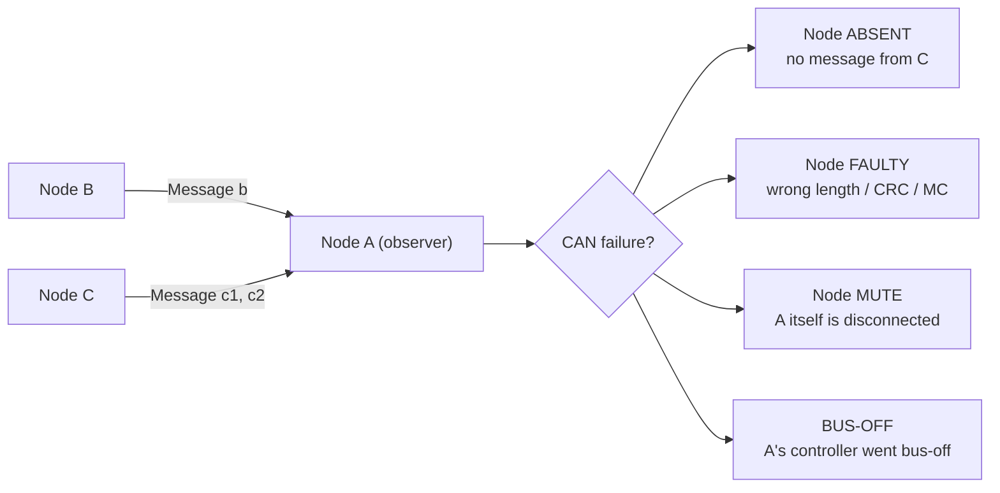
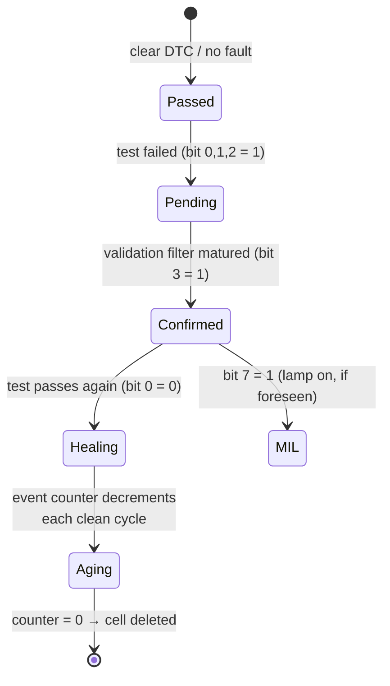
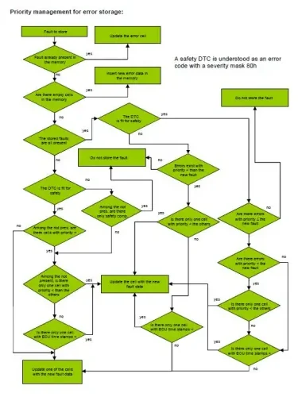
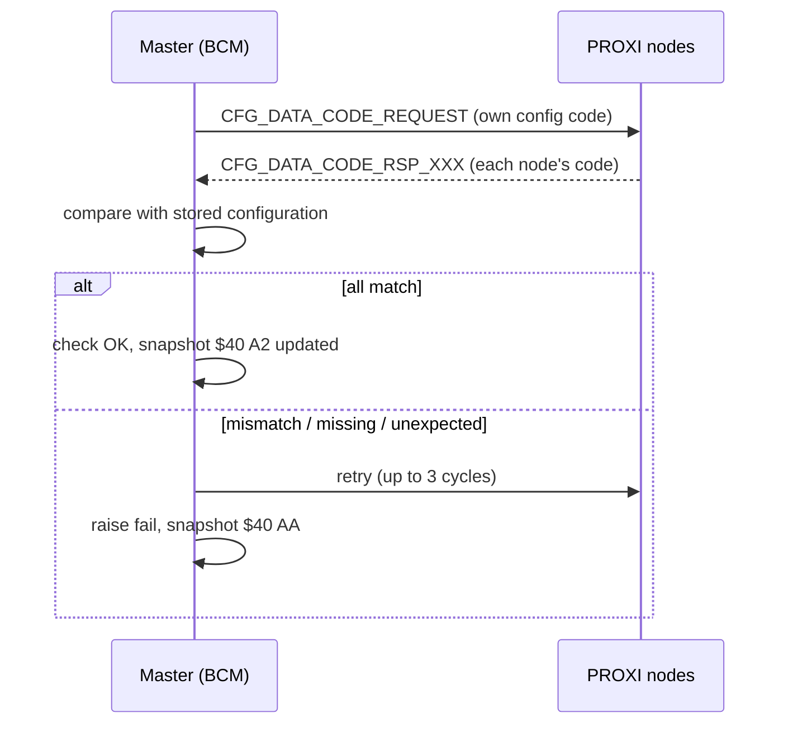
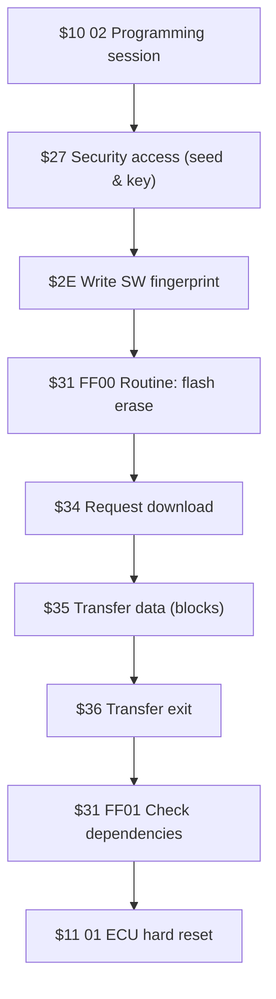

# Diagnosis

Every modern ECU runs a continuous self-check while the vehicle drives: it
watches its sensors, actuators, power supply lines and even its own
microcontroller, and when something is wrong it records the fault so that a
technician — or a test bench — can read it back later. This lesson explains how
that self-diagnosis is specified, how faults become **DTCs (Diagnostic Trouble
Codes)** in the error memory, and which **UDS services** a diagnostic tester
uses to talk to the ECU over CAN.

Diagnostic communication has a simple shape:

- the channel is the **CAN bus** (the diagnostic socket is the physical access
  point),
- the **diagnostic tool is just one more node** on the network: it sends a
  request to an ECU, and that ECU answers,
- the translation from raw bytes to engineering values is done by the tool,
  driven by the ECU's diagnostic description (the **CDD** file, produced with
  CANdela).

The reference standards are:

| Standard | Content |
|---|---|
| ISO 14229-1 | Unified Diagnostic Services (UDS) — services and requirements |
| ISO 14229-3 | UDS on CAN implementation (UDSonCAN) |
| ISO 15765 | Diagnostics on CAN (transport layer, DoCAN) |

A few terms used throughout: the **diagnostic instrument** (tester) is the
external equipment talking to the ECUs; an **error cell** is a RAM or EEPROM
location holding one fault (error code plus environmental data); the
**communication protocol** is the rule set governing tester–ECU exchange.

## What an ECU must diagnose

Diagnosis means the ECU cyclically acquires, processes and compares the signals
of everything connected to it — internal components (microprocessor, memory) and
external ones (sensors, actuators) — and records every detected failure,
permanent or intermittent, in non-volatile memory. A compliant control system
must:

- recognize electrical faults on all directly connected sensors and actuators
  and on the power supply lines, and where possible detect mechanical faults
  through **plausibility checks**;
- distinguish real failures from disturbances;
- manage the fault lifecycle (validation, storage, healing, erasing);
- apply a **recovery strategy** for each fault;
- expose engineering parameters to the tester on request;
- support **active diagnosis** (actuator control from the tester);
- drive warning lamps where foreseen;
- support reprogramming and store statistical data.

### General rules

- Error information must be stored in **non-volatile memory**. ECUs that are
  relevant for legislation or active safety must be able to commit the RAM
  content to non-volatile memory even after a sudden power loss.
- Diagnostics must run in **all vehicle states**: Key ON, cranking, engine
  running, vehicle moving, and power latch (after-run).
- The ECU must recognize the **cranking phase** and filter it, because the
  voltage dip during cranking would otherwise validate false faults.

### Electrical and plausibility faults

For every sensor and actuator the ECU checks the three classic electrical
anomalies on signal, control and power lines:

| Code | Meaning |
|---|---|
| O.C. | Open circuit |
| S.C.G. | Short circuit to ground |
| S.C.B. | Short circuit to battery |

On top of pure electrical checks there are:

- **Plausibility checks** — software logic deciding whether a sensor value (or
  an actuator feedback) is believable at all, e.g. by comparing it with related
  signals;
- short circuits **between different signal lines**, or between a signal line
  and a reference voltage;
- a shared-supply strategy: when several sensors share one supply line, the ECU
  must verify that a supply failure is present on *all* of them before
  validating, to avoid blaming the sensors instead of the line.

The ECU must also diagnose **itself** (internal electronics), its **power
supply** (missing connections, out-of-range voltage — in which case diagnoses
that would produce false faults are inhibited), and, where feasible,
**mechanical parts** through the sensor set.

### CAN network failures

Communication itself is diagnosed too. Four canonical faults cover the cases
where node A monitors the other nodes on the bus:

- **Node ABSENT** — node A detects that node C has disappeared from the network
  (checking one or all of the messages C should send). One DTC per source node.
  Detection is disabled during cranking, and the detection time must exceed
  both the source node's bus-off mute time (`tBUS-OFF`) and its network entry
  time (`tPon`) so that a slow wake-up is not mistaken for an absence. Minimum
  validation time is **1 s**, maximum maturation time **5 s** on BH-CAN and
  C-CAN.
- **Node FAULTY** — node A receives messages from C that are malformed:
  shorter than expected (this check is **mandatory**), or missing/invalid
  format such as wrong CRC or message counter (optional). Again one DTC per
  source node.
- **Node MUTE** — node A realizes *it* is disconnected (its CAN controller
  reports error passive / ACK errors). Only A's own DTC is stored, and while
  the mute condition persists the ABSENT and FAULTY diagnoses are **inhibited**
  — verdicts about other nodes made by a node with a broken controller are not
  trustworthy. Its detection time must be shorter than the one used for ABSENT
  and FAULTY.
- **BUS-OFF** — node A's controller enters bus-off. Only A's DTC is stored, all
  CAN-related diagnoses are muted during the recovery silence period, and a
  **bus-off event counter** is incremented at every entry into bus-off.

!!! note "Fail status on the bus"
    ECUs that perform network diagnosis also broadcast their health in a cyclic
    status message (conventionally named `STATUS_C_XXX`), with two 2-bit coded
    signals: **GenericFailSts** (a DTC is stored) and **CurrentFailSts** (a DTC
    is active right now). Other ECUs can react to these without a tester.

## The error memory

The error memory is an array of **error cells**, one per fault line. Each cell
contains:

- **DTC code** — 3 bytes: the first two identify the component, the third
  (DTCLowByte) identifies the failure type (the *symptom*, e.g. open circuit
  vs. implausible signal);
- **statusOfDTC** — one byte describing the fault's current lifecycle state;
- **snapshot record(s)** — frozen environmental data;
- **extended data record** — counters such as the event counter and the
  lamp-off counter.

### The statusOfDTC byte

The same byte is used in two roles: in a *tester request* it is a
**DTCStatusMask** (which status bits to filter on); in an *ECU response* it is
the **statusOfDTC** (the actual state of each DTC). The bit meanings are
identical in both contexts:

| Bit | Name | Meaning when 1 |
|---|---|---|
| 0 | testFailed | Last completed test **failed** (fault present now) |
| 1 | testFailedThisMonitoringCycle | At least one test failed in the current monitoring cycle |
| 2 | pendingDTC | A failure was detected in the current or previous cycle |
| 3 | confirmedDTC | The fault is stored in memory (confirmed at least once since the last clear) |
| 4 | testNotCompletedSinceLastClear | Test not run to completion since the last clear |
| 5 | testFailedSinceLastClear | At least one failure since the last clear |
| 6 | testNotCompletedThisMonitoringCycle | Test never completed in this cycle (default 1 at cycle start) |
| 7 | warningIndicatorRequested | This DTC is currently requesting the warning lamp |

A *monitoring cycle* is the reference time frame for the diagnostic tests —
for most practical purposes, one driving cycle from Key ON to Key OFF.

### Snapshot and extended data

A **DTCSnapshotRecord** freezes environmental parameters (the "freeze frame":
rpm, temperature, voltage, odometer, …) at the moment a fault is validated.
Each DTC keeps up to two snapshots: the **first** validation (kept until the
DTC is deleted) and the **last** validation (updated on every re-validation).
The first four parameters are mandatory for every system and DTC.

The **DTCExtendedDataRecord** holds counters; two are essentially standard:

- **EventCounter** (mandatory for all systems) — the *aging* counter. It is set
  to **40** when the cell is first stored, and reset to 40 whenever a
  previously confirmed fault fails again. It is decremented by one at each
  Key ON if the fault stayed "not present" for the whole previous cycle, and
  the cell is **autonomously deleted** when it reaches 0. Powertrain/EOBD
  systems follow the European directive variant: the counter decrements within
  the cycle only if the MIL was off at its start, the test passed and a
  warm-up was completed.
- **Cycle to switch warning lamp OFF** (for systems with a warning lamp) — how
  many monitoring cycles remain before the lamp goes off. For powertrain it is
  initialized to **3** with EOBD diagnosis (1 without EOBD), decremented at
  every consecutive error-free cycle, and set to 0 when the lamp is turned
  off. Faults without a lamp keep it at 0.

### Validation filtering and priorities

Every diagnostic line must define **enabling conditions and debounce
timing/counters** for both validation and de-validation, so that ordinary
vehicle disturbances never mature into stored faults. These filters are kept as
calibratable variables, so timing can be tuned without touching the software.
When memory runs out, a **priority** scheme decides which faults to keep — a
*safety* DTC (severity mask 80h) is protected, older or lower-priority cells
are evicted first:

### Erasing, recovery, warning lamps

- **Erasing** — the tester can wipe the whole error memory (volatile and
  non-volatile) with a diagnostic command (ClearDiagnosticInformation,
  service `$14`). Cells whose event counter reaches 0 delete themselves; no
  other automatic erasing is allowed.
- **Recovery strategies** — when a fault is verified, the ECU must keep the
  vehicle safe and running, possibly degraded: sensor faults are compensated
  with agreed **recovery values** or with values computed from other signals;
  actuator strategies depend on the component. All strategies are specified
  per component in the CDD (CANdela) document.
- **Warning lamp (MIL)** — for powertrain/EOBD the MIL stays on from Key ON
  until the engine starts, then goes off if no fault is present. Activation
  modes: **ON-1** (immediately at validation), **ON-3** (after three
  consecutive faulty cycles), or **OFF** (fault not emission/safety relevant,
  lamp never lit).

## Diagnostic functions exposed to the tester

Beyond reading DTCs, an ECU exposes four families of functions on the
diagnostic link.

### Reading parameters — RDI

All engineering parameters (raw sensor values, computed control quantities)
must be readable **individually or in groups**, at Key ON, engine running, and
any vehicle speed. When a sensor is faulty, the ECU must report the value
**actually read**, not the recovery substitute. Asking for a parameter that
does not exist in that vehicle outfit must produce a negative response with
**NRC 0x31** (requestOutOfRange — "parameter not available").

Mandatory data identifiers include operating counters and identification:

| DID | Content |
|---|---|
| `$1008` / `$1009` | ECU time stamps (RAM) / from Key ON |
| `$F186` | Active diagnostic session |
| `$2001` | Odometer (EEPROM) |
| `$2003` | Number of flash re-writings |
| `$2008` / `$2009` | Time stamps in EEPROM / from Key ON in EEPROM |
| `$200A` | Key ON counter |
| `$6080` / `$6081` / `$6082` | Event counter / cycles to lamp OFF / DTC failure type byte |
| `$F187`–`$F1A5` | Identification: spare part number, ECU serial, VIN (`$F190`), supplier HW/SW numbers and versions, type-approval number |

### Active diagnosis — I/O control

**Active diagnosis** lets the tester drive actuators or force output values.
It is used when a component cannot be observed continuously, must be checked
in conditions hard to reach on the road, must be verified by sound or sight,
or must be calibrated. During active diagnosis the normal diagnostic
strategies keep running. It must **not** be used on CAN signals that other
ECUs use for plausibility checks — forcing them would trigger false faults
elsewhere on the network.

### Statistical functions

Counters that reconstruct the vehicle/system history: total number of
missions, missions with anomalies, actuation counts of a component, plus
dedicated functions such as **engine overspeed** and **odometer** tracking.

### Routines — calibration and learning

Some ECUs need workshop procedures after installation: key/remote programming,
characteristic learning (throttle body, phonic wheel, gear position, mixture),
sensor calibration (steering angle, radar alignment), or service operations
(odometer setting, service interval reset). Because a botched procedure can
break the system, the CDD specifies each routine in detail: why and when it
runs, what the operator must do, the exact tester commands and ECU responses,
the timing constraints, and the completion criteria.

## The UDS services behind it all

| Service | Name | Use in this lesson |
|---|---|---|
| `$10` | DiagnosticSessionControl | Default / extended / programming sessions |
| `$11` | ECUReset | e.g. hard reset `$11 01` after flashing |
| `$14` | ClearDiagnosticInformation | Erase the error memory |
| `$19` | ReadDTCInformation | Read DTCs, snapshots, extended data (below) |
| `$22` | ReadDataByIdentifier (RDBI) | Read parameters/DIDs |
| `$27` | SecurityAccess | Seed & key unlock before flashing |
| `$28` | CommunicationControl | Silence normal traffic during download |
| `$2E` | WriteDataByIdentifier | Write fingerprint, PROXI, configuration |
| `$2F` | InputOutputControlByIdentifier | Active diagnosis on one DID |
| `$31` | RoutineControl | Start/stop/result for 2-byte routine IDs |
| `$34`/`$35`/`$36` | RequestDownload / TransferData / RequestTransferExit | Flashing data transfer |
| `$85` | ControlDTCSetting | Stop DTC logging during download |

Service `$19` has a rich sub-function list; the ones used in practice:

| Sub | Returns |
|---|---|
| `$02` | DTCs matching a status mask |
| `$04` | Snapshot record of one DTC (first and last validation) |
| `$06` | Extended data record of one DTC (event counter, lamp-off cycles) |
| `$07` / `$08` | Number / list of DTCs matching severity + status |
| `$09` | Severity of a specific DTC |
| `$0C` | First confirmed (oldest) DTC |
| `$0E` | Most recent confirmed DTC |

When a request cannot be executed, the ECU answers with the **negative
response** `7F <SID> <NRC>`; the response codes are listed in ISO 14229 (you
already met `0x31` for an unavailable parameter).

## PROXI — end-of-line car configuration

Building one ECU hardware per vehicle variant would explode the part-number
matrix, so configuration differences that can be expressed as software
parameters are programmed **at the end of the line (EOL)**. The data package
sent to the nodes is the **PROXI file** (PROXI = *Programming and configuration
of integrated systems*); formats include `.BYT`, `.EOL`, `.EPLUS`, `.HEX`, and
a per-system *PROXI programming targeted specification* defines the bit-level
coding.

- The **master node is the Body Computer (BCM)**; the instrument cluster (IPC)
  usually acts as backup master. The master holds the whole vehicle
  configuration and serves it to the tester; the other nodes store only their
  own slice, and commit it to permanent memory only after the write phase
  completes correctly.
- **Integrity**: the PROXI file carries a **CRC-16** computed from byte 26 to
  the end of the file. Each receiving node recomputes it and refuses the file
  on mismatch. Nodes also reject files that are malformed, incoherent with
  their hardware (e.g. PROXI says "temperature sensor present" but the ECU
  board is not populated), contain invalid values, or violate parameter
  coherence tables.
- **Tester access**: PROXI data is read with `$22` — DID `20 24` for the whole
  car PROXI (from the master), `20 23` for one ECU's own PROXI — and written
  with `$2E`.

### Check configuration

At every transition to Key ON the master verifies that the network matches the
stored configuration:

The check fails if a node does not answer, an unexpected node answers, the EOL
signal value is wrong, or a received configuration code differs from the
stored one; the master retries **3 times** before raising the failure. The
result is readable as snapshots:

- **`$40 A2`** — EOL status after each configuration check: nodes configured on
  the CAN, nodes configured as PROXI participants, nodes actually active,
  nodes with EOL=1, nodes that answered correctly. Note that not every node
  configured as present necessarily takes part in PROXI.
- **`$40 AA`** — a copy of `$40 A2` captured when the check failed (reset on
  the next positive check).
- **`$40 A1`** — system diagnosis synthesis inside the master: which ECUs have
  present or stored faults, for database purposes.

## ECU software download (flashing)

Reprogramming lets the tester send new software to the ECU, which receives,
verifies and stores it. ECU software is structured in blocks — **bootloader**,
**application**, **calibration** — and a flash delivery comes as a *kit* of
three files:

| File | Role |
|---|---|
| `.BIN` | The actual code/data to flash (full EEPROM image) |
| `.PRM` | Protocol parameters: target addresses, access modes, security data, fingerprint |
| `.IDX` | Index: matches data + parameter files and lists the identifications (old/new HW and SW numbers/versions, approval numbers) used to decide whether the download is allowed |

Before anything is flashed, the tool runs **preliminary checks**: the ECU's
whole identification block must be readable, and if the hardware does not
match the `.IDX` file the download does not start — flashing incompatible
software can brick the ECU.

The download then runs in two phases. First, in **functional addressing** (one
request to *all* ECUs on the bus), the tester prepares the network so that
enough bus capacity is free:

1. Extended diagnostic session
2. `ControlDTCSetting ($85)` — stop DTC logging
3. `CommunicationControl ($28)` — silence application messages

Then, in physical addressing to the target ECU only:

After a successful flash, the electronic label carries the new identifications
with the updated fingerprint, and at the next Key ON the ECU updates the flash
re-programming counter (`$2003`) and stores the odometer value of the update.

!!! warning "Never interrupt a flash"
    Erasing and rewriting happen while the application is not running. A power
    loss or bus disturbance mid-download can leave the ECU in boot mode;
    always guarantee supply voltage and follow the exact service sequence.

!!! success "Key takeaways"
    - Diagnosis = cyclic self-check of sensors, actuators, supply, internals
      and the CAN network, with faults stored as DTCs in non-volatile memory.
    - CAN network faults are four canonical cases: node ABSENT, node FAULTY,
      node MUTE, BUS-OFF — one DTC per source node, with strict inhibition and
      timing rules.
    - The statusOfDTC byte tracks the fault lifecycle: pending → confirmed →
      healing → aging (event counter from 40 down to 0 deletes the cell).
    - Snapshots freeze environmental data at first/last validation; extended
      data holds the aging and lamp-off counters.
    - Tester functions: RDI (`$22`), active diagnosis (`$2F`), routines
      (`$31`), DTC reading (`$19`), clearing (`$14`); failures come back as
      `7F SID NRC`.
    - PROXI configures the vehicle at end-of-line: BCM master, CRC-16
      protected files, configuration check at every Key ON.
    - Flashing follows a strict UDS choreography: prepare the bus functionally,
      then session → security → erase → download → transfer → verify → reset.

!!! tip "Where this leads"
    You will practice reading DTCs and parameters in the
    [Diagnosis exercises](diagnosis-exercises/index.md) and the
    [RDI testing](../rdi-testing/index.md) lessons, use workshop
    [Diagnostic tools](../diagnostic-tools/index.md), and see how diagnosis
    fits the wider [Diagnosis process](../../mil4/diagnosis-process/index.md)
    in MIL4.
