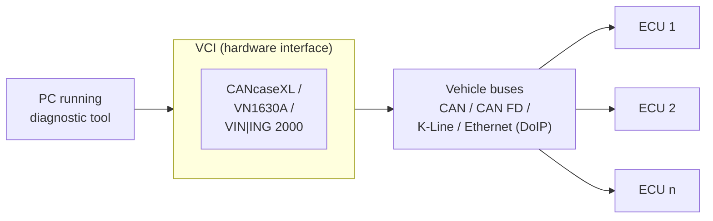
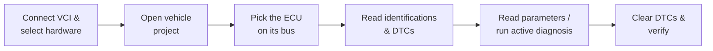
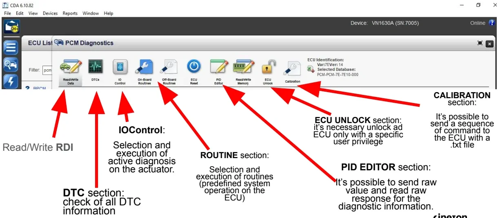
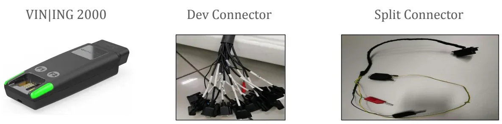
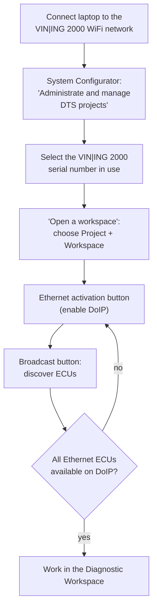
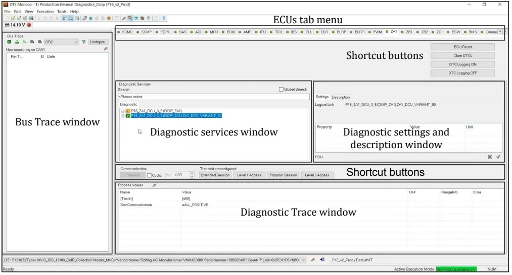

# Diagnostic Tools: DIAnalyzer, CDA & DTS Monaco

Welcome to one of the most hands-on topics of the bootcamp. In the
[Diagnosis](../diagnosis/index.md) lessons you learned the theory of ECU
(Electronic Control Unit — one of the small computers inside the vehicle)
diagnostics and the UDS (Unified Diagnostic Services) protocol behind it. Now
you get to meet the tools that put that theory into your hands: the
**off-board diagnostic testers**, the PC applications you will run at the
bench and in the car to talk to real ECUs every day. After reading this
article you will be able to connect a tester to a vehicle, read and clear
fault codes, read live parameters, drive actuators, and flash ECU software
with confidence.

A diagnostic tester does the boring part for you: it sends UDS requests
through a hardware interface called a **VCI (Vehicle Communication
Interface)** — the box that bridges your laptop and the vehicle buses — and
turns the raw hex exchanges into readable fault codes, parameters and guided
procedures.

Three tools are covered here, one per lesson deck:

- **DIAnalyzer** — the diagnostic application used by FCA (Fiat Chrysler
  Automobiles, now part of Stellantis), current version 4.x
- **CDA (Chrysler Diagnostic Application)** — the Chrysler equivalent, nearly
  identical in functionality to DIAnalyzer
- **DTS Monaco** — Softing's engineering diagnostic tool, used across the
  whole vehicle lifecycle from ECU testing to vehicle release

The good news: all three share the same basic architecture, so everything you
learn with one transfers to the others. A PC application connects to a VCI,
the VCI connects to the vehicle buses, and the tester speaks UDS to whichever
ECU you select.

## What every diagnostic tester can do

Regardless of the brand, a diagnostic tester exposes the same families of
functions, and each one maps directly onto a UDS service — so you already
know the theory behind every button you will click.

| Function | What it does | UDS service behind it |
|---|---|---|
| ECU identification | Reads SW/HW numbers, serial, spare part number | ReadDataByIdentifier (0x22) |
| DTC management | Reads and clears the fault memory, with snapshot and extended data | ReadDTCInformation (0x19), ClearDiagnosticInformation (0x14) |
| Parameter reading (RDI/RDBI) | Reads live and stored data identifiers ("engineering parameters") | ReadDataByIdentifier (0x22) |
| RDI writing | Writes configuration data to EEPROM | WriteDataByIdentifier (0x2E) |
| Active diagnosis (IOCBI) | Drives actuators for functional testing | InputOutputControlByIdentifier (0x2F) |
| Routines | Runs predefined ECU procedures | RoutineControl (0x31) |
| Software download (flash) | Reprograms the ECU application software | 0x34/0x36/0x37 sequence |
| Raw request editor | Sends any raw service bytes and shows the raw response | any |

A few of those acronyms will follow you everywhere, so let us pin them down
once:

- **DTC (Diagnostic Trouble Code)** — a standardized fault code an ECU stores
  when it detects a problem, together with *snapshot* and *extended* data
  describing the conditions when the fault appeared.
- **RDI (Readable Data Identifier)**, read via **RDBI (Read Data By
  Identifier)** — the "engineering parameters" of an ECU: sensor values,
  counters, configuration. Writing an RDI stores data in the ECU's
  **EEPROM** (Electrically Erasable Programmable Read-Only Memory — the
  non-volatile memory that survives key-off).
- **IOCBI (Input Output Control By Identifier)** — the service that lets you
  command an actuator (a fan, a relay, a valve) directly from the tester to
  verify it physically works.

A typical first session with any of these tools looks like this:

The differences between tools are about workflow, licensing, hardware and how
each function is presented on screen — not about the protocol.

!!! warning "KeyOn vs. Engine Running"
    Several operations are only allowed with the ignition on but the engine
    off. Clearing the DTC memory and running the PROXI configuration
    procedure are both possible only in **KeyOn**, never with the engine
    running. Get into this habit early — it will save you a lot of confusing
    error messages.

## DIAnalyzer (FCA)

DIAnalyzer is the diagnostic application used on FCA projects; version 4.x is
functionally equivalent to Chrysler's CDA. A login with an authorized account
is mandatory — an **Offline Authentication** mode exists, but it requires a
specific authorization as well.

### Connection setup

1. **Select the hardware** — `Options → Hardware` opens the hardware settings
   for each CAN bus. Pick the interface and the channel; the settings depend
   on both the hardware and the bus. Example from the lesson: the ECM (Engine
   Control Module) communicates through a **Vector CANcaseXL on channel 2,
   high-speed**.
2. **Open the vehicle project** — each FCA vehicle/project is described by a
   **`.car` configuration file**: `File → Open →` select the `.car` in the
   `Config` folder of DIAnalyzer.
3. Once the `.car` is loaded, DIAnalyzer populates three sheets:
   **Car** (all ECUs grouped by CAN bus), **ECUs** (flat list of the vehicle's
   ECUs) and **Bus** (all accessible buses).
4. **Click an ECU** on its bus to start the diagnostic session — e.g. the TCM
   (Transmission Control Module, present on every vehicle without a manual
   gearbox). The main screen shows the live trace with the tester's Tx frames
   and the ECU's Rx responses, including communication timing and sender/
   receiver for each frame. This trace view is your best friend while
   learning: you can watch every UDS exchange as it happens.

### The .PAR file: decoding raw data

When you select a `.car`, DIAnalyzer automatically loads the **`.PAR` file** —
the decryption/decoding database that turns raw hex responses into named,
scaled values (DTC descriptions, RDI decoding, identifications). The
**Load PAR File** button lets you swap it.

!!! warning "Wrong .PAR = wrong decoding"
    The `.par` file is the *only* thing that makes the displayed data
    meaningful. If you load the wrong one, DTC descriptions and RDI values are
    decoded incorrectly while everything still *looks* like it works. Always
    double-check you have the `.PAR` that matches your project.

### The nine screens

DIAnalyzer organizes its functions in numbered screens, switched from the
toolbar:

| Screen | Name | Content |
|---|---|---|
| 1 | Generic Command | Communication trace; send any raw request, read the raw response |
| 2 | ECU Identifications | SW number, HW number, ECU serial number, spare part number, ISO code |
| 3 | Diagnostic Trouble Codes | Stored DTCs with status, snapshot and extended data record |
| 4 | Parameter Reading | RDBI identifiers ("engineering parameters"), decoded |
| 5 | Active Diagnosis | IOCBI actuator control |
| 6 | EOL Programming | PROXI personalization procedure |
| 7 | Cyber Security | Security access functions |
| 9 | Download | ECU software download (flashing) |

Two toolbar buttons matter everywhere: **Stop/Start** freezes and resumes the
diagnostic communication with the selected ECU, and **Extended** switches
between the *Default* and *Extended* diagnostic sessions.

### Raw requests (Screen 1)

Screen 1 doubles as a raw service console — a great way to practice what you
learned in the Diagnosis lessons. A typical example: requesting all stored
DTCs by hand —

- request: `19 02 FF` (ReadDTCInformation, report DTC by status mask, all)
- positive response: `59 02 FF …` (service 0x19 + 0x40, echoed sub-function,
  then the DTC list)

### Active diagnosis (Screen 5)

IOCBI actuator control works **only in Extended session**. The procedure:

1. Switch to the Extended session with the **Extended** button.
2. Select the actuator identifier.
3. Choose the command type (e.g. `shortTermAdjustment`).
4. Set the value — `FF` = On, `00` = Off — and send.

### Software download (Screen 9)

Flashing an ECU requires **three files with the same name and different
extensions** in the same folder: `.idx`, `.prm` and `.bin`.

1. Press **File IDX** and select the `.idx` file.
2. DIAnalyzer picks up the matching `.bin` and `.prm` automatically (if it
   cannot, select them manually).
3. Press **Download**; a progress bar runs and a popup confirms the end.

!!! tip
    The `.idx` file is plain text — open it in an editor to check exactly what
    the flash package contains before you download it. Thirty seconds of
    checking can save you a bricked ECU.

### PROXI: the End-of-Line personalization procedure

PROXI is one of those procedures you will run constantly, so it is worth
understanding the idea behind it. FCA requires its suppliers to deliver **one
general-purpose software** per ECU that can manage every functionality variant
(engine, transmission, optionals). The vehicle-specific activation happens
later, on the production line, with the **PROXI procedure** — a configuration
write that enables or disables features such as Stop&Start, manual vs.
automatic climate control, gear ratio and so on.

Key facts:

- The vehicle configuration file is stored in the **BCM (Body Control
  Module)**, with a backup copy in the **IPC (Instrument Panel Cluster — the
  dashboard)**.
- The procedure runs only in **KeyOn** (never engine running) and only for
  **qualified users**.
- Access it from the PROXI icon in the **Car** screen.

The PROXI panel offers three operations:

| Operation | What it does | Where it works |
|---|---|---|
| **Car Alignment** | Commands the BCM to push the configuration to *all* ECUs in the vehicle | vehicle only (needs the real BCM) |
| **Read Proxi BCM** | Reads the vehicle configuration and saves it as a `.byt` file | vehicle (or from the IPC) |
| **Open EOL File** | Opens and edits a previously saved `.byt` | also on HiL rigs and static benches |

To edit a configuration: load the project's `.PAR` file, open the `.byt` with
**Open EOL File**, and the panel decodes every activable feature. Modify them
with **Change Proxi**.

!!! tip
    Save every modified `.byt` under a *new* name so the original
    configuration and each variant stay distinguishable. Your future self —
    and your colleagues — will thank you.

## CDA (Chrysler Diagnostic Application)

CDA is Chrysler's diagnostic tool, still used on some FCA projects; if you
have just read the DIAnalyzer section, you already know 90% of it — it is
essentially equivalent. Every user needs a **specifically enabled ID** to log
in; a **Work Offline** mode exists but is gated by a user privilege.

### Connecting to an ECU

1. **Device selection** — choose the hardware interface and press **Connect**.
   CDA can only connect to *known* hardware that is correctly installed on the
   host PC (e.g. a VN1630A).
2. **Device configuration** — tell CDA whether you are on a real **Vehicle**
   or a simulated **Benchtop** environment, and assign the channel used for
   the diagnostic communication.
3. **ECU selection** — scroll the ECU list and double-click the target ECU.
   A successful connection shows a **blue tick** next to the ECU and an
   *"Identification successful"* message, then opens the diagnostic windows.

### The diagnostic screen

One toolbar gives access to all functions: **Read/Write Data** (RDI), **DTCs**,
**IO Control** (active diagnosis on actuators), **On-Board / Off-Board
Routines**, **ECU Reset**, **PID Editor**, **Read/Write Memory**, **ECU
Unlock** (privileged) and **Calibration**.

Highlights of each section:

- **Read/Write RDI** — one click on an RDI reads it. Writing an RDI is an
  EEPROM write (the PROXI write is an example): edit the value in the notepad
  view, press **Write**, and a *"Write successful"* message confirms it.
- **DTC section** — lists every stored DTC; selecting one shows its snapshot
  and extended data record, and you can compare environmental data across
  DTCs (the gear-wheel icon gives further detail). **Clear DTCs** resets the
  error memory — only in KeyOn, never with the engine running.
- **PID Editor** — a raw request/response console (e.g. requesting RDI
  `F1 81`). Always write the raw request bytes starting from **row 0**.
- **Calibration** — sends a whole sequence of commands to the ECU from a
  `.txt` file.

### Flashing with CDA

The **lightning icon** opens the download window: **Select Flash File**, then
**Start Flash**. The application software must be provided as an **`.efd`
file**. CDA notifies you when the download finishes — but note the quirk
below, because it confuses everyone the first time.

!!! warning "The 99% stall is normal"
    The download bar typically locks at **99%**. Do not panic and do not
    unplug anything: the flash only completes after a **KeyOff → KeyOn**
    cycle, which lets the ECU reboot into the new software.

### PROXI in CDA

The PROXI procedure in CDA runs **only in Vehicle mode — never on a HiL
(Hardware-in-the-Loop) bench**. You import the **`.byt`** configuration file
with the Import button, see the configurable parameters (raw or decoded), and
execute the write. Editing the `.byt` file itself needs a specific user
privilege. The same result can be achieved with raw requests in the **PID
Editor**. Between the two tools, the PROXI workflow is considerably simpler in
DIAnalyzer.

## DTS Monaco (Softing)

DTS Monaco is an **off-board engineering diagnostic tool** that covers the
entire range of application cases from ECU testing to vehicle release, and
integrates into automated test sequences and corporate processes thanks to
flexible, configurable interfaces.

**Areas of application:**

- development of diagnostic and control functions for ECUs
- function test and validation
- integration and system test
- preparation of test sequences for Manufacturing and Service
- analysis of returns and Quality Assurance

Because it covers the functionality of several previously separate tools (OBD
— On-Board Diagnostics — scan tool, data logger, bus monitor), it reduces cost
and familiarization time; preconfigured templates give fast results, and all
communication data and test results can be fully documented.

### The VIN|ING 2000 VCI

DTS Monaco works with Softing's **VIN|ING 2000** interface:

- **To the host PC:** WLAN, LAN and USB. The WiFi interface has two separate
  communication channels, supports IEEE 802.11 a/b/g/h/n on the 2.4 and 5 GHz
  bands, WPA2/PSK and WPA2/RADIUS encryption and fast roaming — prerequisites
  for production-line and after-sales use.
- **To the vehicle:** CAN/CAN FD, K-Line and **Ethernet (DoIP)**.
- Various sleep/wake-up modes and programmable function keys for interacting
  with diagnostic sequences.
- The USB/LAN cable uses a **MagCode** magnetic connector — a predetermined
  breaking point that detaches safely under mechanical load instead of
  damaging the device.
- Wiring accessories: the **Dev Connector** (multi-plug development harness)
  and the **Split Connector**.

### From power-on to the first ECU

DTS Monaco communicates with modern vehicles over **DoIP (Diagnostics over
Internet Protocol)** — UDS carried over Ethernet instead of CAN. The startup
sequence is always the same, so learn it once and it becomes muscle memory:

### The Diagnostic Workspace

The workspace is organized around an **ECUs tab menu** (one tab per ECU of the
project) and a set of docked windows:

| Window | Purpose |
|---|---|
| Diagnostic Services | All diagnostic services of the selected ECU, searchable |
| Diagnostic Settings & Description | Logical link, service parameters (property / value / unit) |
| Diagnostic Trace | Sent requests and ECU responses with process values |
| Bus Trace | Raw traffic on the monitored bus |
| Shortcut buttons | Frequent actions: ECU Reset, Clear DTCs, DTC Logging ON/OFF |

On top of the generic layout, DTS Monaco ships **preconfigured task
workspaces** — each one pairs the relevant trace window with the bus trace
and the ECU tab menu, so you can jump straight into the job at hand:

- **Fault memory read** — read the DTC memory of an ECU
- **Clear & Read DTC** — clear then re-read to verify what returns
- **RDI** — read data identifiers
- **Routine** — run ECU routines
- **Part Number Read** — read identification/part numbers
- **Software Download** — flashing, with a dedicated Flashing Trace window

## Choosing between the three tools

| | DIAnalyzer | CDA | DTS Monaco |
|---|---|---|---|
| OEM / vendor | FCA | Chrysler (used on some FCA projects) | Softing (OEM-independent) |
| Typical VCI | Vector CANcaseXL | VN1630A | VIN|ING 2000 |
| Project config | `.car` file | device + channel config | Project / Workspace |
| Decoding database | `.PAR` file | internal database | diagnostic description in the project |
| Flash file set | `.idx` + `.prm` + `.bin` | `.efd` | per project |
| PROXI on a HiL bench | yes (via Open EOL File `.byt`) | **no** — vehicle only | n/a |
| Scope | vehicle diagnostics | vehicle diagnostics | engineering, testing, manufacturing, service |

In practice you rarely choose: the project tells you which tool to use. What
matters is that the underlying concepts — sessions, DTCs, RDIs, routines,
flashing — are identical everywhere.

!!! success "Key takeaways"
    - One mental model, three tools: every tester speaks UDS through a VCI —
      learn the concepts once, reuse them everywhere.
    - The decoding database makes or breaks you: with the wrong `.PAR` file,
      everything looks fine but means nothing.
    - Respect the states: Extended session for active diagnosis, KeyOn for
      clearing DTCs and PROXI, KeyOff → KeyOn to finish a CDA flash.
    - Keep your files straight: `.car` + `.PAR` to open a project,
      `.idx`/`.prm`/`.bin` (or `.efd`) to flash, `.byt` to personalize with
      PROXI.
    - You are ready: you can now connect a tester, read a fault memory, watch
      live parameters, drive an actuator and flash an ECU — the daily bread
      of an E/E engineer.

!!! tip "Where this leads"
    You will apply these testers' concepts — DTCs, snapshots, RDI — in the
    [RDI Testing](../rdi-testing/index.md) exercises and later in the MIL4
    lessons on the [Diagnosis Process](../../mil4/diagnosis-process/index.md)
    and [Troubleshooting](../../mil4/troubleshooting/index.md).
