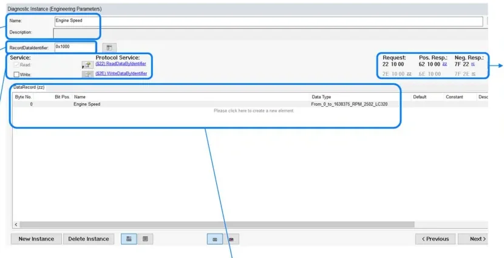
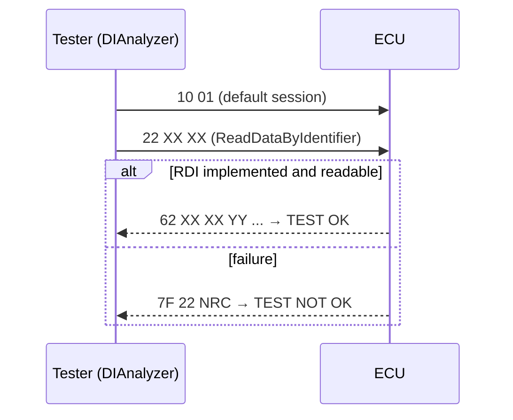
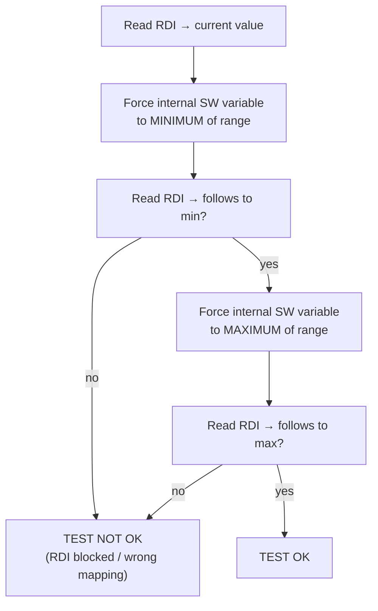
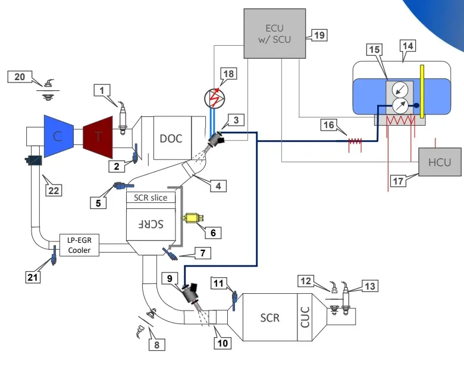
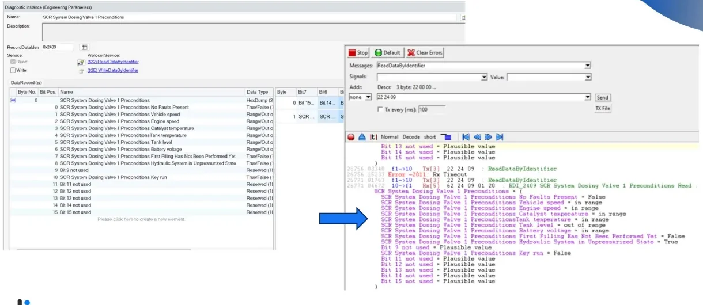

# RDI Testing

Welcome to your first hands-on diagnostic topic! Every Electronic Control Unit
(ECU) in a vehicle holds engineering parameters — sensor readings, internal
software states, actuator feedback, learned values — that development,
production and aftersales teams all need to inspect from the outside. **Tester
Data** is the family of diagnostic commands that exposes them, and the
**Readable Diagnostic Identifier (RDI)** is the element you will use most
often. RDI checks are the simplest diagnostic tests you will run, which makes
them the perfect place to start: by the end of this article you will know what
a Diagnostic Identifier (DID) is, how to find one in the ECU's diagnostic
specification, and how to design and execute an RDI test you can actually
trust.

Tester Data exists to:

- check internal software status and read sensor values,
- check actuator status,
- support component learning procedures (pedals, valves, …).

You will rely on these definitions throughout the vehicle's life: at the
**End of Line (EOL)** station in the assembly plant, in **aftersales**
workshops, and during development, fleet and validation activities.

## What is a DID?

A **Diagnostic Identifier (DID)** identifies an engineering parameter that is
generated by sensors and processed by the electronic system — or calculated
internally for control purposes — and that must be available on the diagnostic
link. Think of it as a numbered window into the ECU's memory: you ask for a
DID by number, the ECU answers with the value behind it.

Two addressing approaches exist:

| Approach | Meaning |
|---|---|
| **By Local Identifier** | An ID assigned during the development phase. The most common approach in Stellantis ECUs; defines IDs for DIDs, IO Controls and Routine Controls. |
| **By Memory Address** | The internal memory address where the value is stored. |

Whichever approach is used, the diagnostic specification also defines the
conversion formulas, whether an external tool may write the value, and whether
security access protects it.

### Availability rules

A DID is not just a debugging hook — it is a contractual obligation of the
ECU. When you test one, these are the guarantees you are verifying:

- Parameters must be readable **individually or in groups**, on proper
  request.
- They must be accessible in **key ON, with the engine running, and at any
  vehicle speed**.
- If a component is faulty, the DID must report the value **actually read by
  the sensor**, not the recovery/substitute value the software is using
  internally.
- If a parameter does not exist in a given application (variant or
  outfitting), the ECU must answer with a negative response meaning
  *"parameter not available"* — **Negative Response Code (NRC) 0x31**
  (`requestOutOfRange`) — not crash or stay silent.

### RDI vs. WDI

DIDs divide by access direction:

| Acronym | Meaning | UDS service |
|---|---|---|
| **RDI** | Readable Diagnostic Identifier | `0x22` ReadDataByIdentifier |
| **WDI** | Writeable Diagnostic Identifier | `0x2E` WriteDataByIdentifier |
| both | Readable and writeable | `0x22` + `0x2E` |

And by origin:

- **Mandatory DIDs** — required by diagnostic norms such as ISO 14229 (the
  standard behind Unified Diagnostic Services, UDS). These are the
  *identification parameters* (ECU identification, software versions, …) and
  generally carry identifiers in the **`F1xx`** range.
- **Engineering parameters** — implemented for a specific ECU in a specific
  vehicle program. They report sensors, valves, pumps, pedals, ECU features,
  and so on. Their identifiers come from a range reserved to the customer,
  specified in the Stellantis diagnostic specification **CS.00102**.

## Reading and writing over UDS

RDI testing runs over standard **Unified Diagnostic Services (UDS)** — the
request/response protocol used for nearly all modern ECU diagnostics (see
[Diagnosis](../diagnosis/index.md) for the full service model). The two
exchanges below are worth memorizing; you will see them constantly.

**Reading** — service `0x22 ReadDataByIdentifier`:

```
Request:           22 XX XX
Positive response: 62 XX XX YY ...
```

`XX XX` is the 2-byte RDI identifier; `YY ...` is the raw value returned by
the ECU, echoing the identifier first.

**Writing** — service `0x2E WriteDataByIdentifier`:

```
Request:           2E XX XX ZZ ...
Positive response: 6E XX XX
```

`ZZ ...` is the value to write; the positive response just confirms the
identifier.

**Failure** — any negative response has the shape `7F <service> <NRC>`, e.g.
`7F 22 11` = *serviceNotSupported* for a read request.

## Conversion formulas

The bytes returned in a `62` response are raw values. Every diagnostic
requirement carries its own **conversion formula** to turn them into physical,
readable quantities. Three types are used:

| Type | Use | Definition |
|---|---|---|
| **Linear** | Raw → physical value | `y(x) = m·x + b` — `m` conversion factor, `b` offset. Min and max (both HEX and DEC) plus unit of measurement must be specified. |
| **Table** | Discrete states | Each signal state maps to a HEX value (e.g. `False` = `$0`, `True` = `$1`). A **mask** gives the maximum representable value for the signal's bit/byte size. |
| **Identical** | Pass-through | Output the value as HEX or ASCII (part numbers, VIN, …). |

Each conversion formula has its own ID, description and size, so it can be
reused across DIDs.

!!! tip "Always convert before judging"
    A raw `62 24 09 01 20` tells you nothing until you apply the DID's data
    type. When a test result looks wrong, first check whether you are
    comparing raw hex against a physical expectation — this is the single most
    common beginner mistake, and now you know to avoid it.

## DIDs in the CDD

The **CANdela Diagnostic Document (CDD)** is the ECU's complete diagnostic
specification, authored with **CANdelaStudio** (Vector). It is your single
source of truth for what to test: services, DIDs, data types, sessions and
security. Three views matter for RDI work:

1. **DID Overview** — the list of all DIDs across all variants: identifier,
   description, and whether each is implemented in Common Diagnostics and/or
   in specific variants.
2. **DID Implementation** — the per-DID detail screen (below): name and
   description, the `RecordDataIdentifier` (the DID itself, e.g. `0x1000`),
   checkboxes enabling read and/or write access, the protocol services (`$22`
   / `$2E`), and the **DataRecord** table giving byte/bit position, name and
   data type of each field. The right-hand side shows the exact request,
   positive and negative response frames; greyed-out entries mean the service
   is not enabled (e.g. a read-only DID has `$2E` in grey).
3. **Properties of Data Type** — the conversion formula details. Navigation
   path: *DataRecord → right-click on the conversion formula name → Properties
   of Data Type*.



## Testing an RDI

Here is the good news: RDI testing is the simplest diagnostic test to realize,
and it runs in the **default session** (`10 01`) — no extended session or
security unlock needed. If you can send a request and read a response, you can
do this.

### The minimal sequence



A pass means a positive `62` response with the correct identifier echoed and a
plausible value. A `7F` negative response fails the test — note the NRC, since
it tells you *why* (`0x11` service not supported, `0x31` request out of range,
`0x22` conditions not correct, …).

### One reading is not enough

This is the pitfall that separates a checkbox test from a real one. A single
positive answer proves the service exists — nothing more. The value could be a
**frozen constant**: a software bug, a stuck variable or a broken scaling can
all return a perfectly formatted but dead value. To say the test is OK, you
need **at least three readings** proving the RDI tracks the internal variable:



You force the internal variable with the development/debug tool chain for the
ECU under test, and read the RDI over UDS. If the diagnostic value follows the
forced minimum and maximum (within the conversion formula's tolerance), the
whole chain — sensor/software variable → diagnostic buffer → `$22` response →
conversion — is working, and you can report the test as passed with
confidence.

!!! warning "Compare like with like"
    Apply the DID's conversion formula to the raw response before comparing
    against the forced value, and respect the valid range defined in the CDD.
    Forcing the variable outside its specified min/max is not a valid test
    step.

## Worked example: SCR dosing valve preconditions

Let's put it all together with a realistic RDI test request, as seen on a
Stellantis diesel program:

- **ECU:** ECM (Engine Control Module)
- **Sub-system:** SCR (Selective Catalytic Reduction) aftertreatment — the
  system that injects a urea solution into the exhaust to cut NOx emissions
- **Issue:** every component of the SCR system must be tested at EOL to verify
  it works properly
- **Customer request:** implement DIDs that report whether all *enable
  conditions* for testing each SCR component are met at EOL — focus component:
  the **Urea Dosing Valve** (item 9 below)



The ECU supplier answered with a multi-bit DID, **`0x2409` — "SCR System
Dosing Valve 1 Preconditions"**, where each bit of the DataRecord reports one
enable condition:

| Bit | Condition | Data type |
|---|---|---|
| 0 | No faults present | True/False |
| 1 | Vehicle speed | in range / out of range |
| 2 | Engine speed | in range / out of range |
| 3 | Catalyst temperature | in range / out of range |
| 4 | Tank temperature | in range / out of range |
| 5 | Tank level | in range / out of range |
| 6 | Battery voltage | in range / out of range |
| 7 | First filling has not been performed yet | True/False |
| 8 | Hydraulic system in unpressurized state | True/False |
| 10 | Key run | True/False |
| 9, 11–15 | not used | reserved |

### Execution in DIAnalyzer

The CDD is loaded into **DIAnalyzer** (the diagnostic test tool), which knows
the DID's layout and conversions. The execution shows the raw exchange and the
decoded result side by side:



Reading the trace:

1. The tester sends `22 24 09` (ReadDataByIdentifier on DID `0x2409`).
2. The ECU answers `62 24 09 01 20` — a positive response with two data bytes.
3. DIAnalyzer decodes the bytes through the CDD data type: *vehicle speed in
   range*, *engine speed in range*, *catalyst temperature in range*, *tank
   temperature in range*, **tank level out of range**, *battery voltage in
   range*, *key run = False*, and so on.

The decoded view is exactly what the EOL operator needs: in this snapshot the
dosing valve test **cannot run** because the tank level is out of range (and
key run reads False) — the other preconditions are green.

!!! note "Why preconditions as a DID?"
    Packing enable conditions into one bitmask DID lets the EOL test sequence
    check everything with a single `$22` request instead of a dozen separate
    reads — and gives an immediate, decoded reason when a component test is
    not allowed to start.

## Where to go next

Practice these concepts in the [RDI testing exercises](rdi-testing/index.md):
UDS request/response analysis, diagnostic exercises on real ECU specs, and
missing-message detection. The tools used here are covered in
[Diagnostic Tools](../diagnostic-tools/index.md).

!!! success "Key takeaways"
    - A DID is a numbered window into an ECU's engineering parameters; **RDI**
      = readable (service `$22`), **WDI** = writeable (service `$2E`).
    - DIDs must be readable at key ON, engine running, any vehicle speed; on
      sensor faults they report the *real* sensor value; missing parameters
      get **NRC 0x31**.
    - Mandatory identification DIDs live in the `F1xx` range (ISO 14229);
      engineering parameters use customer ranges (CS.00102).
    - Raw responses become physical values through linear (`y = m·x + b`),
      table or identical conversion formulas — check them under *Properties of
      Data Type* in the CDD.
    - Never trust a single reading: a passing RDI test needs **at least
      three** — current value, forced minimum, forced maximum.
    - You've got this: if you can send `22 XX XX` and decode the `62` reply,
      you already hold the core skill of diagnostic testing.
