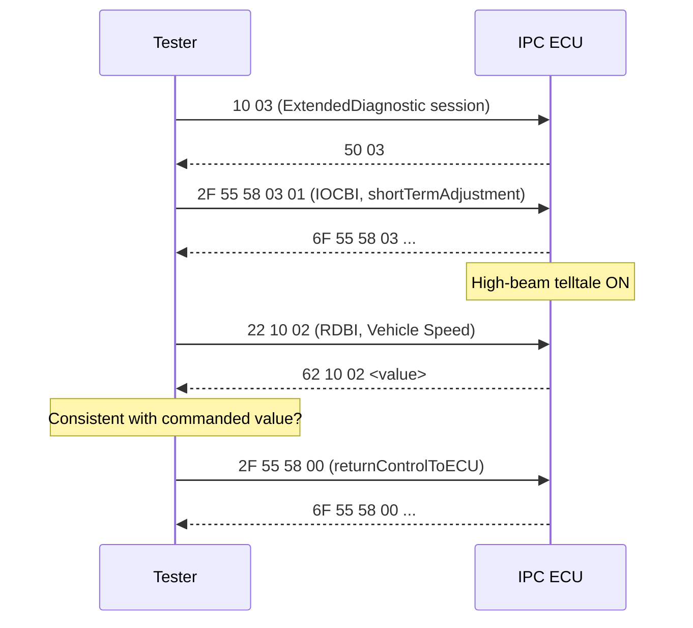
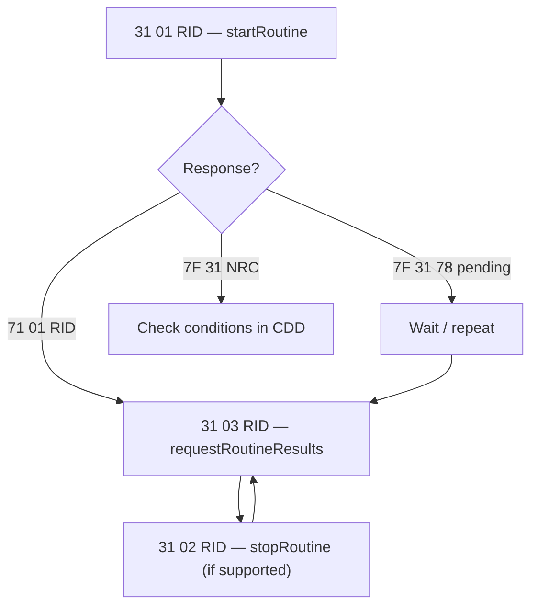

# Exercise 3 — Taking Control: IOLI and Routine Control on the IPC

Earlier exercises covered reading diagnostic data from an ECU. This bench
exercise covers actuation: taking control of the instrument panel cluster
(IPC) — the display behind the steering wheel — to light telltales, sound its
buzzer and sweep its gauges through standard diagnostic services. By the end,
you will be able to:

- navigate a **CANdela Diagnostic Description (CDD)** file — the contract that
  defines everything an ECU will let you do — and extract its full diagnostic
  interface;
- force an output with **InputOutputControlByIdentifier (service `0x2F`)** and
  prove the actuation really happened;
- launch an internal ECU procedure with **RoutineControl (service `0x31`)** and
  collect its results.

**Skills practiced:** treating the CDD as the single source of truth,
respecting sessions and enabling conditions, and verifying every actuation
two ways — the response on the bus *and* the physical effect.

## Goal

Learn to navigate an ECU's diagnostic database, and to use the two
"actuation" services of **Unified Diagnostic Services (UDS)** — I/O control
and routine control — exactly as the database permits: correct session,
sub-function and enabling conditions.

## Setup

- The academy bench with the IPC ECU powered and connected over CAN.
- A diagnostic tester (CANoe/CANalyzer with a diagnostic console, or an
  equivalent UDS tool) loaded with the cluster's CDD,
  `D2956_IPC_E2A_R10_332BEV.cdd`.
- The exercise sheet (`Esercizio_diagnosi_3_Ioli_Routine.pdf`).

## The three services in one look

Three UDS services do all the work in this exercise. Each request is answered
with a positive response (request SID + `0x40`) or a refusal
`7F <SID> <NRC>`, where NRC is a **negative response code** explaining why:

| Service | SID | Positive response | Purpose |
|---|---|---|---|
| ReadDataByIdentifier | `0x22` | `0x62` | Read an RDI: a named data record (sensor value, counter, identification) |
| InputOutputControlByIdentifier | `0x2F` | `0x6F` | Override an IOLI: force an output (telltale, buzzer, gauge) to a state |
| RoutineControl | `0x31` | `0x71` | Start/stop an internal ECU procedure and fetch its results |

## Step 1 — Map the CDD

Before touching the bus, open the CDD and build three inventories: every
**RDI (Read Data Identifier)**, every **IOLI (Input/Output Line Identifier)**
and every routine. This is a real Stellantis production database, so the lists
are long — here are representative entries so you know what you are looking at.

**RDIs (read with `0x22`)** — live data, memories and identification:

| DID | Meaning |
|---|---|
| `0x1002` | Vehicle Speed |
| `0x1000` | Engine Speed |
| `0x1004` | Battery voltage (+30) |
| `0x1005` | External temperature |
| `0x2001` | Odometer |
| `0xF190` | VIN (vehicle identification number) |

**IOLIs (controlled with `0x2F`)** — mostly cluster outputs, which makes them
ideal for visual verification on the bench:

| DID | Output |
|---|---|
| `0x5558` | High beam headlamp indication |
| `0x5559` / `0x555A` | Left / right turn signal lamp indication |
| `0x5573` | Buzzer |
| `0x5572` | Dimming display |
| `0x557B` | Autocheck (full gauge/LED/display sweep) |
| `0x556A` | Vehicle speed cluster (pointer) |

**Routines (driven with `0x31`)**:

| RID | Routine |
|---|---|
| `0x2000` | Original VIN Lock |
| `0x2001` | Original VIN Unlock |
| `0xFF00` | FlashErase |
| `0xFF01` | checkProgrammingDependencies / FlashChecksum |

!!! tip "Note the sessions — this is where most first attempts fail"
    Each CDD entry records in which diagnostic sessions it may be executed.
    The IOLIs run in **ExtendedDiagnostic (`0x03`)** and the end-of-line
    session, not in Default; `FlashErase` requires the **Programming session
    (`0x02`)**. If the tool answers `7F 2F 7E`
    (subFunctionNotSupportedInActiveSession) or `7F 2F 7F`
    (serviceNotSupportedInActiveSession), the ECU does not support the
    requested service or sub-function in the current session —
    switch with `DiagnosticSessionControl` (`10 03` → expect `50 03`) and keep
    the session alive with Tester Present (`3E 00`) while you work.

## Step 2 — Take control of an IOLI

Service `0x2F` offers four sub-functions (control options). The CDD tells you
which ones your chosen IOLI actually supports — never assume all four:

| Option byte | Sub-function | Effect |
|---|---|---|
| `0x00` | returnControlToECU | Give the output back to normal application control |
| `0x01` | resetToDefault | Restore the default state |
| `0x02` | freezeCurrentState | Hold the current state |
| `0x03` | shortTermAdjustment | Force a specific value/state (the one you will use most) |

Procedure:

1. Enter the ExtendedDiagnostic session (`10 03`).
2. Pick one IOLI from your inventory — the **high beam telltale (`0x5558`)**
   or the **buzzer (`0x5573`)** are suitable first choices because the result
   is immediately visible or audible.
3. Read its CDD entry: allowed control options, the control-state encoding,
   and any enabling conditions.
4. Force the output with `shortTermAdjustment`, e.g.
   `2F 55 58 03 01` → expect `6F 55 58 03 …` and the telltale lit.
5. **Cross-check with the matching RDI**: read back the corresponding data
   identifier with `0x22` (for example, drive the speed pointer via
   `0x556A`, then read `Vehicle Speed 0x1002`) and confirm the value the ECU
   reports agrees with what you commanded. Verifying each actuation through
   an independent path distinguishes a test result from an assumption.
6. Always finish with `returnControlToECU` (`2F 55 58 00`), so the cluster
   resumes normal behavior.

## Step 3 — Run a routine

A routine is a procedure that lives *inside* the ECU; RoutineControl (`0x31`)
just starts it, stops it and asks how it went, via three sub-functions. Again,
the CDD decides which ones each routine enables — `FlashErase` supports all
three, while `Original VIN Lock` only supports *start*:

| Sub-function | Code | Purpose |
|---|---|---|
| startRoutine | `0x01` | Launch the routine, optionally with a control option record |
| stopRoutine | `0x02` | Interrupt a running routine |
| requestRoutineResults | `0x03` | Fetch the routine status record / final result |

Procedure:

1. Choose a routine from your Step 1 inventory and read its CDD entry
   carefully: required session, enabling conditions, option record layout
   (e.g. `FlashErase` takes a start/stop address pair).
2. Command the start: `31 01 <RID> <options>` → expect
   `71 01 <RID> <status>`. A long-running routine may first answer
   `7F 31 78` (requestCorrectlyReceived-ResponsePending) — this indicates the
   routine is still executing; wait for the final response.
3. Request the report: `31 03 <RID>` → `71 03 <RID> <statusRecord>` and
   verify the result the tool decodes.
4. If the CDD declares a stop sub-function, command `31 02 <RID>`, verify the
   response, then fetch the report again with `31 03`.

!!! warning "Respect enabling conditions"
    Routines change ECU state: `Original VIN Lock` permanently locks the VIN
    against further updates, and `FlashErase`/`FlashChecksum` belong to the
    reprogramming flow. On the bench, follow the CDD conditions exactly, and
    never send `FlashErase` outside the Programming session it is designed
    for.

## Expected results

- Three complete inventories (RDI, IOLI, routines) extracted from the CDD.
- A physical IOLI (telltale, buzzer, gauge or the full `Autocheck` sweep,
  which drives all pointers 0 → full scale → 0 in about 4 s per direction,
  lights every LED and display segment, and activates the buzzer) actuated
  and released cleanly, with the RDI cross-check confirming coherence.
- One routine executed through start → results (→ stop → results where
  supported), with every response verified in the tool.

## Common mistakes

- **Working in the Default session.** I/O control and routines are gated —
  enter the session the CDD requires and keep it with Tester Present.
- **Skipping `returnControlToECU`.** An IOLI left forced makes every
  subsequent measurement unreliable; always hand control back.
- **Assuming sub-functions exist.** Not every IOLI supports all four control
  options and not every routine supports stop/results — read the CDD entry,
  do not guess from the standard.
- **Misinterpreting `7F xx 78`.** It is not an error; it means "response
  pending". Wait for the final positive response.
- **Misreading NRCs.** `0x22` conditionsNotCorrect and `0x33`
  securityAccessDenied mean the ECU refuses *now*, not that your syntax is
  wrong (`0x13` incorrectMessageLengthOrInvalidFormat) — decode the NRC
  before retrying.

!!! success "Key takeaways"
    - The CDD defines the diagnostic interface: identifiers, sub-functions,
      sessions and enabling conditions are taken from it, not assumed from
      the UDS standard.
    - Service `0x2F` (InputOutputControlByIdentifier) actuates a single
      output line; service `0x31` (RoutineControl) runs internal ECU
      procedures via start/stop/requestResults sub-functions.
    - Each actuation is verified twice: by the positive response and by an
      independent physical or RDI cross-check.
    - On completion, control is returned to the ECU with
      `returnControlToECU` so subsequent measurements remain valid.

!!! tip "Where this leads"
    The service mechanics used here are covered in
    [Diagnosis](../../../diagnosis/index.md), and the previous bench exercise
    is [Exercise Diagnosi 2](../exercise-diagnosi-2/index.md).
