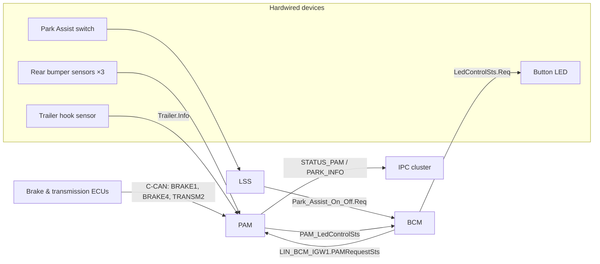
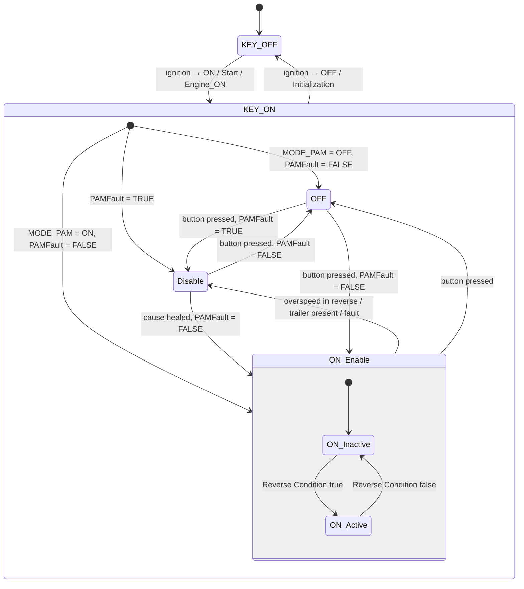
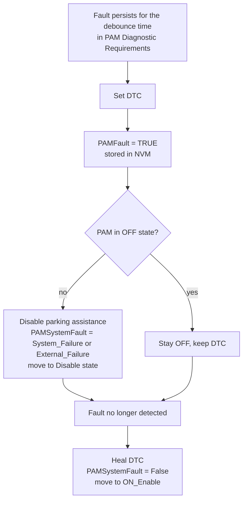

# RDI Testing — Reading the VF179 Rear Parking Assistance Specification

This article covers how to turn a requirements document into test cases,
using a genuine **Vehicle Function (VF) specification** — VF179, *Rear
Parking Assistance* for the P332 battery-electric platform (Edition 2,
Revision A) — the same document the RDI Testing lessons use as their
reference. Every diagnostic exercise that follows (missing messages,
plausibility checks, Unified Diagnostic Services) starts from a requirement
in VF179 and ends as a stimulus applied on the bench and an observed
behavior.

By the end of this article you'll be able to:

- navigate a VF document and know exactly which section answers which testing
  question,
- find the signals to stimulate, the states to observe, the timing parameters
  to respect, and the diagnostic trouble codes (DTCs) to expect,
- read the PAM state machine fluently enough to design your own test cases.

The goal is not to memorize the document, but to know *where to look* in it
for each kind of testing information.

## What a VF document contains

A VF document describes one vehicle feature end to end, across all the
electronic control units (ECUs) that cooperate to deliver it. VF179 follows
the standard Stellantis template, and each section answers a question you will
actually ask on the job:

| Section | Content | Question it answers for you |
|---|---|---|
| Vehicle Function Data | Area (Driving Assistance), owner, revision notes | "Which change request altered which requirement?" |
| Functional Diagram | Block diagram of ECUs, devices and signals | "What do I wire up or simulate on the bench?" |
| External Interfaces / I/O / Signal | Every input and output, grouped by physical channel (hardwire, LIN, B/BH-CAN, C-CAN) | "What are the exact message and signal names for CANoe/CANalyzer?" |
| Indication | Telltales and messages shown to the driver | "What should I check on the cluster?" |
| Working Conditions | Ignition states in which the function is active | "What are the preconditions of my test case?" |
| Functional Requirements | The algorithm: variables, state machine, per-ECU rules | "What behavior do I verify?" |
| Diagnosis and Recovery | Diagnosis table + fault-by-fault recovery rules | "Which faults do I inject, and which DTCs should appear?" |
| Configuration Parameters | Named tunable values with default, range, resolution, unit | "What are the concrete thresholds and debounce times?" |

## Meet the four ECUs

VF179 involves four control units, which are the units stimulated and
observed throughout testing:

- **PAM** (Park Assist Module) — the central controller. It owns the
  algorithm and the three ultrasonic sensors in the rear bumper (left,
  central, right).
- **BCM** (Body Control Module) — the gateway. It forwards the PAM button
  press over LIN (Local Interconnect Network) and drives the button LED, with
  day and night variants.
- **IPC** (Instrument Panel Cluster) — the driver's display. It shows the car
  graphic with distance arcs and plays the acoustic chimes.
- **LSS** — acquires the physical Park Assist on/off switch.

## System purpose and signal flow

The system warns the driver about obstacles behind the vehicle while parking
— including obstacles outside the driver's field of view — through **visual
signals** (arcs on the cluster display) and **acoustic signals** (chimes
whose pulse rate depends on distance). The information flow is:

The document groups interfaces by channel, matching the way the measurement
tools are configured:

| Channel | Signals | Direction |
|---|---|---|
| Hardwire | `Trailer.Info`, `LedControlSts.Req`, `Park_Assist_On_Off.Req` | device ↔ PAM/BCM |
| LIN | `LIN_BCM_IGW1.PAMRequestSts` (button press) | BCM → PAM |
| B/BH-CAN | `PARK_INFO.*` (arcs, chime requests, display activation), `STATUS_PAM.*` (system status, fault, LED request), `BH_IGW1.PamAlertMode`, `STATUS_TELEMATIC.AudioSts_Telematic` | PAM → IPC/BCM |
| C-CAN | `BRAKE1.VehicleSpeedVSOSig` (+`FailSts`), `BRAKE4.VehicleStandStillSts`, `TRANSM2.ShiftLeverPosition` | vehicle → PAM |

Two **PROXI parameters** (the vehicle's configuration bytes) gate entire
branches of the logic. `CAN node 24
(PAM)` must be `Present` for the BCM/IPC requirements to apply at all, and
`Gear_Box_Type` different from `MTX` enables the gear-lever-based reverse
detection. Other PROXI parameters (`PAM_Configuration`, `PAM_Tuning_Set`,
`Vehicle_Line_Configuration`) select the parameter set for the vehicle model.

## Preconditions: the PAM internal variables

The state machine depends on a small set of internal variables, which form the
vocabulary used throughout the document:

- **Reverse Condition** — true when `Gear_Box_Type ≠ MTX` and
  `TRANSM2.ShiftLeverPosition` stays equal to `"R"` for longer than
  `TReverseGear` (**400 ms**).
- **Standstill Condition** — true when `BRAKE4.VehicleStandStillSts` is `"True"`.
- **KEY ON / KEY OFF** — buckets of ignition states: KEY ON covers
  `Ignition_ON`, `Ignition_Start`, `Ignition_ON_Engine_ON`; KEY OFF covers
  `Ignition_OFF` and `Initialization`.
- **MODE_PAM** — the last user-selected activation state (`ON`/`OFF`), stored
  in non-volatile memory (NVM) at every change; the power-on default is `OFF`.
- **PAMFault** — a latched failure flag (`TRUE`/`FALSE`), also stored in NVM
  at every change.

## The PAM state machine

The state machine is the central part of the document and the primary source
of test cases: each transition corresponds to a scenario to be verified.

Each state is identifiable on the bus from its signal values:

- Entering **KEY ON**, PAM initializes, resets all `STATUS_PAM`/`PARK_INFO`
  signals to defaults except `STATUS_PAM.PAMSystemSts = "ON_Inactive"`, and
  **ignores the shift lever signal for `TFilter` (100 ms)**, treating it as
  `"P"`. Then it reloads `MODE_PAM`/`PAMFault` from NVM and jumps to
  `ON_Enable`, `OFF` or `Disable` accordingly.
- **ON_Inactive**: `PAMSystemSts = "ON_Inactive"`, `RearSensorSts = "Active"`,
  LED off, display not active.
- **ON_Active**: `PAMSystemSts = "ON_Active"`, `DisplayActivation = "Active"`,
  and the `PARK_INFO` signals follow the visual alert table.
- **Disable**: `PAMSystemSts = "ON_Disabled"`, LED on (continuous);
  `PAMAboveSpeed = "True"` only when the cause was exceeding `SPEED_LIMIT`
  while in reverse.
- **OFF**: `PAMSystemSts = "OFF"`, LED on (continuous).

Two transitions deserve special attention when you design tests:

1. **Overspeed** — in `ON_Enable`, if `BRAKE1.VehicleSpeedVSOSig` exceeds
   **SPEED_LIMIT (11 km/h)** while the Reverse Condition holds, PAM moves to
   `Disable`. Dropping back below the limit (with no fault) returns it to
   `ON_Enable`. That boundary at 11 km/h is a classic test point.
2. **Button in Disable with an active fault** — PAM stays in `Disable` and
   the LED blinks for `PAM_LED_BLINK_TIME`, then goes back to continuous
   light. With no fault, the same press moves PAM to `OFF`. The same stimulus
   therefore yields two different expected behaviors.

!!! note "Why NVM persistence matters for testing"
    Because `MODE_PAM` and `PAMFault` are stored in non-volatile memory at
    every change of state, a key cycle is itself a test stimulus: induce a
    fault, switch KEY OFF/ON, and verify PAM powers up directly in `Disable`.
    A correct ECU must not "forget" the fault across ignition cycles.

## Alerts: arcs, chimes and special cases

In `ON_Active`, PAM requests acoustic feedback per zone through the two rear
speakers, according to this mapping:

| Obstacle zone | `ChimeActivation_LHR` | `ChimeActivation_RHR` |
|---|---|---|
| Rear left | Active | Not Active |
| Rear central | Active | Active |
| Rear right | Not Active | Active |

The chime repetition rate varies **linearly with obstacle distance**, between
`REP_MIN_DURATION` (0 ms) and `REP_MAX_DURATION` (375 ms). A value of 0 means
a **continuous tone**, indicating the vehicle is immediately adjacent to the
obstacle. `ChimeType_Rear` is fixed to `"Type4"`.

The specification also defines behavior for the following special cases:

- **Wall detection** — if both outer sensors report a wall-shaped obstacle
  continuously for more than `Tpamwalldet` (**3 s**), the acoustic feedback is
  deactivated while the obstacle persists. Otherwise reversing along a wall
  would chime non-stop.
- **Multiple obstacles, same zone** — only the nearest one is signalled.
- **Multiple obstacles, different zones** — the nearest one overall is
  signalled.
- **Moving obstacle at standstill** — if the vehicle is stationary and an
  obstacle sweeps across two consecutive arcs, warnings follow the closest
  position unless the obstacle stays in a different zone continuously for
  `T_Filter_Alerts` (**100 ms**).

On the BCM side, the LED request from PAM is translated into day/night
variants using `InternalLightSts`: continuous or blinking light, with blinking
at `PAM_LED_BLINK_DUTY` (**50 %**) and `PAM_LED_BLINK_FREQ` (**2 Hz**).

## Diagnosis and recovery

The diagnosis table, the section used most in the exercises, has
**20 entries (IDs 1.0–20.0)**, each binding a fault to the ECU that detects
it, the enabling ignition condition, and the fault signal it sets. All of them
are active only with ignition `ON` or engine running.

### Faults detected by PAM

| ID | Fault | Type | Fault signal |
|---|---|---|---|
| 1.0 | Sensor short/open circuit (any of the 3) | electrical | `PAMSystemFault` |
| 2.0 | PAM internal failure | internal | `PAMSystemFault` |
| 3.0 | `BRAKE1` missing message | missing message | `PAMSystemFault` |
| 5.0 | `PAM_OperationalModeSts.Info` = SNA | plausibility | `PAMSystemFault` |
| 6.0 | Sensor blockage (vehicle speed between `Min_Speed` 2 and `Max_Speed` 50 km/h) | plausibility | `RearSensorSts = "Not_Active_Blocked"` |
| 8.0 / 9.0 | `LIN_BCM_IGW1` / `BH_IGW1` missing message | missing message | `PAMSystemFault` |
| 10.0 | `PAMRequestSts` stuck "Pressed" beyond `PAM_STUCK_TIMEOUT` (**15 s**) | plausibility | `PAMSystemFault` |
| 11.0 | `VehicleSpeedVSOSig` = SNA or `FailSts` = "Fail Present" | plausibility | `PAMSystemFault` |
| 12.0 / 13.0 | PAM node mute / bus-off | communication | `PAMSystemFault` |
| 16.0 | Vehicle configuration missing or `PAM_Tuning_Set` calibration mismatch | configuration | `PAMSystemFault` |
| 17.0 / 18.0 | `TRANSM2` missing message / `ShiftLeverPosition` = SNA (only if `Gear_Box_Type ≠ MTX`) | missing / plausibility | `PAMSystemFault` |
| 19.0 / 20.0 | `BRAKE4` missing message / `VehicleStandStillSts` = SNA | missing / plausibility | `PAMSystemFault` |

### Faults detected by IPC and BCM

| ID | ECU | Fault | Reaction |
|---|---|---|---|
| 4.0 | IPC | `STATUS_PAM` missing message | Activate "PARKING ASSISTANCE FAIL" indication, force `DisplayActivation` to "NotActive", set DTC |
| 7.0 | IPC | `STATUS_TELEMATIC` missing for `T_Telematic` | Set DTC, manage the PARKING ASSISTANCE indication |
| 14.0 | BCM | `PAM_LedControlSts` = SNA for `DTC_BCM` | Set DTC, keep the LED at its previous value |
| 15.0 | BCM | `STATUS_PAM` missing message for `DTC_BCM` | Set DTC, keep the LED at its previous value |

### The common fault-handling pattern

Nearly every PAM diagnosis follows the same detect → react → heal sequence,
and test cases should mirror this structure:

The following details are relevant when designing tests:

- **Debounce** — PAM waits `Tign` (**200 ms** default, tunable to 3000 ms)
  after initialization before evaluating any CAN-message fault. Stimulating a
  missing message earlier than that proves nothing.
- **Fault classification** — `PAMSystemFault` is set to `"System_Failure"` for
  internal/sensor/configuration faults and `"External_Failure"` for faults in
  incoming signals and messages. Check the exact enumeration, not just "fault
  present".
- **Freeze frame** — on fault detection PAM stores the vehicle speed from
  `VehicleSpeedVSOSig` among the environmental data; if the speed signal
  itself is failed (`FailSts = "Fail Present"`), a default value is stored.
- **Trailer hook** — an engineering parameter flags trailer-hook presence;
  with `Trailer.Info = "Present"` PAM disables itself deliberately. This is
  expected behavior, not a fault, and must not set a DTC. Injecting it and
  checking that *no* DTC appears is a perfectly valid test.

## Configuration parameters

The parameter table collects the timing and threshold values used in test
design; the default column is the "first trial value":

| Parameter | Default | Range | Res. | Unit | Owner |
|---|---|---|---|---|---|
| `Tign` | 200 | 0–3000 | 100 | ms | PAM |
| `REP_MIN_DURATION` | 0 | 0–400 | 25 | ms | PAM |
| `REP_MAX_DURATION` | 375 | 0–400 | 25 | ms | PAM |
| `ARC_FLASH_DUTY_CYCLE` | 50 | 0–100 | 5 | % | IPC |
| `ARC_FLASH_PERIOD` | 600 | 0–1000 | 50 | ms | IPC |
| `PAM_LED_BLINK_DUTY` | 50 | 0–100 | 50 | % | BCM |
| `PAM_LED_BLINK_FREQ` | 2 | 0–10 | 2 | Hz | BCM |
| `PAM_STUCK_TIMEOUT` | 15 | 0–30 | 1 | s | PAM |
| `PAM_LED_BLINK_TIME` | — | 0–10 | 1 | s | PAM |
| `TReverseGear` | 400 | 0–1000 | 10 | ms | PAM |
| `SPEED_LIMIT` | 11 | 0–100 | 1 | km/h | PAM |
| `Min_Speed` | 2 | 0–100 | 1 | km/h | PAM |
| `Max_Speed` | 50 | 0–100 | 1 | km/h | PAM |
| `Tpamwalldet` | 3 | 0–10 | 1 | s | PAM |
| `TFilter` | 100 | 0–5000 | 100 | ms | PAM |
| `T_PAMSts_valid` | 100 | 0–3000 | 500 | ms | IPC |
| `T_Filter_Alerts` | 100 | 0–2000 | 100 | ms | PAM |
| `T_Telematic` | 300 | 0–5000 | 1000 | ms | IPC |

## From document to test cases

The following workflow applies the document to testing this function on a
bench or HIL (Hardware-in-the-Loop) rig. Each step maps to a section of the
document:

1. **Nominal activation** — KEY ON, simulate `TRANSM2.ShiftLeverPosition =
   "R"` for more than 400 ms, expect `PAMSystemSts = "ON_Active"` and
   `DisplayActivation = "Active"`. Release reverse → `"ON_Inactive"`.
2. **Boundaries** — sweep vehicle speed through 11 km/h in reverse and verify
   the `Disable` / `ON_Enable` transitions and the `PAMAboveSpeed` flag; hold
   the lever in "R" for just under and just over `TReverseGear`.
3. **Fault injection, one per diagnosis ID** — cut a message (missing
   message), send SNA — the "signal not available" value — (plausibility),
   open or short a sensor line, hold the button "Pressed" beyond 15 s. For
   each, verify: debounce respected, DTC set, `PAMSystemFault` enumeration
   correct, state moves to `Disable`.
4. **Recovery** — remove the fault and verify DTC healing and the return to
   `ON_Enable`. Then key-cycle and confirm `PAMFault` persisted in NVM until
   healed.
5. **Cross-ECU checks** — stop `STATUS_PAM` and watch the IPC raise "PARKING
   ASSISTANCE FAIL"; send `PAM_LedControlSts = SNA` and confirm the BCM
   freezes the LED at its last valid command.

!!! tip "Exercises built on this document"
    The hands-on exercises in this section apply exactly these rules:
    [Missing Message](exercise-missing-message/index.md),
    [Exercise Diagnosi 2](exercise-diagnosi-2/index.md),
    [Exercise Diagnosi 3](exercise-diagnosi-3/index.md),
    [Diagnostic Exercise 7](exercise-7-diagnostic-exercise/index.md) and the
    [UDS Exercise](uds-exercise/index.md). For the diagnostic protocol itself
    (services, DTCs, sessions) see [Diagnosis](../../diagnosis/index.md).

!!! warning "Parameters are project data"
    `Tign`, `TReverseGear`, `SPEED_LIMIT` and the other parameters are tunable
    configuration, not fixed constants. Before writing a test, confirm
    which values the ECU under test was actually calibrated with (PROXI /
    `PAM_Tuning_Set`) — a mismatch between document revision and ECU
    calibration is a common source of false failures.

!!! success "Key takeaways"
    - VF179 specifies the Rear Parking Assistance function across four ECUs:
      PAM (algorithm + sensors), BCM (button/LED gateway), IPC (arcs + chime),
      LSS (switch acquisition).
    - The PAM state machine — KEY OFF / KEY ON / ON_Enable (ON_Inactive,
      ON_Active) / Disable / OFF — is driven by the Reverse Condition, the PAM
      button, vehicle speed, trailer presence and the latched `PAMFault`.
    - The 20 diagnosis entries follow one common pattern: debounce → DTC +
      `PAMFault` in NVM → disable → heal and return to `ON_Enable`.
    - Numbers worth remembering: `TReverseGear` 400 ms, `SPEED_LIMIT` 11 km/h,
      `PAM_STUCK_TIMEOUT` 15 s, `Tign` 200 ms, chime period 0–375 ms, wall
      detection after 3 s.
    - Every requirement maps to a stimulus/observation pair; this mapping is
      the basis of requirement-based diagnostic testing.
