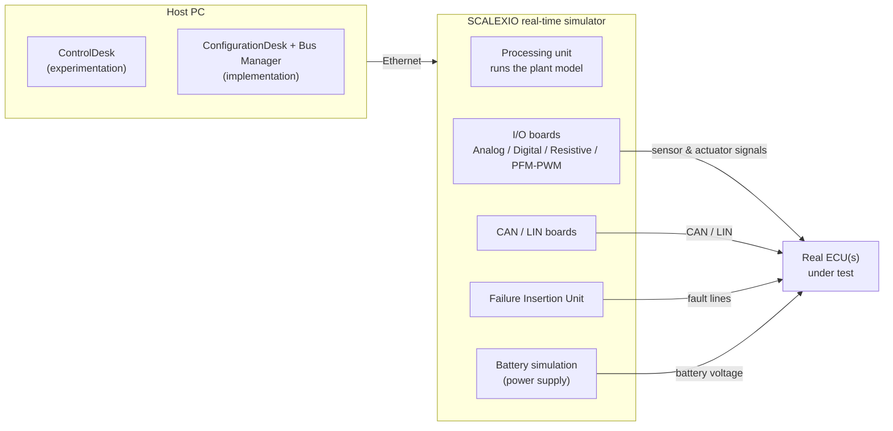
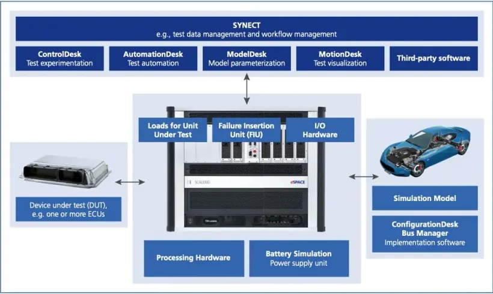
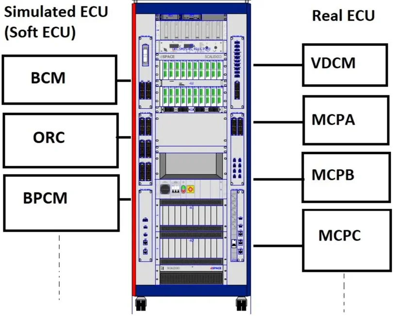
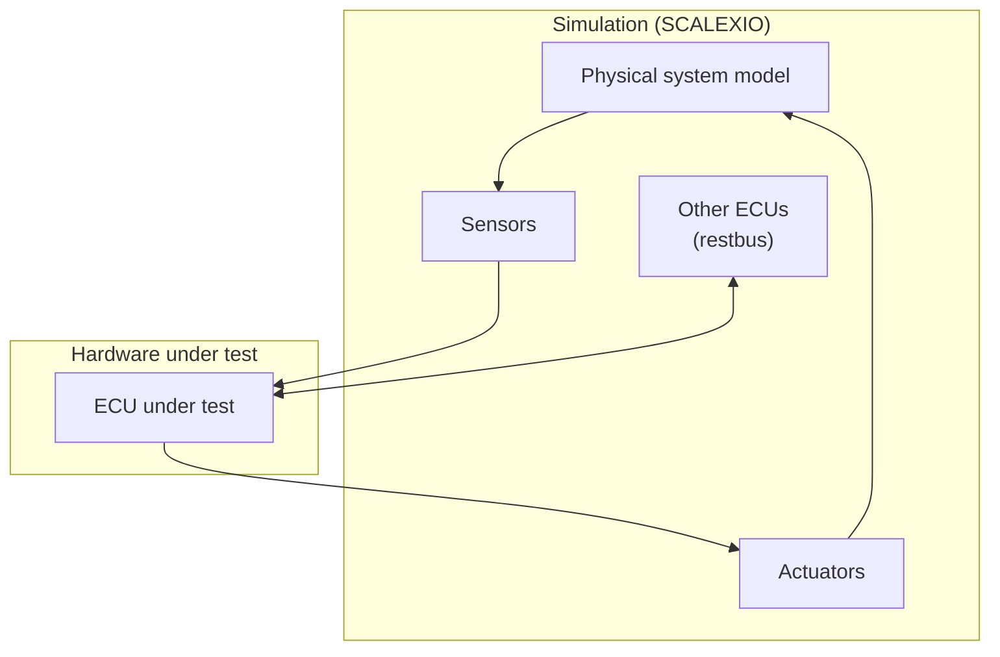
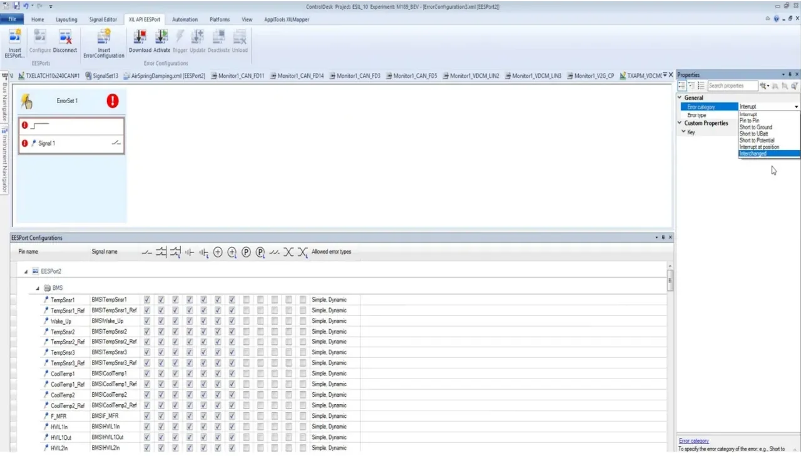
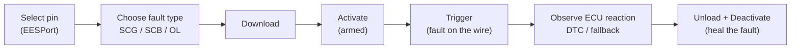

# HIL Testing with dSPACE SCALEXIO & ControlDesk

A Hardware-in-the-Loop (HIL) bench lets you test a **real ECU** against a
**simulated vehicle**: the controller under test runs its production software
on its real hardware, while everything around it — the plant, the sensors, the
other ECUs — is simulated in real time. This article explains how the benches
used in the academy are built and how you drive them day to day with
**ControlDesk**, dSPACE's experimentation software: loading the model,
instrumenting variables, monitoring and manipulating CAN traffic, injecting
electrical faults, and generating stimulus profiles.

## Why hardware-in-the-loop

HIL simulation appeared in the automotive industry in the **1980s**, with the
first microprocessor-based engine control units, and has since spread to
aerospace, military, naval and robotics testing. The core idea is to keep the
benefits of both computer simulation and vehicle testing at the same time:

- the **controller is real** — its electronics, drivers and production software
  are exercised exactly as in the car;
- the **environment is simulated** by physics-based / mathematical models, so
  test scenarios can be changed, repeated and automated at will.

In the [V-Cycle](../../mil1/v-cycle/index.md), HIL sits on the right-hand
(verification) side and is attractive because it:

- **shortens time-to-market and cuts testing cost** — many tests that would
  need a prototype vehicle run on the bench;
- gives full **reproducibility** — the same stimulus produces the same
  conditions every time, unlike on-road tests;
- is **safe** — dangerous maneuvers and fault scenarios (short circuits, sensor
  failures, missing messages) can be tested without risking a vehicle or a
  driver;
- is **scalable** — from a single ECU up to a full networked rig.

!!! warning "The model is the weak link"
    A HIL test is only as trustworthy as the plant model behind it. If the
    simulated engine, battery or vehicle dynamics do not match reality closely
    enough, the ECU may behave correctly on the bench and wrongly in the car.
    Developing and validating an **accurate model of the real plant** is the
    critical — and expensive — part of any HIL project.

## Anatomy of a HIL bench

A typical bench has three layers: a **host PC** running the dSPACE software,
the **real-time simulator** (dSPACE SCALEXIO) that executes the plant model and
drives the electrical interface, and the **ECU(s) under test**.

The SCALEXIO unit is what turns the model into physics. Its duties during a
test:

- run the **real-time application** (the compiled plant model);
- **generate the sensor signals** the ECU expects to see;
- **measure the command signals** the ECU sends to its actuators;
- **supply battery voltage** to the ECU (a programmable power supply simulates
  KL30/KL15);
- **simulate electrical faults** through the Failure Insertion Unit (FIU).

The I/O channels cover every signal type a vehicle ECU touches: analog,
digital, resistive (e.g. temperature sensors), PFM/PWM, engine position
simulation (crank/cam), advanced sensor simulation (e.g. SENT), plus real
**loads** and **actuators** when the ECU must drive actual hardware.

Around the hardware sits the dSPACE software ecosystem:

| Tool | Role |
|---|---|
| **ControlDesk** | Test experimentation — the tool you will use on the bench |
| **ConfigurationDesk + Bus Manager** | Implementation: mapping model I/O to hardware channels and bus configurations |
| **AutomationDesk** | Automated test execution |
| **ModelDesk** | Model parameterization (driving maneuvers, road profiles) |
| **MotionDesk** | 3D test visualization |
| **SYNECT** | Test data and workflow management |

### Real ECUs and "soft" ECUs on the same bus

A HIL rig rarely tests one ECU alone. The bench can wire in several **real
ECUs** while the remaining network nodes are **simulated** inside the model —
this is called *restbus simulation*. On the academy rig, for example, the real
units under test are the **VDCM** (vehicle domain control) and the three motor
control units **MCPA**, **MCPB** and **MCPC**, while **BCM**, **ORC** (airbag)
and **BPCM** exist only as soft ECUs simulated by the bench. Both kinds appear
on the same CAN buses, and from the ECUs' point of view a simulated node is
indistinguishable from a real one.

Conceptually, every HIL loop closes like this:

The ECU receives simulated sensor inputs and CAN traffic, computes, and its
outputs (actuator commands, CAN frames) feed back into the model — the loop
closes in real time, typically with a fixed simulation step.

## Vehicle-side logging: the gateway setup

Before or alongside bench work you often need to capture real traffic on the
vehicle. The setup used in the lessons taps a vehicle CAN FD line through a
**BOB (Break-Out Box)**: the harness is opened on the BOB's banana sockets and
both halves of the bus are brought out to **DB9** connectors. A Vector
**CANcaseXL** interface connects the two DB9 taps to a PC, letting you log
both directions of the bus (e.g. both sides of a gateway) simultaneously with
CANalyzer/CANoe — see the [CANalyzer](../../mil2/canalyzer/index.md) lessons
for the software side.

For measurement directly at the ECU pins, the academy also uses the **ETAS
ES891.1** module, which offers FETK/GE ECU interfaces plus CAN FD, FlexRay and
LIN channels in a single housing — useful when you need to correlate bus
traffic with ECU-internal variables.

## Working with ControlDesk

ControlDesk is the *experimenting* software: it connects to the running
real-time application and gives you access to **calibration, measurement and
diagnostics**, with data acquisition synchronized across ECUs, RCP and HIL
platforms and the bus systems. Everything you do on the bench — driving the
simulated car, watching signals, recording, injecting faults — happens inside a
ControlDesk **project/experiment**.

### Loading the model and going online

The compiled model's variables are described to ControlDesk by an **`.sdf`
file** (system description file). A project can reference more than one `.sdf`
in the **Project** section; you pick the active one by *activating* it.

!!! tip "Which .sdf is the right one?"
    If you do not know which `.sdf` matches the current bench configuration,
    **ask your PL or the HIL team** — running against the wrong description
    file means your instruments read the wrong variables.

The basic start sequence:

1. Open the ControlDesk experiment and check in **Project** that the correct
   project/experiment and `.sdf` are activated.
2. Press **GO ONLINE** in the main view (Home ribbon). The model and all its
   parameters are loaded onto the platform and the simulation is ready to run.
3. Verify the **power supply is ON** — without battery voltage the real ECUs
   stay dead.

To restart from a clean state, go **OFFLINE** and choose **Reload and Start**
on the platform in the **Platforms/Devices** section.

!!! warning "Always reload after automation runs"
    Reloading the model is **mandatory after the automation team has used the
    HIL** for its test campaigns — automated suites can leave parameters,
    faults and overrides in an unknown state. When in doubt, reload.

### Layouts and the dashboard

An experiment's screens are called **layouts**. The main layout (the
**Dashboard**) normally collects:

- the most important **parameters to set** in the model;
- the **vehicle drive commands** — key position, accelerator and brake pedals,
  gear selection, start/stop button;
- the main **driving-condition variables** — engine speed, vehicle speed, drive
  ready, state of charge (SOC), HV battery voltage, etc.

From the **Layouting** ribbon you can create additional layouts and fill them
with more instruments, so each test activity (I/O check, CAN monitoring, fault
injection) gets its own screen instead of overloading the dashboard.

### Variables, overrides and plots

The **Variables** section is the browser into the running model: navigate the
tree, then **drag variables onto a layout** to display them — as numeric
fields, variable arrays, or in the **plot editor** for live curves. Typical
uses:

- checking the **correspondence between model variables and ECU signals**
  (does the ECU see the wheel speed the model thinks it is generating?);
- **open-loop I/O tests** on sensors and actuators: override a model variable
  (e.g. force a sensor voltage) and verify the ECU reacts as specified.

Handy override tricks:

- To write the **same value to two variables at once**, drag the second
  variable onto the first one's instrument with the right mouse button and
  choose **Connect as Additional Write Variable**.
- Any overridden variable stays overridden until you release it — keep track
  of what you forced (see best practices below).

### Measuring and recording

Live plots show the current behavior; to keep the data you need a
**recorder**:

1. Click **Start Measuring** (Home ribbon) to begin real-time measurement.
2. In the **Measurement Configuration** section, create a new **recorder**.
3. Drag the variables to record into the recorder.
4. **Start immediate** begins the log; **Stop recording** ends it.
5. The recording lands in **Project → Measurement data**, and can be exported
   as an **`.mf4`** (MDF4) file for post-processing.

## Bus Navigator and CAN monitoring

The **Bus Navigator** shows the **bus configurations** contained in the
simulation application — the controllers, communication matrices, messages,
PDUs and signals of each bus (CAN, LIN). Applications built with the RTI CAN or
LIN **MultiMessage Blockset** carry their bus configuration with them, so
ControlDesk knows every message on every network, whether it originates from a
simulated node or from a **real node in the loop**.

Two instruments do most of the work:

- **Bus Monitor** — live view of the whole message/signal flow on a bus;
- **CAN Logger** — records the CAN frames to a trace file.

### Manipulating simulated CAN traffic

For messages sent by **simulated nodes**, ControlDesk lets you take over the
transmission — right-click a message in the Bus Navigator and **Generate TX
Layout**. The generated layout exposes every signal of the message; switching a
signal's source from *Input* (model-driven) to **Constant** lets you type the
value you want on the bus. Three failure simulations are built into the same
layout:

| Manipulation | How | Simulates |
|---|---|---|
| **Global Enable** off | deselect the checkbox at the top of the TX layout | a **missing message** — the node disappears from the bus |
| **CRC** deselected | uncheck CRC in the message layout | a **CRC failure** on that frame |
| **Message counter** changed | force the counter signal | a **rolling-counter failure** (e.g. frozen counter) |

These are the bread and butter of diagnostic and degradation testing: the real
ECUs in the loop must detect each condition and set the expected DTC or fallback
behavior. Restore everything afterwards — a forgotten constant or disabled
message will confuse the next engineer on the bench.

## Fault injection with the FIU

The **Failure Insertion Unit** physically switches faults onto the wiring
between the simulator and the ECU — shorts, open circuits, pin swaps — on real
copper, so the ECU's hardware diagnostics see exactly what they would see in a
broken car. In ControlDesk the FIU is driven from the **XIL API EESPort**
ribbon. The **EESPort Configurations** view lists every faultable pin (sensor,
actuator, CAN line) with the fault types allowed on it; each pin shows whether
it supports *Simple* and/or *Dynamic* faults.

Fault types you will use most:

| Code | Fault | Meaning |
|---|---|---|
| **OL** / Interrupt | Open load | the line is interrupted |
| **SCG** | Short to ground | the line is tied to ground |
| **SCB** | Short to Ubat | the line is tied to battery voltage |

The full error categories also include *Pin to Pin* (short between two pins),
*Short to Potential*, *Interrupt at position* and *Interchanged* (swapped
pins).

The working sequence:

1. **Configure the EESPort** (Insert EESPort / Configure in the ribbon).
2. In **EESPort Configurations**, select the pin of the sensor, actuator or
   CAN line you want to fault — the available fault types for that pin are
   already marked.
3. **Drag the pin** into the error configuration (ErrorSet) layout.
4. In **Properties**, choose and adjust the **fault type** (SCG, SCB, OL, …).
5. **Download**, then **Activate**, then **Trigger** the event. Downloaded +
   activated means the fault is armed; triggering applies it to the wiring.
6. To remove the fault: **Unload** and **Deactivate**.

!!! warning "Heal every fault"
    **Always unload and deactivate the fault at the end of the test.** A fault
    left armed on a shared bench is a trap for the next user — the ECU will
    report errors with no visible cause.

## Signal generator

When a test needs a **time profile** rather than a constant — an engine-speed
ramp, a key-off/key-on cycle, a slow voltage droop — use the **Signal
Generator** (ribbon section of the same name):

1. Click **Insert Signal Generator**.
2. In the **Signal selector**, pick the segment type (e.g. *segment signal*)
   and drag it onto the generator track; combine segments to build the
   profile.
3. Drag the **target model variable** into the generator's variable slot.
4. Set the **duration/period** of each segment in **Properties**.
5. **Download** and **start** the generator to apply the profile.

When the profile ends, bring the variable back to its **nominal condition** —
the generator does not do that for you.

## Best practices on a shared HIL bench

A HIL rig is shared equipment: automation runs at night, colleagues test during
the day. These rules from the lessons keep the bench trustworthy:

**Before starting:**

- Check which **project/experiment and `.sdf`** are activated in the Project
  section; if unsure, ask your PL or the HIL team.
- **Reload the experiment** before your session — mandatory after an
  automation test run.
- Confirm ControlDesk is **ONLINE** and the **power supply is ON**.

**After every manipulation — return to nominal:**

- Released any **overridden parameters/variables** (e.g. a forced sensor
  voltage).
- Restored any **Bus Navigator signals** you changed (constants, disabled
  messages, CRC/counter manipulations).
- **Healed every FIU fault** (unload + deactivate).
- Returned every **signal generator** stimulus to nominal.

**Before leaving the bench:**

- Key **OFF**, power supply **OFF**, ControlDesk **OFFLINE**.

!!! success "Key takeaways"
    - HIL = real ECU + simulated plant in a real-time loop; it is fast,
      reproducible, safe and scalable — but only as good as the plant model.
    - SCALEXIO runs the model, generates sensor signals, measures actuator
      commands, powers the ECU and injects faults (FIU); ControlDesk is the
      experimenting front-end over Ethernet.
    - The bench mixes **real ECUs** (VDCM, MCPA/B/C) with **soft ECUs**
      (BCM, ORC, BPCM) simulated as a restbus on the same CAN networks.
    - Daily workflow: activate the right `.sdf` → GO ONLINE → drive from the
      Dashboard → instrument variables, record with a recorder (`.mf4`).
    - Bus Navigator manipulates simulated CAN nodes (TX layouts, Global
      Enable, CRC, message counter); the FIU puts real electrical faults
      (SCG/SCB/OL) on the wiring via XIL API EESPort.
    - Shared-bench discipline: reload after automation, and always return to
      nominal state before leaving.

!!! tip "Where this leads"
    Calibration and measurement *inside* the ECU (not in the model) is done
    with [INCA](../inca/index.md). HIL benches are the execution environment
    for the automated suites you will design in the
    [Verification](../../mil4/verification/index.md) module.
