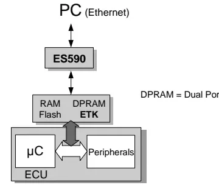
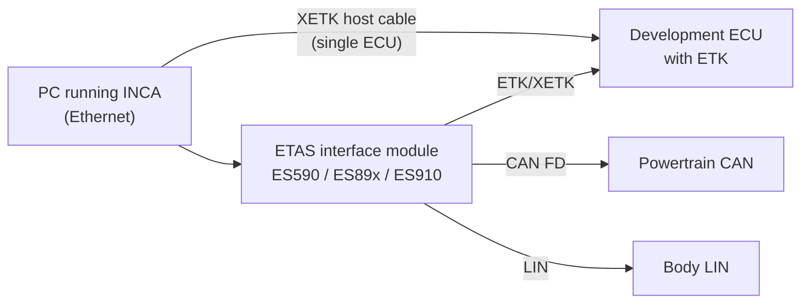
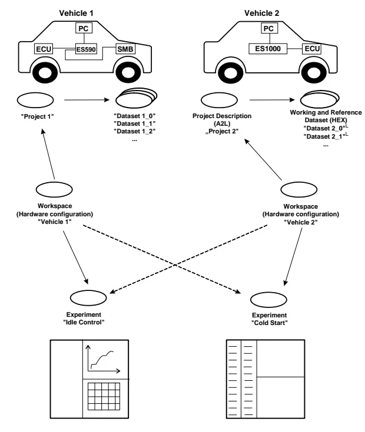
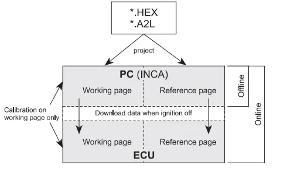

# INCA — Measurement, Calibration and Flashing

Welcome to the tool where ECUs stop being black boxes. **INCA** (INtegrated
Calibration and Acquisition system) is ETAS's measurement and calibration
environment, and it is the single most hands-on tool in this part of the
bootcamp. Up to now you have watched traffic *between* ECUs on the bus; INCA
lets you look *inside* one — at intermediate software values that never appear
on CAN at all.

By the end of this lesson you will be able to:

- **Measure** — read internal ECU signals (lambda, temperatures, state
  machines, contactor feedback, …) live while the ECU is running.
- **Calibrate** — change parameters of the ECU software (scalars, curves,
  maps) on the fly and watch the effect immediately.
- **Flash** — program new software and dataset versions into the ECU's flash
  memory — safely, and knowing how to recover when something goes wrong.

The walkthrough follows the INCA V7.1 "Getting Started" manual and the
bootcamp demo session, which ran the full workflow on a real project: building
a database from the software delivery, wiring up the hardware, measuring with
the right raster, recording logs, flashing, and comparing calibration
datasets. Don't worry if the vocabulary feels dense at first — every term is
explained where you first need it.

!!! tip "Practice offline first"
    INCA works perfectly well without a connected ECU (offline mode). Get
    comfortable creating workspaces, picking variables and building
    experiments offline on your own PC *before* you sit in a vehicle or at a
    HIL rig — a mistake in the office costs nothing; a mistake on a running
    powertrain can.

## Calibration basics: what a calibration system actually does

An ECU's control algorithms are full of adjustable values — a throttle
characteristic curve, a temperature threshold, a gain factor. During
development these **calibration variables** are tuned iteratively: measure the
system's behavior, adjust the values, measure again. For that loop to work,
the calibration system must answer three questions about every variable:

1. **Where** is the value in the ECU's memory? (its address)
2. **How** does raw memory content become a physical value? (the hex →
   physical conversion rule, e.g. `speed_kmh = raw * 0.01`)
3. **How** does the PC talk to the ECU? (interface, protocol, baud rate)

Nobody expects you to figure these out by hand. They are delivered together
with the ECU software, in two files you will see constantly:

| File | Contents |
|---|---|
| `*.a2l` (ASAM-MCD-2MC description file) | Address, data type, conversion rule and structure of every measurement and calibration variable — **no values** |
| `*.hex` / `*.s19` (program file, Intel HEX or Motorola S-record) | The actual ECU program: code **and** data (the default values of all calibrations) |

!!! note "A2L + HEX always travel together"
    Every software delivery includes at least one A2L and one HEX/S19 file,
    and they must match. If the A2L describes addresses from a different build
    than the HEX file you loaded, INCA will read and write the *wrong memory
    locations* — the classic source of "my calibration change did nothing" or
    of corrupted ECUs.

These formats and interfaces are standardized by **ASAM-MCD** (Association for
Standardization of Automation and Measuring Systems — Measurement, Calibration
and Diagnosis), which is why tools from different vendors can interoperate.
The four standards worth recognizing by name:

| Standard | Role |
|---|---|
| ASAM-MCD-1a | Hardware interface to the ECU, e.g. CAN bus with CCP (CAN Calibration Protocol) |
| ASAM-MCD-1b | Driver interface between the calibration program on the PC and the calibration hardware |
| ASAM-MCD-2MC | The A2L file format describing variables, addresses and conversions |
| ASAM-MCD-3MC | Interface for test-bench automation systems to remote-control the calibration system |

## Connecting to the ECU: parallel (ETK) vs. serial access

There are two fundamentally different ways to reach an ECU's memory, and
knowing which one you have in front of you shapes your whole session.

### ETK — the parallel emulator probe

The **ETK (Emulator Test Probe)** is an ECU-specific board that hooks directly
onto the microcontroller's address and data buses and emulates (part of) the
ECU's memory. The ECU cannot tell whether its program runs from its own flash
or from the ETK. Only about 30 lines of extra code in the ECU software are
needed for data acquisition via a table transferred from the calibration
system, and the extra computing load is negligible.

What the ETK buys you:

- The ETK carries its own **RAM and flash** (plus dual-port RAM for
  simultaneous access by the microcontroller and the calibration tool), so you
  can edit calibrations in RAM **while the engine is running**, and switch
  between data versions instantly to compare the engine's response.
- Measured data can be acquired in **several measurement rasters (loops)
  simultaneously**, speed-synchronous if needed.
- The ETK board is **microcontroller-specific** (bus width, clock, memory size
  …) and connects to the ECU via adapters — everything else (PC software,
  calibration device, cables) is identical across projects, so once you learn
  the setup it transfers to the next program.
- The ETK has its own flash for storing calibrated data, so the ECU can start
  immediately without a download. Do not confuse it with the ECU's own flash.

This power is also why a **development ECU** (open housing, ETK connector on
the board) costs orders of magnitude more than a **production ECU** — in the
bootcamp demo the instructor quoted roughly **50–100 € for a production unit
versus up to ~15 000 € for a development ECU**, depending on the
microcontroller's complexity. The production ECU in your own car is closed: no
ETK port, no memory emulation.

### Serial calibration: CCP/XCP over CAN, K-Line

If no ETK is available (or only bus access is wanted), calibration runs over
the vehicle's serial interfaces — **CAN, LIN, FlexRay or K-Line** — using a
communication protocol implemented both in the ECU and in the calibration
device (CCP, or its modern successor **XCP**). A small emulation memory inside
the ECU plays the role of the ETK RAM, but it is much smaller, so typically
only a subset of data can be emulated and a new program version must be
flashed before its data portion can be edited.

### The ETAS hardware chain

- For **one ECU only**, an *XETK host cable* connects the ECU straight to the
  PC — no interface module needed.
- For **several ECUs or mixed buses**, use an interface module such as the
  **ES891/ES892** (ETK + CAN FD + LIN ports) demonstrated in the lesson: one
  HOST port to the PC, two ETK ports for ECUs, and further CAN FD / LIN
  channels so that internal ECU signals *and* bus traffic land in the same
  log. If you only need CAN traffic, plain logging over the OBD socket with
  CANalyzer is enough — choose the hardware according to what your test
  actually needs to capture.
- Ethernet-based ETAS hardware gets its IP address from the **ETAS IP
  Manager**, configured once with the **ETAS Network Manager** (Windows Start
  menu → ETAS). If INCA cannot find Ethernet hardware, check that APIPA is
  enabled and that the firewall allows outgoing TCP connections to the ETAS
  network on **ports 18001–18020** — a surprisingly common first-day problem.

## How INCA organizes data: database, project, datasets, workspace, experiment

Everything INCA knows lives in a **database**, managed by the **Database
Manager (DBM)** — think of it as a file system for calibration data. You can
(and should) keep several small databases rather than one huge one, for
performance. The DBM stores these object types:

| Object | What it is |
|---|---|
| **Project** | Created by reading the A2L file; holds all description/management info (addresses, conversion rules) of one ECU program |
| **Master dataset** | The data portion of the first HEX file loaded for a project; write-protected, the "as delivered" reference |
| **Working dataset** | The copy you actually edit (the *working page*) |
| **Reference dataset** | A frozen copy used for comparison (the *reference page*) |
| **Workspace** | Bundles a project, the matching hardware configuration and experiments — one workspace per test environment (vehicle, bench, HIL) |
| **Experiment** | A saved screen layout: which variables are shown/recorded, with which instruments, rasters and display settings |

Two design ideas are worth internalizing early — they explain most of INCA's
menus:

- **Experiments are reusable across projects and workspaces.** The same
  "Idle Control" experiment can run on the test bench and in the vehicle, as
  long as the variable names in the A2L have not changed. Workspaces capture
  the *hardware differences*; experiments capture the *task*.
- **Import/Export moves objects between databases.** To reuse an experiment a
  colleague built, right-click the target folder in the DBM and import the
  exported file — experiments travel as `*.exp` files.

### Working page vs. reference page

At the heart of calibration is a two-page concept, mirrored both in INCA and
in the ECU's emulation memory. Once this clicks, calibration stops feeling
risky:

- All your edits go to the **working page** only. The **reference page** holds
  the original, unmodified data version and cannot be edited directly — so
  there is always a safe baseline to fall back to.
- You can **switch between the two pages while the process is running** — the
  fastest possible A/B comparison of how the engine or gearbox responds to the
  old and the new data.
- When a working dataset is finished and validated, it can be write-protected:
  it becomes the new reference dataset and INCA automatically creates a fresh
  working copy of it.
- The **Memory Page Manager** copies memory contents in any direction
  (PC ↔ ECU, working ↔ reference) to resolve mismatches between data versions.
- At the start of every session INCA compares project code and data with what
  is actually in the ECU. If they differ — e.g. someone flashed the ECU with
  another laptop — you must decide which side wins before calibrating.

## Setting up a project step by step

This is the exact sequence demonstrated in the bootcamp session. Follow it
once and the folder structure will feel natural:

1. **Create a top folder** in the DBM (right-click → new folder) to keep
   everything for your project together. INCA can host several projects and
   vehicles side by side.
2. **Add the software**: right-click the folder → *Add* → **A2L file first**,
   then the matching **HEX or S19 file** when asked (an S19 is just the
   Motorola flavor of a HEX file — the calibration/program image). INCA takes
   a while to build the project; that is normal.
3. **Protect the original**: rename the resulting dataset meaningfully, then
   right-click → **freeze** (set read-only). This frozen master dataset is
   your known-good baseline. To try changes, create a *copy* with a new name
   and modify the copy — never the frozen original.
4. **Create a workspace** (right-click → *Add workspace*) and assign the
   project to it.
5. **Select the hardware**: INCA asks which interface you use (e.g. an ES89x
   module, or direct XETK). Pick what is actually connected to your vehicle or
   simulator.
6. **Add an experiment**: either create a new one, or import a colleague's
   `*.exp` file (right-click the folder → *Import*). When a test owner hands
   you an experiment with predefined variables, importing it guarantees you
   measure exactly what they expect.

## Hardware configuration and initialization

The **Hardware Configuration Editor** manages the link between your workspace
and the physical hardware:

- Use the **search button** (magnifier) to find connected hardware over
  Ethernet or USB. When several ECUs are connected, give each a meaningful
  **device name** (e.g. `AVCU1`) so status displays tell you at a glance which
  ECU is aligned and which is not.
- **Initialize** the hardware with the *Initialize hardware* button or **F3**
  (on laptops: `Fn` + `F3`). Initialization aligns INCA's working and
  reference pages with the data actually in the ECU.
- Two options from the demo are worth setting permanently (remember to hit
  **Apply**):
    - *Initialize automatically* — retries connection/alignment on its own;
    - *Auto-start behavior → always working page* — preserves the calibrations
      you made in the working page across restarts instead of silently
      reverting to the reference data.

## Flashing the ECU

Flashing is the moment new engineers tend to hold their breath — and rightly
so, but with a few habits it is routine. Flash programming is started from the
hardware window (the *flash programming* action). Practical points from the
demo:

- **Flash from the reference page** (which you keep read-only) into the ECU
  flash, so you always program a known, frozen data version — not your
  half-edited working page.
- Choose the scope: **code + data + calibration** (full image — the
  recommended default, since the parts belong together) or **calibration data
  only** when the code has not changed and only a new dataset is being
  delivered.
- Flashing needs a **translation/profile file** that matches the software
  version (distributed with the release notes). If the software version or the
  vehicle variant changes, edit the profile selection accordingly — one file
  can carry profiles for several vehicle lines.
- The **bootloader** (a HEX file named in the release notes) only needs to be
  flashed when it actually changed. If you ever lose communication with an ECU
  completely — e.g. after flashing a wrong software — flashing the bootloader
  again is the recovery path. Good to know before you need it.
- After OK, INCA resets the ECU and shows the flash progress and result; when
  it finishes, it starts the **automatic alignment** of working and reference
  pages.

!!! warning "Match the software to the vehicle"
    Flashing the wrong software variant can leave the ECU in a state where
    immobilizer pairing (the association between the body computer and the
    powertrain ECU) is missing. Know whether your dataset includes the
    immobilizer association for your vehicle before you flash.

## The Experiment Environment

The experiment is where measurement and calibration happen — the screen you
will live in during a test session. Its main building blocks:

### Selecting variables

The **Variable Selection** dialog lists every measurement and calibration
variable of the project. Practical tips:

- Use **wildcard search** (`*`) liberally when you only remember part of a
  signal name.
- Pick variables according to your **test case**: for a vehicle test you want
  at least the basic feedback signals in front of you — ignition/key status,
  drive-ready, contactor states, park-lock position — plus the *internal* ECU
  variables relevant to the feature under test, not only the CAN signals. A
  mismatch between a CAN signal and the internal variable that produced it is
  exactly the kind of finding you are looking for — it is where INCA earns its
  place next to CANalyzer.
- Variables can be set **inactive**: they stay in the experiment but are
  neither displayed nor recorded.

### Rasters — the sampling time

Each variable is acquired in a **raster**, i.e. a sampling interval offered by
the ECU (in the demo project: 25 ms as the fastest raster, then 50 ms,
125 ms, …; other ECUs/projects may offer 10 ms or 1 ms).

!!! warning "Choose the raster faster than your signal"
    If a signal evolves every 25 ms but you watch it in a 100 ms raster, you
    silently lose three out of four samples — a spike to a limit and back can
    be completely invisible. When in doubt, pick the fastest raster the ECU
    offers for the signals that matter, and keep the raster's load in mind
    (everything you add costs bandwidth).

You can change a variable's raster afterwards via the *Measure Rate* / display
configuration, and assign variables to recorders in the Variable
Configuration.

### Instruments and layers

Variables are displayed in **measure instruments** (numeric displays, YT and
XY oscilloscopes, …) and edited in **calibration instruments/editors**
(tables, curve and map editors). To keep a crowded experiment usable, spread
the instruments over **layers** (tabbed pages of the experiment window) — e.g.
one layer for powertrain feedback, one for the feature under test, one for
calibrations.

### Recording measurement data

- Press the **record button** during measurement to start logging; the status
  bar shows the running record time and the maximum possible log duration
  (limited by free disk space and the number/width of recorded signals — the
  offline demo showed ~7 h of headroom; expect less on a loaded real setup).
- Configure file storage in the measure configuration **before** recording:
  path, filename pattern, and metadata such as user, company, project and
  vehicle (available as variables like `&[USER]`, `&[PROJECT]`).
- **Filename discipline** (from the demo, worth adopting verbatim): start with
  the **date**, then **project/vehicle**, **facility** (vehicle vs.
  HIL/simulator — it changes how much the log is worth), **software version**,
  **test number** and **result** (OK/NOK). Anyone receiving your log months
  later can reconstruct exactly what was tested, where, and on which software.
  Use the **auto-increment** option for checklist-style test runs (test1,
  test2, …).
- **Triggers** let you record only around interesting events instead of
  logging hours of nothing: define a condition (e.g. a DTC is set, a reset
  occurs, a threshold crossing) with the signal logic, plus how much
  **pre-trigger and post-trigger time** to keep (e.g. 30 min before and after
  the event). For ordinary manual testing on a simulator, triggers are simply
  switched off.
- To also **log calibration changes**, add the calibration variables to the
  recorder configuration before starting the recording.
- When you stop, INCA offers to **save or discard** the log and shows a
  summary with the software and dataset info — keep that metadata with the
  file; you will need it when analyzing offline.

### Calibrating in the experiment

- The status bar tells you the ECU connection state and whether working and
  reference pages differ (a checksum warning means: align before trusting
  anything).
- You can only edit calibrations on the **working page** — if an editor
  refuses your input, check which page is active, switch to the working page
  (and align pages first if needed).
- Useful keys in calibration editors: **F7** increments, **F6** decrements the
  selected value, **Ctrl+U** discards all changes and resets to the reference
  page values.
- A calibrator may send you a set of values to try as a **DCM or CSV file**:
  load it via *Variables → read all calibrations from file*; INCA applies the
  values to the working page and immediately shows the difference against the
  reference page.

### Comparing datasets with the Calibration Data Manager (CDM)

The **CDM** is the offline workbench for datasets — the answer to "what
exactly did we change between calibration release A and B", without diffing
HEX files by hand:

1. Choose a **source dataset** and one or more **comparison datasets** (from
   the database or from file).
2. Pick the action: **List** (dump selected calibration values), **Compare**
   (differences between datasets) or **Copy** (transfer values).
3. Select the variables of interest, run the compare, and filter the result by
   *equal* or *different*.
4. Export the result — the demo produced an **HTML** report listing each
   calibration with its value in the master dataset and in the compared one
   (output formats include `*.txt`, `*.htm`, `*.pdf`, `*.csv`, `*.dcm`,
   `*.cdfx`, `*.xml`).

## Offline analysis with MDA

Recorded INCA logs are analyzed in the **Measure Data Analyzer (MDA)**, the
ETAS post-processing tool:

1. Open MDA, create a **new configuration**, and add the measure file recorded
   in INCA.
2. In the **Variable Explorer**, pick the signals you want and their display
   mode, then drag & drop them onto an oscilloscope window.
3. For readability, select several signals, right-click → *move to individual
   strip*, then *zoom to fit*.
4. Use the **cursor/measure functions** to read signal values and the
   difference between two points in time — the standard way to quantify "how
   long did the contactor take to close" or "how big was the voltage dip".

!!! note
    When INCA asks about generating extra per-layer files for MDA, you can
    uncheck that option — one clean measure file per recording is easier to
    archive and share.

## Keyboard shortcuts worth memorizing

| Key | Action |
|---|---|
| `F1` | Context-sensitive help |
| `F3` | Initialize hardware (laptops: `Fn+F3`) |
| `F4` | Display configuration |
| `F6` / `F7` | Decrement / increment calibration value |
| `Ctrl+U` | Reset calibrations to reference page values |
| `Ctrl+F3` | Open Hardware Configuration Editor |
| `Ctrl+F5` | Open Experiment Environment |
| `Ctrl+Z` / `Ctrl+Y` | Undo / redo |

When something misbehaves, open the **Monitor window** first: INCA logs every
action, warning and error there, and support requests start from
*? → Log Files* (which can bundle the whole workspace into a ZIP for ETAS
support).

!!! success "Key takeaways"
    - INCA = measure internal ECU signals, calibrate parameters live, flash
      software — all based on the **A2L (addresses/conversions) + HEX/S19
      (code+data)** pair; they must match the ECU's software exactly.
    - **ETK** = parallel memory emulation on a development ECU (fast,
      multi-raster, calibration while running); serial calibration rides
      CCP/XCP over CAN or K-Line.
    - Data model: **project + datasets** describe the software, the
      **workspace** describes the hardware, the **experiment** describes the
      measurement task — experiments are reusable across all of them.
    - Edits go to the **working page** only; the **reference page** is the
      frozen comparison baseline, and flash programming should run from the
      reference page.
    - Pick the **raster** faster than the fastest signal you care about, or
      you will lose samples without noticing.
    - Name logs with date, project, facility, software version, test number
      and result; use triggers with pre/post time to capture rare events.
    - CDM compares datasets and exports HTML reports; MDA analyzes the
      recorded measure files offline.

!!! tip "Where this leads"
    You will deepen the INCA workflow in the follow-up [INCA 2](../inca-2/index.md)
    lesson and practice it hands-on in the [INCA exercises](inca-exercises/index.md).
    For pure bus-level logging (no ECU internals), use
    [CANalyzer](../../mil2/canalyzer/index.md); for the diagnostic side of ECU
    access (DTCs, UDS services), see [Diagnosis](../../mil2/diagnosis/index.md).
