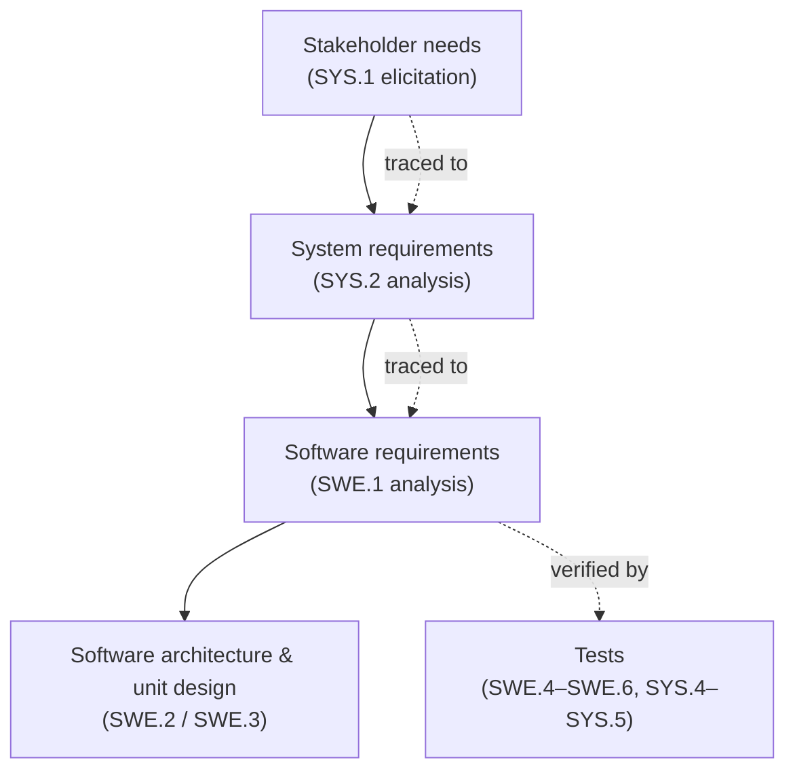
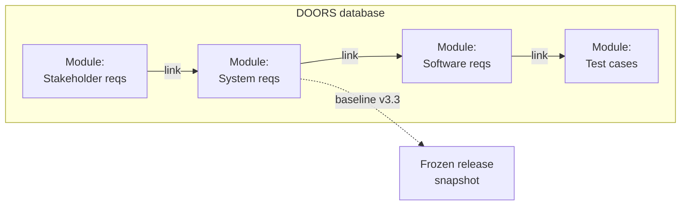

# Requirements Management

Welcome to the starting line of every automotive project. Long before anyone
writes a line of code or powers up a HIL (Hardware-in-the-Loop) rig, someone
has to answer a deceptively simple question: **what exactly must this system
do, and how will we prove it does it?** That answer lives in the
**requirements** — and in the automotive world they are not an informal to-do
list. They are contract-relevant engineering artifacts that get elicited,
reviewed, versioned and traced through the entire development lifecycle.

As a new E/E engineer you may never *own* the requirements document — but you
will read it every single day, derive your test cases from it, and defend your
test results against it. By the end of this article you will be able to:

- explain how **Automotive SPICE (ASPICE)** structures the requirements chain
  and why OEMs (Original Equipment Manufacturers) audit suppliers against it,
- spot a *bad* requirement on sight and rewrite it into a good one,
- find your way around **IBM Rational DOORS**, the industry-standard tool where
  real projects store and trace thousands of requirements.

## Automotive SPICE: the rules of the game

**Automotive SPICE** — short for *Software Process Improvement and Capability
dEtermination* (yes, the capitalization is odd, but that's where the acronym
comes from) — is the automotive-specific variant of the international standard
**ISO/IEC 15504 (SPICE)**. Its job is to **improve and evaluate the development
processes of ECU (Electronic Control Unit) suppliers**: when a carmaker audits
a supplier, the ASPICE model defines which processes are examined and how their
maturity is rated.

ASPICE lays its processes onto the V-model you already know from
[the V-Cycle](../../mil1/v-cycle/index.md). Three of them sit at the very top of
the left leg and form the requirements chain:


| Process | Name | What it does |
|---|---|---|
| **SYS.1** | Requirements Elicitation | Gather, process and track evolving stakeholder needs and requirements throughout the product lifecycle |
| **SYS.2** | System Requirements Analysis | Transform the defined stakeholder requirements into a set of system requirements that will guide the design of the system |
| **SWE.1** | Software Requirements Analysis | Transform the software-related parts of the system requirements into a set of software requirements |

The key idea is **progressive refinement with traceability**: each level
transforms the level above it, and every derived requirement must be linkable
back to its parent — and forward to the test that will prove it.



!!! note "Why you care as a test engineer"
    ASPICE traceability is bidirectional: a requirement must trace *down* to
    design and code, and every requirement must be *verifiable* by a test or
    analysis on the right leg of the V. When you later write test cases in the
    [Test Cases](../testcases/index.md) lesson and run them in
    [Verification](../../mil4/verification/index.md), each test will reference
    the requirement IDs it covers. Traceability is not bureaucracy — it is how
    you prove nothing was forgotten and nothing was invented.

## Functional vs. non-functional requirements

Requirements come in two fundamental flavors, and you'll meet both constantly:

- **Functional requirements** — what the system **shall do**. Example: "If the
  driver presses the brake pedal, the brake lights shall illuminate."
- **Non-functional requirements** — what the system **shall be**: qualities and
  constraints such as timing, memory consumption, temperature range,
  reliability, maintainability or compliance with a standard. Example: "The
  function shall execute within 10 ms" or "The ECU shall operate from −40 °C to
  +85 °C."

Both kinds must follow the same quality rules below. A vague non-functional
requirement ("the system shall be fast") is just as defective as a vague
functional one — and just as likely to blow up in your face during testing.

## Anatomy of a good requirement

Here is the heart of the lesson — and the skill you will use most. A
requirement is only useful if it can be understood one way, built within real
constraints, and proven at the end. Six characteristics define a well-formed
requirement:

| Characteristic | Rule |
|---|---|
| **Clear and unambiguous** | Only one way to interpret it |
| **Testable (verifiable)** | Can be checked by inspection, analysis, demonstration or test |
| **Feasible** | Doable within existing constraints (cost, timing, technology) |
| **Consistent** | No conflicts with other requirements; avoid redundancy |
| **Atomic** | A single statement — no conjunctions bundling several requirements |
| **Traceable** | Its level and its correlation with other requirements are known |

The easiest way to internalize these is through bad → good rewrites. Train
your eye on these examples and you'll start catching defects in reviews within
your first weeks on a project.

### Clear and unambiguous

> ❌ *The system shall not accept password longer than 15 characters.*

What does "not accept" mean — ignore it? truncate it? crash? A reader can
interpret this in several ways, and every developer will pick a different one.
The fixed version states the observable behavior:

> ✅ *If the user inserts a password longer than 15 characters, then the system
> shall display an error message and shall ask the user to correct it.*

### Testable

> ❌ *The system must refresh the data reasonably quickly.*

"Reasonably quickly" cannot be verified by anyone — and *you* are the one who
will have to verify it. A requirement is testable only if it contains a
measurable criterion:

> ✅ *The system must refresh the data each 0.5 ms.*

There are four recognized verification methods: **inspection** (review the
artifact), **analysis** (calculate or simulate), **demonstration** (operate and
observe) and **test** (stimulate with defined inputs and compare outputs).
Pick the method per requirement — and write the requirement so that at least
one method applies.

### Feasible

> ❌ *The replacement control system shall be installed with no disruption of
> the production.*

Zero disruption is usually physically impossible, so this requirement sets the
project up to fail before it starts. A feasible version quantifies what the
business can actually accept:

> ✅ *The replacement control system shall be installed causing no more than
> 2 days of production disruption.*

### Consistent

Requirements must not contradict each other. In this pair, REQ2 silently
forbids exactly what REQ1 demands:

> ❌ REQ1: *If A != B, then initialization shall be triggered.*
> ❌ REQ2: *The request for initialization shall be sent permanently with the
> value 0 ('kein_init').*

The conflict is resolved by keeping the single, agreed behavior:

> ✅ *The request for initialization shall be sent permanently with the value
> 0 ('kein_init').*

!!! warning "Redundancy is also a consistency problem"
    If the same behavior is stated in two places, a later change to one copy
    creates a hidden contradiction — and the two halves of the project will
    quietly diverge. Say it once, link to it everywhere.

### Atomic

Conjunctions are a smell. One requirement, one statement:

> ❌ *In case of overtemperature, overcurrent and overvoltage the system shall
> abort the charge.*

Split it so each condition can be traced, implemented and tested individually:

> ✅ REQ1: *In case of overtemperature the system shall abort the charge.*
> ✅ REQ2: *In case of overcurrent the system shall abort the charge.*
> ✅ REQ3: *In case of overvoltage the system shall abort the charge.*

Now each fault case gets its own test, its own link, and its own verdict in
the verification report.

### Traceable

It must always be possible to know **which level a requirement belongs to**
(stakeholder, system, software) and **how it correlates with other
requirements** — which parent it refines, which siblings it depends on, and
which tests verify it. Traceability is not a property of the sentence but of
the requirement *management*: it lives in the tool, which brings us to DOORS.

## Managing requirements in IBM Rational DOORS

**IBM Rational DOORS** (Dynamic Object-Oriented Requirements System) is the
de-facto standard requirements management tool in the automotive industry. A
Word document or Excel sheet simply cannot maintain thousands of linked,
versioned requirements without collapsing — DOORS can. You don't need to
master it on day one, but you do need to navigate it confidently, so let's
walk through the mental model.

### The data hierarchy

DOORS organizes a database into three levels you will see immediately in its
two main windows:


| Level | What it is |
|---|---|
| **Project / folder** | A container in the database explorer, grouping related work (e.g. one vehicle project) |
| **Formal module** | A structured document inside a project — e.g. "User Requirements", "System Requirements", "Verification Methods" |
| **Object** | One row inside a formal module: a requirement, a heading, or explanatory text |

Each object carries an absolute number, a heading hierarchy (the numbered
outline you see in the module), and a set of **attributes**.

### Attributes

Attributes characterize every requirement object, support the process, and
allow efficient administration of large requirement sets. Typical attributes
include the object ID, status, priority, verification method, and any
**customized attributes** your project defines (e.g. "ASIL", "Variant",
"Source"). DOORS distinguishes:

- **predefined attributes** — built-in system data (creation date, author,
  absolute number, …),
- **customized attributes** — project-specific columns with defined types
  (enumeration, integer, date, text, …).

Attributes are also scriptable: DOORS ships with its own extension language,
**DXL (DOORS eXtension Language)**, used for automation such as loading a
standard view onto the current module:

```text
Module m = current
Object o = current
Filter f
load view "Standard view"
```

### Filtering

To work inside a module of 5 000 requirements you need filters. DOORS can
filter objects by:

- names and IDs,
- **links through modules** (e.g. show only objects linked to a given test
  module),
- wildcards and full **regular expressions**,
- predefined and customized attribute values,

and multiple conditions can be combined in one filter.

!!! warning "Filters have no memory"
    A DOORS filter is not saved as part of the module by default — close the
    module and your carefully built multi-condition filter is gone. Save your
    working configurations as named **views** so they survive (and so they can
    be used for exports). Every new DOORS user learns this the hard way
    exactly once.

### Baselines, links and history

These are the features that make DOORS a *management* tool rather than a text
editor:

- **Links for traceability** — objects in one module link to objects in
  another (system requirement → software requirement → test case). DOORS
  visualizes and analyzes link coverage, and can report orphan requirements or
  tests that verify nothing.
- **Baselines** — immutable snapshots of a module at a defined point (e.g.
  "System Requirements v3.3" released to the supplier). You can always diff
  the current state against any baseline.
- **Defined views for exports** — saved column/filter/sort configurations,
  used to generate consistent documents for reviews and customers.
- **Easy import/update of attributes** — bulk changes (e.g. setting a new
  status on hundreds of objects) via import instead of manual editing.
- **History** — every change to every object is recorded with author and
  timestamp, so audits can reconstruct who changed what and when.



!!! tip "Practical habit"
    Before editing anything in a shared project, check whether the module is
    baselined and whether a change-management process applies — in many OEM
    projects you may only edit in a working copy, and changes are reviewed
    before they reach the released baseline.

## From requirements to the rest of the bootcamp

Requirements management is the entry point of the whole MIL3/MIL4 chain: the
test cases you will design in [Test Cases](../testcases/index.md) derive their
expected behavior directly from requirement text, and the
[Verification](../../mil4/verification/index.md) and
[Validation](../../mil4/validation/index.md) lessons close the loop by proving
each requirement on the bench or in the vehicle. A requirement that is
ambiguous, untestable or untraceable will surface again as an argument about
test results — which is why the six quality rules above matter to you even if
you never write a requirement yourself.

!!! success "Key takeaways"
    - Automotive SPICE (ISO/IEC 15504 for automotive) evaluates ECU supplier
      processes; the requirements chain is SYS.1 elicitation → SYS.2 system
      analysis → SWE.1 software analysis, each level refining the previous one.
    - Functional requirements say what the system *does*; non-functional
      requirements say what it *is* (timing, temperature, memory, …).
    - You can now judge any requirement against the six rules: clear,
      testable, feasible, consistent, atomic, traceable — and demand a
      measurable criterion wherever it must be verified.
    - Verification methods: inspection, analysis, demonstration, test.
    - DOORS structures requirements as database → projects → formal modules →
      objects, with attributes, filters, baselines, history and cross-module
      links providing traceability end to end.

!!! tip "Where this leads"
    Next up: turn these requirements into executable checks in
    [Test Cases](../testcases/index.md), then prove them on real hardware in
    [Verification](../../mil4/verification/index.md) and
    [Validation](../../mil4/validation/index.md).
