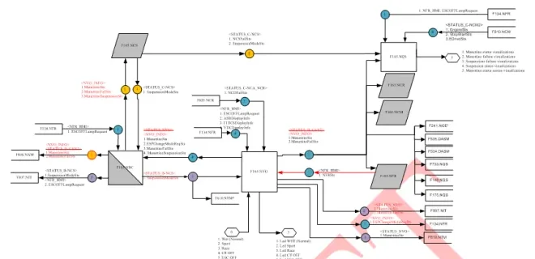
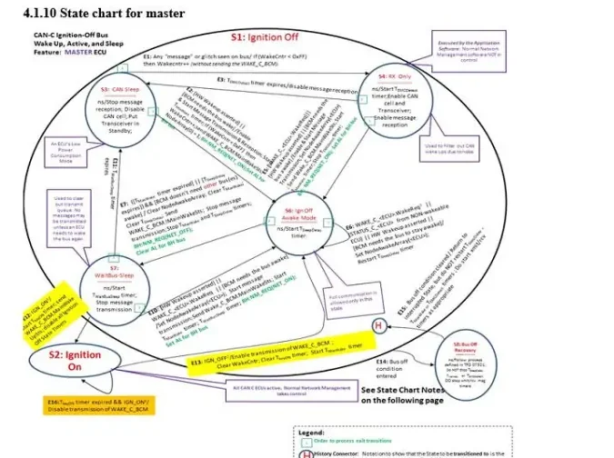
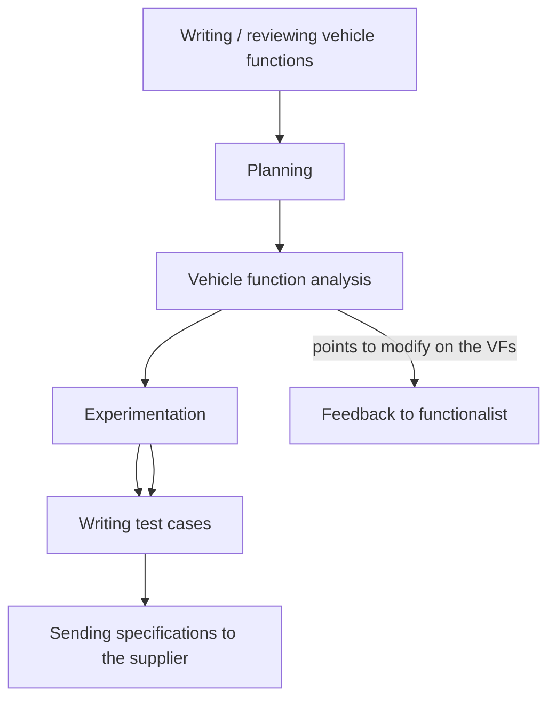
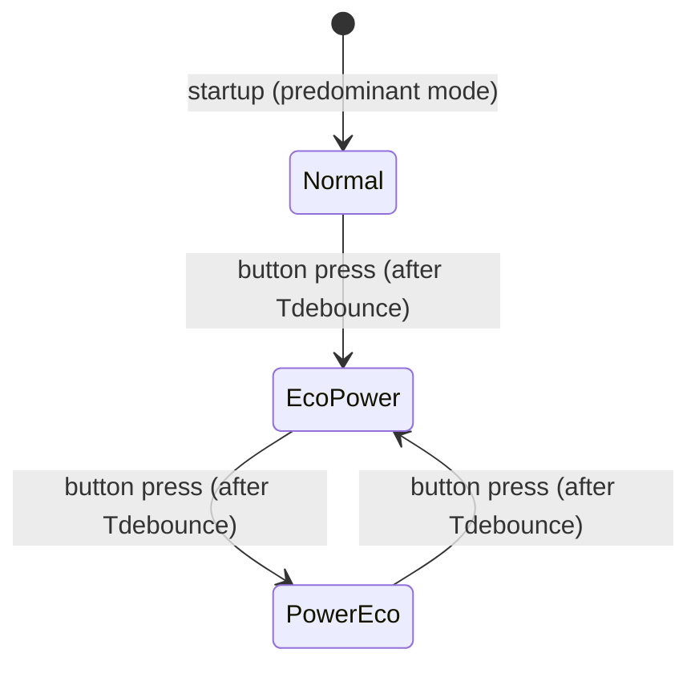

# Test Cases: From Vehicle Functions to Executable Tests

This article explains how executable tests are derived from vehicle
specifications. A function is considered complete only after it has been
placed in a known condition, stimulated, and checked against its
specification — repeatably, on record. The instrument for this is the
**test case**.

By the end of this article you will be able to:

- read a **VF (Vehicle Function)** specification — the document every
  requirement comes from — and know what to look for,
- turn each requirement into a **positive + negative test pair** with a
  traceable identifier,
- tell a **functional** test from a **diagnostic** one, and
- choose where each test should run: in the car, at the bench, or on a
  simulator.

## The starting point: the Vehicle Function specification

Test cases are never written from thin air. They are extracted from a
**functional specification** — in Kineton/Fiat practice, a **VF (Vehicle
Function)**. A VF is written by a *functionalist* and describes one vehicle
function end to end: its features, the Electronic Control Units (ECUs)
involved, the expected behavior under different environmental and key
conditions, plus the diagnosis and recovery strategies.

Two properties matter to you as a tester:

- **A VF is not tied to the component structure** — it describes *what* the
  vehicle does, not how a specific ECU is built. The software itself is
  written starting from the VF.
- **A VF is your test basis** — every test case you write must trace back to
  a paragraph of a VF (or of a diagnostic document). No orphan tests.

A single vehicle area hosts many VFs: car access, theft protection, climate,
braking, vehicle dynamics, energy management, lighting, infotainment,
instrument panel functions, and more.

### Naming: versions and releases

A VF is identified by the function name plus an alphanumeric suffix:

```
<Function Name>[Fx.Vfx_Rx]
```

- **V** = *Version* — versions the functionality according to the vehicle
  set-up it targets.
- **R** = *Release* — tracks changes made to the same VF across releases
  (for example, adaptations when porting to a new project).

The suffix reappears inside every test case identifier; this is how
traceability is enforced.

### What is inside a VF

| Section | Content |
|---|---|
| Revision notes | Dated history: VF owner, origin project in case of porting, list of changes |
| Functional diagram | Graphical map of the nodes involved and the CAN/LIN messages they exchange for this function |
| Working conditions | When the function is operational (key-on, key-off, timed after key-off, …) |
| Function description | The heart of the VF: nodes that "make logic", their input/output signals, state machines for special conditions |
| Working characteristics | Proxy/calibration values used by the function, activation info |
| CAN WakeUP | Whether activating the function can wake the CAN network |
| Diagnosis and recovery | Fault detection and fallback behavior; details live in the CDD |



The **functional diagram** is the part consulted most often during test
design:

- Every connection between nodes is labeled with the **CAN (Controller Area
  Network) or LIN (Local Interconnect Network) message and the
  transmitted/received signals**. Colors distinguish the networks (C1CAN,
  C2CAN, C3CAN, BHCAN, PCAN, LIN…), including *private* internal networks
  between modules of one component.
- Nodes drawn in **two colors are gateways** (direct or indirect) between
  networks.
- Numbers inside the node blocks reference **other VFs** the signals come
  from or go to — functions talk to each other through the diagram.
- Outputs are not always bus messages: an LED or a buzzer the driver hears
  is a perfectly legitimate function output.

!!! note "Companion documents you must have open"
    A VF never stands alone. Before writing or running its tests, have these
    within reach:

    - the **DBC (Database CAN) files** — one per CAN network, mapping every
      message and signal (see [CAN & LIN](../../mil1/can-lin/index.md)),
    - the **LIN description files** for the LIN sub-networks,
    - the **CDD** (diagnostic description) — the document that meticulously
      lists every fault code with its validation/invalidation conditions.

    A signal named differently in the VF than in the DBC — or missing from
    the DBC entirely — is one of the most common findings of VF analysis.
    Detecting it during analysis avoids rework on tests written against the
    wrong signal name.

## What a test case is

A test case is a **set of conditions used to verify that the requirements of
a function are respected** — and that the implementation matches the
specification. The basic coverage rule is:

!!! tip "Positive and negative tests"
    For every operating condition, foresee **both** a *positive* test (the
    requirement holds when it should) and a *negative* test (apply the
    opposite condition, and the result must be the opposite of the positive
    case). Only the pair provides robust coverage of the requirement.

In the V-model, your test cases sit on the right-hand (verification) side,
mirroring the requirements on the left — see
[the V-cycle](../../mil1/v-cycle/index.md).

### Test case format

Each test is formalized in a document (usually a table) with at least:

| Field | Meaning |
|---|---|
| Unique identifier | Alphanumeric ID, e.g. `VFXXX_V5_R4.TC001` |
| Function name | The VF the test belongs to |
| Project | The vehicle project the test is written for |
| Market | Europe / Asia / America… when behavior differs per market |
| Test type | E.g. integration test or diagnostic test |
| Preconditions | Conditions that must hold *before* acting — fundamental for success |
| Actions | What to do, starting from the preconditions |
| Check | The expected result to verify after the actions |
| Result | OK / KO |
| Source specification | The VF (name and release) the test was extracted from |
| Notes | Free comments for the tester |

The **preconditions** field deserves particular care: most non-reproducible
test results trace back to a system that was not actually in the state the
test assumed.

### The checklist table

In practice, all tests for a VF live in a **checklist**: one row per test,
grouped by requirement. Its columns are:

- **Req ID Reference** — the paragraph number of the VF;
- **Req description** — the title of that paragraph;
- **TEST ID** — `VFXXX_VX_RY.TC001`, `.TC002`, `.TC003`, …;
- **TEST DESCRIPTION** — a verbose description written as a chain of
  conditions: *in → key on, engine on conditions, → when condition A = true,
  → the expected behavior shall happen*;
- **CONDITION** — the concrete stimulus values:
  `→ Key ON, Engine ON`, `→ CANSignal1 = xxx`, `→ CANSignal2 = yyy`,
  `→ ElectricalSignal1 = 'High'`, …;
- **Verification / TEST RESULT** — OK or KO, plus a **Note**: *if the test
  is KO, why is it KO?*

The note on a KO result is required in practice: a KO without an explanation
forces the test to be re-run from scratch.

## Functional vs diagnostic test cases

Test cases fall into two macro categories, distinguished by the document
they are checked against.

**Functional (integration) test cases** are the first step in guaranteeing
software quality. They verify that the application works as expected
technically *and* — just as important — that it does what the user actually
asked for. They are written against the **VF**, and their result must match
what the software specification provides.

**Diagnostic test cases** verify the fault-detection machinery itself. They
are written against the **CDD**, and their result must match what the CDD
provides. Their purpose is to catch malfunctions (*faults*) when they happen
and trigger actions that minimize damage before the actual breakdown
(*failure*) occurs. Functional safety standards
tie the **Safety Integrity Level (SIL)** of a system directly to its
*diagnostic coverage* — the fraction of dangerous failures detected in time.

Diagnostic tests are extracted from the diagnosis section of the VF (when
present) and, above all, from the CDD, which defines every **DTC (Diagnostic
Trouble Code)** with its **validation/invalidation conditions and
timescales** — exactly what you need to build preconditions and checks. See
[Diagnosis](../../mil2/diagnosis/index.md) for the underlying concepts.

## Deriving test cases from requirements

A requirement inside a VF can take several forms, and each form has its own
extraction style:

- **Descriptive text** — e.g. *"If the Master is awakened by a Hardware Wake
  up that requires the CAN C bus to be awake, it shall transmit the
  WAKE_C_NBC message, setting the MainWakeSts bit and the NodeX bit
  corresponding to itself."* This is the hardest form: you interpret the
  prose, identify the precondition ("hardware wake-up requiring CAN C"), the
  action (transmit `WAKE_C_NBC`) and the check (`MainWakeSts` and `NodeX`
  bits set) — and you invent the negative case yourself.
- **Descriptive table** — behavior listed row by row; each row becomes at
  least one test.
- **Truth table** — mechanical: every input combination is a test case.
- **Logical equation** — test each combination that makes the equation true
  and false.
- **State machine** — every transition is a test: put the system in the
  source state, apply the trigger, verify the destination state and the
  actions.
- **Flowchart** — every path through the chart is a test.

!!! note
    Except for descriptive text, the process is mechanical: a truth table or
    a flowchart is transcribed directly into the chosen test syntax. The
    risk of missing cases lies mainly in the free-text requirements.

### Example: a truth table becomes four tests

A VF remarks section states that the "+ luci" condition is transmitted on
CAN in the `InternalLightSts` signal, according to this table:

| `PosLightCmd` (+ luci) | `NightDaySts` | `InternalLightSts` on CAN |
|---|---|---|
| 0 (position lights OFF) | 0 (night condition) | 0 |
| 1 (position lights ON) | 0 | 1 |
| 0 | 1 (daytime condition) | 0 |
| 1 | 1 | 0 |

Each row yields a test case: set the two input signals, read the CAN signal,
compare with the expected value. Row 4 is the *negative* test for row 2:
same command, different ambient condition, opposite output.

### Example: a state machine transition becomes a test

The figure below is the master state chart for CAN-C ignition-off bus
wake-up/sleep management — a classic network-management requirement form:



Take transition **E12**, which moves the master from state **S7**
(WaitBusSleep) to state **S2** (Ignition On). The derived test case is:

- **Precondition**: master ECU in S7, bus wake-up conditions as per the VF;
- **Action**: apply the E12 trigger (ignition on);
- **Check**: the ECU reaches S2 and performs the transition actions (e.g.
  enabling transmission of the `WAKE_C_BCM` message, clearing/restarting the
  relevant timers as written in the chart);
- **Negative test**: without the trigger, the ECU must remain in S7 and the
  S2-entry actions must not occur.

One transition maps to one positive test plus its negative counterpart. A
chart like this, with seven states and a dozen transitions, generates twenty
or more test cases.

## The drafting workflow

Writing test cases is a process with its own quality loop, not a one-shot
translation task:



The **VF analysis** step is one of the most important for clean tests. It
means studying the vehicle function and cross-checking it against the
**DB files** (DBC/LIN), previously executed test results and related
documentation. Typical findings:

- a signal is named differently in the VF than in the DBC — or is missing
  from the DBC entirely;
- parts of the function are implemented through **internal messages** that
  are not observable from the vehicle networks — they cannot be tested with
  an integration approach.

That second finding draws an important boundary: requirements describing
behavior *internal* to a component, which cannot be monitored from outside,
give rise to **component tests** — and those belong to the component's
**supplier**, not to the vehicle-level test team. Conversely, if the
analysis identifies plausible cases the VF does not describe, the
corresponding test cases are still written. Total coverage of the VF is the
goal.

## Worked example: Gearbox Status Management (BEV)

The following worked example applies this process to a real VF: *Gearbox
Status Management* for a Battery Electric Vehicle (BEV) project. The
function involves several nodes:

- **MTA** — the robotic transmission actuator, the node that "makes logic";
- **SLU** — the shift lever unit, source of `ShiftLeverPosition.Info`
  (R-N-D);
- **BCM** — body controller, acting as **direct gateway** routing the
  `STATUS_C_TCM_MTA_DCTM` message between C-CAN and B-CAN, and mapping
  signals such as `STATUS_B_CAN2.SBR1RowDriverSeatSts =
  STATUS_SDM.SBR1RowDriverSeatSts`;
- **IPC** — the instrument panel, which displays indications and drives the
  buzzer based on what it receives on B-CAN.

Requirements are written in a semi-formal style: a `@` condition
(`@KeyStatus.info = keyon:`) followed by *shall* statements in if/else form.
**Each *shall* statement is a candidate test case.**

### Mismatch: blinking and buzzer

The VF defines a mismatch table between the inserted gear and the
transmission park brake status (`TPBMSts`), separately for
*Keyon_EngineOff* and *Keyon_EngineOn* — e.g. lever in N with park brake
*not* released → mismatch. From it:

- when the MTA detects a mismatch for longer than the timeout
  `T_Gear_Mismatch` (trial value **500 ms**), it shall send
  `STATUS_C_TCM_MTA_DCTM.GearIndicationSts = Blinking` and
  `BuzzerReqSts = OtherCaseSoundOn`;
- when no mismatch is detected, it shall send `GearIndicationSts = Normal`
  and `BuzzerReqSts = OFF`.

That is a positive test (create the mismatch, wait out the timeout, read the
CAN signals: blinking + buzzer on) and a negative test (no mismatch: signals
stay Normal/OFF). Every row of both mismatch tables is its own test case.

### Gear engagement requests

The N/R/D engagement requirements show how one *shall* branches into several
tests. For an **R engagement request** at `Keyon_EngineOn`, coming from N:

- brake pedal pressed **and** `VehicleSpeed.Info < Rthreshold` (trial value
  **3 km/h**) → MTA inserts R;
- brake **not** pressed → MTA sends
  `RoboticTransmissionWarnings = Press_Brake_Pedal_Repeat_Warning` for
  `Tmessage` (trial value **10 s**) and forces N;
- speed too high → `Vehicle_Speed_Too_High_to_Shift_R` for `Tmessage`, force
  N; if the speed then drops below `Rthreshold` while the lever is still in
  R, the MTA shall stop the warning and insert R.

Three tests minimum from one paragraph — plus the recovery path as a fourth.

The symmetrical requirement exists for **D engagement** with
`Forwardthreshold` (trial value **−3 km/h**): rolling backward faster than
the threshold blocks the D engagement and raises
`Vehicle_Speed_Too_High_to_Shift_D`.

### Drive mode: a small state machine

The Power/Eco button cycles three modes in a fixed sequence, with `Normal`
as the predominant mode at every startup:



At startup the MTA sends `DriveModeSts = No_program_Selected`; each press
(after `Tdebounce`, trial value **60 ms**) advances the mode and updates
`DriveModeSts` accordingly. Tests: the full cycle, the startup default, the
key-off behavior (during `T_SHOW_OFF_MTA`, **8 s**, the MTA must still send
`No_program_Selected`), and the debounce filtering itself.

### Diagnosis: missing messages

The VF's diagnosis table assigns each fault a type (electrical,
plausibility, missing message), the node that stores it and its detection
time. Example: if the MTA does not receive `STATUS_B_CAN` for at least
`MissingMsg_Default_Time` (trial value **2.5 s**), it shall validate the DTC
and assume a safe default — `DriverDoorSts = Closed`. When the message is
received correctly again, the DTC is devalidated and real values are used.
The IPC and BCM have analogous requirements for their input messages.

The diagnostic test case follows directly: stop the message
(straightforward on a simulator or bench), wait 2.5 s, check that the DTC is
validated and the default is used; restart the message, check devalidation.
The exact validation/invalidation timings come from the CDD.

### Configuration parameters: the tester's cheat sheet

The VF closes with a table of calibrable parameters and their *first trial
values* — these are the concrete numbers to use in your preconditions and
checks:

| Parameter | Meaning | Trial value |
|---|---|---|
| `Rthreshold` | Speed threshold to accept Reverse | 3 km/h |
| `Forwardthreshold` | Speed threshold to accept Drive | −3 km/h |
| `T_Gear_Mismatch` | Time before mismatch is recognized | 500 ms |
| `Tmessage` | Time a warning message is driven to the IPC | 10 s |
| `Tdebounce` | Button debounce/filter time | 60 ms |
| `TStuck` | Time to detect a stuck drive-mode button | 20 s |
| `T_SHOW_OFF_MTA` | CAN update guaranteed after key-off | 8 s |
| `T_SHOW_OFF_IPC` | Indication guaranteed after key-off | 7 s |
| `MissingMsg_Default_Time` | Time to declare a message missing | 2.5 s |
| `TPBM_threshold` | Speed threshold to request the park brake | 4 km/h |
| `MTA_CRC_MC_wrong_timer` | Time to recognize CRC/message-counter errors | 3 s |

!!! warning "Trial values are calibrations, not constants"
    These are *first trial values*: a later calibration release can change
    them. Always read the parameters from the VF release quoted in your test
    ID (`VFXXX_V5_R4`…) before writing timing checks — a test written
    against 500 ms will fail confusingly the day the calibration moves to
    something else.

## Where tests are executed

Once the tests for a VF are written, the test phase can run in three
environments, chosen per test type:

| Environment | When to prefer it |
|---|---|
| **In the car** | When you must observe the real, user-perceivable behavior — e.g. wiper behavior at high vehicle speed |
| **At the bench** | When you need to simulate/measure the electrical-electronic behavior — currents, voltages, oscilloscope work |
| **At the simulator** | When no car or bench is available, or when you need CAN message stimulation with very fast dynamics |

Missing-message diagnostic tests and timing checks in the
hundreds-of-milliseconds range are typical simulator candidates; tests that
require perceiving audible output, such as the buzzer, belong in the car.

!!! success "Key takeaways"
    - Test cases are extracted from the **VF** (functional tests) and the
      **CDD** (diagnostic tests), not written freehand.
    - Every requirement is covered by a **positive and a negative** test;
      only the pair provides robust coverage.
    - Test IDs embed the VF name, version and release
      (`VFXXX_V5_R4.TC001`), which provides the traceability chain.
    - Requirements come as text, tables, truth tables, equations, state
      machines and flowcharts; each form maps mechanically to tests, and
      only free text requires interpretation.
    - VF analysis against the DBC detects wrong or missing signal names
      before test execution; unobservable internal behavior becomes a
      **component test**, owned by the supplier.
    - The VF's parameter table (`T_Gear_Mismatch`,
      `MissingMsg_Default_Time`, thresholds…) provides the concrete values
      for checks; tests must reference the quoted release.
    - The execution environment is chosen per test: car for user-perceivable
      behavior, bench for electrical measurement, simulator for fast CAN
      stimulation.

!!! tip "Where this leads"
    You will manage the requirements behind these tests in
    [Requirements](../requirements/index.md), dig deeper into the VF
    documents in [Vehicle Functions](../vf/index.md), and automate execution
    on HIL (Hardware-in-the-Loop) rigs in
    [HIL Users](../hil-users/index.md).
