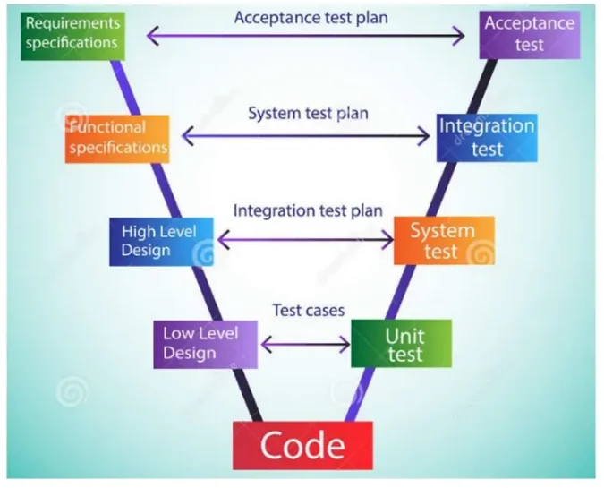
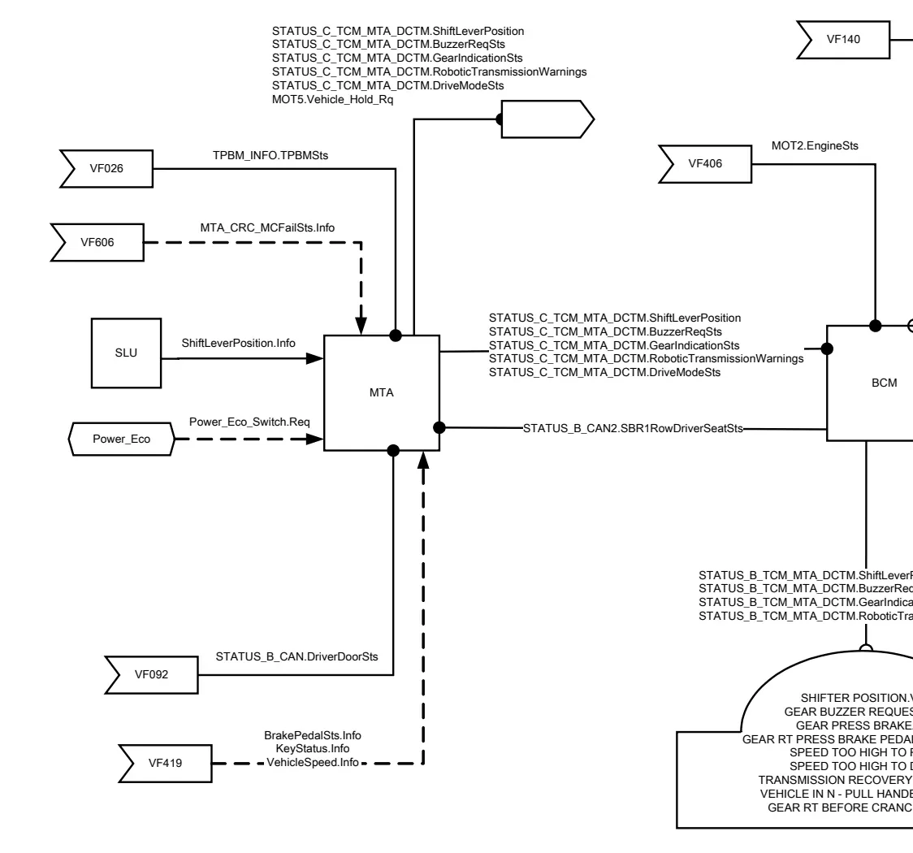
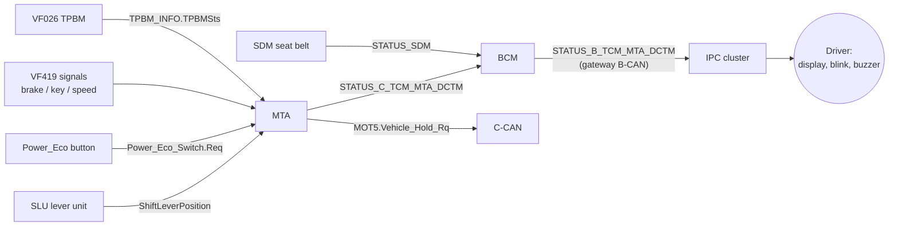
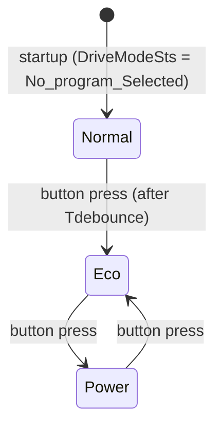

# Functional Specifications (VF)

Every function in a modern vehicle — from the climate control to the gearbox
indicator on the dashboard — is described, before a single line of software is
written, in a **functional specification**. In the FCA/Stellantis world this
document is called a **VF (Vehicle Function)**. It is written by a dedicated
professional figure, the **functionalist**, and it is the reference you will
constantly open when writing test cases, setting up a HIL bench, or chasing a
bug: if the car behaves differently from what the VF says, either the software
or the document is wrong.

This article explains what a VF contains, how it is structured, and then walks
through a real example — VF200, the *Gearbox Status Management* function of a
BEV project — so you can recognize every section when you meet one at work.

## What a VF is (and is not)

A VF gives a **complete view of the behavior of one function**:

- the list of features the function offers,
- the vehicle **nodes (ECUs)** involved and the signals they exchange,
- the expected behavior under the different vehicle operating conditions
  (key-on, key-off, cranking, low battery, …),
- the **diagnosis** strategy and the **recovery** behavior adopted when
  something fails,
- a history of the changes made with respect to previous versions.

Two properties are worth stressing:

- **A VF is not tied to the component structure.** It describes *what* the
  function must do, not *how* a specific ECU is built. The same function may be
  re-allocated to different hardware across projects without changing the VF's
  logic.
- **The software is written starting from the VF.** Downstream, requirements
  and test cases are derived from it — which is why a vague VF produces vague
  software.

### Position in the V-model



The VF sits on the **left branch of the V-model**, just below the requirements
specifications: requirements say *what the vehicle must do*, the VF says *how
each function behaves to achieve it*. On the right branch, the VF is mirrored by
the **integration and system test** phases — the tests that verify the
implemented function against the specification. This is why you, as a test
engineer, will read VFs even if you never write one.

!!! note "One function, many VFs"
    A car-level feature area (car access, theft protection, climate, braking,
    lighting, infotainment, vehicle dynamics, energy management, …) is usually
    covered by **several VFs**, one per function. The VF set of a vehicle
    program together describes its entire E/E functional behavior.

## Naming and versioning

A VF is identified by the function name followed by an alphanumeric code:

```
<Function Name>  [ VF<num> _ V<x> _ R<y> ]
```

- **VF number** — identifies the function itself (e.g. VF200).
- **V — Version** — versions the functionality according to the vehicle set-up
  (different architectures or configurations may need different versions).
- **R — Release** — tracks the evolutions of the same VF over time (bug fixes,
  adaptations when porting the function to a new project).

So `VF200_V5_R4R3_P250FL14` reads as: function 200, version 5 (releases R3 and
R4 merged), ported to project 250FL14.

!!! tip "Always quote the full identifier"
    When you reference a VF in a test report or a defect, write the complete
    `VF_V_R` string plus the project code. "The gearbox VF" is ambiguous —
    release R3 and R4 of the same version can specify different behavior, as
    the example below shows.

## Anatomy of a VF

Although layouts vary slightly between OEM templates, a VF contains the same
logical sections.

### Revision notes

The document opens with a **revision table**: for every release, the date, the
author (the VF *owner*), and the list of changes — usually referencing a change
request number (CR). If the VF was **ported** from another project, the origin
project is declared here. This table is the first thing to check when a test
fails "against the spec": you may be reading an outdated release.

### Functional diagram

The **functional diagram** is a graphical map of the function: every involved
node, every connection between nodes, and the **CAN/LIN messages and signals**
exchanged on each branch.

Reading conventions you will find in these diagrams:

- Different **colors** identify the different networks (C1CAN, C2CAN, C3CAN,
  BHCAN, PCAN, LIN, …).
- On each connection branch, the **message name** and the transmitted/received
  **signal names** are annotated.
- Nodes drawn with **two colors act as gateways** (direct or indirect) between
  networks.
- **Numbers inside the node blocks** reference the VFs from which signals come
  or to which they go — this is how you navigate from one VF to another.
- Node outputs are not necessarily bus messages: they can also be **acoustic or
  visual signals** perceived directly by the user, e.g. an LED or a buzzer.

### Working conditions

The **working conditions table** states under which vehicle states the function
is operational. Typical rows:

| Working mode | Meaning |
|---|---|
| Key off (+30) | Function active on permanent battery supply |
| Key on (+15) | Function active with ignition on |
| Timed, from key off | Function stays alive for a timed window after key-off |
| Excluded during crank (+) | Function suspended while the starter is cranking |
| Excluded with battery discharged (+) | Function cut off under low battery |

Each row is marked Yes/No, with remarks for the timing (in minutes) or the
exclusion mode (SW or HW). A simple function may live only at key-on; a body
function often needs key-off and timed operation too.

### Function description — the heart of the VF

This is the core section, and the longest. It starts by listing the **nodes
involved**, distinguishing those that *"make logic"* (implement the algorithm)
from those that merely forward or display information, with their input/output
signals. Then it describes the behavior in detail, typically as:

- **structured requirements** — `If … then … else …` rules, often written in
  shall-style ("the MTA shall send …"),
- **truth tables** mapping input combinations to outputs,
- **state machines** for operating conditions,
- **timeouts and thresholds** expressed as named calibration parameters
  (never hardcoded numbers in the logic itself).

The behavior is usually split per key condition (`@KeyStatus = keyon`,
`@KeyStatus = keyoff`, …), because most functions behave differently when the
vehicle is asleep.

### Working characteristics (parameters)

All tunable values — thresholds, timeouts, debounce times — are collected as
**configuration parameters**, each with a description, the node that owns it,
and where the value is implemented (PROXI, end-of-line programming, part
number, or to be defined with the supplier). Test engineers care about these a
lot: changing a parameter is a calibration change, not a software change, and
tests must often be repeated per parameter set.

### CAN wake-up

A short section states whether activating the function can **wake the CAN
network** up (e.g. a door handle pull waking the body CAN), with a table of the
triggering events per node. This matters for power management tests.

### Diagnosis and recovery

The last functional section describes, for every input the function depends on,
what happens when it fails:

- the **diagnosis type** (electrical fault, plausibility fault, missing
  message, CRC/message-counter failure),
- which ECU **stores the DTC** and with which detection time (UDM),
- the **recovery strategy**: the default/fallback values the function uses
  while the fault is active.

!!! note "The CDD has the full diagnosis detail"
    The VF only sketches the diagnosis strategy. The complete description of
    DTCs, validation/invalidation conditions and fault debouncing lives in the
    **CDD (CANdela Diagnostic Description)** of each ECU — you will work with
    CDD files in the diagnosis lessons.

### Companion files: DBC and LIN files

A VF never stands alone. The network-level truth about messages and signals is
kept in two companion databases:

- the **DBC file**, one per CAN network (e.g. BHCAN), mapping every message,
  signal, scaling and node;
- the **LIN description file**, doing the same for the LIN sub-networks (e.g.
  the wiping functionality).

When a VF says "the MTA shall send `STATUS_C_TCM_MTA_DCTM.GearIndicationSts`",
the DBC tells you the message ID, cycle time, start bit, length and value table
of that signal. You will read and edit DBC files constantly in CANalyzer/CANoe.

## Case study: VF200 — Gearbox Status Management (BEV)

The best way to understand the structure is a real document. The example VF is
**VF200_V5_R4R3**, *Gearbox Status Management – BEV*, for FCA project
**250FL14** (Vehicle Function Area: *Powertrain Management*, Group: *GearBox*).
The function manages **everything the driver sees and hears about the
transmission**: the gear indication on the instrument panel, the blinking of
that indication, the warning messages, the buzzer, the drive-mode (Eco/Power)
management, and the vehicle-hold / parking-brake requests.

The revision notes alone teach a lesson: across releases, a parameter
(`T_SHOW_OFF_BCM`) was deleted as unnecessary, signal names were corrected
(`Power_Eco.Req` → `EcoPower.Req`), diagnosis timers were aligned
(`MissingMsg_Fast_Time` → `MissingMsg_Default_Time`), and the driver-exit logic
was changed from AND to OR between seat belt and door status — exactly the kind
of detail that flips a test result.

### Nodes and signal flow



The nodes that *make logic* are three:

| Node | Role in VF200 |
|---|---|
| **MTA** (transmission controller) | Reads the lever, decides the gear, requests warnings/buzzer, manages the drive-mode button and the vehicle-hold request |
| **BCM** (body control module) | Acts as a **direct gateway**: routes `STATUS_C_TCM_MTA_DCTM` from C-CAN to B-CAN (`STATUS_B_TCM_MTA_DCTM`), and forwards the seat-belt status from `STATUS_SDM` and the engine status from `STATUS_C_CAN` |
| **IPC** (instrument panel cluster) | Displays the gear position, the blinking, the text warnings, drives the buzzer |

The main inputs the MTA consumes:

| Signal | Carried by | Meaning |
|---|---|---|
| `ShiftLeverPosition.Info` | SLU (lever unit) | Requested lever position; the ESM lever has 3 stable positions R–N–D |
| `BrakePedalSts.Info`, `KeyStatus.Info`, `VehicleSpeed.Info` | via VF419 | Brake pedal, key state, vehicle speed |
| `TPBM_INFO.TPBMSts` | via VF026 | Transmission park brake status |
| `STATUS_B_CAN.DriverDoorSts` | via VF092 | Driver door open/closed |
| `STATUS_B_CAN2.SBR1RowDriverSeatSts` | SDM via BCM gateway | Seat belt fastened |
| `MOT2.EngineSts` | via VF406 | Engine OFF / cranking / ON |
| `Power_Eco_Switch.Req` | Power_Eco button | Drive-mode selection |



### Working conditions

VF200's table is instructive: most sub-functions (blinking, buzzer, warnings,
gear-change request, power-eco management, …) are active at **key-on (+15)**,
some remain active in a **timed window after key-off** (the IPC must keep
showing indications for `T_SHOW_OFF_IPC`), and some are **excluded during
cranking** or with **low battery**. A function's behavior is always qualified
by which of these conditions is active — in the requirement text you will see
guards like `@KeyStatus.info = Keyon_EngineOff:` before every rule.

### Gear-change request logic

The core algorithm decides whether a lever movement is *accepted*. The pattern
repeats for N, R and D:

- At **key-on, engine off**: the gear is accepted only if the **brake pedal is
  pressed** at the moment of the lever transition; otherwise the MTA emits
  `RoboticTransmissionWarnings = Press_Brake_Pedal_Repeat_Warning` for a
  `Tmessage` time.
- At **key-on, engine on**, engaging **R**: if coming from D, the vehicle speed
  must be ≤ `Rthreshold`; if coming from N, the brake must also be pressed. If
  the speed is too high, the MTA sends
  `Vehicle_Speed_Too_High_to_Shift_R` **and forces N** — but as soon as speed
  drops below the threshold (lever still in R), it stops the warning and
  engages R.
- Engaging **D** mirrors this with `Forwardthreshold` (a *negative* first-trial
  value of −3 km/h — the car may still be rolling slightly backwards).

**Mismatch detection**: the MTA continuously compares the lever position with
the actually engaged gear (and the park-brake status). If a mismatch persists
longer than `T_Gear_Mismatch` (first trial 500 ms), it sets
`GearIndicationSts = Blinking` **and** `BuzzerReqSts = OtherCaseSoundOn` —
that is the blinking gear letter and the beep you hear when the gearbox could
not do what you asked.

### Drive-mode (Power_Eco) management

The Power_Eco button cycles the drive mode. The sequence is
**Normal → Eco → Power → Eco → …** — note Normal is only the *predominant
mode* at startup; after that the button toggles between Eco and Power. Each
press is debounced (`Tdebounce`, first trial 60 ms) and mapped onto
`DriveModeSts`:



At every key-on→key-off transition the MTA reports
`DriveModeSts = No_program_Selected` for the `T_SHOW_OFF_MTA` window.

### Vehicle-hold (transmission parking brake) scenarios

The trickiest part of VF200 is `MOT5.Vehicle_Hold_Rq` — when the MTA asks to
hold the vehicle. The VF enumerates **seven scenarios**, with explicit priority
rules (e.g. the driver-exit scenarios override normal operation). Two of them
show the safety thinking:

- **Switch-off**: at key-on→key-off, if the last known speed was below
  `TPBM_threshold` the MTA requests hold; otherwise it warns
  `Vehicle_In_Neutral`.
- **Driver exit in D/R (7th scenario)**: at key-on engine-on, if the driver
  opens the door **and** unfastens the seat belt while in D or R, and the speed
  is below the threshold, the MTA **autonomously shifts to N** and requests
  hold. Exit conditions require the driver to be back (door closed / belt
  fastened) and a fresh, brake-pressed lever movement.

!!! warning "OR vs AND is a safety decision"
    The 6th scenario (driver exit in N) triggers with door open **or** belt
    unfastened; the 7th requires **both**. This OR was introduced by a change
    request — a reminder that these logical operators are deliberate safety
    choices, and that tests must cover each side of them.

### Indications on the cluster

The IPC translates each MTA signal into something the driver perceives. The
mapping is one-to-one and fully testable:

| MTA signal value | IPC indication |
|---|---|
| `GearIndicationSts = Blinking` | Shifter position display blinks |
| `BuzzerReqSts = OtherCaseSoundOn` | Gear buzzer on |
| `RoboticTransmissionWarnings = Press_Brake_Pedal_Warning` | "GEAR PRESS BRAKE" text |
| `… = Press_Brake_Pedal_Repeat_Warning` | "GEAR RT PRESS BRAKE REPEAT" text |
| `… = Vehicle_Speed_Too_High_to_Shift_R / _D` | "SPEED TOO HIGH TO R / D" text |
| `… = Trans_Recover_Mode_Warning` | "TRANSMISSION RECOVERY MODE" text |
| `… = Vehicle_In_Neutral` | "VEHICLE IN N – PULL HANDBRAKE" (also at key-off, for `T_SHOW_OFF_IPC`) |

The IPC also runs its own internal logic: it activates
`GearInsertNAndPressBrakeToStart.Req` whenever the lever is not in N **or** the
brake is not pressed (shown at key-on engine-off as "GEAR RT BEFORE CRANKING"),
and derives `EcoPower.Req` from the received `DriveModeSts`.

### Diagnosis and recovery in VF200

The diagnosis table lists every input, the fault type, and the storing ECU. The
recovery rules show the standard patterns you will meet everywhere:

| Fault | Detecting ECU | Recovery while fault active |
|---|---|---|
| `ShiftLeverPosition` electrical / plausibility fault | MTA | DTC validated, "Motor Fault" to IPC; keep D if driving forward, otherwise force N and declare `ShiftLeverPosition = N` |
| `Power_Eco_Switch.Req` stuck (`TStuck`, 20 s) or electrical | MTA | Force `DriveModeSts = No_program_Selected`, go to Normal mode |
| `STATUS_B_CAN` missing (> `MissingMsg_Default_Time`) | MTA | Assume `DriverDoorSts = Closed` |
| `STATUS_B_CAN2` missing | MTA | Assume `Seat Belt Fasten` |
| `TPBM_INFO` missing or CRC/MC fail (`MTA_CRC_MC_wrong_timer`) | MTA | Use last valid `TPBMSts` (default `Released`) |
| `STATUS_SDM` missing | BCM | Forward `Seat Belt Fasten` |
| `STATUS_C_CAN`, `STATUS_B_TCM_MTA_DCTM`, `EDR_INFO` missing | IPC | Assume `EngineSts = On`, requests `Not_Active`, brake switch `Not_active` |

Note the philosophy: **fallback values are chosen on the safe side** — assume
the door is closed and the belt fastened (so no spurious hold request), declare
the engine running, and neutralize driver-visible requests.

### Configuration parameters

VF200 closes with its calibration table — the knobs a test engineer can turn:

| Parameter | Meaning | First trial value |
|---|---|---|
| `Rthreshold` | Max speed to engage reverse | 3 km/h |
| `Forwardthreshold` | Min speed to engage drive | −3 km/h |
| `TPBM_threshold` | Speed below which vehicle hold can be requested | 4 km/h |
| `T_Gear_Mismatch` | Delay before declaring lever/gear mismatch | 500 ms |
| `Tdebounce` | Button debounce / filtering | 60 ms |
| `TStuck` | Button-pressed-too-long plausibility fault | 20 s |
| `Tmessage` | Duration of a warning message to the IPC | 10 s |
| `T_SHOW_OFF_MTA` / `T_SHOW_OFF_IPC` | Keep sending/showing after key-off | 8 s / 7 s |
| `MissingMsg_Default_Time` | Missing-message detection time | 2.5 s |
| `MTA_CRC_MC_wrong_timer` | CRC / message-counter failure debounce | 3 |

!!! tip "For your test cases"
    Every `If … then` rule, every truth-table row, every scenario number and
    every parameter in a VF is a candidate test case. When you move to the
    test-design lessons, a VF like VF200 is exactly the document you will be
    asked to derive cases from — boundary values around `Rthreshold`,
    `TPBM_threshold` and the mismatch timer are the obvious targets.

!!! success "Key takeaways"
    - A VF (Vehicle Function) is the functionalist's document describing the
      complete behavior of one vehicle function; software and tests are
      derived from it, and it is independent of the component structure.
    - Naming: `Function [VFn_Vx_Ry]` — Version tracks the set-up, Release
      tracks evolutions; always reference the full identifier.
    - Fixed structure: revision notes, functional diagram (nodes, gateways,
      CAN/LIN messages per network), working conditions, function description,
      parameters, CAN wake-up, diagnosis & recovery, plus DBC/LIN companion
      files (and the CDD for full diagnosis detail).
    - Requirements are written per key condition with named calibration
      parameters — never hardcoded values.
    - The VF200 example shows it all: lever/gear mismatch → blinking + buzzer,
      speed-thresholded gear engagement with forced-N fallback, seven
      prioritized vehicle-hold scenarios, one-to-one IPC indication mapping,
      and safe-side recovery defaults for every failed input.
