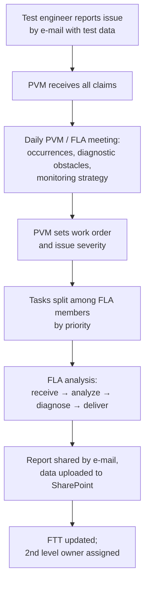
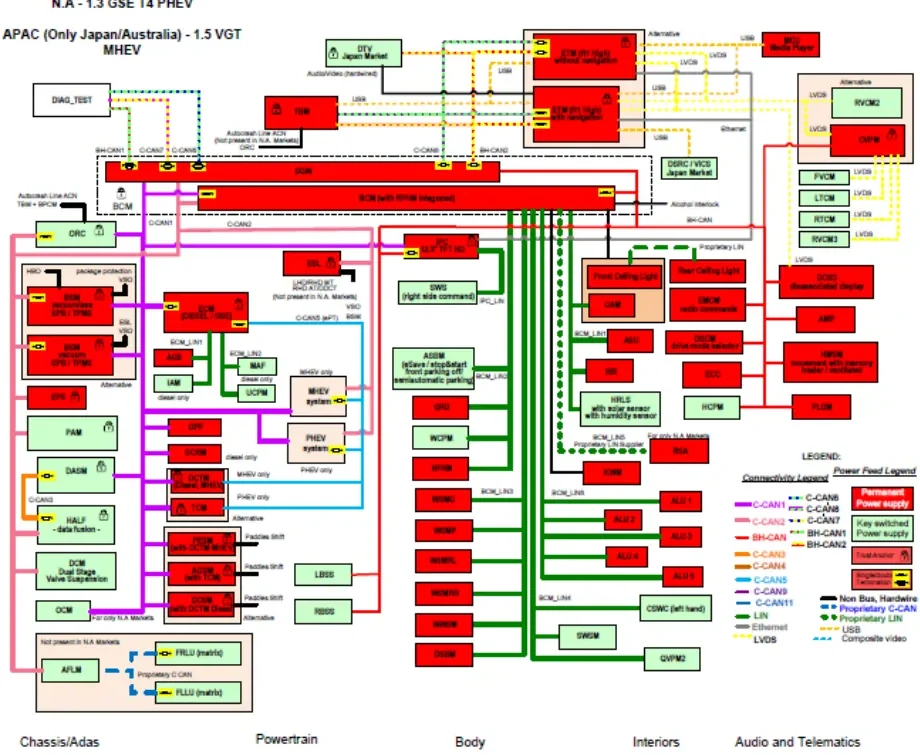
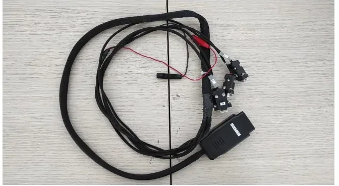
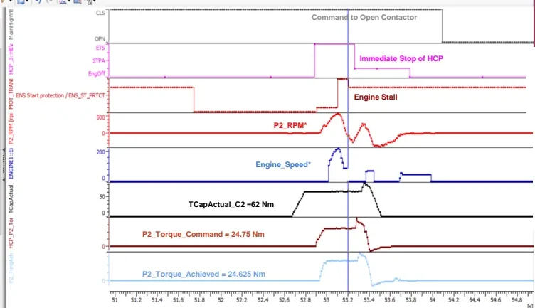

# First Level Analysis (FLA)

Welcome to one of the most hands-on roles in vehicle validation. When a test
car throws a warning lamp, refuses to start, or does something odd during a
charging session, someone has to be **first on the scene**: look at the data,
reconstruct what actually happened, and point the right specialists at the
right problem. That someone is the **First Level Analysis (FLA)** team — and
after this lesson, that someone could be you.

By the end of this article you will be able to:

- explain what FLA delivers (and, just as importantly, what it does *not*
  deliver),
- follow an issue from the first claim e-mail to a tracked, routed analysis,
- connect a laptop to a real vehicle through the diagnostic socket and see
  live bus traffic,
- read a fault code, look it up in the DTC Matrix, and turn raw signals into
  a root-cause hypothesis — the exact workflow the "Flying Doctor" uses in
  the field.

## What the FLA team actually does

The FLA team is a group of engineers whose primary task is to **analyze and
diagnose the vehicles under test**. Vehicles can show "non-normal behavior"
at any point in their life:

- during prototype construction,
- in the final production process,
- while accumulating mileage in reliability and quality testing,
- in after-sales operation, at the customer.

For every reported issue, FLA owes the organization three concrete things:

1. **A failure report** containing everything the second-level analysis
   needs: the data logger files, the Vehicle Scan Report (VSR), and the
   vehicle status as reported by the fleet support engineer.
2. **Clear ownership.** The issue gets routed to the right function inside
   the Propulsion organization — or to the E/E Vehicle Team when the problem
   sits outside the propulsion area. Second-level analysis only starts once
   someone clearly owns it.
3. **Tracking.** The issue goes into a dedicated Open Item List called the
   **FTT (Fault Tracking Table)**, where its evolution and any new
   occurrences are monitored.

!!! note "FLA is not the fixer"
    Your deliverable is a **well-defined, understandable report with a
    possible root cause and a correct solution path** — not the final fix.
    The actual software or hardware correction belongs to the second-level
    team that owns the function. Think of yourself as the detective, not the
    surgeon.

## How an issue reaches your desk

Analysis never starts ad-hoc. Every claim flows through the same pipeline,
driven by the **PVM (Program/Project Validation Manager)**:

Claims arrive from many directions, but they all land in the same issues
list:

- **Flying Doctors and Fleet Support Engineers** — engineers who test and
  diagnose vehicles at the customer site or on fleet activities (hot,
  winter, interoperability testing).
- **Fleet reports** — HMSR fleet report, RG / Captive / FFB fleet reports
  (via IMAN or ticket).
- **End-of-Line claims** from the plant.
- **OBD Scorecard / ControlTec** — data records uploaded from the fleet.
- **Extras** — durability fleets, NVH campaigns, reappear tests, and
  similar.

You are not alone in this. The teams around FLA each bring a different
angle: the **fleet team** exercises the vehicle the way a new customer
would and records what goes wrong; the **flying doctors** handle on-site
technical support, software updates and high-severity customer problems;
the **plant team** chases production-process issues; the **after-sales
team** looks after customer-facing technical support.

!!! tip "Delivery time"
    The target is to deliver the first-level analysis **within 24 hours** of
    the claim — or faster. Speed matters: second-level teams and fleet
    operations are blocked until the issue is characterized and routed.

## Your FLA toolbox

Good news: you already know most of these tools from MIL2 and MIL3. In FLA
you simply combine them for a new purpose — **reconstructing what the
vehicle did**:

| Tool / artifact | Role in FLA |
|---|---|
| **CANalyzer** | Reads CAN logs (`.blf`, `.asc`); visualizes signals to reproduce the claim; decodes diagnostic traffic |
| **INCA / MDA** | Reads ECU-internal measurement files (`.mdf`) recorded on fleet data loggers over CAN/XCP |
| **CDA / Dianalyzer** | Diagnostic tools: read DTCs, run RDI requests, I/O controls, routines, flash ECUs, produce the Scan Report |
| **VSR (Vehicle Scan Report)** | Snapshot of all ECUs' DTCs and identification data at the time of the issue |
| **DTC Matrix** | Per-ECU table describing every DTC: causes, symptoms, repair actions |
| **Topological scheme** | Which ECU sits on which CAN network, with termination resistors |
| **DBC / VF documents** | Decode raw frames into signals; link signals to vehicle functions |
| **SharePoint** | Backup and sharing of all analysis data |

## Know the vehicle before you touch the data

Here is a piece of mentor advice worth remembering: **you cannot interpret
signals from a vehicle you do not understand.** Before analyzing a claim on
a new program, an FLA engineer studies four things — illustrated here with
the MHEV (Mild Hybrid Electric Vehicle) P2.5 48 V vehicle from the case
study below:

1. **Propulsion system configuration** — on a P2.5 48 V mild hybrid, which
   machines can crank the engine (the 12 V P1f belt starter generator and
   the P2 electric motor in the transmission), and through which clutches
   the torque flows.
2. **Mechanical/electrical layout** — where the ECUs and actuators are
   physically installed.
3. **Network topology** — which ECUs share each CAN bus (see the figure
   below for a production example).
4. **Cooling system configuration** — which pumps and circuits cool the
   power electronics, battery and engine (over-temperature DTCs often trace
   back here).

The topological scheme divides the vehicle into domains — ADAS (Advanced
Driver Assistance Systems), Powertrain, Body, Interiors, Audio &
Telematics — and draws every CAN network as a colored line. The buses you
will use most are **C1, C2, BH and C5 (the ePT network)**. Notice how the
ePT network connects **only** propulsion ECUs. The scheme also marks each
bus's **termination resistor** as a small yellow rectangle inside the ECU
that hosts it: on the ePT bus the BPCM (Battery Pack Control Module) and
EVCU (Electric Vehicle Control Unit) carry the termination, on C1 it is the
BCM (Body Control Module) and EVCU. When you suspect a wiring problem, this
drawing tells you exactly which two ECUs to measure between.

## The diagnostic language you will speak every day

### DTCs: the vehicle's way of saying "something hurt"

A **DTC (Diagnostic Trouble Code)** is a fault recorded by an ECU
(Electronic Control Unit), encoded in **three bytes**: the first two
identify the component or system, the third identifies the symptom — the
type of failure. A DTC can be:

- **Active** — the fault condition is present right now;
- **Stored** — the fault is gone, but the ECU remembers it. Stored DTCs can
  be cleared with a memory-clear command.

### The three diagnostic services you will use constantly

| Service | Request SID | Positive response | What it does |
|---|---|---|---|
| **ReadDataByIdentifier (RDI)** | `0x22` | `0x62` | Reads an ECU parameter (e.g. engine speed) by its identifier |
| **InputOutputControlByIdentifier** | `0x2F` | `0x6F` | Commands a single actuator to perform one specific action |
| **RoutineControl** | `0x31` | `0x71` | Starts an on-board routine — a coordinated sequence involving several components |

There is a neat pattern here: the positive response is always the **request
service ID + 0x40** — send `0x22`, receive `0x62`. A **negative response is
`0x7F`**, followed by the original service ID and a negative response code.
Once you see this rhythm in a trace, diagnostic conversations stop looking
like hex soup.

### The DTC Matrix: from raw code to diagnosis plan

For each ECU, the **DTC Matrix** (DTC Criteria Matrix) is the reference
table that turns a raw code into a plan of attack. Its columns include:

- the DTC value in **hex and standard (J2012) format**, plus a description;
- **Warning indicator** — whether this DTC switches the MIL (Malfunction
  Indicator Lamp, the engine warning lamp) on;
- **Stored-DTC self-healing criteria** — how many key cycles without the
  fault the ECU needs to clear the code by itself;
- **Engineering notes** — e.g. which vehicle function and which signal of
  which message relates to the DTC;
- **Customer perception symptom** — what the driver actually feels or
  hears;
- **Possible causes** and **repair action** (a checklist);
- **Mature threshold** — the conditions under which the DTC sets;
- **De-mature criteria** — the conditions under which it is only stored
  (e.g. a signal below/above/equal to a threshold).

### PROXI and flashing: two field essentials

Two Dianalyzer functions will save you repeatedly in the field:

- **PROXI** — the vehicle configuration file listing every fitted feature
  (e.g. whether the car has adaptive cruise control). The Body Computer is
  the PROXI master and distributes the relevant part to each ECU. A wrong
  PROXI makes ECUs set DTCs for features that are not installed — if the
  PROXI declares adaptive cruise control on a car without it, you will
  chase "phantom" faults that do not exist.
- **Software update** — flashing an ECU needs three files: **IDX** (the
  electronic label with software/hardware data), **PRM** (the flash
  procedure guide) and **BIN** (the software itself).

## Plugging into the car

Everything starts with the physical connection. The **bridle** (breakout
harness) goes between the vehicle's **EOBD (European On-Board Diagnostics)
socket** and the **CANcaseXL** interface that talks to your laptop.

### EOBD pinout (Fiat/Stellantis vehicles)

The EOBD plug has 16 pins. Some assignments are fixed by law; others are
OEM-specific:

| Pins | Network | Note |
|---|---|---|
| 6 / 14 | **CAN 1 (C-CAN, diagnostic)** | Fixed by regulation — always the same |
| 12 / 13 | **CAN 2** | OEM-specific |
| 3 / 11 | **BH-CAN** | OEM-specific |
| 4 / 5 | Ground | |
| 16 | Battery +12 V | |
| — | CAN 5 (ePT powertrain) | **Not routed to the EOBD plug** |

The other end of the bridle carries **DB9 connectors** that plug into the
CANcase channels; on the DB9, pins **2 and 7** carry the CAN pair.

### CANcase and channel setup in CANalyzer

Each CANcase channel has its own **transceiver**, and every transceiver
works only within a certain speed range — so each DB9 must land on the
right channel, and each channel must be configured with the right bit rate.
In CANalyzer:

1. Open **Analysis & Stimulation → Database Management** and load the DBC
   (Database CAN) file for each channel (e.g. `CAN_C1_Vehicle` on channel
   1, the C-CAN DBC on channel 2, `CAN_C2_Vehicle` and `CAN_BH_Vehicle` on
   channel 3).
2. Associate the CANcase hardware channels with the CANalyzer channels and
   set each network's speed.
3. Start the measurement: if the trace shows messages being exchanged, the
   association is correct and the CANcase LED is **green**.

!!! warning "The Secure Gateway (SGW)"
    Modern vehicles carry an SGW (Secure Gateway) ECU that blocks
    unauthorized access to the buses. If the SGW is locked you will see
    **no messages at all** on the trace — even with perfect wiring and
    perfect settings. Unlock it first (from a diagnostic tool such as CDA
    or Dianalyzer's Cyber Security panel, or bypass it with an ETAS/ETK
    connection). In Dianalyzer, ECUs that answer are shown in blue; ECUs
    with an exclamation mark are not communicating.

### INCA: looking inside the ECU

While CANalyzer observes the *bus*, **INCA** observes the *inside of the
ECU*: it reads internal variables and changes **calibration values** at run
time through the **CCP (CAN Calibration Protocol)** or **XCP (Universal
Measurement and Calibration Protocol)** — CCP rides on classic CAN, XCP
also on extended CAN and other transports. This only works on
**development (open) ECUs**: with a production ECU you cannot touch
calibrations, and the only way to deploy new values is to **flash** the new
software version.

A field trick worth knowing: when a new software release only changes
calibration data, you can import the calibration from the reference page
into the working page instead of re-flashing everything. For bypassing the
SGW, the ETAS hardware connects to the vehicle through the **ETK**
interface (plus supply, Ethernet and the CAN lines to the EOBD plug).

## Case study: FTT#344 — chasing a "gearbox fault" that wasn't one

This is a real FLA analysis, end to end. The claim: a **transmission fault
("Avaria Cambio")** reported on a 48 V mild-hybrid vehicle. Follow the
reasoning — this is the template for almost every analysis you will ever
do.

### Step 1 — Check that you have data

Look up the vehicle's data records on ControlTec, download them, and verify
they are consistent with the VSR and the fleet engineer's report. No usable
data, no analysis.

### Step 2 — Read the DTC memory

Start from the ECU named in the claim — the **TCM (Transmission Control
Module)** — then read all the other powertrain ECUs. Result:

- **P0A3C** on the TCM, with `P2_Mode_Status = Idle/Failure`;
- **P0A3D** — `P2_GMG_OVER_TEMPERATURE` on the TCM.

### Step 3 — Consult the DTC Matrix

Look up both codes in the TCM's DTC Matrix: warning indicator behavior,
possible causes, mature/de-mature criteria. This frames your hypotheses
*before* you touch a single signal.

### Step 4 — Visualize the claim through signals

Now the core FLA skill. Your first goal is to see **on a graph what the
driver saw** — which lamp or message appeared on the IPC (Instrument Panel
Cluster), and at what exact moment — so the second-level owner gets a
precise point in time instead of gigabytes of uninteresting data. Around
the event, always collect the **boundary conditions**: Drive Ready vs.
Key-On, HEV mode, vehicle speed, engine speed, 48 V SOC (State of Charge),
gas pedal, brake pedal, shift lever position, and so on. They become
essential when the root cause is not found immediately and a reappear test
must be set up.

Reading the plot top to bottom reconstructs the whole event chain:

1. The vehicle was performing an **EM (Electric Machine) Low Power Start**
   — an engine crank performed by the P2 electric motor, used for example
   when the 48 V battery SOC is below **44.5 %**.
2. The P2 motor applied **24.75 Nm** of commanded torque
   (`P2_Torque_Command`), achieving **24.625 Nm** (`P2_Torque_Achieved`),
   with clutch 2 closed at `TCapActual_C2 = 62 Nm`. Through the
   intermediate gear ratio of **2.5** from P2 to the sub-transmission, that
   is roughly **60 Nm at the flywheel**.
3. The engine spun up (`Engine_Speed`, `P2_RPM` rise) but **never reached
   combustion** — the speed fell back to zero: an **engine stall**.
4. The **HCP (Hybrid Control Processor)** reacted with an immediate stop
   and commanded the **contactor to open**.
5. The opened contactor made the TCM set **P0A3C**, which lit the
   transmission lamp — the driver's claim.

So the transmission lamp and the TCM fault codes were **consequences**, not
the cause. The real cause was a failed engine start: the P2 torque was
simply not enough to spin the engine up to combustion.

### Step 5 — Draw the conclusion and route it

The FLA report stated the causal chain and assigned second-level ownership:

- **ECM (Engine Control Module)** — investigate the failed engine start:
  24.75 Nm from P2 (≈ 60 Nm at the flywheel) was insufficient to spin up
  the engine;
- **HCP** — confirm the torque command to P2 during the EM Low Power Start
  and the reaction to the stall.

### Step 6 — Track the resolution in the FTT

The FTT entry was updated as the second-level answers came in:

- HCP confirmed its reaction was by design: immediate stop and contactor
  opening after an engine stall → P0A3C + transmission lamp. The torque
  command to P2 is computed by HCP from the TCM signal `TCapActual_C2` (the
  torque capacity of the closing clutch 2).
- ECM confirmed the torque was insufficient to start combustion in that
  condition.
- **Fix**: a TCM software calibration change — a higher saturation offset,
  set as the minimum saturation during EM start, with more torque delivered
  at 200 and 400 engine rpm — raising the clutch-2 torque (and hence the P2
  torque computed by HCP) to avoid the stall. The issue was correlated to
  **warm conditions (coolant above 50 °C)** and planned for introduction
  via a dedicated PCR.

!!! note "Why boundary conditions mattered here"
    The failure only appeared in one specific situation — EM Low Power
    Start at low 48 V SOC with a warm engine. Without logging SOC, coolant
    temperature and the start mode, the second-level teams would never have
    reproduced it. Log generously; your future self will thank you.

## Watching diagnostics live in CANalyzer (PDX)

FLA often needs to watch a **diagnostic conversation** (tester ↔ ECU) live
or in a log. With a diagnostic description loaded (PDX/CDD — the packaged
diagnostic database), CANalyzer decodes it for you.

**Setup — diagnostic response decoding:**

1. In the diagnostic/PDX configuration, select the CAN channel carrying the
   C1 and diagnostic messages.
2. Select the interface variant (e.g. *Normal 29 Bit* for CAN C1 on the
   Atlantis platform).
3. Check the request/response IDs of the ECU under test (e.g. BPCM) in the
   **transport layer tab**, then confirm.
4. You can then add RDIs and other diagnostic parameters to a **Graphics
   window** with `Ctrl+R` and pick the signals you need — diagnostic
   answers plotted like normal CAN signals.

**Diagnostic trace — isolating tester traffic:**

1. Create a new trace window and filter only diagnostic messages.
2. In the pass filter, select the diagnostic messages you need.
3. Open the trace and filter for the IDs used in the filter; with *Toggle
   Display Mode* you see all Rx/Tx diagnostic messages, including the raw
   hex payloads, in timeline order.
4. Filter out the empty-data events to keep only the translated Tx/Rx
   messages (shown in green).

**Correlating with signals:** put markers in the trace at the diagnostic
events of interest, then in the Graphics window right-click the marker bar
and show the same markers — you can now read the exact signal values at the
moment a DTC was set or a routine was executed. This is how you tie "what
the tester asked" to "what the vehicle was doing".

## Your turn: hands-on exercise on the Tonale PHEV

Time to put it all together on a real car. **What you'll practice:** the
complete field workflow — connect, unlock, scan, interpret, repair, verify.

**Goal.** The vehicle (an Alfa Romeo Tonale PHEV, a plug-in hybrid) shows
an active **MIL** on the instrument cluster. Find the issue and fix it.

**Setup.** EOBD bridle, CANcaseXL, laptop with CANalyzer (license + DBCs
for each channel) and CDA.

**Steps.**

1. Connect the bridle to the EOBD plug and the DB9s to the correct CANcase
   channels.
2. In CANalyzer, load the DBCs per channel, associate hardware channels,
   set bit rates, and start the measurement. Verify messages flow on the
   trace (green LED on the CANcase).
3. In CDA, select the CANcase and the CAN network, **unlock the SGW**, and
   check the ECU list (blue = communicating).
4. Read the DTCs of all ECUs and produce a **Scan Report**.
5. Many DTCs were present, but only **two** had the MIL on: one on the TBM,
   one on the PCM (Powertrain Control Module). The PCM code was **P012D —
   Turbocharger/Supercharger Inlet Air Pressure Sensor 1 Circuit High**.
   The MIL points at the PCM code.
6. Open the PCM **DTC Matrix** for P012D: the possible causes listed *open
   circuit* or *short circuit* on the sensor wiring.
7. Physically inspect the turbocharger inlet pressure sensor — it was
   **disconnected**. Reconnect it.
8. Back in CDA: the DTC has turned from active to **stored**. Clear the DTC
   memory → **MIL off**.

**Expected result.** DTC cleared, MIL off, and a second Scan Report taken
after the fix to document the repair.

!!! tip "Field habits"
    - Always take a Scan Report **when the issue is present** and **after
      the fix** — the pair documents the repair.
    - If you cannot tell which DTC is the culprit, record a **log** and
      look for signals with unexpected values around the event.

**Common mistakes — nothing on the CANalyzer trace?** Work this checklist
before you panic:

1. Bridle not connected correctly to the EOBD plug.
2. DB9 plugged into the wrong CANcase channel.
3. SGW locked and no bus mirroring performed by the host.
4. DBCs loaded on the wrong CANalyzer channels.
5. CANcase ↔ CANalyzer channel association wrong.
6. Wrong bit rate configured for the network.

!!! success "Key takeaways"
    - FLA = receive, analyze, diagnose, deliver: characterize the issue
      with data (logs, VSR, fleet report), propose a root cause, and hand
      clear ownership to the second level — within ~24 h.
    - Every claim flows through the daily PVM meeting that sets priority
      and severity; every analysis is tracked in the FTT and archived on
      SharePoint.
    - Know the vehicle *before* the data: propulsion configuration, network
      topology (who terminates which bus), cooling, layout.
    - You now speak the diagnostic grammar: DTCs (active/stored), services
      `0x22` / `0x2F` / `0x31` answered by `+0x40` or `0x7F`, the DTC
      Matrix columns, PROXI alignment, IDX/PRM/BIN flash files.
    - Vehicle access is a checklist, not a mystery: EOBD pins 6/14 (C1),
      12/13 (C2), 3/11 (BH), DB9 pins 2/7, correct CANcase channel and bit
      rate — and unlock the SGW or you will see nothing.
    - The FTT#344 chain — claim → DTCs → signal visualization → boundary
      conditions → root cause → calibration fix — is your template for
      every future analysis. You have everything you need to run one
      yourself.

!!! tip "Where this leads"
    The tools used here have their own lessons:
    [CANalyzer](../../mil2/canalyzer/index.md),
    [Diagnosis](../../mil2/diagnosis/index.md),
    [RDI testing](../../mil2/rdi-testing/index.md) and
    [INCA](../../mil3/inca/index.md). The processes around FLA continue in
    [Diagnosis Process](../diagnosis-process/index.md) and
    [Troubleshooting](../troubleshooting/index.md).
