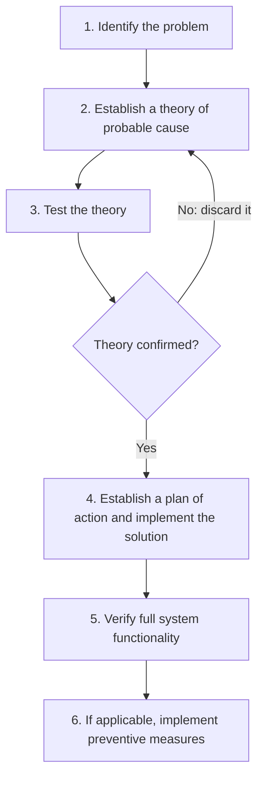
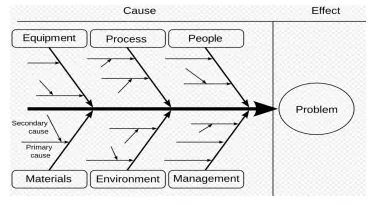
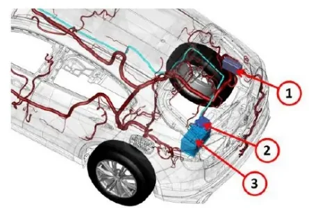

# Troubleshooting Principles

Troubleshooting is where the skills from the previous modules come together.
Reading CAN traces, flashing ECUs and running HIL test cases all serve one
purpose: finding the cause when a vehicle or a rig misbehaves. Troubleshooting
is a learnable method, not an innate talent.

By the end of this article you'll be able to:

- explain what separates systematic troubleshooting from guessing,
- run the six-step troubleshooting loop on any defect, electrical or software,
- locate a parasitic battery drain with a multimeter and a fuse box,
- analyze a real fault investigation — a torque-security DTC on a hybrid
  prototype — and identify the troubleshooting method applied in it,
- practice the method on two introductory exercises.

## What troubleshooting actually is

Troubleshooting is problem solving applied to something that *was* working and
suddenly stopped. Three properties define it:

- It is a **logical, systematic search for the root cause** — not a search for
  a plausible-sounding fix.
- Finding the most likely cause is a **process of elimination**: you knock out
  candidate causes one by one with tests, instead of arguing for your
  favorite.
- It is **not finished until you have confirmed** that the fix actually
  restores the system to its working state.

!!! note "Think first, act later"
    The lesson opens with Einstein's remark: given one hour to solve a
    problem, spend 55 minutes thinking about the problem and 5 minutes
    thinking about solutions. Get the problem statement wrong and every
    activity that follows is compromised, no matter how fast you work.

## Think like an engineer, not a magician

When a system fails, a common first hypothesis is whatever changed most
recently. That is a reasonable starting point — but remember the principle that
**correlation does not imply causality**. Two events happening together, or
resembling each other, does not make one the cause of the other. Jumping from
coincidence to causation is what the lesson calls *magical thinking*, and it is
the single most common failure mode of inexperienced troubleshooters.

The opposite habit is **critical thinking** — analyzing facts to form a
judgement. On the bench, that means:

- base your theory of the cause on **facts**, as much as you can gather;
- a theory is good if you can **test it** — even a wrong-but-testable theory
  moves the investigation forward;
- a disproven theory is a normal step: discard it and build the next one.

### Occam's razor: simplest first

Start from the **simplest and most probable** explanations. The old
problem-solving principle known as Occam's razor — "entities should not be
multiplied without necessity" — translates into workshop language as: *the
simplest solution is most likely the right one*. Before you suspect a rare
software race condition, check the fuse, the connector, the power supply and
the ground. In practice, these simple causes account for a large share of
faults.

### Defining the problem: Descartes at the bench

Getting step 1 right — *defining the issue* — is where most investigations are
won or lost. The lesson borrows Descartes' four rules, and they map remarkably
well onto engineering work:

| Rule | What it means at the bench |
|---|---|
| **Doubt** | Never accept anything as true without specific evidence. Don't jump to conclusions "on the spot", no matter how tempting. |
| **Simplification** | Divide the problem into easy-to-solve sub-problems, so you can narrow down each difficulty separately. |
| **Focus** | Solve the simpler parts first, then move to the complex ones. |
| **Completeness** | Do not omit anything: critically examine all aspects and all related sub-problems. |

## The six-step troubleshooting loop

The standard procedure is a loop, not a line:

Two points deserve emphasis:

- **Step 1 is where most investigations go wrong.** "The battery is dead" and
  "the battery is being drained overnight by an unknown consumer" lead to
  completely different investigations. Write the problem statement carefully.
- **Step 6 is what separates repair from engineering.** Fixing the instance in
  front of you is necessary; adding a preventive measure — a design change, a
  new test case, a diagnostic check — is what stops the issue from coming back
  on the next vehicle.

## Habits that make you faster

Beyond the formal method, the lesson collects advice from people who do this
every day:

- **Share your ideas** with everyone involved in the issue. If you can't get
  to the solution yourself, help someone else get there — what matters is a
  solution in a reasonable time, not who finds it.
- If someone else found the solution, make sure you **fully understand how it
  works**. Ask questions until the reasoning is clear.
- **Carefully examine the data you already have.** Don't wait for "perfect"
  data — the answer is often already sitting in the first log you received.
  It's a matter of learning to read it.
- When an issue requires testing at **HIL or on the vehicle, be present during
  the test** whenever possible, to be sure it is executed correctly. You need
  to trust your data.
- **Know the system architecture.** If you don't know how it works, it's
  unlikely you'll know how to fix it.
- **Engagement with the problem matters.** Sustained, genuine interest in the
  issue tends to produce the best results.

!!! tip "Structuring the cause search: the fishbone diagram"
    When a problem has many possible causes, an **Ishikawa (fishbone)
    diagram** helps you enumerate them systematically instead of fixating on
    the first one: the effect sits at the head, and the bones group candidate
    causes by family — equipment, process, people, materials, environment,
    management — split further into primary and secondary causes.

    

## Case study 1 — a battery that keeps dying

A battery that repeatedly goes flat is a **symptom**, and a suitable first
troubleshooting case because the candidate causes are few and concrete:

- **battery wear** (the battery itself no longer holds charge);
- a **mismatch of the charge/discharge ratio** when charging from the
  alternator;
- **alternator failure**;
- **starter malfunction** or poor operation;
- **external leakage currents** — something on the vehicle draws current while
  it is parked.

The power distribution hardware involved in the measurement:

1. Front PDC (Power Distribution Center)
2. Battery fuse box
3. Battery

### Goal

Measure the leakage (parasitic) current and isolate the circuit that is
draining the battery while the vehicle is parked.

### Setup

Prepare the vehicle first — skipping these steps can lock you out of the car:

1. Open the hood and **switch off all consumers** — radio, exterior and
   interior lights.
2. Remove the key from the ignition and close the doors.
3. **Leave the windows open.** While you measure, the battery will be
   connected and disconnected, and the central locking may trigger — open
   windows guarantee you keep access to the car.

Equipment:

- a **multimeter with a DC measuring range of at least 10 A**;
- alligator test clips for a convenient series connection;
- an 8 or 10 mm box/open-end wrench (vehicle-dependent);
- work gloves.

!!! tip "Clamp meters"
    A DC-capable clamp meter is more convenient — nothing to disconnect, just
    clamp it around the cable. Two caveats: it must measure **DC** current
    (most cheap clamp meters are AC-only, and the DC-capable ones cost more),
    and it is less precise and can pick up parasitic coupling. Zero it with
    the "Zero" button before reading. Clamp around either the positive or the
    negative battery cable, including any extra wires bolted to the terminal.

### Steps: the fuse-pull method

Fuse and relay boxes live under the hood, but additional boxes may sit near
the dashboard, under the rear seat, or in the boot. To find the excess
consumer:

1. Connect the multimeter exactly as for the leakage measurement.
2. **Remove each fuse one at a time**, reinsert it, and watch the multimeter
   reading.
3. When pulling one fuse produces a significant (and acceptable) drop in
   current, consult the vehicle's technical documentation to see what that
   fuse feeds, then test those devices in detail.
4. If **all fuses check out but the leakage persists**, investigate the
   devices that are *not* fuse-protected: the **alternator** and the
   **starter**.

This is the elimination principle in its purest form: each pulled fuse is a
tested theory, and the search space shrinks circuit by circuit.

## Case study 2 — torque security check fail (DTC P061B)

This case study covers a software/safety issue. It occurred on a **P1P4
hybrid prototype** at the Melfi plant, with the vehicle on dynamometer rolls.

**Symptom and customer impact:**

- DTC **P061B** — an internal torque calculation error detected by the PIM
  (Powertrain Interface Module);
- the **contactor opens and the vehicle shuts down**; it can be restarted
  after a key cycle.

**Fault logic:** the PIM continuously checks that the estimated output torque
(the sum of estimated front and rear axle torque) stays within calculated
minimum and maximum limits, and that the driver torque request from the ECS is
not negative at low vehicle speed. When either check fails, the torque
security monitor trips.

### First analysis

The logged data shows:

- vehicle moving on rolls at around **20 km/h** in **hybrid mode**;
- the failure attributed to the **MtrB (P4 axle motor) torque**;
- it occurs **during the gear selection transition from D to N**.

### Second analysis

Digging into the wheel speeds reveals the real trigger: front and rear wheels
report a **speed delta of 12 km/h** (front ≈ 30 km/h, rear ≈ 18 km/h) with
**ESC intervening**, exactly while the D → N change happens. That combination
drives the MtrB torque up, and the resulting **output torque estimate
overshoots the maximum threshold**, tripping the security check.

**Action required:** reproduce the scenario at HIL — a controlled environment
where the same roll-speed mismatch and D→N transition can be replayed
repeatedly and the controller behavior captured precisely.

!!! warning "Read this case as the method, not just the facts"
    Notice the shape of the investigation: the first theory ("MtrB torque
    fails") was *refined*, not accepted — the team went back to the data,
    correlated wheel speeds, ESC activity and the gear transition, and only
    then formed a testable reproduction plan. That is the
    identify → theory → test loop applied to a real DTC. Reproducing a fault
    at HIL before touching the fix is exactly the kind of work you practiced
    in the [HIL Users](../../mil3/hil-users/index.md) lessons.

## Try it yourself

The following two exercises from the lesson practice the method. For each
one, write down the checks **in the order you would perform them** — simplest
and most probable first.

### Exercise 1 — the starter does not crank

**Goal:** diagnose a no-crank condition using electrical checks only.

**What you'll practice:** working from source to load, and preferring
voltage-drop measurements under load over visual inspection.

> Trying to start the engine, the starter does not start. What electrical
> checks do you do?

A solid answer works from the source toward the load:

1. **Battery**: open-circuit voltage, then voltage under cranking load (a
   healthy battery that collapses under load is worn out — see Case 1).
2. **Connections**: battery terminals, engine and chassis ground straps,
   starter B+ cable — clean, tight, corrosion-free. Voltage-drop measurements
   under load beat visual inspection.
3. **Control side**: does the starter relay receive its command (ignition
   switch / start request through the relevant ECU, immobilizer OK, clutch or
   brake interlock satisfied)? Check the relay itself — it is in the fuse and
   relay box.
4. **Starter motor**: solenoid click present or not; if power and ground are
   good at the starter and it still does not turn, the starter itself is
   faulty.

### Exercise 2 — ECM absent on the C-CAN

**Goal:** find out why the ECM (Engine Control Module) is silent on the
C-CAN powertrain bus.

**What you'll practice:** applying Occam's razor to a network problem — power
and ground before bus physics, bus physics before suspecting the ECU.

> In key-on conditions, the ECM does not communicate on C1 (C-CAN). What do
> you check?

1. **Is the ECU alive at all?** Power supplies (permanent +12 V, ignition
   +15), grounds, and the ECU's fuses. A node with no power cannot transmit —
   apply Occam's razor before suspecting the bus.
2. **The bus wiring to the node**: continuity of CAN-H and CAN-L from the ECM
   connector to the bus, and the **termination** — the C-CAN expects 120 Ω at
   each end, i.e. about **60 Ω measured between CAN-H and CAN-L** with power
   off. A missing termination or an open branch isolates nodes.
3. **Bus health with a tool**: connect CANalyzer/CANoe (or an oscilloscope on
   CAN-H/CAN-L) and look for *any* traffic and for error frames. Other nodes
   present and error-free while the ECM is silent points back to the ECM or
   its branch; bus-off symptoms point to wiring or a disturbed node.
4. **The ECM itself**: only after power, ground and bus physical layer are
   proven, suspect the ECU hardware or a corrupted flash — this is where the
   diagnostic techniques from [Diagnosis](../../mil2/diagnosis/index.md)
   (reading DTCs from other nodes, attempting a diagnostic session on the
   diagnostic CAN) come in.

!!! success "Key takeaways"
    - Troubleshooting = systematic elimination of candidate causes, ending
      only when the fix is **verified** and, where possible, a **preventive
      measure** is in place.
    - Correlation is not causation: treat theories as hypotheses to be tested.
      A disproven theory is still progress, as long as it was falsifiable.
    - Simplest first (Occam): fuse → connector → power/ground before software.
    - Descartes' four rules — doubt, simplification, focus, completeness —
      turn "define the issue" into a concrete checklist.
    - The six-step loop: identify → theory → test → (back to theory if
      wrong) → plan & implement → verify → prevent.
    - Parasitic drain is found by measuring leakage current (multimeter,
      ≥ 10 A DC range, or a DC clamp meter) and pulling fuses one by one;
      remember the unfused suspects: alternator and starter.
    - The P061B case was cross-domain: the fault came from the *interaction*
      of wheel-speed mismatch, ESC intervention and a D→N transition, and the
      fix starts with reproducing it at HIL.

!!! tip "Where this leads"
    Troubleshooting feeds directly into
    [First Level Analysis](../first-level-analysis/index.md), where you triage
    fleet and plant issues under time pressure, and builds on the
    [Diagnosis Process](../diagnosis-process/index.md) for how faults are
    detected, stored and validated in the ECU.
