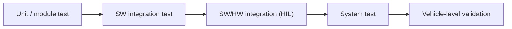

# Software Verification

Verification answers one question: **"did we build the product right?"** — does
the software, as implemented, actually do what its specification says? This is
the opening lesson of the MIL4 module, where everything you practiced earlier
(requirements, test cases, HIL rigs, diagnostic tools) comes together into the
discipline of proving that an ECU behaves as specified before it ever reaches a
vehicle.

## Verification vs. validation

The two words are often confused; keep them separate:

| | Verification | Validation |
|---|---|---|
| Question | Did we build it **right**? | Did we build the **right thing**? |
| Reference | Requirements and design specs | Real user / customer needs |
| Typical evidence | Test results vs. expected values | Behavior in the real vehicle/context |
| When | Continuously, at every V-model level | Late, on the integrated product |

Both feed the two arms of the [V-model](../../mil1/v-cycle/index.md): the left
arm decomposes requirements into design, the right arm climbs back up through
verification levels — unit, integration, system — each one traced to the
requirements level that produced it.

## What gets verified, and at which level

Software verification is not one activity but a ladder:

- **Static verification** — reviews, coding-standard checks (e.g. MISRA),
  static analysis. Finds defects without executing the code.
- **Dynamic verification** — executing the software against test cases and
  comparing actual vs. expected outputs: on the PC (MiL/SiL), on the target
  processor (PiL), and on real hardware in the loop ([HIL](../../mil3/hil-users/index.md)).

Every dynamic test rests on the artifacts you built in MIL3: the
[requirements](../../mil3/requirements/index.md) define *what* must hold, and
the [test cases](../../mil3/testcases/index.md) define *how* each requirement
is stimulated and checked. A verification activity without requirement
traceability proves nothing — an untraceable pass is just an observation.

## The deliverables of a verification cycle

A professional verification cycle produces:

1. a **test specification** linked requirement-by-requirement,
2. an **executable test environment** (automation, not manual poking),
3. a **test report** with pass/fail verdicts and coverage,
4. **defect reports** for every deviation, fed back to development.

!!! note "Why this matters downstream"
    When a defect escapes verification, it resurfaces later as a field problem.
    The remaining MIL4 lessons — [Validation](../validation/index.md),
    [Diagnosis Process](../diagnosis-process/index.md),
    [Troubleshooting](../troubleshooting/index.md) and
    [First Level Analysis](../first-level-analysis/index.md) — are about
    catching and containing exactly those escapes. Solid verification is the
    cheapest defect filter in the whole chain.

!!! tip "How to work through MIL4"
    Take the lessons in order: **Verification → Validation → Diagnosis Process
    → Troubleshooting → First Level Analysis**. The first two build the
    "prove it works" mindset; the last three build the "find out why it
    doesn't" workflow you will use daily on HIL rigs and test vehicles.

!!! success "Key takeaways"
    - Verification = conformance to specification; validation = fitness for
      real use. Never mix them up.
    - Verification happens at every V-model level, from static checks to HIL
      system tests, always traced back to requirements.
    - The output of verification is evidence: specifications, automated runs,
      reports and defects — not opinions.
