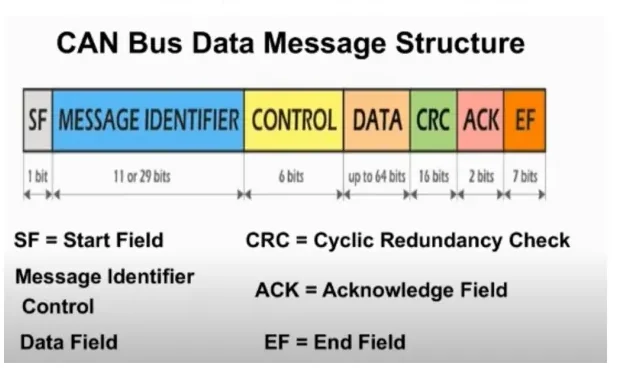
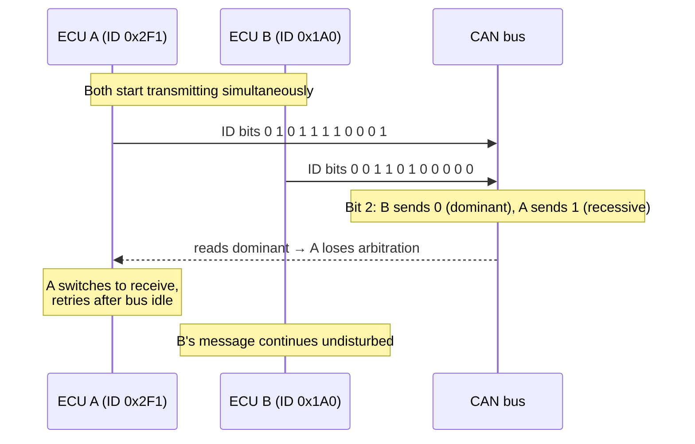
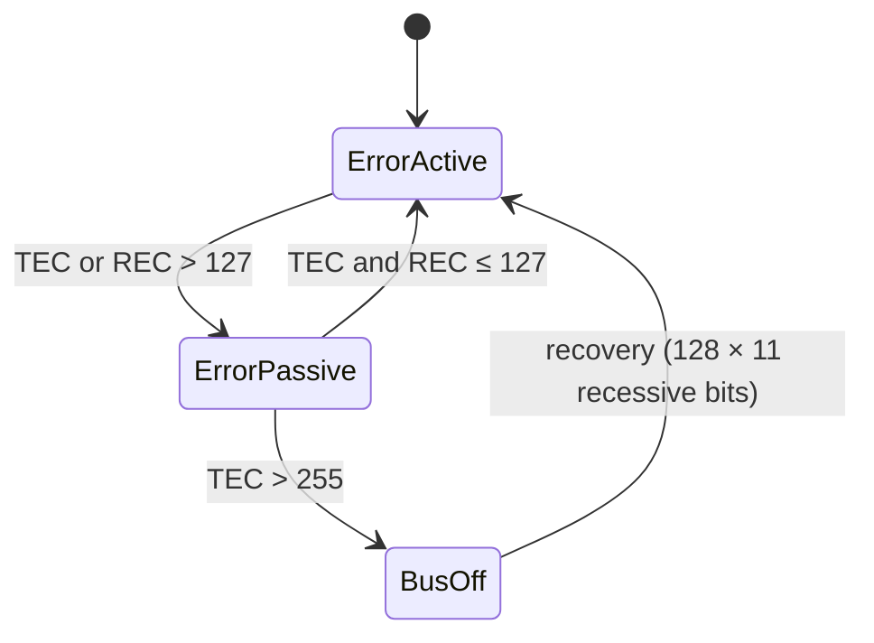
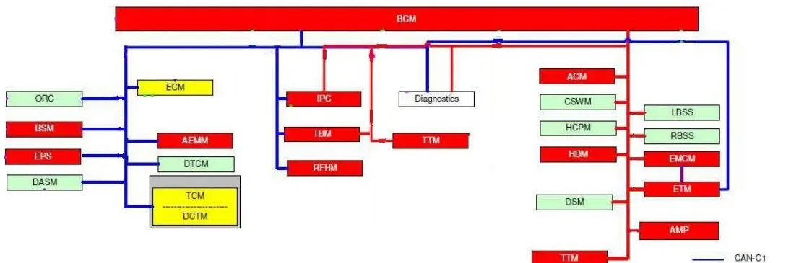
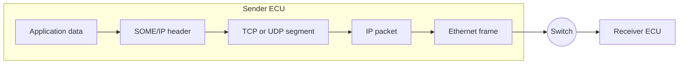

# CAN, LIN & Automotive Ethernet

Modern vehicles contain dozens of electronic control units (ECUs) that must
exchange data constantly. Instead of point-to-point wiring between every pair of
ECUs, vehicles use **shared communication buses**. This article covers the three
technologies you will meet throughout the bootcamp:

- **CAN** — the workhorse for powertrain, chassis and body communication
- **LIN** — the cheap, slow bus for simple actuators and sensors
- **Automotive Ethernet** — the high-bandwidth backbone for cameras, ADAS and
  software-defined vehicles

## CAN — Controller Area Network

CAN is a **broadcast** bus: every message is sent to the whole network, and each
node decides for itself which messages to read. It was designed for
*deterministic* communication in distributed systems and provides:

- message prioritization with guaranteed maximum latency for the highest-priority
  message,
- multicast communication with bit-oriented synchronization,
- system-wide data consistency (a message is either accepted by all nodes or by
  none),
- multi-master access — any node may start transmitting when the bus is free,
- sophisticated error detection, signalling and automatic retransmission of
  corrupted messages,
- fault confinement: defective nodes switch themselves off the bus.

Typical CAN speeds range from **20 kbit/s to 1 Mbit/s**; the achievable rate
depends on bus length and transceiver speed.

### Physical layer

Each node connects to the two-wire differential bus (CAN-H and CAN-L) through a
**transceiver** — a transmitting/receiving amplifier that converts between the
controller's logic levels and the bus's electrical levels.

Two electrical rules matter in practice:

- **Termination.** To avoid signal reflections, both ends of the bus carry a
  120 Ω termination resistor (per ISO 11898 for high-speed CAN), and stub lines
  to nodes are kept short.
- **Dominant vs. recessive bits.** CAN uses a differential voltage: a small
  difference between CAN-H and CAN-L is the *recessive* state (logic 1); a
  clearly driven difference is the *dominant* state (logic 0). Because dominant
  bits electrically override recessive ones, a node transmitting a recessive bit
  while another transmits a dominant bit will read back *dominant* — this is the
  physical basis of arbitration.

The maximum bus length and the bit rate are directly coupled: the bit time must
be long enough for the signal to propagate to the farthest node and back within
one bit, so long buses force lower bit rates.

### The CAN data frame

A CAN **data frame** carries up to 8 bytes of payload (64 in CAN FD) with this
layout:

| Field | Size | Purpose |
|---|---|---|
| SOF (start of frame) | 1 bit | Synchronizes all nodes |
| Identifier | 11 bits (standard) or 29 bits (extended) | Identifies the *content*, sets priority |
| Control | 6 bits | 2 reserved bits + 4-bit DLC (payload length in bytes) |
| Data | 0–8 bytes | The payload |
| CRC | 15 bits + delimiter | Integrity check over SOF…data |
| ACK | 2 bits | Receivers pull the slot dominant to acknowledge |
| EOF | 7 bits | End of frame |
| Interframe space | ≥ 3 bits | Bus idle before the next frame |

CAN frames carry **no sender/receiver addresses** — the identifier describes the
*meaning* of the data (e.g. "vehicle speed"), and every node filters the
identifiers it cares about.

The other frame types are:

- **Remote frame** — asks the owning node to send the data frame with a given
  identifier; same format, empty data field, DLC set to the *requested* length.
- **Error frame** — transmitted by any node that detects an error, forcing all
  nodes to discard the current message.
- **Overload frame** — flow control, asking for extra delay between frames
  (rarely seen in practice).

### Arbitration: who wins the bus

When several nodes start transmitting at the same time, they write their
identifiers onto the bus bit by bit, starting from the most significant bit.
Since dominant (0) overrides recessive (1), a node that sends a recessive bit but
reads back dominant knows it has lost and immediately stops transmitting — the
message with the **lowest identifier wins** without any bits being destroyed or
re-sent.

!!! warning "Priority is in the identifier"
    Low numeric identifier = high priority. When designing a network, assign the
    lowest IDs to the most safety- or time-critical messages (e.g. braking,
    steering) — a poorly allocated ID map can make a critical message
    systematically late on a loaded bus.

### Error detection and confinement

Every node monitors the bus while it transmits and applies five detection
mechanisms: **bit errors** (read-back mismatch), **stuff errors** (6 identical
bits in a row — CAN inserts an opposite bit after every 5 identical ones), **CRC
errors**, **form errors** (fixed-format fields with wrong values) and **ACK
errors** (nobody acknowledged).

Each node keeps a **Transmit Error Counter** and a **Receive Error Counter**
(+8 for a corrupted transmission, −1 for a successful one, with several
detailed rules). The counters drive a three-state machine:

- **Error active** — normal operation; the node sends active error flags and
  disrupts the faulty frame immediately.
- **Error passive** — the node sends passive error flags and waits longer before
  retransmitting, so it disturbs the bus less.
- **Bus off** — the node disconnects itself from the bus until a recovery
  sequence completes. This is what prevents one broken ECU from killing the
  whole network.

### DBC files: giving raw frames meaning

A raw CAN trace is just identifiers and bytes. The network specification that
maps them to physical signals is the **DBC (Database CAN)** file. Each network
has its own DBC listing:

- every ECU on the bus,
- every transmitted/received message with its identifier, DLC and sending mode
  (cyclic, on event, …),
- the signal layout inside each message's data field: start bit, length, byte
  order, scaling factor and offset, unit, and value tables.

You will use DBC files constantly in MIL2 (CANalyzer/CANoe) — they are what turns
`0x1A0: 3F 20 …` into "Vehicle speed = 128.5 km/h".

### CAN in the vehicle

A real vehicle carries several CAN buses separated by bandwidth and criticality:

| Bus | Bit rate | Typical content |
|---|---|---|
| C-CAN | 500 kbit/s | Powertrain/EOBD-relevant ECUs |
| BH-CAN | 125 kbit/s | Body high |
| B-CAN | 50 kbit/s | Body, comfort |
| CAN FD | up to ~5–15 Mbit/s data phase | High-bandwidth ECUs |

The **diagnostic socket** (EOBD/OBD-II connector, usually near the steering
column) is your physical access point: 16 pins, with pins 6/14 for the
diagnostic CAN, pins 4/5 ground and pin 16 battery +12 V.

## LIN — Local Interconnect Network

LIN exists because CAN is overkill (and too expensive) for a window motor or a
rain sensor. It is a **single-wire** serial bus for non-critical subsystems:

- **single master, up to 16 slaves** — the master controls all communication,
- up to **19.2 kbit/s** over up to 40 m,
- variable payload of 2, 4 or 8 bytes,
- checksum error detection and defective-node detection,
- 12 V operation (battery level, not differential): dominant ≈ 0 V is logic 0,
  recessive ≈ +12 V is logic 1. The master pulls the bus up through 1 kΩ, slaves
  through ~30 kΩ.

### Frame structure

Every LIN frame is initiated by the master with a **header**; a slave (or the
master itself) then sends the **response**:

| Part | Sender | Contents |
|---|---|---|
| Break | master | ≥ 13 dominant bits — marks frame start |
| Sync field | master | byte 0x55 — slaves synchronize their clocks to it |
| Identifier | master | 6-bit frame ID (0–59 normal, 60–61 diagnostic) |
| Data | slave | 1–8 data bytes |
| Checksum | slave | inverted sum over the data bytes |

On receiving a header, each slave checks the ID: one of them publishes the
response, the others may subscribe to it.

### Schedule tables and frame types

The master's **schedule table** (defined in the network's **LDF — LIN
Description File**, the LIN counterpart of a DBC) fixes the sequence and time
grid of the frames. This guarantees that the bus is never overloaded and that
every signal gets its periodicity. Frame types include:

- **Unconditional frames** — the normal cyclic communication; the master sends
  the header in its slot and the designated slave fills in the data.
- **Sporadic frames** — sent only when the master knows a slave has updated
  data.
- **Diagnostic frames** — IDs 60/61; a master request with first data byte 0 is
  the *go-to-sleep* command.

LIN networks **sleep and wake** to save power: the master can force all slaves
to sleep, and any slave can wake the bus by holding it dominant (the wake-up
break), which the master detects.

Typical LIN applications: power windows, door locks, seats, mirrors, wipers,
seat heaters, climate flaps, interior lights, steering-wheel buttons — e.g. a
body control module as master with defrost, air-recirculation and air-quality
slaves.

## Automotive Ethernet

CAN and LIN top out far below what cameras, radar fusion and over-the-air
updates need. Automotive Ethernet brings standard IP networking into the
vehicle, with 100 Mbit/s–1 Gbit/s over a *single* unshielded twisted pair
(100BASE-T1 / 1000BASE-T1) and a switched (star) topology instead of a shared
bus.

Key differences from CAN thinking:

- **Addressing instead of broadcast filtering** — frames carry source and
  destination MAC addresses; switches forward traffic only where it is needed.
- **Encapsulation stack** — application data is wrapped in TCP or UDP
  (transport), then IP (network), then Ethernet (data link) — the OSI layers you
  know from IT, minus the session/presentation layers.
- **Service-oriented communication** — with **SOME/IP** (and its service
  discovery, SOME/IP-SD) ECUs offer *services* that others subscribe to
  (publish/subscribe with events and notifications), rather than broadcasting
  fixed signal layouts.

Protocols you will meet later that ride on this stack: **DoIP** (diagnostics
over IP), **FOTA** (firmware over the air), **gPTP** (time synchronization),
**AVB/TSN** (audio-video and time-sensitive traffic).

## Choosing the right bus

| | LIN | CAN | Automotive Ethernet |
|---|---|---|---|
| Bandwidth | 19.2 kbit/s | 125 k–1 Mbit/s (FD: more) | 100 M–1 Gbit/s |
| Wiring | 1 wire | 2-wire differential | 1 twisted pair, switched |
| Access scheme | master/slave | multi-master, CSMA/CD+AMP (arbitration) | switched, full duplex |
| Cost per node | lowest | low | higher |
| Typical use | body actuators/sensors | powertrain, chassis, body | cameras, ADAS, backbones |

!!! success "Key takeaways"
    - CAN = broadcast, content-addressed by identifier; lowest ID wins
      arbitration because dominant beats recessive.
    - CAN protects itself: 5 error types, error counters, and the
      active → passive → bus-off confinement ladder.
    - DBC files decode raw CAN frames into named, scaled physical signals.
    - LIN = cheap single-wire master/slave bus driven by LDF schedule tables.
    - Ethernet brings IP networking in-vehicle: MAC addressing, switches,
      TCP/UDP, SOME/IP services, DoIP diagnostics.

!!! tip "Where this leads"
    You will read live CAN traffic in [CANalyzer](../../mil2/canalyzer/index.md),
    script node behavior in [CAPL](../../mil2/capl/index.md), and diagnose ECUs
    over these buses in the [Diagnosis](../../mil2/diagnosis/index.md) lessons.

---

## Source material

This article was distilled from the academy lesson materials:

- :material-file-pdf-box: [Academy Kineton Format - Network CAN LIN](../../assets/mil1/CAN_LIN/Academy_Kineton_Format___Network_CAN_LIN.pdf) — PDF, 2.2 MB
- :material-file-pdf-box: [Ethernet old version](../../assets/mil1/CAN_LIN/Ethernet_old_version.pdf) — PDF, 1.5 MB
- :material-file-pdf-box: [eth pres rev1](../../assets/mil1/CAN_LIN/eth_pres_rev1.pdf) — PDF, 1.9 MB
