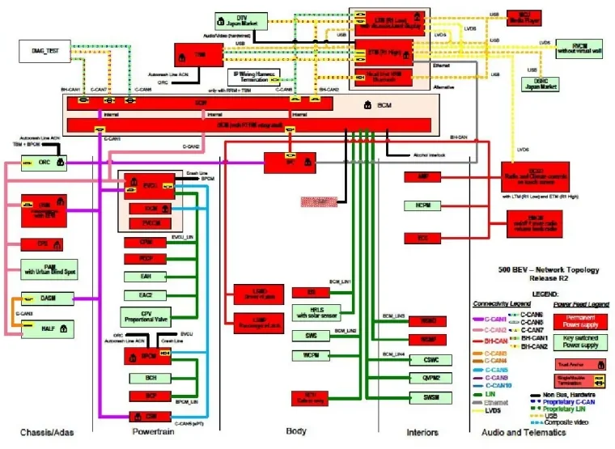
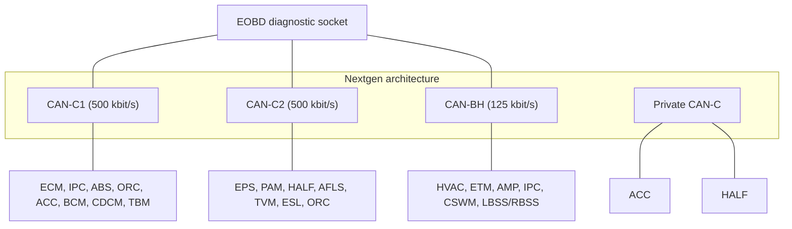
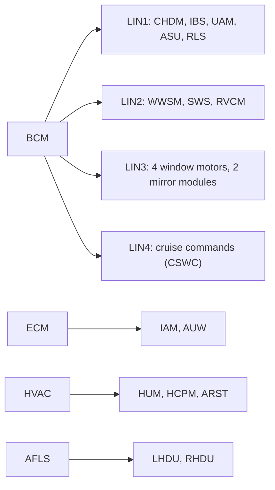
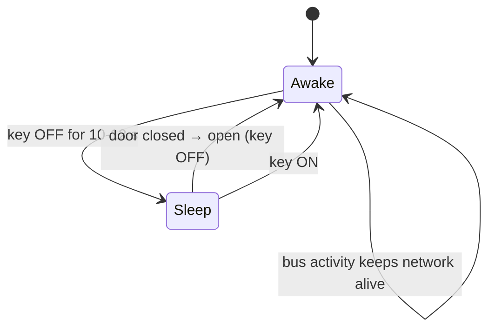
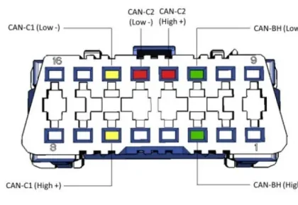
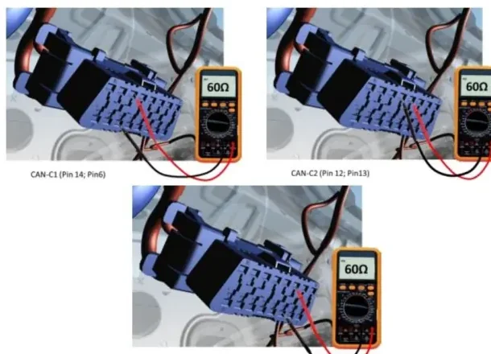

# Vehicle E/E Architecture

A modern car is a distributed computer network on wheels: an average new vehicle
carries **more than 40 electronic control units (ECUs)**, about **five miles of
wiring** and **over 10 million lines of software**, with electronics making up
close to **40% of the vehicle's content** — and the share keeps growing. The
**E/E (Electrical/Electronic) Architecture** is what holds all of this together:
it is the heart of the functional integration of the vehicle, distributing
power, signals and functions to every E/E system on board.

The pressure behind this growth comes from four directions:

- fuel economy and electrification,
- safety and driving assistance,
- information, comfort and convenience,
- navigation and connectivity.

## What the E/E architecture covers — and what it does not

The architecture work sits **above** the individual components and **before**
the vehicle-level application tasks. It defines:

- **Technologies and standards** — network architecture, software architecture,
  diagnosis standards and hardware standards.
- **Components** — body electronic modules, power distribution units, wiring
  topology and connectors, plus the analysis needed to add or remove
  components.
- **Interfaces to all E/E systems** of the vehicle.

It explicitly does **not** include the downstream engineering activities that
consume the architecture: packaging and wiring layout of a specific vehicle,
development and testing of new application software, and tuning that software
to reach performance targets.

!!! note
    Think of the E/E architecture as the "constitution" of the vehicle's
    electronics: it fixes the rules, the partitions and the interfaces. What
    each ECU then *does* inside those rules is application work.

## The documents that define an architecture

An E/E architecture is not one drawing — it is a set of coordinated
specifications:

| Characteristic | What it defines |
|---|---|
| EEA standards | Engineering standards: EMC, electrical systems, networks, diagnostics, vehicle configuration management, development processes |
| Network topology | The overall communication network: which ECUs sit on which bus, and the type of power feed each ECU uses |
| SLA (Sense / Logic / Actuation) | How features and functions are distributed, including their inputs and outputs |
| Electrical interface | The hardware electrical interfaces between ECUs and switches, sensors, actuators and other ECUs |
| Network management | Wake-up and sleep management of the networks (related to AUTOSAR) |
| Diagnostic requirements | Base diagnostic specs, flash bootloader, diagnostic services and protocol |
| Vehicle Configuration Management | How vehicle-specific content (standard and optional features) is communicated to the ECUs, reducing part-number complexity |
| Network database | CAN and LIN message IDs, data length, timing, and signal content/location (the DBC/LDF world) |
| VF (Vehicle Functions) | Detailed description of the functionality, exchanged signals and algorithms of each feature or sub-feature |

Electrical interfaces (sensors, pedal assembly, starter), ECU re-programming,
cyber-security level, AUTOSAR compliance and the standard CAN map all hang off
this same definition.

## Key drivers of architecture development

Four forces decide when an architecture must evolve:

1. **Integration and function complexity.** The volume and complexity of new
   requirements grows at an exponential rate — every new feature adds signals,
   messages and cross-ECU interactions.
2. **Bus load capacity.** Current networks already run at **50–60% bus load**
   on the C-CAN. To guarantee robust communication (no missed messages, no
   latency problems), networks are kept below a **65–70%** threshold. New
   features must be budgeted against this limit or the bus will overflow.
3. **Cyber security.** Vehicles must be protected against attack. Secure CAN
   communication needs message authentication, which **increases message data
   by ~50%**; safety-critical modules need hardware **trust anchors** — as
   many as 18 ECUs on a high-feature-content vehicle.
4. **AUTOSAR.** The open, standardized automotive software architecture makes
   software exchangeable across vehicle platforms, supplier solutions and OEM
   applications. Main benefits: a formally defined architecture, hardware
   independence, standardized software interfaces and functional-safety
   support.

## Vehicle Functions (VF)

A **Vehicle Function** is any functionality that requires several ECUs to
interact — usually over the CAN/LIN networks. VFs carry the high-level
integration requirements between vehicle ECUs and are **specific to each car
line and each E/E architecture**. They are documented in detail (signals
exchanged, algorithms, conditions) in the functional specifications you will
study in the [VF](../../mil3/vf/index.md) lessons.

## Network topology: how real architectures are laid out

Stellantis/FCA architectures illustrate the typical evolution. All of them
share the same backbone ideas — **11-bit CAN IDs**, **LIN 2.x** sub-networks,
cruise-control commands on a LIN connected to the BCM, a signal-key
architecture, and an advanced frame-security mechanism (CRC/message-counter
coverage) — and differ in topology and in how they scale:

| Architecture | Example car line | Topology | Distinctive features |
|---|---|---|---|
| CUSW | KL | Star, BCM central hub | Direct PROXI in ECM; IPC on both B-CAN and C-CAN; torque CAN interface at flywheel torque level (Nm) |
| Atlantis / Nextgen | 520 | Daisy chain, ECM/BCM terminators | Multiple C-CANs plus new transmission types for bus-load reduction; AUTOSAR compliance (J4A Tier-1); Secure Gateway for cyber-security level 3 |
| BEV | 332 | Star, BCM central hub | Multiple C-CANs and multiple LINs; dedicated C-CAN for the e-powertrain; Secure Gateway; IPC on C-CAN |
| Powernet | DT | Star, BCM central hub | Like BEV plus dedicated e-PT C-CAN, but **no direct PROXI in ECM** — vehicle configuration travels via CAN |

Two recurring building blocks deserve attention:

- The **IPC** (instrument panel cluster) traditionally bridges the body and
  powertrain domains by sitting on both B-CAN and C-CAN; on the BEV
  architecture it moves to C-CAN only.
- The **Secure Gateway (SGW)** is the cyber-security checkpoint: diagnostic
  and cross-domain traffic is filtered through it instead of reaching the
  powertrain buses directly.

## The CAN buses of the vehicle

Vehicles split traffic over several CAN buses classified by baud rate:

| Bus | Baud rate | Carries |
|---|---|---|
| C-CAN | 500 kbit/s | Powertrain and all emission-relevant ECUs (per EOBD rules) |
| BH-CAN | 125 kbit/s | Multimedia/infotainment and comfort ECUs |
| B-CAN | 50 kbit/s | Body, low-speed comfort |
| FD-CAN | variable, up to ~15 Mbit/s | High-bandwidth ECUs (CAN FD) |

The **Nextgen** architecture concretely uses three digital networks: **CAN-C1**
and **CAN-C2**, both high-speed at 500 kbit/s, and **CAN-BH** at 125 kbit/s.

### CAN-C1 — powertrain and core

CAN-C1 interconnects the core of the vehicle: **BCM** (body control module),
**IPC** (instrument cluster), **ORC** (airbag/occupant restraint), **RFHm**
(radio-frequency hub), **ABS**, **ACC** (adaptive cruise control), **TBM**
(telematic box), **ECM** (engine control), **CDCM** (chassis domain control)
and the **EOBD** diagnostic socket. Automatic-transmission variants (**GME
AT**) add the **TCM** (transmission control), **DTCM** (AWD driveline control)
and **AGSM** (gear shifter module) to the same bus.

### CAN-C2 — chassis and driver assistance

CAN-C2 collects the chassis-area ECUs: **ABS**, **BCM**, **ESL** (steering
lock), **PAM** (parking aid), **EPS** (electric power steering), **HALF**
(haptic lane feedback), **ORC**, **TBM**, **AAML/AAMR** (left/right active
aerodynamics actuators), **AFLS** (adaptive front lights), **CDCM**, **TVM**
(torque vectoring differential), plus the **J001** junction connectors and the
EOBD socket.

### CAN-BH — interior comfort

CAN-BH serves comfort and infotainment: **IPC**, **CSWM** (seat/steering-wheel
memory and heating), **LBSS/RBSS** (blind-spot sensors), **AMP** (Hi-Fi
amplifier), **TTM/TTEBM** (trailer tow), **HVAC** (climate), **ETM**
(infotelematics), **BCM**, **TBM**, **EMCM** (rotary infotainment selector),
**ANC** (engine-sound enhancement) and **PLGM** (power liftgate).

### Private CAN

Some ECU pairs talk so intensely that they get a **dedicated bus**: the ACC
module and the HALF module are connected by a private CAN-C line because they
exchange data continuously while adaptive cruise control and the forward
collision warning (FCW) function are active.

## LIN sub-networks

Cheap actuators and sensors hang off **LIN** buses (see
[CAN, LIN & Ethernet](../can-lin/index.md) for the protocol itself), always
with an ECU acting as master. On the Nextgen vehicle:

- **BCM is LIN master for four buses**: LIN1 carries the child-detection
  module (CHDM), intelligent battery sensor (IBS), ultrasonic anti-tilt module
  (UAM), alarm unit (ASU) and rain/light sensor (RLS); LIN2 the wiper motor
  (WWSM), steering-wheel switches (SWS) and rear-view camera (RVCM); LIN3 the
  four window motors (WSMP/WSMD/WSMRL/WSMRR) and the two mirror modules
  (PMCM/DMCM); LIN4 the cruise-control steering-wheel commands (CSWC).
- **ECM** masters the intelligent alternator (IAM) and auxiliary water pump
  (AUW).
- **AFLS** masters the left/right xenon headlamp modules (LHDU/RHDU).
- **HVAC** masters the humidity sensor (HUM), the climate control panel (HCPM)
  and the cabin temperature sensor (ARST).
- **EMCM** masters the volume knob.

## Sleep and wake-up

To save battery, the CAN-C1, CAN-C2 and CAN-BH networks **enter sleep mode
about 10–12 seconds after the key is turned OFF**. They wake up again even
with the key still OFF as soon as a door changes from *closed* to *open* — the
BCM sees the door-ajar switch and brings the networks back to life so the
vehicle is ready (interior lights, cluster, locks) before you even insert the
key.

!!! tip "Why you care during testing"
    If you connect a diagnostic tool or a CAN logger and see a dead bus, wait:
    the network may simply be asleep. Opening a door (or turning the key) is
    the standard way to wake it — and conversely, any leakage current test
    must wait for the 10–12 s sleep transition.

## The OBD-II diagnostic connector

All diagnosis goes through the 16-pin **OBD-II / EOBD** connector (usually
under the dashboard near the steering column). On the Nextgen vehicle the
three networks are pinned out as follows:

| Pins | Network |
|---|---|
| 6 (High) / 14 (Low) | CAN-C1 |
| 12 (High) / 13 (Low) | CAN-C2 |
| 3 (High) / 11 (Low) | CAN-BH |

## Checking a CAN bus with a multimeter

Each of the three networks has **two 120 Ω termination resistors**, one at
each end of the bus, wired in parallel by the twisted pair itself. A healthy,
electrically continuous network therefore measures **about 60 Ω** between its
High and Low pins at the diagnostic connector — with the vehicle asleep or
powered off:

| Measure between pins | Network | Expected |
|---|---|---|
| 6 and 14 | CAN-C1 | ≈ 60 Ω |
| 12 and 13 | CAN-C2 | ≈ 60 Ω |
| 3 and 11 | CAN-BH | ≈ 60 Ω |

This is the fastest sanity check in vehicle troubleshooting: **~60 Ω** means
both terminations and the wiring are intact; **~120 Ω** means one termination
or one side of the bus is disconnected; a much lower value points to a short.

!!! warning
    Always measure resistance with the bus unpowered. A resistance reading
    taken on a live network is meaningless and can damage the multimeter.

!!! success "Key takeaways"
    - The E/E architecture defines standards, topology, SLA distribution,
      electrical interfaces, network management, diagnostics, configuration
      management and the network database — not the application SW work built
      on top of it.
    - Architectures evolve under four pressures: feature complexity, bus load
      (keep C-CAN below the 65–70% threshold), cyber security (SGW, message
      authentication, trust anchors) and AUTOSAR.
    - A Nextgen vehicle runs CAN-C1 and CAN-C2 at 500 kbit/s plus CAN-BH at
      125 kbit/s; LIN sub-networks hang off the BCM, ECM, AFLS, HVAC and EMCM
      as masters.
    - Networks sleep 10–12 s after key OFF and wake on a door opening.
    - At the OBD-II connector, CAN-C1 is on pins 6/14, CAN-C2 on 12/13,
      CAN-BH on 3/11; a healthy bus measures ≈ 60 Ω between High and Low.

!!! tip "Where this leads"
    You will decode the traffic on these exact buses in
    [CANalyzer](../../mil2/canalyzer/index.md), diagnose the ECUs behind them
    in the [Diagnosis](../../mil2/diagnosis/index.md) lessons, and test the
    Vehicle Functions that ride on top in [VF](../../mil3/vf/index.md).

---

## Source material

This article was distilled from the academy lesson materials:

- :material-file-pdf-box: [EE Architecture](../../assets/mil1/EE_Architecture/EE_Architecture.pdf) — PDF, 2.7 MB
