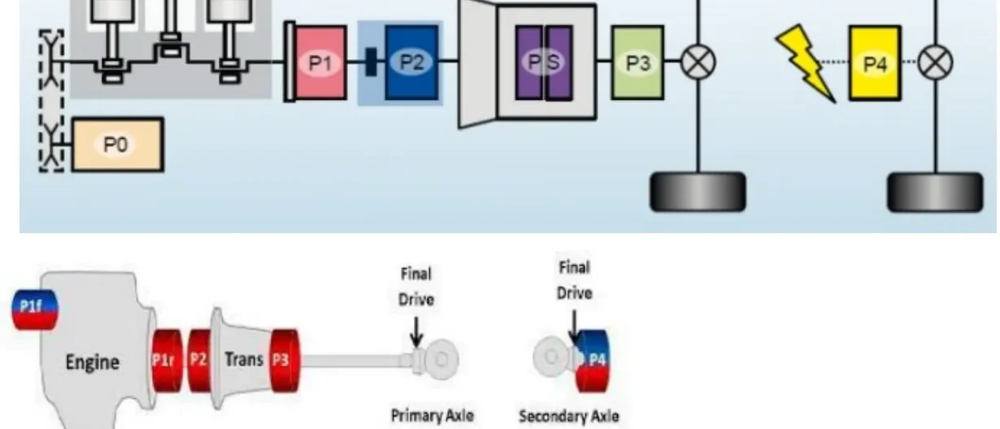
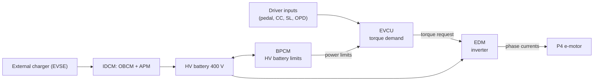
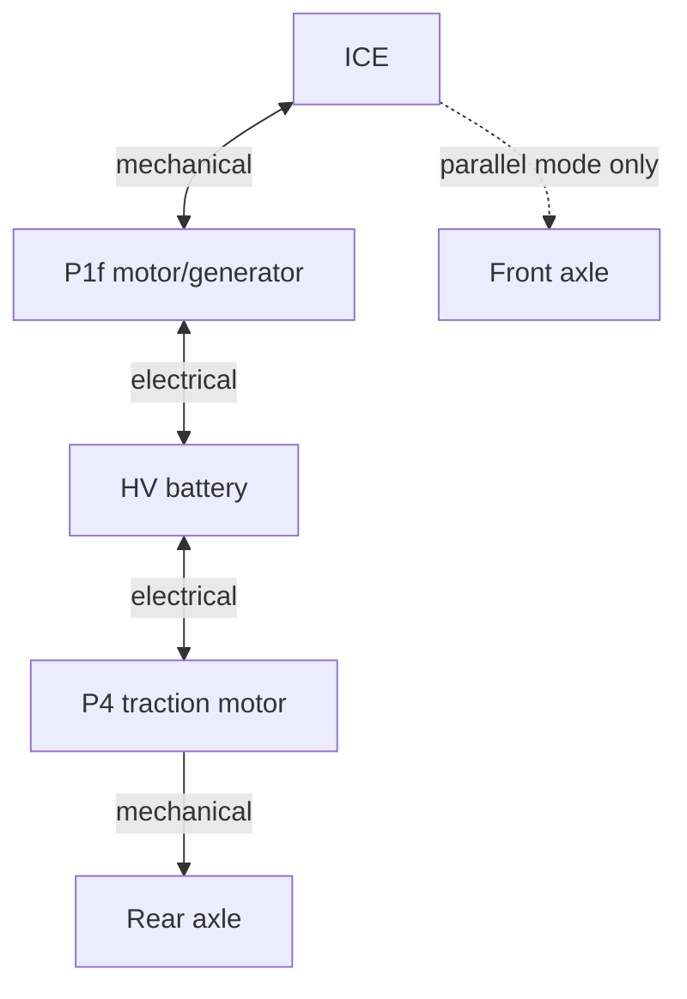

# Hybrid Vehicle Architectures

Driven by the need to cut CO₂ emissions — especially in large cities — every
major automotive group has restructured its product plans around hybrid and
electric propulsion. Each manufacturer answered the challenge differently,
which is why today's market offers a whole family of electrified layouts. This
article gives you the map: how the electric machine can be placed in the
powertrain (the **P0–P4 positions**), how vehicles are classified by
electrification level (**micro, mild, full, plug-in hybrid, and BEV**), and how
a real **P1P4 plug-in hybrid** switches between its operating modes.

!!! note "What 'hybrid' means here"
    In this lesson *hybrid* always means a vehicle where **one of the two
    power sources is an electric motor** and the other is an internal
    combustion engine (ICE). Other combinations (e.g. hydraulic hybrids) exist
    but are out of scope.

## Motor positions: the P0–P4 nomenclature

Hybrid architectures are named after **where the electric machine sits** in
the driveline. The position determines what the motor can do: a belt-driven
motor can only assist the engine, while a motor on its own axle can drive the
car alone.

| Position | Location | Typical role |
|---|---|---|
| **P0** | Connected to the ICE by a belt (belt alternator-starter) | Engine start/stop, small torque assist, recuperation |
| **P1** (front = **P1f**, rear = **P1r**) | On the crankshaft, before the clutch | Stronger assist, generation; spins whenever the engine spins |
| **P2** | After the clutch, at the transmission input | Can drive the car alone when the clutch decouples the ICE |
| **P2.5** | Integrated *inside* the transmission | Assists the engine and covers torque during gearshifts |
| **PS** (power split) | Inside a dedicated planetary/CVT transmission | Blends ICE and electric torque continuously (Toyota-style) |
| **P3** | Transmission output, before the final drive | Electric drive at the primary axle, off-axis from the ICE |
| **P4** | Directly on the secondary axle (own final drive) | Independent electric axle — enables electric AWD |

The bottom half of the figure shows the same idea on a real layout: the ICE
drives the **primary axle** through P1r/P2/P3 options and the transmission,
while a **P4** machine with its own final drive powers the **secondary
axle** — the arrangement used by most Stellantis hybrids and BEVs you will
work on.

!!! tip "Reading architecture names"
    A name like **P1P4** is simply the list of positions in use: a P1 machine
    coupled to the engine plus a P4 machine on the rear axle. When you meet an
    unfamiliar hybrid, decode its P-code first — it tells you immediately which
    operating modes are physically possible.

## The electrification ladder

The market categories differ mainly in battery size, motor power, and whether
the car can move on electricity alone.

| Category | Electric machine | Battery | Electric-only driving | Example |
|---|---|---|---|---|
| **Micro hybrid** | Belt-driven (P0), less than 1 cv | 12 V secondary battery | None — only assists the ICE | Fiat 500 Hybrid |
| **MHEV** (mild hybrid) | Various positions, e.g. P2.5 | 48 V | A few meters, below ~10 km/h | Audi Q3 SB 1.5 TFSIe MHEV |
| **FHEV** (full hybrid) | One or more machines, various positions | ~6 kWh | Some kilometres, at OEM-defined speeds | Toyota Prius |
| **PHEV** (plug-in hybrid) | Same layouts as FHEV | Larger than FHEV, externally chargeable | Tens of kilometres | Jeep Compass / Renegade 4xe |
| **BEV** (battery electric) | P4 traction motor only | Large HV pack, e.g. 400 V | The only propulsion source | New Fiat 500e |

### Micro hybrid

The entry level of electrification: an electric motor on the belt drive with a
secondary 12 V battery, delivering less than 1 cv. It supports the thermal
engine briefly in the moments when the engine would run far from its
stoichiometric point, but it **cannot move the vehicle by itself** — it is an
efficiency add-on, not a second powertrain.

### Mild hybrid (MHEV)

Mild hybrids place the machine where it can do real work — a common choice is
**P2.5 inside the transmission**, where the motor can fill in torque while the
ICE is between gears. They can crawl in pure electric mode for a few meters at
under 10 km/h (parking manoeuvres, stop-and-go queues) and typically carry a
**48 V** battery pack.

### Full hybrid (FHEV)

The full hybrid was the real revolution: born in **1997 with Toyota**, it was
the first architecture to fundamentally change vehicle propulsion. An FHEV can
drive electrically for a few kilometres at speeds defined by the manufacturer.
Its battery (roughly 6 kWh class) is charged **only by recovering kinetic
energy** — there is no plug, so the usable electric range is bounded by how
much energy braking and coasting can put back.

### Plug-in hybrid (PHEV)

A PHEV keeps the full-hybrid architecture and removes its two limits: the
battery **can be charged from an external charging point**, and it can be
**larger**, because its size is no longer constrained by what kinetic
recuperation can store. The Jeep Compass and Renegade **4xe** are the
Stellantis examples of this layout — currently the most publicized hybrid
technology on the market.

## BEV architecture and torque control

In a **BEV** all propulsion comes from the electric motor. The motor connects
to the front axle through a **single fixed gear ratio** — an electric machine's
torque curve makes a multi-gear transmission unnecessary — so the motor is
effectively a **P4**. The new Fiat 500e is the reference example: a
**70 kW / 95 cv** motor fed by a **400 V** battery, delivering up to
**200 Nm** of torque with an expected range of about **320 km**.

### The powertrain controllers

A Stellantis BEV splits powertrain control across four main modules:

| Module | Responsibility |
|---|---|
| **BPCM** (battery pack control module) | HV battery supervisor: estimates voltage and power limits, drives the contactors, commands battery heating and cooling |
| **IDCM** (integrated DC-charge module) | Split in two subsystems: **OBCM** interfaces with the external charger (EVSE) to charge the HV battery; **APM** controls the DC/DC converter that keeps the 12 V battery charged |
| **EVCU** (electric vehicle control unit) | The powertrain brain: from vehicle status and driver inputs it computes the **torque demand** for the motor and hosts standard vehicle functions — Cruise Control, Speed Limiter, One Pedal Drive |
| **EDM** (electric drive module) | Turns the EVCU's torque demand into electrical actuation — phase currents and voltages that physically drive the motor |

The torque path is strictly layered: the EVCU decides *how much* torque is
wanted (and the BPCM tells it how much power the battery can give or accept),
the EDM decides *how* to produce it electrically, and the motor executes.

### Negative torque: regenerating energy

The electric machine works in both directions — it can deliver **positive
power** (traction) or **negative power** (generation), recharging the HV
battery and extending range. Two everyday scenarios exploit this:

- **Regenerative braking / One Pedal Drive (OPD).** The motor brakes the car,
  converting kinetic energy into battery charge. With OPD active, the
  accelerator pedal has a *neutral point*: above it the motor produces positive
  (driving) torque, below it a negative (braking) torque. The driver can
  perform almost any manoeuvre — including stopping — by modulating only the
  accelerator, without touching the brake pedal.
- **Cruise Control / Speed Limiter downhill.** On a BEV, CC and SL can hold
  the target speed even on steep negative grades, because the motor's braking
  capability replaces the friction brakes. The grade's potential energy is
  harvested into the battery instead of being wasted as heat.

## REEV — the range extender

A **Range Extended Electric Vehicle** is a hybrid where the ICE **never drives
the wheels**: it exists only to recharge the HV battery and extend range. In
mode terms, a REEV is a **series-only** hybrid.

The typical topology pairs a **P4 traction motor** (exactly as on a BEV, acting
on the demanded torque) with an ICE coupled to a second, smaller machine in
**P0 or P1** position. That machine works purely as a **generator**: it
converts the engine's torque into electrical energy for the battery. The
driver always experiences electric drive; the engine runs (at its most
efficient point) only when the battery needs support.

## P1P4 plug-in hybrid: the operating modes

The P1P4 layout — used, for example, on the Jeep 4xe models — combines a
**P1f machine on the engine** with a **P4 machine on the rear axle**, giving
the energy manager three ways to move the car:

| Mode | ICE | P1f machine | P4 machine | When used |
|---|---|---|---|---|
| **EV** | Off | Idle | Propels the car alone | Battery charged, moderate demand — zero-emission driving |
| **Series** | On, drives P1f | Generates, charging the battery | Propels the car alone | Battery low — the ICE runs as a generator, the car still drives electrically |
| **Parallel** | On, propels | Generates if kinetic energy is available | Propels together with the ICE | Maximum power demand — both power sources drive the vehicle |

In every mode, **recuperation stays available**: when the vehicle has kinetic
energy to give back (braking, coasting), the P4 motor — and where coupled, the
P1f machine — charge the battery instead of dissipating energy in the friction
brakes.

!!! note "Series vs. parallel"
    - **Series**: the engine's energy reaches the wheels only *electrically*
      (ICE → generator → battery → motor → wheels). The ICE can run at its
      optimal point, but the double energy conversion costs efficiency.
    - **Parallel**: the engine drives the wheels *mechanically*, with the
      electric motor adding torque. More efficient at steady speed, and the
      only way to reach the vehicle's maximum combined power.

## Choosing an architecture

The categories are not rivals but trade-offs along three axes:

- **How much electric driving you want** — from none (micro) to full-time (BEV).
- **Battery and voltage class** — 12 V assist, 48 V mild hybrid, ~6 kWh
  self-charging full hybrid, large externally-charged PHEV and BEV packs.
- **Mechanical complexity vs. efficiency** — each conversion between
  mechanical and electrical energy costs a few percent, so parallel paths
  favour highway efficiency while series paths favour urban stop-and-go.

!!! success "Key takeaways"
    - Motor **position** (P0–P4) defines what a hybrid can do; architecture
      names like P1P4 are just the list of positions in use.
    - The ladder runs micro (12 V belt assist) → mild (48 V, P2.5) → full
      (~6 kWh, kinetic-only charging, Toyota 1997) → plug-in (external
      charging, bigger battery) → BEV (single-ratio P4, e.g. 500e: 70 kW,
      400 V, 200 Nm, ~320 km).
    - On a BEV, the EVCU computes torque demand, the EDM actuates it as phase
      currents, the BPCM guards the HV battery, and the IDCM (OBCM + APM)
      handles charging and the DC/DC converter.
    - Electric machines give negative torque too: regenerative braking, One
      Pedal Drive, and downhill speed-holding all recharge the battery.
    - A REEV is a series-only hybrid (ICE → P0/P1 generator); a P1P4 PHEV
      runs EV, series, and parallel modes, recuperating through P4 (and P1f)
      in all of them.

!!! tip "Where this leads"
    The BEV layout and its controllers are treated in more depth in
    [HEV Architecture — BEV](../hev-architecture-bev/index.md); the machines
    themselves in [Electric Motors](../electric-motors/index.md). The vehicle
    networks that connect the EVCU, BPCM and EDM are the ones you will trace
    in [CAN, LIN & Automotive Ethernet](../can-lin/index.md).

---

## Source material

This article was distilled from the academy lesson materials:

- :material-file-pdf-box: [HEV Architecture Hybrid](../../assets/mil1/HEV_Architecture_Hybrid/HEV_Architecture_Hybrid.pdf) — PDF, 237.1 KB
