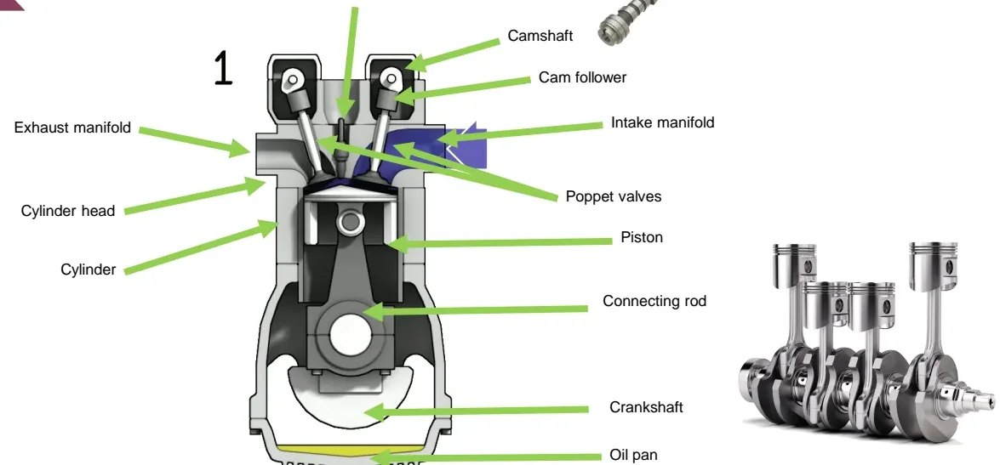
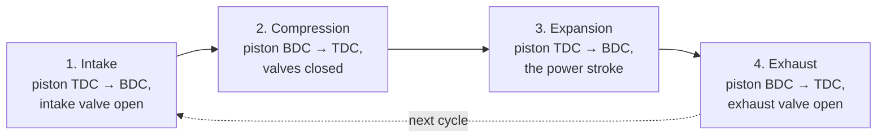
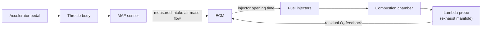
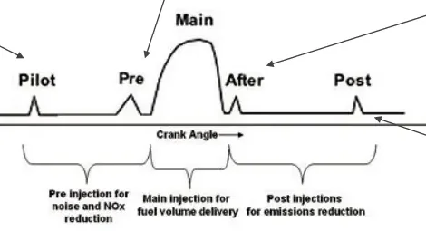
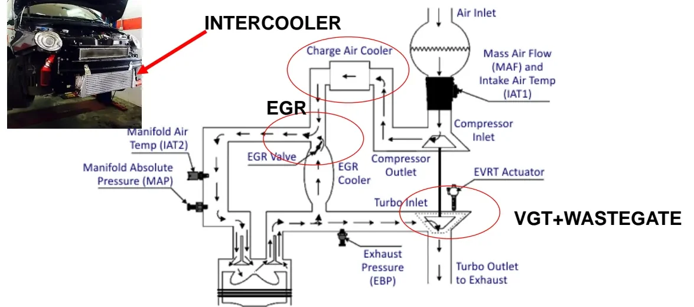
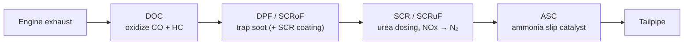

# Internal Combustion Engines (ICE)

Welcome to your first deep dive into the hardware you will spend much of the
bootcamp talking to. Even in an electrification-focused program, most vehicles
you will calibrate, test and diagnose still burn fuel — and almost everything
you will do as an E/E engineer (reading sensors, driving actuators, flashing
software, chasing faults) happens *around* the engine. These two lessons build
the foundation you need: how a 4-stroke engine works, how gasoline (spark
ignition) and Diesel engines differ, how the engine control module meters air
and fuel, and how modern engines use turbocharging, exhaust gas recirculation,
variable valve actuation and exhaust aftertreatment to meet Euro 6 emission
limits. By the end, you will be able to look at any engine control schematic
and recognize every sensor, actuator and control loop on it.

Don't worry if some terms are new — every acronym is explained the first time
it appears, and you will meet all of them again in the hands-on modules.

## Anatomy of a 4-stroke engine

A piston slides inside a **cylinder** and is linked by a **connecting rod** to
the **crankshaft**, which converts the piston's up-and-down motion into the
rotation that ultimately drives the wheels. The **cylinder head** closes the
top of the cylinder and hosts the **poppet valves** (intake and exhaust) and,
in gasoline engines, the spark plug. The valves are driven by the **camshaft**
(through cam followers or rockers), timed to the crankshaft. The **intake
manifold** feeds fresh air (or air-fuel mixture) to the cylinders; the
**exhaust manifold** collects the burned gases. The **oil pan** (sump) at the
bottom holds the lubricating oil.



The piston moves between two limit positions you will hear about constantly:

- **TDC** — top dead center, minimum chamber volume
- **BDC** — bottom dead center, maximum chamber volume

### The four strokes

One full working cycle takes **two crankshaft revolutions** (720°):



1. **Intake** — piston moves TDC → BDC, intake valve open: the cylinder fills
   with fresh charge.
2. **Compression** — both valves closed, piston moves BDC → TDC: pressure and
   temperature rise sharply.
3. **Expansion** (power stroke) — combustion pushes the piston TDC → BDC; this
   is the only stroke that produces work.
4. **Exhaust** — exhaust valve open, piston moves BDC → TDC: burned gases are
   pushed out.

### Key engine parameters

These are the numbers that define any engine — you will see them in specs,
data sheets and calibration tools:

| Parameter | Definition | Notes |
|---|---|---|
| Bore *B* | Cylinder diameter | |
| Stroke *s* | TDC–BDC distance | |
| Displacement | `s · π·B²/4 · N_cyl` | Total swept volume of all cylinders (the "2.0 L" in an engine name) |
| Compression ratio (CR) | volume at BDC ÷ volume at TDC | Gasoline ≈ 10–12, Diesel ≈ 15–20 |
| Stroke ratio | B ÷ s | "Oversquare" (B > s) engines rev higher |
| Air-fuel ratio (AFR) | `m_air / m_fuel` (mass or mass-flow ratio) | Stoichiometric ≈ 14.7 for gasoline |
| BSFC | Brake specific fuel consumption, kg/kWh | Fuel used per unit of energy delivered; the standard efficiency chart for engine maps |

## Spark ignition (SI) engines

In a gasoline — **spark ignition (SI)** — engine the air-fuel mixture is
**premixed** (the fuel vaporizes into the intake air before combustion) and
combustion is triggered by the spark plug. Crucially, the mixture is kept
**stoichiometric and constant** — so power is regulated by modulating the
*airflow*, not the mixture. Roughly:

```
P = η(T_e, rpm) · ṁ_fuel · H_i = η(T_e, rpm) · ṁ_air · H_i / AFR
```

with `AFR ≈ 14.7` essentially constant, power scales directly with the air
mass flow the engine breathes. This one idea — *control the air, keep the
mixture fixed* — explains most of the gasoline engine's control hardware.

### Why stoichiometric matters

| Mixture | AFR | Behavior |
|---|---|---|
| Rich | < 14.7 | Engine runs apparently normally if not excessively rich, but partial fuel oxidation produces unburned hydrocarbons (HC), carbon monoxide (CO) and soot; fuel is wasted |
| Stoichiometric | ≈ 14.7 | Ideal operation: complete oxidation ideally yields only CO₂ and H₂O |
| Lean | > 14.7 | Risk of misfire; slower flame front can cause overheating, knock and pre-ignition; higher mechanical and thermal stress. Carefully controlled lean operation can improve efficiency |

!!! note "The three-way catalyst is the real reason"
    Stoichiometric operation is not just about clean combustion — the exhaust
    three-way catalyst only converts CO, HC **and** nitrogen oxides (NOx)
    efficiently at AFR ≈ 14.7. This is why the engine control module (ECM)
    works so hard to hold the mixture there (see the lambda feedback loop
    below).

### Spark advance and compression ratio

Combustion does not start instantly when the plug fires — the flame needs
time to propagate — so the spark is fired **before top dead center (BTDC)**,
typically **15°–25° BTDC**.

- More advance → higher peak pressure and temperature → more power and
  efficiency, but higher mechanical/thermal stress and risk of **knock**.
- Higher compression ratio → higher efficiency, same knock/pre-ignition risk.
- Knock resistance is a *fuel* property: the **octane number** (typically
  95–100 for gasoline, >120 for methane) defines how much advance/CR the
  engine can tolerate. If knock appears, the ECM must retard the spark —
  losing efficiency.
- Turbocharged SI engines therefore use **lower compression ratios** than
  naturally aspirated ones.

Four abnormal combustion events to recognize (you will meet these names again
in the diagnosis modules):

- **Misfire** — mixture too diluted (too lean); combustion cannot start.
  Unburned fuel goes straight to the exhaust.
- **Choke** — mixture too rich; same result, unburned fuel out of the
  tailpipe.
- **Knock** — after the spark has started combustion, a hot spot (e.g. the
  exhaust valve) ignites the end-gas; the colliding flame fronts produce the
  characteristic metallic pressure oscillation.
- **Pre-ignition** — a hot spot ignites the mixture *before* the spark,
  usually from overheating or an excessive compression ratio. Far more
  destructive than knock.

### Torque control: the throttle

The accelerator pedal commands the **throttle body**, which chokes the intake
flow. At constant volumetric flow (set by displacement and rpm), choking
reduces the **density** of the air downstream of the throttle, hence the air
*mass* per cycle:

```
ṁ_air = ρ_intake · V̇ ≈ ρ_intake · (rpm/2) · displacement / 60
```

| Throttle | Intake density | Operating point |
|---|---|---|
| Closed (idle) | ρ_intake ≪ ρ_atm | Minimum air mass, minimum torque |
| Medium | ρ_intake < ρ_atm | Part load — where road cars spend most of their life |
| Wide open | ρ_intake ≈ ρ_atm | Maximum volumetric filling |

!!! warning "Pumping losses"
    Throttling is effectively a controlled waste: the piston works against a
    vacuum during intake at part load. These **pumping losses** are the main
    reason SI engines are less efficient than Diesels at partial load, and the
    motivation behind throttle-less load control (variable valve lift) and
    downsized turbocharged engines.

### Fuel metering: measuring air, dosing fuel

Because AFR must stay at 14.7, the injected fuel mass must track the air mass
exactly. In **port injection**, low-pressure injectors (3–5 bar) sit in the
intake manifold downstream of the throttle; since gasoline is volatile (and
liquefied petroleum gas (LPG)/methane are already gaseous), the fuel dissolves
into the intake flow.

The problem: the exact instantaneous air mass flow cannot be predicted —
transients, fluid dynamics, thermal effects and fuel vaporization all disturb
it. The solution is a two-layer control loop, and it is the first closed-loop
system you will learn to read:



- **Feed-forward**: a **mass air flow (MAF) sensor** measures the intake air
  flow and the ECM computes the base injection time. MAF sensors are
  expensive, can disturb the flow, and perform poorly above ~7500 rpm.
- **Feedback**: a **lambda probe (λ sensor)** in the exhaust manifold detects
  excess oxygen (lean mixture) or its absence (rich mixture), and the ECM
  trims the injected fuel dynamically to hold λ = 1 (λ = AFR ÷ AFR
  stoichiometric).

## Diesel engines

Diesel (compression ignition) engines flip most SI assumptions. This table is
worth remembering — it explains nearly every hardware difference you will see:

| | Spark ignition | Diesel |
|---|---|---|
| Mixture | Homogeneous, premixed | Highly non-homogeneous: AFR spans 0 (fuel droplets) to ∞ (pure air zones) |
| Ignition | Spark plug | Spontaneous, from high pressure/temperature at end of compression |
| Intake | Throttled | **No throttle** — free intake, airflow depends mainly on rpm |
| Torque control | Air mass (throttle) | Directly the **injected fuel quantity**; air mass ≈ constant |
| AFR | Held ≈ 14.7 | Always excess air (lean) |
| Compression ratio | ~10–12 | **15–20**, end-of-compression pressures roughly 2× SI |
| Fuel volatility / injection | Volatile fuel, 3–5 bar port injection | Poorly volatile fuel, injected at up to **2000 bar** to atomize into fine droplets |
| Combustion mode | Premixed flame front | Mainly **diffusive** (fuel burns as it mixes) |

Fuel quality is expressed by the **cetane number** (typically 51–60): the
higher the cetane, the shorter the **ignition delay** between injection and
combustion start, and the higher the usable engine speed. The ignition delay
is extremely temperature-sensitive — a 200 K difference can change it by a
factor of 20 — which is why **glow plugs** create a local hot spot for cold
starts. Advancing the injection (the Diesel counterpart of spark advance)
raises peak pressure and efficiency but also mechanical stress and combustion
noise.

### Diesel pollutants: soot and NOx

Diesels are more efficient, but that efficiency comes with a specific
emissions bill:

- **Soot** is essentially unburned fuel — its presence means lost efficiency.
  It forms when oxygen is locally or globally scarce, mixing is poor (low
  turbulence), droplets are too large to vaporize completely, or the droplet
  surface carbonizes at extreme temperatures before evaporating. Smaller
  droplets (higher injection pressure) vaporize more completely and limit
  soot.
- **NOx** (nitrogen oxides, NO and NO₂) forms because air is ~79% N₂ and ~21%
  O₂: at Diesel combustion temperatures, and with long residence times and
  abundant excess oxygen, molecular nitrogen splits and oxidizes. NOx is
  therefore the price of the Diesel's efficiency — high temperature, high
  pressure, no throttling.

### Injection hardware evolution

- **Indirect injection (IDI)** — fuel is injected into a small **pre-chamber**
  where combustion starts easily and rapidly (short ignition delay). The
  pre-chamber's connecting hole generates turbulence that improves mixing and
  slows the heat-release/pressure peak, cutting noise and mechanical stress
  and relaxing injection-timing precision. The cost: larger hot surfaces and
  the pressure drop through the hole reduce efficiency.
- **Direct injection (DI)** — fuel goes straight into the cylinder. Better
  efficiency, but requires careful fluid-dynamic design (turbulence) and high
  fuel pressure to force the (originally mechanical) injector open.
- **Electronic direct injection** — electronically controlled unit injectors
  or pump-injectors make timing and quantity programmable.
- **Common rail** — a shared high-pressure **rail** acts as a hydraulic
  accumulator, decoupling the available fuel pressure from the injection
  pump. Fuel is always available at ECM-controlled rail pressure, so
  electronic injectors can fire **multiple injections within 1–2 ms**. This
  is the technology behind the names you will see everywhere (MultiJet, TDI,
  HDi, CDI).

### Multiple injection phases



A single combustion cycle can combine up to five injection events — this is
where calibration engineers spend a lot of their time:

| Phase | Position | Purpose |
|---|---|---|
| **Pilot** | Early, small | Pre-heats the chamber, shortening the main injection's ignition delay — greatly reduces combustion noise and mechanical stress |
| **Pre** | Before main | Reduces oxygen availability when the main injection burns — less NOx, at the cost of more soot |
| **Main** | Around TDC | Delivers the actual fuel volume (torque); its time shape is freely programmable with electronic injectors |
| **After** | Just after main | Sustains combustion into the expansion stroke, promoting soot oxidation |
| **Post** | Late (optional) | Feeds the aftertreatment — raises exhaust enthalpy for DPF regeneration |

## Turbocharging and the air path

Engine power can be raised in three ways: more displacement, higher maximum
rpm, or higher in-cylinder peak pressure. **Turbocharging** takes the third
route indirectly: a compressor raises the intake-manifold pressure, so more
air (more oxygen) enters the cylinder and more fuel can be burned.

The trick is that the compressor sits on the same shaft as a **turbine**
driven by the hot, still-pressurized exhaust gases — energy that would
otherwise be wasted. Boost is therefore (almost) free.



Take a moment with this figure — nearly every component on it is a sensor or
actuator you will one day measure or drive from a test bench.

**Pros**

- More torque and power from a smaller engine (downsizing).
- In Diesels, peak power and overall efficiency *always* improve
  (waste-energy recovery); in SI engines, gains materialize when the turbo's
  best-efficiency zone is matched to the engine's poor-efficiency zone on the
  BSFC map.
- At medium-high load the compressor pushes air in, reducing the intake
  pumping work.

**Cons**

- Higher complexity and cost; extra degrees of freedom to control.
- Compressed air heats up — an **intercooler** (charge air cooler) is needed,
  otherwise the cycle's low temperature rises and efficiency drops.
- Turbine/compressor inertia causes **turbo lag** — delayed boost after a
  sudden load request.

### Boost control: wastegate and VGT

- **Wastegate (WG)** — a valve that bypasses part of the exhaust around the
  turbine. The ECM modulates it to limit turbine speed (turbines spin up to
  ~250,000 rpm) and boost pressure, using the **exhaust back-pressure (EBP)**
  and **manifold absolute pressure (MAP)** sensors.
- **Variable geometry turbine (VGT)** — adjustable vanes change the turbine's
  flow conditions. Opening the vanes mimics the wastegate (which then becomes
  unnecessary); closing them speeds the turbine up at low exhaust flow. VGT
  optimizes boost across the whole rpm/torque range, strongly mitigates turbo
  lag, and gives the ECM an extra actuator for emission-control strategies.

### Exhaust gas recirculation (EGR)

The **exhaust gas recirculation (EGR) valve** (ECM-controlled) routes a
fraction of the exhaust back into the intake. Recirculated exhaust is inert
in the chamber: it lowers the combustion temperature and the oxygen
availability, and since NOx formation is temperature-driven, NOx drops. The
recirculated gas must first pass through a dedicated heat exchanger — the
**EGR cooler**.

Soot in the EGR stream is a design trade-off: with careful calibration, small
particles can be re-burned, or particles can grow — easier to trap in the
particulate filter but worse for fouling of the EGR valve, cooler and intake
manifold.

## Breathing and mixture strategies

### Gasoline direct injection (GDI)

Injecting gasoline directly into the cylinder enables **stratified charge**
operation at low load:

- A stoichiometric-to-slightly-rich cloud forms near the spark plug (so it
  ignites reliably) while the rest of the chamber runs lean to very lean.
- The throttle can stay wide open in stratified mode — pumping losses drop
  and higher compression ratios become possible.
- At medium/high load the ECM switches to **homogeneous** mode (AFR ≈ 14.7
  everywhere, like port injection); some engines keep a traditional port
  injector for exactly this.
- Costs: sophisticated injectors, critical in-chamber fluid-dynamic design,
  tricky transient control (stratified mode is abandoned during transients),
  soot formation from poor mixing time, and higher NOx from lean zones. The
  benefits are limited in conventional powertrains but greater in hybrids.

### Variable valve lift and timing (VVL/VVT)

- **Variable valve lift (VVL)** can regulate intake airflow through the
  valves themselves, potentially eliminating the throttle body and its
  pumping losses.
- **Variable valve timing (VVT)** optimizes valve opening/closing instants
  for better cylinder filling (exploiting manifold dynamic effects), giving a
  favorable torque curve at both low and high rpm — impossible with fixed cam
  timing.
- Valve timing can also realize **internal EGR** (sucking exhaust gas back
  into the cylinder without an EGR loop) and reduce pumping losses by
  advancing intake-valve closing and exhaust-valve opening.
- Systems can be continuously variable (BMW Valvetronic) or discrete (Honda
  VTEC, two timings). Nearly every manufacturer has a proprietary scheme —
  BMW Valvetronic, Porsche VarioCam, Honda VTEC, **FCA MultiAir**.

### FCA MultiAir in one paragraph

One camshaft serves both valve rows: exhaust valves are actuated
conventionally, while the intake cam drives a small **hydraulic pump** (like
a syringe) through a rocker. The pump feeds pressurized engine oil to
hydraulic pistons above the intake valves via an **electronically controlled
solenoid valve**. By opening or closing the solenoid, the ECM decouples
intake-valve motion from the camshaft — full software control of intake lift
and timing using the engine's own oil as the working fluid. It is a great
example of how much "mechanical" behavior is now actually software.

## Exhaust aftertreatment

### Oxidation and three-way catalysts

- A first catalyst **oxidizes** incomplete combustion products (CO and HC);
  it works in stoichiometric-to-lean exhaust, so it fits both SI and Diesel.
  In Diesels it is called the **Diesel oxidation catalyst (DOC)** and
  operates above ~200 °C; SI catalysts are platinum/palladium-based and work
  above 600–700 °C.
- A second, rhodium-based catalyst **reduces** NOx — but only in
  rich-to-stoichiometric exhaust, so it cannot be used on Diesels (always
  lean).
- Best overall conversion requires AFR ≈ stoichiometric — one more reason for
  the lambda closed loop you saw above.

!!! tip "Catalyst diagnostics"
    Catalyst health is monitored with **two lambda probes**, one upstream and
    one downstream. As long as the two see different oxygen concentrations
    the catalyst is storing/releasing oxygen correctly; when the two signals
    become too similar, the ECM flags catalyst degradation. You will use
    exactly this signal pair when diagnosing aftertreatment faults.

### Particulate filters: DPF and GPF

A **Diesel particulate filter (DPF)** is a ceramic or metal matrix that
mechanically traps soot; a catalytic coating lowers the soot-oxidation
temperature. During low-load driving (traffic, high EGR, cold exhaust) soot
accumulates, and a **differential pressure sensor** across the filter tracks
the build-up. Past a threshold, the ECM triggers **regeneration**:

- **post injection** of fuel to raise exhaust temperature above 450–500 °C,
  and
- a dedicated **low-EGR** strategy to increase exhaust oxygen.

The **gasoline particulate filter (GPF)** is the gasoline counterpart, needed
mainly for GDI engines (the only SI engines with significant soot). SI
exhaust is hotter, so no extra fuel is burned; regeneration runs during
deceleration cut-offs and/or by increasing airflow (throttle or VVL) while
retarding spark advance (within knock limits).

### SCR: urea-based NOx reduction

Diesels cannot use a NOx-reduction catalyst, so NOx is chemically reduced in
a **selective catalytic reduction (SCR)** reactor:

1. An aqueous urea solution (**AdBlue**) is injected upstream of the reactor
   and decomposes into **ammonia**, the actual reactant. (Ammonia itself is
   flammable, toxic and volatile — urea is the safe carrier.)
2. In the reactor's channels the exhaust-ammonia mix passes over a
   vanadium-based catalyst, where ammonia reduces NOx to N₂ and H₂O.
3. NOx concentration in exhaust is only ~1%, so dwell time must be long
   enough for good conversion. Dosing more ammonia improves NOx reduction but
   risks **ammonia slip** out of the tailpipe.
4. A second stage — the **ammonia slip catalyst (ASC)** — absorbs slipped
   ammonia and releases it when NOx production rises, acting as an ammonia
   buffer.



## Case study: 2.2 L MultiJet Euro 6d

The second lesson closes with a real Euro 6d diesel (2.2 L, 180–200 hp class,
Jeep Cherokee / Ducato family) showing what all of the above means in
hardware. Read this list as a preview of your future workplace: almost every
item is a sensor you will log or an actuator you will command.

- **Air path**: MAF meter with integrated temperature/humidity/pressure
  sensors (connected over [LIN](../can-lin/index.md)), MAP + manifold
  temperature sensors, compressor-outlet and intercooler-outlet temperature
  sensors, an electrical **VGT** valve with position feedback, an **H-bridge
  throttle actuator**, and smart swirl control.
- **Fuel path**: high-pressure pump with metering unit, common rail with
  pressure sensor and DRV (pressure regulator valve), four CRI 2.20 injectors,
  plus LP fuel pump control, water-in-fuel sensor and fuel heater.
- **EGR**: both high-pressure (**HP-EGR**) and low-pressure (**LP-EGR**)
  valves (H-bridge driven, with position sensors), EGR temperature sensors
  and an EGR cooler bypass.
- **Cold start**: glow plug control unit (GCU3) with four glow plugs.
- **Aftertreatment**: the aftertreatment system (ATS) uses **SCRoF + SCRuF
  with double urea dosing** — a DOC, then an SCR-coated DPF with its own
  dosing module, then an underfloor SCR with a second dosing module,
  supervised by a dedicated **SCR control unit (SCU)**, multiple NOx sensors
  (DOC inlet, SCRoF outlet, SCRuF outlet), a soot sensor, temperature sensors
  at every stage, and a urea tank assembly with level, quality and
  temperature sensing plus heated lines.

Moving from Euro 6d-Temp to full Euro 6d on this engine meant, among other
things: a new electronic control unit (ECU) generation, a second urea
injector with its own controller, improved underfloor SCR, a third NOx
sensor, a second 80 W water pump, cooled LP-EGR, new injector nozzles, and
durability upgrades (steel pistons, new cylinder head, oil pump and cooler).

!!! success "Key takeaways"
    You now have the mental map every engine-related task in this bootcamp
    builds on:
    - A 4-stroke cycle = intake, compression, expansion, exhaust over two
      crankshaft revolutions; compression ratio, displacement and AFR are the
      numbers that define an engine.
    - Gasoline (SI) engines hold AFR ≈ 14.7 and control torque with the
      throttle; the ECM meters fuel via MAF feed-forward plus lambda-probe
      feedback — your first closed control loop.
    - Knock, pre-ignition and misfire bound spark advance and compression
      ratio; octane (SI) and cetane (Diesel) numbers grade fuel quality.
    - Diesels run unthrottled with excess air, control torque via injected
      fuel quantity, ignite by compression (CR 15–20, injection up to
      2000 bar) and pay for their efficiency with soot and NOx.
    - Common-rail injection chains pilot/pre/main/after/post events within
      1–2 ms to trade noise, NOx, soot and DPF regeneration.
    - Turbocharging recovers exhaust energy (wastegate/VGT control, up to
      ~250,000 rpm turbine speed), the intercooler protects efficiency, and
      EGR cools combustion to cut NOx.
    - Aftertreatment is a chain: oxidation catalyst/DOC, DPF/GPF with
      pressure-sensor-triggered regeneration, SCR with AdBlue dosing plus an
      ammonia slip catalyst — all monitored by lambda, NOx, temperature and
      differential-pressure sensors that you will meet again in the diagnosis
      and calibration modules.

!!! tip "Where this leads"
    The sensors and actuators listed here (MAF, MAP, lambda, EGR and VGT
    position, rail pressure) are exactly what you will measure and stimulate
    in the [HIL](../../mil3/hil-users/index.md) and
    [INCA](../../mil3/inca/index.md) lessons, and the communication between
    the ECM and smart auxiliaries rides on the
    [CAN and LIN](../can-lin/index.md) buses. Everything on this page comes
    back — now with a multimeter and a CAN trace in your hands.

---

## Source material

This article was distilled from the academy lesson materials:

- :material-file-pdf-box: [MCI 1](../../assets/mil1/ICE/MCI_1.pdf) — PDF, 2.1 MB
- :material-file-pdf-box: [MCI 2](../../assets/mil1/ICE/MCI_2.pdf) — PDF, 1.9 MB
- :material-file-pdf-box: [MCI Animation](../../assets/mil1/ICE/MCI_Animation.pdf) — PDF, 14.0 KB
