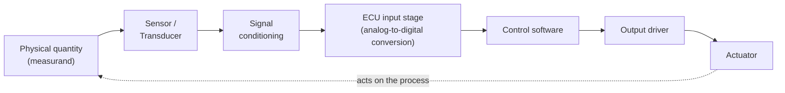
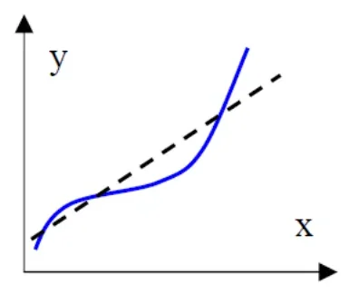
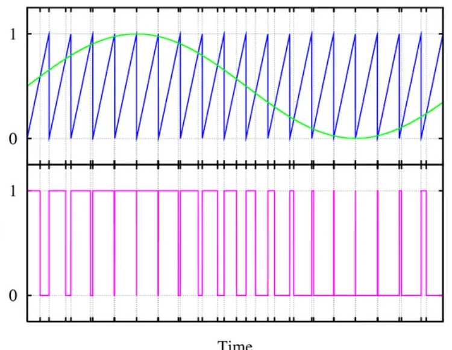
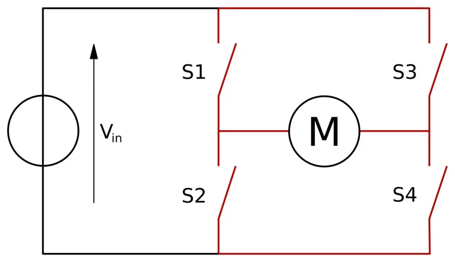

# Sensors & Actuators

Every electronic
control unit (ECU) in a vehicle performs the same three functions: it
**senses** a physical quantity, **processes** the measurement, and **acts** on
the system to change its behavior. This article covers the two ends of that
chain — the sensors that feed information in and the actuators that turn the
ECU's decisions back into physical action — plus the terminology needed to
read an automotive wiring schematic and classify the components on it. The
hands-on exercise at the end applies these concepts to a real engine
schematic: each component is classified as sensor or actuator, active or
passive, analog or digital.

## Sensors

### Sensor, transducer, transmitter

These three terms are often mixed up; in measurement engineering they mean
distinct things:

- **Sensor** — the primary element of a measurement chain: it converts the
  input variable (the *measurand*) into a signal suitable for measurement.
- **Transducer** — a device that accepts information as a physical or chemical
  input variable and converts it into an output variable of the same or a
  different nature (for example pressure → voltage).
- **Transmitter** — a device that receives the measurement variable and
  produces a **normalized output signal** (a standard range such as 0–5 V or
  4–20 mA) that downstream electronics can consume directly.

A transducer is the sensitive device that delivers a measurable electrical
signal in response to a specific measurand — so **a transducer is always a
sensor, but a sensor is not necessarily a transducer** (a sensor may need a
separate transduction stage before anything electrical appears).

The diagram below shows the path every measurement takes from
the physical world to the control software:

### How sensors are classified

Sensors are grouped along several independent axes:

| Axis | Options |
|---|---|
| Energy behavior | **Active** or **passive** (see below) |
| Measured quantity | temperature, pressure, speed, position, humidity, illuminance, … |
| Nature of the output | resistive, inductive, capacitive, voltage, current, … |
| Output form | **analog** or **digital** |

**Active vs. passive** is the classification you will use most:

- An **active** sensor is based on a physical effect that converts the
  measurand's own energy (thermal, mechanical, irradiation, …) directly into
  electrical energy. Examples: **thermocouples** (thermoelectric effect) and
  **pyroelectric crystals** whose polarization depends on temperature.
- A **passive** sensor only changes the **impedance** of its sensitive element
  in response to the measurand — it cannot generate energy by itself.
  Examples: strain gauges and magnetic sensors.

This distinction has a direct practical consequence:
a passive sensor needs an external excitation (a supply voltage or current)
before it produces any output, while an active one generates its signal
on its own. If a passive sensor reads a flat zero, check its supply pin first.

### Conditioning circuits

The electrical signal leaving a sensor is rarely ready for an ECU pin, so a
**conditioning circuit** sits between the two. Its role differs per sensor
type:

- For a **passive** sensor/transducer, the conditioning circuit is *essential
  for generating* the electrical signal at all — it supplies the excitation
  and turns the impedance change into a voltage (for example a Wheatstone
  bridge for a strain gauge). The sensor and its conditioning form a single
  functional assembly.
- For an **active** sensor/transducer, the conditioning circuit only *adapts*
  the generated electricity — amplification, filtering, level shifting — to
  the input characteristics of the measurement system. This is classic
  *signal conditioning*.

### Static characteristics

Static characteristics describe how a sensor behaves when the measurand
changes slowly enough that dynamics do not matter. These terms appear
frequently in datasheets and test reports; this section serves as a reference
for them.

**Input side:**

- **Measurand** — the quantity to be measured.
- **Measurement principle** — the physical principle the output generation is
  based on.
- **Range** — the upper and lower limits within which the measurand may vary.

**Output side:**

- **Normal operating range (output range)** — the span of output values
  produced while the input sweeps the full input range.
- **Deliverable power** — the maximum power the sensor can supply to the
  downstream system; for current outputs the **load impedance** is specified
  instead.
- **Output uncertainty** — the width of the band that contains, with a stated
  confidence level, all the values the output may take for a given operating
  condition.

**Calibration and conversion:**

- **Conversion function** — the function that maps the input value to the
  output value. This is exactly what a scaling factor + offset encodes for a
  bus signal in a DBC (Database CAN) file — you will meet those in MIL2.
- **Calibration constant** — the slope of the calibration curve, when the
  curve is linear.
- **Sensitivity** — the slope of the conversion curve at a given operating
  point; for a linear sensor it is the inverse of the slope of the
  calibration curve.
- **Stability** — the ability to keep operating characteristics unchanged over
  time, both short and long term (drift).

**Linearity** tells you how far the calibration curve deviates from a straight
line — it is quoted as the *maximum* deviation from the ideal line:

Three more terms that appear constantly in datasheets and test reports:

- **Resolution** — the smallest variation of the measurand that produces an
  appreciable variation of the output. When the sensor works close to zero,
  this is called the **threshold**.
- **Repeatability** — how tightly the output values cluster when the *same*
  measurand is applied repeatedly under the *same* operating conditions;
  expressed like the calibration uncertainty.
- **Hysteresis** — the maximum difference between the outputs measured at the
  same measurand value when the value is approached first with increasing and
  then with decreasing measurand, sweeping the whole range.

!!! note "Accuracy terms in practice"
    When you read "±1 % FS" on a datasheet, that figure usually folds
    linearity, hysteresis and repeatability into one number referenced to the
    **full scale** of the output range — not to the current reading.

### Dynamic characteristics

When the measurand changes quickly, the sensor's own speed matters:

- **Frequency domain** — the **bandwidth**: the range of measurand frequencies
  the sensor can follow.
- **Time domain** — **rise time** and **fall time** of the output signal, the
  **time constant**, and the **settling time** (how long the output needs to
  enter and stay within its final error band after a step input).

For example, a knock sensor needs bandwidth in the kilohertz
range to capture combustion vibrations, while a coolant temperature sensor can
be a hundred times slower without affecting control. Matching sensor bandwidth
to the application is a design decision documented in every sensor
specification.

### Common physical effects and sensor examples

The table below collects the transduction effects commonly found on
vehicle schematics; it serves as a lookup when identifying how an
unknown sensor works.

| Physical effect | What happens | Typical devices | Measures | Output |
|---|---|---|---|---|
| Magnetoresistive | Resistance depends on strain / field | Magnetoresistor | Magnetic field, linear & angular displacement, proximity, position | Change in resistance |
| Piezoelectric | Stress on the element generates electric charge | Force sensors, piezo microphone, piezo temperature sensor | Vibration, force, ultrasonic waves, temperature | Voltage or charge |
| Pyroelectric | Element generates charge in response to heat flow | Heat flowmeter, pyroelectric sensor | Temperature change | Voltage |
| Thermoelectric | Temperature difference between two junctions of different metals generates a potential | Thermocouples, thermopiles, infrared pyrometer | Temperature difference | Voltage |
| Photoresistive | Optical radiation changes the element's resistance | Photoresistor, photodiode, phototransistor, photofet | Light, position, motion, sound flow, force | Change in resistance |
| Photovoltaic | Radiation makes the element generate a potential | Flame photometer, light detector, pyrometer | Light intensity, position, motion, temperature | Voltage |
| Thermal radiation | Objects emit radiation whose intensity depends on temperature | Pyrometer | Temperature | Voltage |

## Actuators

An **actuator** is the mirror image of a sensor: in an automation system it
transforms an automatic command decision, processed by an electronic control
board, into a **physical action on the process being regulated**. It lets you
act on a system to modify its behavior and obtain the desired output.

More generally, an actuator is a transducer that converts a signal from one
physical domain — typically electrical — into an equivalent quantity in
another domain: mechanical, hydraulic, thermal, and so on.

Actuators are classified two ways:

- **By the physical quantity the command is transduced into** — the most
  common families are *mechanical*, *hydraulic*, and *electrical*.
- **By the type of electric actuation command** — **digital** (on/off) or
  **analog** (in practice almost always **PWM**, explained below).

### The relay — the basic digital actuator

The relay is one of the simplest and most used actuators in the automotive
field: an **electromechanical switch** that separates the *control* of a load
from the *power* the load needs. A relay therefore consists of two distinct
circuits:

- **Control circuit** — a coil; when current flows through it, the coil is
  excited and pulls the contacts over.
- **Power circuit** — the contacts and the user (load). Contacts can be
  **normally open (NO)** or **normally closed (NC)**.

The ECU only drives the small coil current; the contacts switch the heavy load
current (a fuel pump, a starter solenoid, a fan).

**HSD vs. LSD** — which side of the coil the ECU switches:

- An **HSD (High-Side Driver)** relay is commanded active with a *high
  potential*: the control unit drives battery voltage onto one coil pin, so
  the other pin sits at a low reference potential.
- An **LSD (Low-Side Driver)** relay is commanded active with a *low
  potential*: the control unit grounds one coil pin, so the other pin sits at
  a high reference potential.

!!! tip "Reading schematics"
    Pin labels like `CANISTER PURGE PWM (HSD)` or
    `HIGH PRESS GDI FUEL PMP LSD` on a wiring diagram tell you immediately
    which side the ECU driver switches — essential when you probe the circuit
    with a multimeter or scope. Recognizing this convention makes most
    actuator wiring readable at a glance.

### PWM — the analog-style command

To get an *analog* effect from a digital output, ECUs use **Pulse Width
Modulation (PWM)**: the pin switches fully on and fully off at a fixed
frequency, and the **duty cycle** (the fraction of the period spent "on")
encodes the commanded value. An inductive or thermal load — a valve, a
heater, a lamp — averages the pulses, so 50 % duty behaves like half power.

The figure shows the classic generation scheme: a slow reference signal
(green) is compared against a fast sawtooth carrier (blue); while the
reference is above the carrier, the output (magenta) is high. The higher the
reference, the wider the pulses.

### The H-bridge — driving a motor both ways

A DC motor needs its terminal polarity reversed to change direction. The
**H-bridge** does this with four switches arranged like the letter H around
the motor:

| S1 | S2 | S3 | S4 | Motor |
|---|---|---|---|---|
| closed | open | open | closed | runs one direction |
| open | closed | closed | open | runs the opposite direction |
| open | open | open | open | free / coast |

!!! warning "Never close both switches on one leg"
    Closing S1+S2 (or S3+S4) at the same time shorts the supply through the
    bridge — a shoot-through fault that destroys the driver stage. Real
    H-bridge drivers enforce a dead time between switching.

Combining the two ideas — an H-bridge whose switches are PWM-driven — gives
you full control of both **direction and speed**, which is exactly how
electronic throttle bodies and many pump/flap motors are driven.

### Use case: ignition coil

A spark plug needs an "ignition spark" — an arc — which means a **very high
voltage** that the 12 V vehicle network cannot provide directly. The ignition
coil solves this as a transformer:

1. The ECU drives current through the **primary** winding from the vehicle
   supply, building up energy in the magnetic core.
2. The primary current is interrupted sharply — this is why the primary must
   be driven with an *alternating/switched* waveform, not a steady DC.
3. The collapsing field induces the high-voltage pulse in the **secondary**
   winding, which fires the plug.

On a modern engine each cylinder has its own coil (you will see *Ignition coil
cylinder 1…4* on the schematic), driven directly by ECU power stages.

### Use case: fuel injector

A fuel injector is a solenoid valve: the ECU energizes a coil, a needle lifts,
and pressurized fuel sprays for exactly the commanded time. Two families
matter:

- **Port injection (no GDI)** — fuel pressure is a few bar; the injector is a
  simple low-voltage solenoid, driven on/off.
- **Gasoline Direct Injection (GDI)** — fuel pressure is tens to hundreds of
  bar, so opening the needle takes much more energy. The driver uses a
  **peak-and-hold** current profile and, as the schematics show, **both an HSD
  and an LSD** line (`HIGH PRESS GDI FUEL PMP HSD/LSD`) so the ECU can control
  both sides of the circuit and shape the current precisely.

## Hands-on: classify the sensors and actuators on a real engine schematic

**What you'll practice:** reading two real wiring schematics and classifying
every component on them — the exact routine you will repeat on real projects.

The lesson exercise gives you two wiring schematics from the **520 eAWD
(electric All-Wheel Drive) with the 1.3 GSE T4 engine** (ECU: Continental
GPEC4 LM):

- `520_eAWD_EMEA_sch_eng_1.3_GSE_T4_20180611.pdf` — the **engine-side**
  schematic (engine harness, ECU engine connector, sensors and actuators on
  the engine).
- `520_eAWD_EMEA_sch_veh_1.3_GSE_T4_20180611.pdf` — the **vehicle-side**
  schematic (fuse/relay box, body wiring, pedal and tank sensors).

**Goal:** find every sensor and actuator on the two sheets, then for each one
state (1) whether it is a sensor or an actuator, (2) whether it is **active or
passive**, (3) whether its interface is **analog or digital**.

**Setup:** open both PDFs side by side and keep the classification axes from
this article at hand. Trace each component back to the ECU pin names — the
wire labels (`TIP sensor signal`, `Linear lambda sensor … HS HTR command`,
`CANISTER PURGE PWM (HSD)`) tell you both the function and the drive type.

**Step-by-step:**

1. Scan the engine sheet first and list every labeled component around the
   engine harness connectors.
2. Split the list into *sensors* (measure something: temperature, pressure,
   position, speed, knock, oxygen) and *actuators* (do something: coils,
   injectors, valves, motors, relays).
3. Classify each sensor active or passive from its physical principle —
   e.g. a thermocouple/piezo element generates its own signal (active), an
   NTC (Negative Temperature Coefficient) thermistor or strain element needs
   excitation (passive).
4. Classify each interface analog or digital — continuous voltage signals
   (pressure, temperature, pedal position) are analog; switches and PWM/HSD/
   LSD-driven loads are digital commands.
5. Repeat on the vehicle sheet for body-side components.

**Expected result (orientation):** a complete list on the first pass is not
expected. The engine sheet alone contains, among others:

- *Sensors:* knock sensors 1–2, engine speed (crankshaft) sensor, engine phase
  (camshaft) sensor, GDI fuel rail pressure sensor, coolant temperature
  sensor, oil gallery sensor, intake P&T / Temperature and Manifold Absolute
  Pressure (TMAP) sensor, throttle inlet pressure and temperature (TIP)
  sensors, linear lambda sensor in front of the catalyst, Variable Valve
  Actuation (VVA) oil temperature sensor, throttle position sensors TPS1/TPS2.
- *Actuators:* ignition coils for cylinders 1–4, GDI injectors for cylinders
  1–4, VVA actuators 1–4, variable-displacement oil pump electrovalve (VDOP),
  dump valve, waste-gate valve, rail pressure regulator/control valve,
  electric thermostat actuator, throttle actuator, canister purge valve
  (PWM, HSD), high-pressure GDI fuel pump (HSD + LSD), starter, water-cooled
  charge air cooler (WCAC) pump.

The vehicle sheet adds the accelerator pedal position sensor, stop-lamp
switch, fuel level and fuel tank pressure sensors, Gasoline Particulate Filter
(GPF) temperature and differential pressure sensors, plus the fuel pump relay,
cranking-disable relay, engine control module relay and fuel-lid latch.

**Common mistakes** (frequent on a first pass):

- Calling a knock sensor *passive* — it is piezoelectric, so it **generates**
  charge (active). Temperature NTCs and pressure cells that need a `sensor
  supply` pin are the passive ones.
- Confusing the *signal type* with the *drive type*: an injector is a digital
  on/off actuator even though its current waveform is carefully shaped.
- Missing the lambda sensor's heater command line (`HS HTR command`) — the
  sensor element is analog, but its heater is a separately driven actuator
  circuit.
- Treating relays as part of the ECU — they sit in the fuse/relay box
  (FRB/RB designators on the vehicle sheet) and are driven *by* the ECU.

!!! success "Key takeaways"
    - The ECU processing chain is **sense → condition → process → drive →
      act**; sensor, transducer and transmitter describe increasing
      refinement of the sensing end.
    - Active sensors generate their own energy (thermocouple, piezo); passive
      sensors only change impedance and need excitation — when a passive
      sensor produces no output, check its supply pin first.
    - Datasheet terminology covered: range, sensitivity, calibration,
      linearity, resolution, repeatability, hysteresis, bandwidth, settling
      time.
    - Actuators close the loop: relays for on/off loads (HSD switches the high
      side, LSD the low side), PWM for proportional control, H-bridges for
      bidirectional motors, and power stages such as coil transformers and
      peak-and-hold injector drivers for high-power loads.
    - With component names and ECU pin labels, every element on a real
      schematic can be classified as sensor/actuator, active/passive, and
      analog/digital.

!!! tip "Where this leads"
    The signals these sensors produce travel to other ECUs over the vehicle
    buses — see [CAN, LIN & Automotive Ethernet](../can-lin/index.md) — and
    you will measure and stimulate real sensor/actuator circuits later in the
    HIL lessons.

---

## Source material

This article was distilled from the academy lesson materials:

- :material-file-pdf-box: [eAWD EMEA sch eng 1.3 GSE T4 20180611](../../assets/mil1/Sensors/520_eAWD_EMEA_sch_eng_1.3_GSE_T4_20180611.pdf) — PDF, 292.7 KB
- :material-file-pdf-box: [eAWD EMEA sch veh 1.3 GSE T4 20180611](../../assets/mil1/Sensors/520_eAWD_EMEA_sch_veh_1.3_GSE_T4_20180611.pdf) — PDF, 309.9 KB
- :material-file-pdf-box: [Sensors](../../assets/mil1/Sensors/Sensors.pdf) — PDF, 792.8 KB
- :material-file-pdf-box: [Sensors Question](../../assets/mil1/Sensors/Sensors_Question.pdf) — PDF, 111.8 KB
