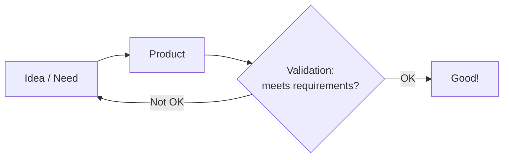
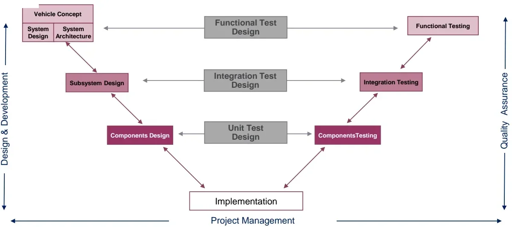
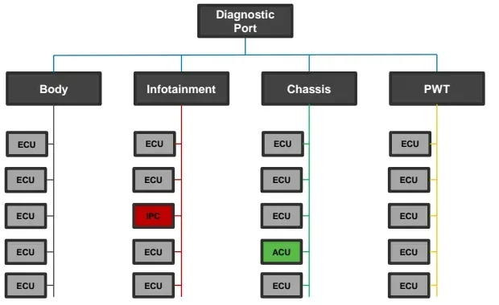
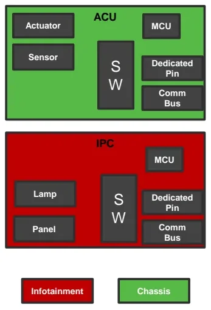
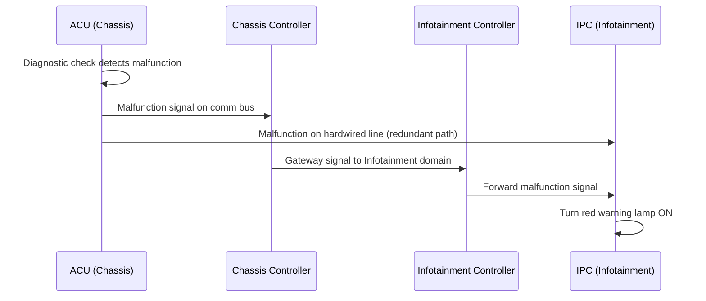

# The V-Cycle Development Model

Building a car means assembling thousands of mechanical parts, electronic
hardware and software into one product that must work safely for years. No
single team can hold all of that complexity in their head, so the automotive
industry organizes development around a formal process: the **V-Cycle** (or
V-Model). This article explains why the process exists, how the V is
structured, and walks through a real example — the airbag malfunction warning —
from vehicle concept down to component testing and back up to vehicle
acceptance.

## Why a process at all?

A modern car is a stack of *purpose-built layers*: mechanical components,
electronic hardware, software, and consumables (liquids, oils, glues). Making a
product out of these layers is a massive organizational effort, and the
industry manages it with the **People – Process – Tools** framework:

- **People** — must have clear roles and fully understand the process.
- **Process** — the *how* of the organization: a series of steps and actions
  taken to reach a defined goal.
- **Tools** — support and improve the process, but never replace it.

At its simplest, any development process is a loop:

Three terms in that loop have precise meanings you will use every day:

| Term | Meaning |
|---|---|
| **Requirement** | A singular, documented need that a product aims to satisfy |
| **Deliverable** | A tangible or intangible good or service produced as a result of a project (or part of it) |
| **Validation** | The procedure that checks whether a product actually meets its requirements |

The car itself goes through four macro-phases: **design & development**,
**productization**, **serial production**, and **servicing**. The V-Cycle
governs the first one.

## Who builds a car: OEM, Tier 1, Tier 2

Vehicle development is split across a supply chain, and the process must
coordinate all of it:

| Actor | Role |
|---|---|
| **OEM** (Original Equipment Manufacturer) | The car-maker itself (FCA/Stellantis, Ferrari, Audi, …). Owns the vehicle concept and the final integration. |
| **Tier 1** | Specialized supplier that delivers equipment **directly to the OEM** — e.g. a complete subsystem or an ECU. |
| **Tier 2** | Specialized supplier that provides parts/components **to a Tier 1** — e.g. a microcontroller (MCU) or a sensor chip that ends up inside the Tier 1's ECU. |

This layering matters for the V-Cycle: the OEM runs the vehicle-level phases,
while Tier 1 and Tier 2 suppliers run the subsystem and component phases — and
their Vs must nest inside the OEM's.

## From a flat sequence to the V

A vehicle project is a *system of systems*, so development cascades through
levels of abstraction, each with its own responsible actor:

| Level | What happens there | Typical owner |
|---|---|---|
| Vehicle Concept | Vehicle "mission" definition and requirements | OEM |
| System Design / Architecture | ECU topology, communication protocol definition | OEM |
| Subsystem Design | Specs for modules: instrument cluster, ADAS, infotainment, … | OEM + Tier 1/2 |
| Components Design | ECU/MCU specs, electrical components, SW modules | Tier 1/2 |
| Implementation | Hardware built, software written | Tier 1/2 |
| Components Testing | Unit tests of single components | Tier 1/2 |
| Integration Testing | ECU functionality tested in an integrated environment | Tier 1/2 |
| Functional Testing | Vehicle-level functionality and acceptance tests | OEM |

Drawn with specification flowing *down* on the left and verification flowing
*up* on the right, this cascade forms the letter V:

The **left branch** is design & development; the **right branch** is quality
assurance; **project management** spans the whole timeline underneath.

### The key idea: test design happens during design

The horizontal arrows in the middle of the figure are what makes the V a V and
not a waterfall. While you write a specification on the left branch, you
**simultaneously design the test** that will verify it on the right branch:

- writing *component design specs* → designing the **unit tests**,
- writing *subsystem design specs* → designing the **integration tests**,
- writing *system/vehicle specs* → designing the **functional tests**.

!!! tip "Why design tests early?"
    If a requirement cannot be tested, it is a bad requirement. Designing the
    test at specification time forces every requirement to be verifiable, and
    it means the test plan is ready the moment implementation finishes —
    instead of being invented under time pressure afterwards.

### Four characteristics of the V-Cycle

1. **Connected branches.** Every design phase has a corresponding test phase at
   the same level of abstraction, and the test is designed together with the
   spec (see above).
2. **Parallelization.** Phases are *not* strictly in series. Subsystem and
   component activities overlap in time, so the combined duration is shorter
   than the sum: Δt(Sub+Comp) < ΔtSub + ΔtComp.
3. **Scalability.** The same V shape applies at any scale. Inside a single
   ECU, software development runs its own mini-V: SW requirements (subsystem
   design) → SW architecture → SW design/configuration → implementation → unit
   testing → SW module integration testing → subsystem SW functional testing.
4. **Iterative loops and agility.** A failed test on the right branch feeds
   back into the matching design phase on the left — the V is traversed many
   times, not once.

## A running example: the airbag malfunction warning

The deck illustrates the whole V with one concrete feature: **telling the
driver that the airbag system has a malfunction**.

The airbag system is safety-critical: it must deploy flawlessly in a major
accident, must *not* deploy when not required, and any malfunction must be
promptly and properly notified to the driver. The candidate module to show the
warning is the **IPC** (Instrument Panel Cluster). Functional safety analysis
requires the notification mechanism to be reliable and fail-proof to a certain
degree, and homologation constraints allow a standard icon, orange or red —
**red** is chosen.

### Vehicle Concept

The top-left phase turns the idea into requirements:

- **Input:** none (this is where the need is born).
- **Output:** product requirements/constraints, functional test design.
- **Typical deliverable:** a *Specification of Requirements* document — the
  list of desired functionalities, the vehicle mission, homologation
  constraints, and the vehicle safety concept.

### System Design & Architecture

The vehicle gets a **domain-based topology**: ECUs sit on different
communication buses according to their function (Body, Infotainment, Chassis,
Powertrain), with a diagnostic port reaching all domains.

Note the consequence for our feature: **the IPC and the ACU (Airbag Control
Unit) live in two different domains** — Infotainment and Chassis respectively.
So the requirements produced here say:

- the **ACU** signals a malfunction over its communication bus to the
  **Chassis domain controller**,
- the signal is forwarded to the **Infotainment** domain and then to the
  **IPC**,
- the **IPC** switches the red warning lamp ON.

Because functional safety demanded extra reliability, an additional
**hardwired connection between ACU and IPC** is added as a redundant path.

Deliverables of this phase: the ECU topology, the communication bus
specifications (i.e. the **CAN Matrix**), and vehicle function specifications
(e.g. *Airbag Management*).

### Subsystem Design

Now each ECU gets its own I/O and HW/SW specifications, and the integration
tests are designed in parallel.

- **ACU** shall perform diagnostic checks on the whole functionality (sensors,
  actuators, software, hardware, communication), provide a dedicated
  malfunction signal on the communication bus, and drive the dedicated
  hardwired signal according to system status.
- **IPC** shall handle both the bus signal and the hardwired signal coherently
  with the ACU, provide a dedicated red lamp and a serigraph on the panel, and
  turn the lamp on when a malfunction signal is received.
- **Infotainment and Chassis domain controllers** shall gateway (transfer) the
  malfunction signal between the two buses.

Deliverables: hardware schematics, **SDD & SRS** (Software Design Document &
Software Requirements Specification), and I/O specifications.

### Components Design and Implementation

Subsystem specs are broken down to component level — the deliverable is the
**component datasheet** — and then the product is physically built and the
software is written (implementation sits at the bottom tip of the V).

### Components (Unit) Testing

Climbing the right branch: does each single part work as intended? For our
feature the simplest question is: *does the single LED turn on when powered?*
Typical unit tests cover:

- individual SW modules or portions of code,
- single HW components (MCU, capacitors, …),
- the electrical harness.

Deliverable: the **component test results** document.

### Integration Testing

One level up, the units are combined and the subsystem behavior is checked in
an integrated environment:

- Does the ACU actually *diagnose* a malfunction of the airbag deployment
  system and correctly trigger both the bus signal and the hardwired line?
- Does the IPC process the incoming malfunction signals — bus *and* hardwire —
  and turn the LED on?
- Can the domain controllers gateway the signal between buses?

Deliverables: the integration test results document, and — when reality
disagrees with the spec — **change requests** against the requirements.

### Functional Testing

At the vehicle level the feature is validated against its original concept,
including performance: does the system react to an airbag malfunction as
required, and does the warning satisfy the homologation constraints (the
standard red icon)? The output of this phase is the **acceptance test**
result — the OEM's sign-off that the vehicle does what the Vehicle Concept
asked for.

The full signal path being verified end-to-end:

## Reading a real project plan

Project plans used in the industry draw the V-Cycle against a calendar. A
typical plan (as in the second exercise sheet) shows, from 2019 to 2022:

- **Per-ECU timelines** (ECU 1…ECU 5) with coded software releases
  (`1A`, `2A`, `3A`, …) and hardware maturity steps (`M100`, `B100`, `B200`,
  `B500`, …).
- **Quality Gates** (`QG1`, `QG1.5`, `QG2`, …) — checkpoints where the project
  must prove a defined maturity before proceeding.
- **PCR** — a consolidated software release that bundles several ECUs; its
  timeline is *shifted* relative to the single-ECU timelines because the
  bundled release can only be built after the individual ECU releases it
  contains.
- **Vehicle fleets** — *Mules* (early prototype vehicles), the **VP fleet**
  (Verification Prototypes) and the **PS fleet** (Pre-Series vehicles) — whose
  build dates must align with the releases they are meant to validate, and with
  the certification and validation (V&V) windows.
- **J1 (Job 1)** — the start of series production in the factory; software and
  factory preparation activities converge on this date.

The skill being trained is tracing dependencies: which release must be ready
for which fleet build, which quality gate gates which phase, and what happens
to the plan when one ECU's release slips.

## Practice exercises

The lesson ships two exercise sheets (`V_Cycle_p1_Excercises.pdf` and
`V_Cycle_p2_Excercises.pdf`). Work them in this order:

1. **Concept review (part 1).** Ten questions covering this whole article: the
   evolution of cars from the 80s to now, "purpose-built vehicle", why the
   V-Cycle is needed, OEM/Tier 1/Tier 2 differences with three examples each,
   requirement/deliverable/validation definitions, the levels of testing, how
   the two branches connect, parallelization, scalability — and a capstone:
   **write a report applying the full V-Cycle to an Adaptive Cruise Control
   feature**, from design to in-car usage. A first draft is written now; the
   refined version is the final exercise for the First Milestone review.
2. **Plan analysis (part 2).** Using the project timeline described above:
   redraw the V-Cycle from the plan's milestones, analyze ECU 1's timeline
   phase by phase (gaps, colors, ends), explain what a PCR is and why its
   timeline is shifted, propose activities for a PCR software release, describe
   the VP fleet timeline and its relationship to the vehicle timeline, quality
   gates, requirements and PCRs, and finally explain J1 and what software and
   factory activities must be prepared before it.

!!! note "Deliverable"
    The completed report goes to **automotive.training@kineton.it** — when
    asking questions, quote the lesson ID and the exercise title.

!!! success "Key takeaways"
    - A car is a system of systems; development is organized with the
      People–Process–Tools framework, and the V-Cycle is the process.
    - Requirements are documented needs; deliverables are what phases produce;
      validation proves the product meets the requirements.
    - The V's left branch decomposes (Vehicle Concept → System Design →
      Subsystem Design → Components Design → Implementation); the right branch
      verifies bottom-up (Unit → Integration → Functional/acceptance testing).
    - Tests are *designed in parallel* with the specs they verify — that is the
      bridge between the branches.
    - The V is parallelized (phases overlap), scalable (a whole vehicle or a
      single ECU's software), and iterative (failures loop back into design).
    - Responsibilities follow the supply chain: OEM at vehicle level, Tier 1/2
      at subsystem and component level.
    - Real project plans map the V onto calendars with software releases,
      quality gates, prototype fleets (Mule/VP/PS), PCRs and the J1 production
      start.

!!! tip "Where this leads"
    The requirements discipline introduced here is deepened in
    [Requirements](../../mil3/requirements/index.md); the right branch of the V
    becomes hands-on in [Verification](../../mil4/verification/index.md) and
    [Validation](../../mil4/validation/index.md), and the bus-level signals of
    the airbag example are exactly what you will trace in
    [CAN, LIN & Automotive Ethernet](../can-lin/index.md) and diagnose in the
    [Diagnosis](../../mil2/diagnosis/index.md) lessons.

---

## Source material

This article was distilled from the academy lesson materials:

- :material-file-pdf-box: [V Cycle](../../assets/mil1/V_Cycle/V_Cycle.pdf) — PDF, 1.4 MB
- :material-file-pdf-box: [V Cycle p1 Excercises](../../assets/mil1/V_Cycle/V_Cycle_p1_Excercises.pdf) — PDF, 118.2 KB
- :material-file-pdf-box: [V Cycle p2 Excercises](../../assets/mil1/V_Cycle/V_Cycle_p2_Excercises.pdf) — PDF, 145.1 KB

## Downloads

- :material-file: [MP3converter](../../assets/mil1/V_Cycle/MP3converter.ps1) — 1.5 KB
