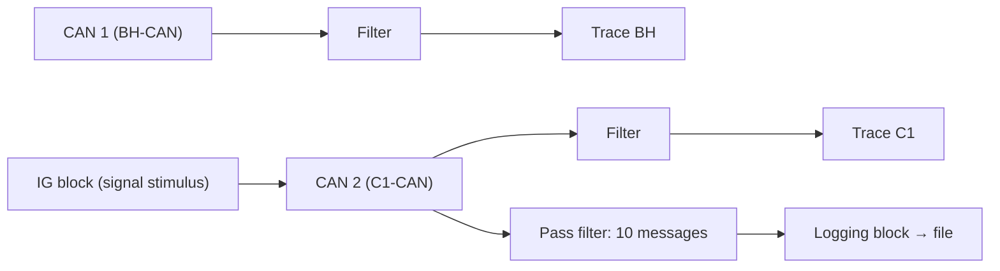
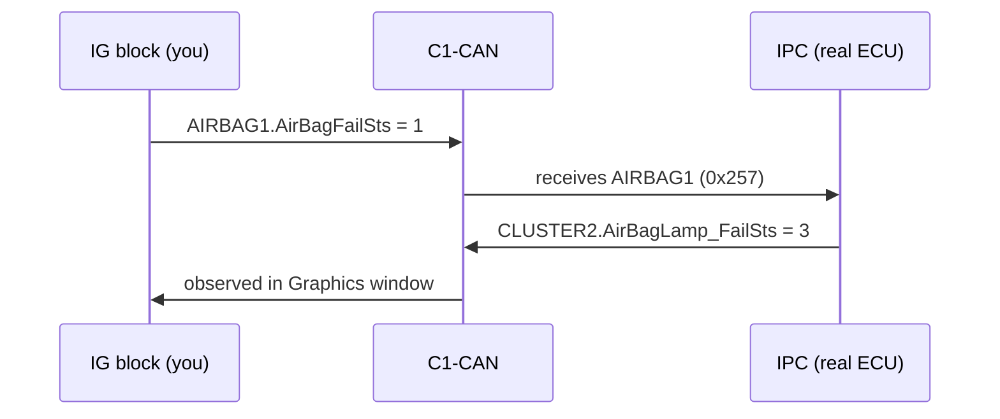

# CANalyzer Exercise: Trace Filters & the Interactive Generator (IG)

This hands-on exercise turns the CANalyzer basics from the
[CANalyzer topic](../../index.md) into practice on the **P332 BEV platform**
network databases. You will work with **two CAN channels** — the body bus
(**BH-CAN**) and the powertrain bus (**C1-CAN**) — and learn to:

- open a dedicated **Trace window** per channel and filter each one differently,
- **inject signals** onto the bus with the **Interactive Generator (IG) block**,
- verify injected values and ECU reactions in a **Graphics window**,
- record a **log file** and analyze it later in **offline mode**.

!!! note "Deliverable"
    For every step below, capture a **screenshot** that proves the result —
    this is part of the exercise sheet's requirements.

## Goal

Prove you can control a CANalyzer measurement end-to-end: observe selected
traffic with filters, stimulate the network with the IG block, and confirm that
a real ECU (the **IPC**, Instrument Panel Cluster) reacts to your simulated
input by changing the signals it transmits.

## Setup

You need:

- **CANalyzer** with a configuration containing **two CAN channels**
  (a real interface such as a VN16xx, or two virtual CAN channels).
- The two network databases, one assigned to each channel:

  | Channel | Bus | DBC file |
  |---|---|---|
  | CAN 1 | BH-CAN | `P332BEV_BH_CAN_R1_20200902_..._.dbc` |
  | CAN 2 | C1-CAN | `P332BEV_C1_CAN_R1_20200902_..._.dbc` |

- The rest of the network running (real ECUs or remaining-bus simulation), so
  the IPC actually answers your stimuli.

Key CANalyzer concepts used in this exercise, all found in the **Measurement
Setup** window (right-click a branch → *Insert…*):

- **Trace window** — live list of frames, decoded through the DBC.
- **Filter blocks** — a *pass filter* lets only selected messages through;
  a *stop filter* drops the selected messages and passes everything else.
- **IG block (Interactive Generator)** — double-click it to open a panel where
  you pick signals from the database, type physical values, and send them
  cyclically or on demand.
- **Graphics window** — plots signal values over time.
- **Logging block** — writes the (filtered) traffic to an ASC/BLF file.

## Step 1 — One Trace window per channel

Insert two Trace windows in the Measurement Setup and rename them **Trace BH**
and **Trace C1**. Connect each one to its own channel branch so that Trace BH
shows only BH-CAN traffic and Trace C1 only C1-CAN traffic. Start the
measurement and confirm both windows scroll independently.

## Step 2 — Pass filter on Trace BH (IPC traffic only)

The IPC is the most talkative node on the body bus. In Trace BH, configure a
**pass filter** that shows **only the messages transmitted and received by the
IPC**. From the BH-CAN database these are messages such as `CLUSTER5`,
`CLUSTER6`, `IPC_DISPLAY_INFO`, `IPC_VEHICLE_SETUP` … `TRIP_A/B/D` (Tx), plus
the messages where the IPC is listed as a receiver.

!!! tip
    You can also use the Trace window's own *Analysis filter* (right-click the
    trace → predefined filters) instead of a separate filter block — either
    way, the visible traffic must shrink to IPC-related frames only.

## Step 3 — Stop filter on Trace C1 (silence the BSM)

On the C1 bus the **BSM** (Brake System Module) transmits `BRAKE1`, `BRAKE8`,
`BRAKE10`, … Configure a **stop filter** on Trace C1 that blocks every message
transmitted by the BSM. Expected: the `BRAKE*` messages disappear from the
trace while all other C1 traffic keeps flowing. Note the difference from
Step 2: a pass filter *keeps* the selection, a stop filter *removes* it.

## Step 4 — Stimulate the bus with the IG block

Insert an **IG block** on the C1 channel and double-click it. Add the following
signals from the database (*Add signals from database* in the IG window), set
the values, and start the generator so the frames are sent cyclically:

| Message (ID) | Sender you replace | Signal | Value to set |
|---|---|---|---|
| `AIRBAG1` (0x257) | ORC | `AirBagFailSts` | `1` = *Fail_Not_Present_Lamp_Flashing* |
| `BRAKE1` (0x101) | BSM | `VehicleSpeedVSOSig` | **40 km/h** |
| `BCM_COMMAND` (0xFA) | BCM | `CmdIgnSts` | `4` = *RUN* |
| `ENGINE1` (0xFC) | EVCU | `PowertrainPrplsnActv` | `1` = *Active* |

Useful DBC facts when entering values:

- `VehicleSpeedVSOSig` is 13 bits, factor **0.0625 km/h/bit** — CANalyzer
  converts automatically, so just type `40` in the physical-value column.
- `CmdIgnSts` is a 3-bit value table: 0=Initialization, 1=IGN_LK, 3=ACC,
  **4=RUN**, 5=START, 7=SNA.
- `AirBagFailSts` value table: 0=Fail_Not_Present_Lamp_Off,
  **1=Fail_Not_Present_Lamp_Flashing**, 2=Fail_Present_Lamp_On, 3=Not_Used.

## Step 5 — Verify in a Graphics window

Insert a **Graphics window** and drag the four signals above into it. Verify
that each trace sits at exactly the value you set in the IG block — a flat line
at 40 km/h, `CmdIgnSts` at RUN, and so on. This closes the loop: stimulus
(IG) → bus → observation (Graphics).

## Step 6 — Closed-loop check: the IPC answers your stimulus

Now for the interesting part: the IPC **listens** to these signals and reacts
by changing what it transmits in `CLUSTER2` (0x256). Run these three tests:

| # | IG stimulus | Expected IPC response (plot it!) |
|---|---|---|
| 1 | `AIRBAG1.AirBagFailSts = 0` | `CLUSTER2.AirBagLamp_FailSts = 0` (lamp OFF, no fail) |
| 2 | `AIRBAG1.AirBagFailSts = 1` | `CLUSTER2.AirBagLamp_FailSts = 3` (BLINKING, fail not present) |
| 3 | `BRAKE8.ABSFailSts = 1` | `CLUSTER2.ABSLamp_FailSts = 2` (lamp ON) |

This is the everyday HIL/test pattern: *stimulate an input, observe the ECU's
output on the bus, compare against the specification*.

## Step 7 — Log a signal-change session

1. Pick **10 signals** in the IG block, each from a **different message**.
2. Insert a **Logging block** preceded by a **pass filter** that keeps only the
   10 messages carrying your signals — the log must contain nothing else.
3. Start logging, then **change the signal values while recording** (e.g.
   ramp the vehicle speed, toggle fail statuses).
4. Stop the measurement and keep the log file.

## Step 8 — Analyze the log in offline mode

Switch CANalyzer to **offline mode**, point the offline source at the log file
you just recorded, and start the measurement. The Trace and Graphics windows
now replay the recorded traffic: in the Graphics window each of your edits
appears as a **step in the signal trace**, and the time axis tells you the
exact instant (relative timestamp) at which you changed each signal.

!!! warning "Online vs. offline"
    Offline mode replays the log file instead of reading the hardware. The IG
    block has no effect there — you are analyzing, not stimulating. Remember to
    switch back before the next live session.

## Expected result checklist

- Two trace windows, each bound to its own channel.
- Trace BH shows IPC-related frames only; Trace C1 shows no `BRAKE*` frames.
- Graphics window confirms all four IG-driven values on the bus.
- The three IPC lamp reactions (table in Step 6) observed and plotted.
- A log file containing only the 10 selected messages, with visible value
  changes, and the change instants identified in offline replay.

## Common mistakes

- **Filter on the wrong channel** — the IPC messages for Step 2 live on BH-CAN;
  BSM/BSM braking messages live on C1-CAN. Check the DBC assignment first.
- **Confusing pass and stop filters** — Step 2 keeps the selection, Step 3
  removes it. If your trace goes empty (or nothing changes), you picked the
  wrong filter type.
- **Entering raw instead of physical values** — with the DBC assigned, IG
  fields accept physical units; typing 640 when you mean 40 km/h doubles-checks
  nothing (raw 640 × 0.0625 = 40 km/h is what the tool writes for you).
- **Forgetting to start the IG transmission** — setting a value in the IG
  panel does nothing until the generator is actually running (cyclic send).
- **Looking for the IPC response in the wrong window** — `CLUSTER2` is
  transmitted *by the IPC*; make sure the Graphics window plots
  `AirBagLamp_FailSts`/`ABSLamp_FailSts`, not your stimulus signal.
- **Analyzing a log while still online** — offline replay requires switching
  the measurement source to the file, otherwise you keep seeing live traffic.

!!! success "Key takeaways"
    - Trace windows + pass/stop filters let you watch exactly the traffic you
      care about on each CAN channel.
    - The **IG block** turns CANalyzer into a rest-bus simulator: you transmit
      real database messages with controlled signal values.
    - Stimulate → observe → compare: changing `AirBagFailSts`/`ABSFailSts` and
      watching the IPC's `CLUSTER2` lamp status is the core test pattern you
      will reuse in HIL and verification work.
    - Logging with a pre-filter and replaying in **offline mode** is how you
      document and analyze exactly when each signal changed.

---

## Source material

This article was distilled from the academy lesson materials:

- :material-file-pdf-box: [CANalyzer Exercise IG](../../../../assets/mil2/12_CANalyzer/CANalyzer_Exercise/CANalyzer_Exercise_IG/CANalyzer_Exercise_IG.pdf) — PDF, 32.9 KB

## Downloads

- :material-file: [P332BEV BH CAN R1 20200902 E2A plus CR14698 14830 14888](../../../../assets/mil2/12_CANalyzer/CANalyzer_Exercise/CANalyzer_Exercise_IG/P332BEV_BH_CAN_R1_20200902_E2A_plus_CR14698_14830_14888.dbc) — 457.8 KB
- :material-file: [P332BEV C1 CAN R1 20200902 E2A plus CR14698 14830 14888](../../../../assets/mil2/12_CANalyzer/CANalyzer_Exercise/CANalyzer_Exercise_IG/P332BEV_C1_CAN_R1_20200902_E2A_plus_CR14698_14830_14888.dbc) — 388.8 KB
