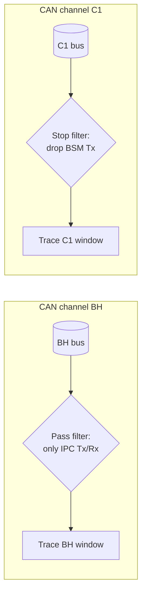
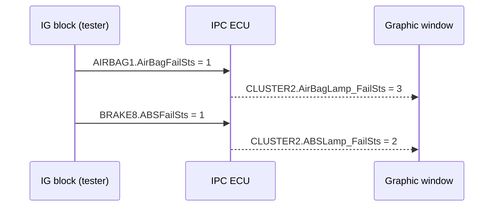

# CANalyzer Exercise — Trace Filters & IG Stimulation (Cluster)

This exercise puts the whole CANalyzer analysis chain to work on the instrument
cluster (IPC) of the P332 BEV platform. You will build a two-channel measurement
setup, filter the traffic per channel, stimulate the network with the
Interactive Generator (IG) block, and verify that the cluster reacts to the
stimulated failure states exactly as the network specification says it should.

## Goal

By the end of the exercise you should be able to:

- configure **one Trace window per CAN channel** and apply channel-specific
  pass/stop filters,
- **stimulate signals** with the IG block and confirm them in a Graphic window,
- verify **closed-loop behavior**: a stimulated input signal must produce the
  expected output signal from the IPC,
- **log selected traffic** and replay it in offline mode to measure time deltas,
- document the work in a report with screenshots of every step.

## Setup

| Item | Details |
|---|---|
| Tool | Vector CANalyzer |
| Databases | `P332BEV_BH_CAN_...E2A_plus_CR14698_14830_14888.dbc` (BH channel), `P332BEV_C1_CAN_...E2A_plus_CR14698_14830_14888.dbc` (C1 channel) |
| Channels | CAN 1 = BH (body high), CAN 2 = C1 |
| Stimulation | IG (Interactive Generator) block |
| Analysis | Trace windows, Graphic windows, logging block, offline mode |

The two DBC files describe the same vehicle platform on two different CAN
channels — assign each database to its channel so message names, signals and
value tables decode correctly in the trace.

!!! tip "Screenshot everything"
    The exercise is graded on evidence: after each step, copy a screenshot of
    the relevant window into your report document. Do this as you go, not at
    the end.

## Step 1 — Per-channel Trace windows and filters

Create **two Trace blocks** in the measurement setup, one per channel, and name
them `Trace BH` and `Trace C1`. Then apply a different filter policy to each:

- **Trace BH → pass filter for IPC.** Insert a pass filter so the window shows
  *only* messages transmitted or received by the IPC node. This is the classic
  "watch one ECU" setup you will use constantly when debugging a single
  controller on a busy bus.
- **Trace C1 → stop filter for BSM.** Insert a stop filter that *drops* all
  messages transmitted by the BSM node, leaving everything else visible. This
  is how you silence a chatty node that would otherwise flood the trace.

!!! warning "Pass vs. stop filter"
    A **pass filter** is a whitelist: only matching messages get through. A
    **stop filter** is a blacklist: matching messages are discarded and all
    others pass. Swapping the two is the most common reason a trace shows
    "nothing" or "everything".

## Step 2 — Stimulate signals with the IG block

Add an **IG block** to the measurement setup and configure it to transmit the
following signals with these values:

| Message | Signal | Value | Meaning |
|---|---|---|---|
| `AIRBAG1` | `AirBagFailSts` | `1` | Fail_not_Present_Lamp_Flashing |
| `BRAKE1` | `VehicleSpeedVSOSignal` | `40 km/h` | Vehicle speed |
| `BCM_COMMAND` | `CmdIgnSts` | `RUN` | Ignition in RUN |
| `ENGINE1` | `PowertrainPrplsnActv` | `1` | Powertrain propulsion active |

Note the pattern: you are building a **plausible vehicle state** — ignition on,
powertrain active, vehicle moving at 40 km/h — and then injecting an airbag
failure on top. ECUs like the IPC often gate their behavior on the ignition and
speed signals, so all four are needed for a realistic test.

## Step 3 — Verify the stimulation in a Graphic window

Open a **Graphic window**, drag in the four signals above, and check that each
trace settles on the value you set in the IG block (`AirBagFailSts = 1`,
speed at 40 km/h, `CmdIgnSts = RUN`, `PowertrainPrplsnActv = 1`).

This confirms the IG block is actually transmitting and the DBC decodes the
frames as expected — always verify your stimulus before trusting the system's
response to it.

## Step 4 — Closed-loop checks: how the IPC reacts

Now the real test. The IPC listens to the failure-status signals and drives its
lamp-status signals in the `CLUSTER2` message accordingly. Stimulate each input
with the IG block and verify the IPC's response in a Graphic window:

| Stimulated input (IG) | Expected IPC response |
|---|---|
| `AIRBAG1.AirBagFailSts = 0` | `CLUSTER2.AirBagLamp_FailSts = 0` |
| `AIRBAG1.AirBagFailSts = 1` | `CLUSTER2.AirBagLamp_FailSts = 3` |
| `BRAKE8.ABSFailSts = 1` | `CLUSTER2.ABSLamp_FailSts = 2` |

This is the essence of **stimulus–response testing**: you impersonate one ECU
(the airbag or brake controller) and check that another ECU (the cluster)
translates the failure status into the correct lamp command. The encoded values
(`0`, `2`, `3`) come from the value tables in the DBC — e.g. `3` for the airbag
lamp typically means "lamp flashing" rather than a simple on/off.

## Step 5 — Logging and offline time analysis

1. Pick **10 signals**, each from a *different* message, and configure a
   **logging block** so only those signals/messages are recorded (reuse a pass
   filter to restrict the log).
2. Start the measurement and the log, then **change the signals one at a time**
   in the IG block while logging.
3. Stop, switch CANalyzer to **offline mode**, and load the log file as the
   source. Step through the trace and read the timestamps of your edits.
4. Measure the delta times between signal changes:
   - first change → third change: expected **Δt ≈ 4.35 s**,
   - first change → last change: expected **Δt ≈ 9.16 s**.

The exact deltas depend on how fast you clicked, but they should be in this
ballpark — the point of the step is learning to read absolute and relative
timestamps in an offline trace, a skill you will use for every real log
analysis.

## Step 6 — Report

Assemble a single report containing, for every step above, the screenshot
evidence and the measured values: the two filtered traces, the IG
configuration, the Graphic-window verifications, the logged file, and the two
delta-time measurements.

## Common mistakes

- **Wrong filter type** — using a stop filter where a pass filter is needed
  (or vice versa) in Step 1; the trace then shows everything or nothing.
- **DBC on the wrong channel** — BH and C1 databases swapped, so signals decode
  to garbage or not at all.
- **Trusting the IG without checking** — skipping the Graphic-window
  verification in Step 3, then wondering why the IPC does not react (the IG
  generator may not even be started).
- **Unrealistic vehicle state** — forgetting `CmdIgnSts = RUN`; many ECUs
  ignore failure inputs when the ignition is off.
- **Logging the whole bus** — the exercise asks for a log containing *only*
  the 10 chosen signals; without a filter the offline analysis is needle-in-a-
  haystack.
- **Reading absolute time instead of delta** — Steps 7–8 want the *difference*
  between timestamps, not the timestamps themselves.

!!! success "Key takeaways"
    - One Trace window per channel keeps multi-bus analysis readable; pass
      filters whitelist, stop filters blacklist.
    - The IG block impersonates ECUs: stimulate a realistic vehicle state
      (ignition RUN, speed 40 km/h) plus the failure you want to test.
    - Always verify the stimulus (Graphic window) before judging the response.
    - Closed-loop check: `AirBagFailSts = 1` must produce
      `CLUSTER2.AirBagLamp_FailSts = 3`; `ABSFailSts = 1` must produce
      `CLUSTER2.ABSLamp_FailSts = 2`.
    - Log only what you need, then use offline mode to measure delta times
      (≈ 4.35 s and ≈ 9.16 s between your edits).

---

## Source material

This article was distilled from the academy lesson materials:

- :material-file-pdf-box: [CANalyzer Exercise IGTrace](../../../../assets/mil2/12_CANalyzer/CANalyzer_Exercise/CANalyzer_Exercise_IGTrace/CANalyzer_Exercise_IGTrace.pdf) — PDF, 103.8 KB

## Downloads

- :material-file: [P332BEV BH CAN R1 20200902 E2A plus CR14698 14830 14888](../../../../assets/mil2/12_CANalyzer/CANalyzer_Exercise/CANalyzer_Exercise_IGTrace/P332BEV_BH_CAN_R1_20200902_E2A_plus_CR14698_14830_14888.dbc) — 457.8 KB
- :material-file: [P332BEV C1 CAN R1 20200902 E2A plus CR14698 14830 14888](../../../../assets/mil2/12_CANalyzer/CANalyzer_Exercise/CANalyzer_Exercise_IGTrace/P332BEV_C1_CAN_R1_20200902_E2A_plus_CR14698_14830_14888.dbc) — 388.8 KB
