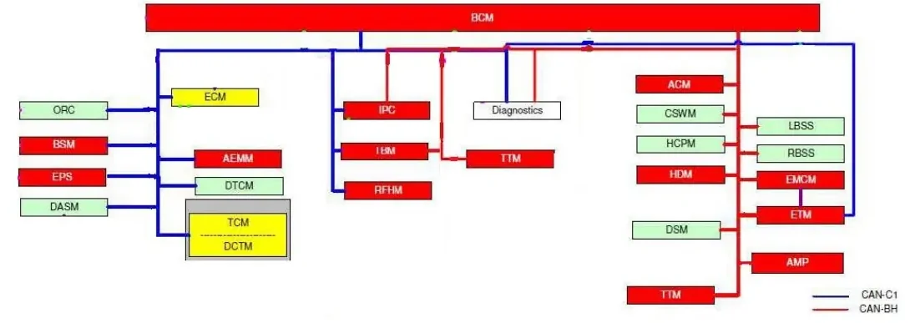
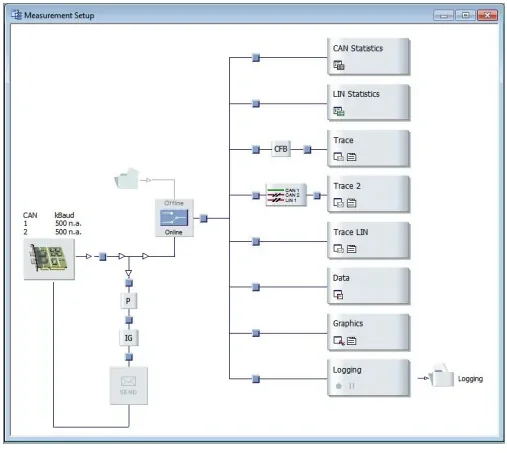
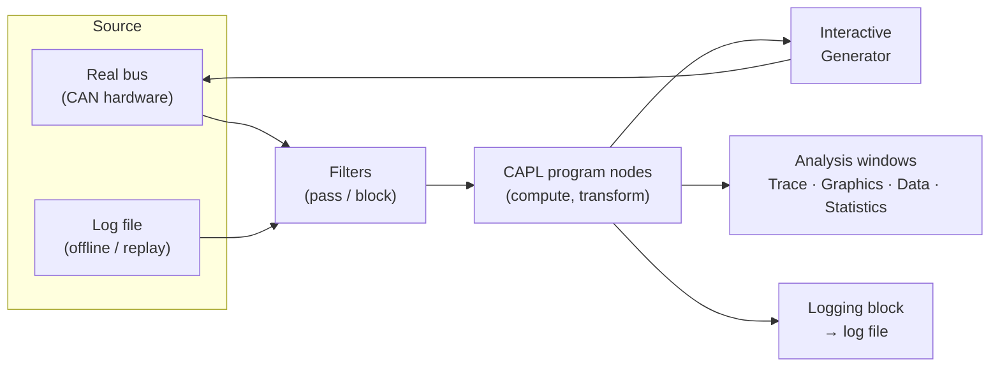
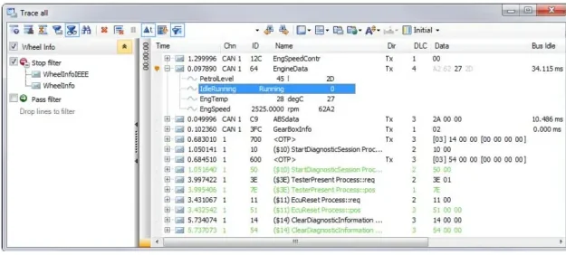
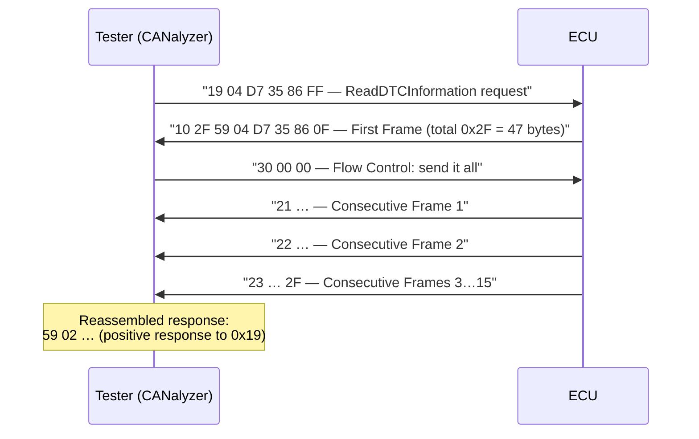

# CANalyzer — CAN Bus Analysis

**CANalyzer** is Vector's tool for **observing, logging and stimulating bus
communication** — Controller Area Network (CAN) first, but also Local
Interconnect Network (LIN) and FlexRay. It connects to a real bus (or reads a
recorded trace) and answers the fundamental question of a debugging session:
is there communication on this bus, and what does it contain? This article
covers how to set up a measurement, decode live traffic with a database, and
send messages onto the bus.

Daily work with CANalyzer reduces to three use cases:

- **Analysis** — watch messages and signals live, with decoded physical
  values, statistics and graphical plots.
- **Logging & replay** — record bus traffic to a file and play it back later
  for offline analysis.
- **Stimulation** — send messages yourself (manually, periodically, or from
  scripts) to see how Electronic Control Units (ECUs) react.

## Before the tool: the buses you will connect to

Before connecting to a vehicle, a short recap of the buses you will find in
it (full theory in
[CAN, LIN & Automotive Ethernet](../../mil1/can-lin/index.md)):

| Bus | Bit rate | Typical content |
|---|---|---|
| C-CAN | 500 kbit/s | Powertrain and emission-relevant ECUs (mandated by EOBD rules) |
| BH-CAN | 125 kbit/s | Body-high / multimedia ECUs |
| B-CAN | 50 kbit/s | Body and comfort functions |
| CAN FD | 1 Mbit/s arbitration, faster data phase | High-bandwidth ECUs |

A real vehicle carries several of these buses at once, with the Body Control
Module (BCM) often acting as the hub between them:

CAN is a **broadcast** bus — every node sees every frame — so a passive
observer like CANalyzer can be connected at any point of the bus and sees all
traffic on it.

## Physical access: where to plug in

### The EOBD / OBD-II diagnostic socket

Your standard entry point is the **diagnostic socket** — the European
On-Board Diagnostics (EOBD) connector, known in the US as OBD-II. You will
usually find it on the driver's side, between the door and the steering
column:

| Pins | Assignment |
|---|---|
| 6, 14 | EOBD CAN (CAN-H / CAN-L of the diagnostic bus) |
| 4, 5 | Ground |
| 16 | Battery +12 V |
| others | Vendor-specific |

The CAN interface hardware (e.g. a Vector **CANcardXL** or a VN16xx
interface) connects the socket to your PC over USB and presents the bus to
CANalyzer as an **online data source**.

### Wiring documents: when you tap the bus directly

At the bench or on a prototype you will often connect straight to an ECU
connector instead of the OBD socket. To do that safely you need the ECU's
**wiring document** — the pin-out table that tells you which pin carries
which signal. The lesson includes the wiring document of an Instrument Panel
Cluster (IPC) as an example: an 18-pin connector where each pin is marked
*used* or *not used* and the used ones are mapped to functions such as:

- **KL31** — ground,
- **KL30** — permanent battery positive,
- **KL15** — ignition-switched positive,
- **LIN**, **BH-CAN L/H**, **C-CAN L/H** — the communication buses,
- dedicated inputs (e.g. the EVIC push button).

!!! warning "Read the pin-out before you probe"
    KL-numbers are German automotive conventions (*Klemme* = terminal): KL30
    is always-on battery, KL15 is live only with ignition on, KL31 is ground.
    Connecting your interface to the wrong pin can feed 12 V into a CAN
    transceiver input. Always confirm CAN-H/CAN-L and ground from the wiring
    document first, and remember the bus needs its **120 Ω termination** at
    both ends to be readable — a bare ECU on the bench without termination
    will show garbage or nothing at all.

## Configuring a measurement: the Measurement Setup

Everything in CANalyzer revolves around the **Measurement Setup** window,
where the data flow is drawn and edited graphically — from the data source on
the left to the analysis windows on the right. It works like a pipeline: data
enters from the source, is processed by the inserted blocks, and is routed to
analysis windows or logging.

The building blocks you insert into the data flow:

- **Data source (online/offline).** The real bus connected via the interface
  hardware is the *online* source; a previously recorded log file is the
  *offline* source. You can replay an offline file through the exact same
  analysis setup as a live bus, which allows a problem to be re-examined
  offline at any time.
- **Analysis windows.** Trace, Graphics, Data, Statistics (details below) —
  each window can show the same data in a different way.
- **CAPL program nodes.** Small programs inserted into the data flow for
  filtering, arithmetic on signals, or custom reactions.
- **Filters.** Define which data is passed and which is explicitly blocked —
  essential on a 500 kbit/s bus, where thousands of frames per second would
  otherwise make individual messages difficult to isolate.
- **Logging blocks.** Record the (filtered) data stream to a file for later
  analysis.

## Giving bytes a meaning: DBC databases and CANdb++

Raw CAN traffic is just identifiers and data bytes. To display
`EngSpeed = 2525.0 rpm` instead of `0x64: A2 62 27 20` you attach a **DBC
(Database CAN) file** to each CAN channel in the configuration. The DBC
describes every ECU, message (identifier, data length code, cycle time) and
signal (start bit, length, byte order, factor, offset, unit) on the bus.

DBC files are created and edited with Vector's **CANdb++ Editor**, which lets
you:

- create new DBC databases from scratch,
- add messages and signals to an existing database,
- define transmission/reception relations between nodes,
- define environment variables used by CANoe simulations.

!!! tip "No DBC, no decode"
    If the trace shows only raw hex, the database assignment for that channel
    is missing. The first thing to check in any CANalyzer configuration is
    that each channel has the correct DBC — the same bus at the same bit rate
    with the wrong DBC decodes into plausible-looking nonsense. This check
    should be performed before any further analysis.

## The analysis windows

### Trace window

The **Trace Window** is the most frequently used analysis window. It is a
chronological list of every bus event — data frames, remote
frames, error frames — with timestamp, channel, identifier, name, direction,
data length code and data bytes. With a DBC attached, each message expands to
show its decoded signal values.

Capabilities that matter in daily work:

- **Filters** (pass/stop) to shrink the displayed data volume — you can even
  delete events from the data stream.
- **Hide unchanged data** — signals that do not change fade out or disappear,
  so changes become immediately visible.
- **Color highlighting** for important events and messages.
- **Markers** bound to an event's timestamp; they are shared with the other
  analysis windows, so you can jump to the same instant in the Graphics
  window.
- **Statistics** per message/signal, including time-stamp and value
  differences between consecutive events.
- **Export** of some or all of the trace contents; exported files can be
  converted between formats afterwards to reuse the same dataset in other
  tools.

### Graphics, Data and Statistics windows

| Window | What it shows | Typical use |
|---|---|---|
| Graphics | Signal values over time as curves | Watch sensor ramps, correlate two signals, spot dropouts |
| Data | Current values of signals, system variables and diagnostic parameters in configurable representations | Dashboard-style live monitoring |
| Statistics | Bus load per node and per frame, burst counters/durations, frame and error counters/rates, controller states | Verify the bus is healthy and not overloaded |

The Graphics window supports measurement and difference markers (synchronized
with the Trace window), min/max display per signal in the legend, statistics
(min, max, mean, standard deviation), and direct logging of signals to
signal-based **MDF (Measurement Data Format)** files — the whole waveform or
just the visible section.

## Diagnostics from CANalyzer

CANalyzer does not just observe diagnostic traffic — with its **Diagnostic
Feature Set** it can act as the diagnostic tester itself. It speaks the two
protocol families you will meet throughout the bootcamp: **KWP2000** (Keyword
Protocol 2000, the older standard) and **UDS (Unified Diagnostic Services,
ISO 14229)**, the modern one. The tester behavior is driven by diagnostic
description files in **ODX (Open Diagnostic Data Exchange, as PDX files)** or
**CANdelaStudio (CDD)** format; when no description file is available, a
**Basic Diagnostic Editor** lets you define simple services quickly.

In practice you will use three interactive windows: the **Diagnostic
Console** (send services and read responses), the **Fault Memory Window**
(read and clear Diagnostic Trouble Codes, DTCs) and the **Diagnostic Session
Control** (switch sessions, with a configurable Security-DLL). A
preconfigured **OBD-II tester** with its own console and fault memory window
is included as well. Transport- and diagnostic-layer timing parameters are
adjusted in the **Diagnostic/ISO-TP Configuration** dialog.

### ISO-TP multi-frame transfers in the trace

Diagnostic payloads routinely exceed the 8 bytes of a single CAN frame, so
**ISO-TP (ISO 15765-2)** — the transport protocol for diagnostics over CAN —
segments them. Recognizing the frame types in a trace saves you from
misreading diagnostic exchanges: the first nibble of the first data byte
tells you the frame type.

| First nibble | Frame type | Role |
|---|---|---|
| `0x0` | Single Frame | Whole payload fits in one frame |
| `0x1` | First Frame | Starts a multi-frame transfer; carries the total length |
| `0x2` | Consecutive Frame | Continuation; low nibble is the sequence counter (1…F, wrap) |
| `0x3` | Flow Control | Receiver's permission to continue (block size, separation time) |

In the example above (from the lesson's workshop capture) the tester requests
DTC data with service **0x19 subfunction 0x04**, the ECU answers with a First
Frame announcing **0x2F = 47 payload bytes**, the tester releases the
transfer with a Flow Control (`30 00 00`), and the payload arrives in
Consecutive Frames numbered `21`, `22`, … `2F`. With a
diagnostic description loaded, CANalyzer reassembles all of this
automatically and shows the decoded service; without one, the bytes must be
stitched together manually.

## Logging and replay

For post-measurement analysis you log the bus traffic to a file and replay it
later, time-independently:

1. Insert a **logging block** in the Measurement Setup and start the
   measurement — everything passing that point in the data flow is recorded.
2. Alternatively, log directly from the **Graphics window** (signal-based
   MDF) or the **Data window**.
3. For analysis, switch the data source to **offline** and point it at the
   log file: the recorded traffic flows through the same filters, CAPL nodes
   and analysis windows as if it were live.

This online/offline symmetry is a standard workflow: capture in the vehicle,
analyze at the desk, and hand the same file to a colleague, who can reproduce
exactly the same measurement.

## Stimulation: making the bus talk

CANalyzer is not only a listener — you can inject traffic to see how ECUs
behave. Start simple and scale up as you need to:

- **Interactive Generator (IG).** The quickest way to send: build a send list
  of messages (manually or from the database), set raw data or physical
  signal values in the signal list, and transmit once, periodically, on a key
  press or on a screen button. An integrated **Signal Generator** can drive a
  signal with a waveform (ramps, sine, …) instead of a fixed value.
- **Panels.** Custom graphical interfaces — sliders, gauges, switches —
  built with the **Panel Designer** by dragging controls and linking them to
  signals or variables. Panels display analysis data or feed values into
  CAPL programs.
- **Visual Sequencer.** Predefined programming steps to build command
  sequences without writing code.
- **CAPL and .NET.** Full programming for anything the above cannot express.

**CAPL (Communication Access Programming Language)** deserves its own mention
because it extends CANalyzer everywhere:

- **C-like syntax** — quick to learn if you know C.
- **Event-oriented** — instead of a main loop you write event procedures
  (`on message …`, `on timer …`, `on key …`) that run when the event occurs.
- **Symbolic access** — you work with database messages and signals by name,
  in physical units, not raw bytes.
- **Analysis and stimulation** — count events, compute on signals, generate
  messages to stimulate ECUs; works both online and offline.
- Programs are written in the **CAPL Browser**, which goes beyond a plain
  editor (symbol completion, compilation, debugging).

CAPL is covered in depth in the [CAPL lessons](../capl/index.md); the related
tool CANoe is covered in the
[CANoe lessons](../canoe/index.md). CANoe adds full network simulation and
remaining-bus modeling on top of the same measurement concepts, so the
content of this article transfers directly.

!!! success "Key takeaways"
    - CANalyzer covers three use cases — analysis, logging/replay and
      stimulation — configured as blocks in the Measurement Setup data flow.
    - Bus access is via the EOBD socket (pins 6/14 CAN, 4/5 GND, 16 +12 V)
      or directly at ECU pins identified from the wiring document
      (KL30 / KL15 / KL31).
    - A DBC database must be assigned to each channel; without it, only raw
      frames are shown and no signal decoding takes place.
    - Trace, Graphics, Data and Statistics are different views on the same
      data stream; filters and markers keep large traces manageable.
    - Diagnostics are built in (UDS/KWP2000 tester, DTC fault memory);
      ISO-TP multi-frame transfers are identified by the 1/3/2
      First Frame / Flow Control / Consecutive Frame nibbles.
    - Stimulation ranges from the Interactive Generator for simple message
      sending to CAPL for fully programmed behavior.

!!! tip "Where this leads"
    Practice these concepts hands-on in the
    [CANalyzer exercises](canalyzer-exercise/index.md), then learn to script
    node behavior in [CAPL](../capl/index.md) and to run full diagnostics in
    the [Diagnosis](../diagnosis/index.md) lessons.

## Sub-sections

- [CANalyzer Exercise](canalyzer-exercise/index.md)

---

## Source material

This article was distilled from the academy lesson materials:

- :material-file-pdf-box: [CANalyzer](../../assets/mil2/12_CANalyzer/CANalyzer.pdf) — PDF, 2.0 MB
- :material-file-pdf-box: [Wiring Document IPC](../../assets/mil2/12_CANalyzer/Wiring_Document_IPC.pdf) — PDF, 208.2 KB

## Downloads

- :material-file: [CANalyzer Multiframe](../../assets/mil2/12_CANalyzer/CANalyzer_Multiframe.png) — 929.2 KB
