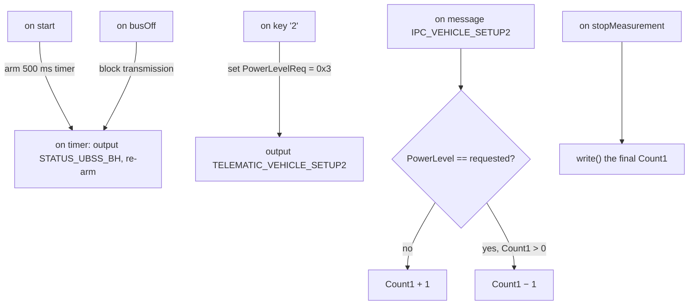

# CAPL Exercise — Simulating the IPC Environment

In this exercise you play the role of the surrounding vehicle network for the
**IPC** (Instrument Panel Cluster) ECU on the P332 BEV BH-CAN bus. Instead of
connecting the real cluster, you write a CAPL program in CANoe/CANalyzer that
generates the traffic the IPC expects, sends a configuration request on a key
press, and checks whether the IPC's reply agrees with what was requested.

The exercise ties together every CAPL construct from the
[CAPL lessons](../../index.md): cyclic timers, keyboard events, message event
handlers, bus-off handling, and measurement-end reporting.

## Goal

Write one CAPL program node that, for the whole measurement:

1. sends the `STATUS_UBSS_BH` message cyclically with the period defined in
   the DBC;
2. sends `TELEMATIC_VEHICLE_SETUP2` with `PowerLevelReq = 0x3` when the `2`
   key is pressed;
3. counts how often the `PowerLevel` signal reported back by the IPC does
   **not** match the requested value;
4. stops transmitting if a bus-off condition occurs;
5. prints the final mismatch count to the Write window when the measurement
   stops.

## Setup

You need:

- **CANoe** (or CANalyzer) with a CAN channel — real hardware or virtual,
- the network database `P332BEV_BH-CAN_R1_20200902_E2A_plus_CR14698_14830_14888.dbc`
  from the exercise folder.

Create a new configuration, assign the DBC to CAN channel 1
(*Simulation Setup → right-click the channel → Databases → Add*), then insert a
program node: right-click the node position in the Simulation Setup and choose
**Insert Network Node** (CANoe) or **Insert Program Node** (CANalyzer), then
open its CAPL editor. If you need a refresher on the tool workflow, see the
[CANalyzer](../../../canalyzer/index.md) and [CANoe](../../../canoe/index.md)
lessons.

### The messages involved

Everything below comes from the DBC — always check it rather than guessing
IDs, periods or signal positions:

| Message | ID (dec/hex) | DLC | Sender | Timing |
|---|---|---|---|---|
| `STATUS_UBSS_BH` | 1206 / 0x4B6 | 4 | BCM | cyclic, `GenMsgCycleTime` = **500 ms** |
| `TELEMATIC_VEHICLE_SETUP2` | 162 / 0xA2 | 8 | ETM | event-driven (no cycle time) |
| `IPC_VEHICLE_SETUP2` | 1486 / 0x5CE | 8 | IPC | cyclic, 1000 ms |

The two signals that matter:

- `PowerLevelReq` — the request, 3 bits at start bit 42 of
  `TELEMATIC_VEHICLE_SETUP2`;
- `PowerLevel` — the IPC's feedback, 3 bits at start bit 43 of
  `IPC_VEHICLE_SETUP2`.

!!! warning "Follow the DBC, not the task sheet's shorthand"
    The exercise sheet says to watch the `PowerLevel` signal "in
    `IPC_VEHICLE_SETUP`", but in this DBC that signal actually lives in
    **`IPC_VEHICLE_SETUP2`** (the plain `IPC_VEHICLE_SETUP` has no
    `PowerLevel`). The DBC is the source of truth — attach your message event
    handler to the message that really carries the signal.

## How the program fits together

CAPL is event-driven: there is no main loop, just procedures that run when
something happens. This exercise needs one handler per event type:



## Step by step

### 1. Declare the state

In the `variables` block declare a timer, message objects for the two messages
you transmit, the counter, the last requested value, and a flag for the bus
state:

```c
variables
{
  msTimer tUbss;                            // drives STATUS_UBSS_BH
  message STATUS_UBSS_BH msgUbss;
  message TELEMATIC_VEHICLE_SETUP2 msgSetup;
  int  Count1 = 0;                          // mismatch counter
  int  reqPowerLevel = 0;                   // last value sent as PowerLevelReq
  int  busOk = 1;                           // 0 after a bus-off
  const int UBSS_CYCLE_MS = 500;            // GenMsgCycleTime from the DBC
}
```

### 2. Start the cyclic transmission

`on start` runs once when the measurement begins. Arm the timer there; the
timer handler outputs the message and re-arms itself, which gives the 500 ms
cycle "for the entire measurement duration". The `busOk` check makes the
handler go silent after a bus-off without any further bookkeeping:

```c
on start
{
  setTimer(tUbss, UBSS_CYCLE_MS);
}

on timer tUbss
{
  if (busOk)
  {
    output(msgUbss);
    setTimer(tUbss, UBSS_CYCLE_MS);   // re-arm for the next period
  }
}
```

!!! tip
    In CANoe you can also use `setTimerCyclic(tUbss, UBSS_CYCLE_MS)` and drop
    the re-arm line. The manual re-arm version works everywhere and makes the
    period explicit.

### 3. Send the request on key press

`on key '2'` fires when the user presses `2` during the measurement. Set the
signal, remember what you requested, and put the message on the bus:

```c
on key '2'
{
  msgSetup.PowerLevelReq = 0x3;
  reqPowerLevel = 0x3;
  output(msgSetup);
}
```

### 4. Judge the IPC's answer

Every time the IPC's feedback message arrives, compare its `PowerLevel` with
the value you requested. The counter goes up on a mismatch and down on a
match — but never below zero:

```c
on message IPC_VEHICLE_SETUP2
{
  if (this.PowerLevel != reqPowerLevel)
  {
    Count1++;
  }
  else if (Count1 > 0)        // counter must never go negative
  {
    Count1--;
  }
}
```

### 5. React to bus-off and report at the end

A bus-off means the channel has shut down after too many transmit errors (see
the error-confinement state machine in
[CAN, LIN & Automotive Ethernet](../../../../mil1/can-lin/index.md)). The
`on busOff` handler flips the flag that silences the timer handler, and
`on stopMeasurement` prints the required sentence:

```c
on busOff
{
  busOk = 0;                  // timer handler stops outputting STATUS_UBSS_BH
}

on stopMeasurement
{
  write("PowerLevel signal value has been different from PowerLevelReq one %d times",
        Count1);
}
```

## Expected result

With the measurement running you should see in the Trace window:

- `STATUS_UBSS_BH` (0x4B6) appearing every 500 ms from your node;
- one `TELEMATIC_VEHICLE_SETUP2` (0xA2) each time you press `2`, with
  `PowerLevelReq = 3` in the decoded signals;
- incoming `IPC_VEHICLE_SETUP2` frames (real or simulated by a second node).

When you stop the measurement, the Write window shows a line like:

```
PowerLevel signal value has been different from PowerLevelReq one 12 times
```

## Common mistakes

- **Forgetting to re-arm the timer.** `setTimer` fires once; without the
  second `setTimer` call inside `on timer`, `STATUS_UBSS_BH` is sent exactly
  one time.
- **Letting `Count1` go negative.** Decrement unconditionally and the very
  first matching frame already takes you to −1; guard with `Count1 > 0`.
- **Handling the wrong message.** Attach `on message` to the message that
  actually carries `PowerLevel` in *this* DBC (`IPC_VEHICLE_SETUP2`) — a
  handler on a message that never carries the signal never runs.
- **Comparing against a hardcoded 0x3 only.** The logic must compare against
  the value you *last requested* — store it when you send the request, or the
  program breaks as soon as the requirement changes to another key/value.
- **Stopping the timer instead of guarding it on bus-off.** Either approach
  works, but if you cancel the timer inside `on busOff` remember that
  restarting the measurement is the only way back — the flag approach keeps
  the state machine obvious.
- **Editing the CAPL file while the measurement runs.** Compile (F9) and check
  for errors *before* starting; a node with a compile error is silently
  inactive.

!!! success "Key takeaways"
    - CAPL programs are pure event handlers: `on start`, `on timer`, `on key`,
      `on message`, `on busOff`, `on stopMeasurement` — no main loop.
    - Cyclic transmission = `setTimer` in `on start` + output and re-arm in
      `on timer`; the period comes from the DBC's `GenMsgCycleTime`
      (500 ms here).
    - Keep the "requested" value in a variable so received feedback can be
      compared against it; protect counters from going negative.
    - React to bus-off by stopping transmissions, and use `on stopMeasurement`
      plus `write()` for end-of-run reporting.

---

## Source material

This article was distilled from the academy lesson materials:

- :material-file-pdf-box: [CAPL Exercise](../../../../assets/mil2/14_CAPL/CAPL_Exercise/CAPL_Exercise/CAPL_Exercise.pdf) — PDF, 667.3 KB

## Downloads

- :material-file: [P332BEV BH CAN R1 20200902 E2A plus CR14698 14830 14888](../../../../assets/mil2/14_CAPL/CAPL_Exercise/CAPL_Exercise/P332BEV_BH_CAN_R1_20200902_E2A_plus_CR14698_14830_14888.dbc) — 457.8 KB
