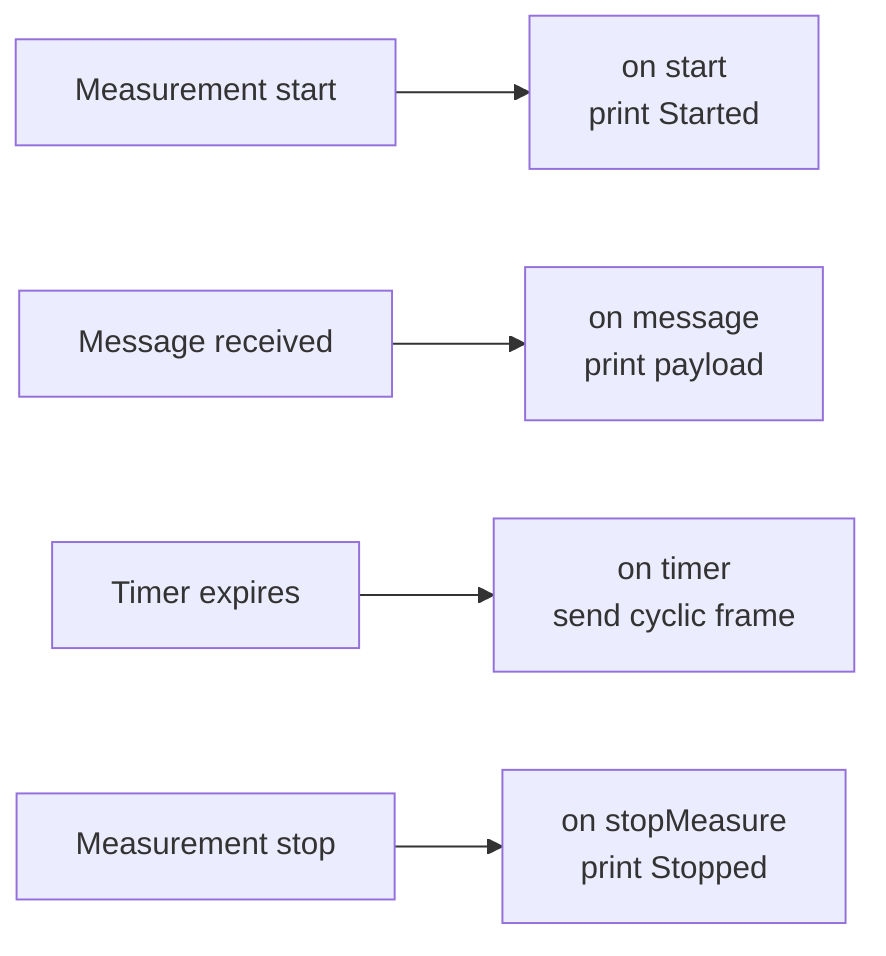

# CAPL Exercise 8 — Logging, Graphics and a First CAPL Node

This exercise closes the CAPL lesson block by combining two skills in one
working configuration: setting up a complete CANoe/CANalyzer measurement
(trace logging plus signal graphics, as in the earlier CANalyzer/IG exercise)
and writing your first **CAPL program node** that reacts to the measurement
lifecycle and to live bus traffic.

## Goal

Build a configuration that:

1. **Observes and logs** the CAN trace coming from the real ECU connected to
   the CANcase interface.
2. **Displays at least two signals of interest in a Graphics window** with
   enough samples to see them evolve over time.
3. Hosts a **CAPL node** that:
   - prints `"Started"` when the measurement begins,
   - prints `"Stopped"` when the measurement ends,
   - prints the raw payload of one specific received CAN message,
   - transmits a CAN message at the correct cycle time so that the connected
     ECU actually accepts it.

## Setup

- **CANoe or CANalyzer** (a licensed demo version is enough), with a
  **CANcaseXL** (or compatible Vector interface) wired to the target ECU.
- The **DBC files** supplied with the exercise: they describe the platform's
  BH-CAN and C-CAN networks. Assign the one matching the bus your CANcase
  channel is physically connected to — without a database, the Graphics
  window cannot resolve raw frames into named signals.
- A new configuration (File → New → CAN template), with the hardware channel
  mapped and the correct bit rate set for the bus.

!!! tip "Check the bus first"
    Before writing any code, run a plain measurement and confirm you see
    traffic in the Trace window. No traffic usually means a wrong bit rate,
    a missing termination, or the wrong channel mapping — fix that before
    moving on.

## Step-by-step procedure

### 1. Trace and logging

1. Add a **Trace window** (Configuration → Trace) so you can watch frames
   live, decoded through the DBC.
2. Insert a **Logging block** in the Measurement Setup and configure the
   destination file (`.asc` is fine for this exercise) and trigger mode.
   Start a measurement, let it run a few seconds, stop it, and reopen the
   logged file to verify frames were actually recorded.

### 2. Graphics window

1. Add a **Graphics window** and drag at least two signals of interest from
   the symbol explorer (DBC tree) into it — pick signals that actually change
   (a counter, a speed, a state machine), not constants.
2. Run the measurement long enough to collect visible samples and confirm
   both curves update.

### 3. The CAPL node

Insert a **program node** in the Measurement Setup (right-click on the CAN
bus line → *Insert CAPL Test Module / Program node*) and open the CAPL
Browser. The program is organized around **event handlers**:



A skeleton covering all four requirements:

```c
variables
{
  msTimer cyclicTimer;   // timer driving the cyclic transmission
  message 0x100 txMsg;   // the message we send to the ECU
}

on start
{
  write("Started");
  txMsg.dlc = 8;
  txMsg.byte(0) = 0x00;  // fill payload as required by the ECU
  setTimer(cyclicTimer, 100);   // first send after 100 ms
}

on message 0x1A0   // one specific message of interest from the DBC
{
  write("RX 0x1A0 payload: %02x %02x %02x %02x %02x %02x %02x %02x",
        this.byte(0), this.byte(1), this.byte(2), this.byte(3),
        this.byte(4), this.byte(5), this.byte(6), this.byte(7));
}

on timer cyclicTimer
{
  output(txMsg);
  setTimer(cyclicTimer, 100);   // re-arm: 100 ms cycle time
}

on stopMeasure
{
  write("Stopped");
}
```

Key points:

- **`on start` / `on stopMeasure`** bracket the whole measurement — this is
  where the `"Started"` / `"Stopped"` prints belong, not inside message
  handlers.
- **`on message <id>`** fires once per received frame; `this` refers to the
  triggering message, and `this.byte(n)` reads individual payload bytes.
- **Cyclic sending is done with a re-armed timer**: `setTimer()` inside the
  `on timer` handler keeps the frame going. The cycle time must match what
  the ECU expects for that message — look it up in the DBC's message
  attributes (e.g. a 100 ms cycle), because an ECU monitoring that frame will
  raise a timeout error if the period is wrong.

## Expected result

- The Write window shows `Started` at measurement start and `Stopped` at
  the end.
- Each reception of the chosen message prints its 8 payload bytes in the
  Write window.
- The transmitted frame appears in the Trace window at the correct cycle
  time, and the connected ECU reacts to it (no missing-message error, and
  any behavior driven by that frame occurs).
- The logging file contains the recorded trace, and the Graphics window
  shows the two selected signals evolving with real samples.

## Common mistakes

!!! warning "Watch out for these"
    - **No database assigned**: signals won't appear in the symbol explorer
      and the Graphics window stays empty. Attach the DBC to the bus in the
      configuration first.
    - **Wrong cycle time on the transmitted frame**: sending a 100 ms message
      at 10 ms floods the bus; sending it too slowly triggers timeout faults
      in the ECU. Always copy the cycle time from the DBC.
    - **Forgetting to re-arm the timer**: `setTimer()` fires once — without
      the call inside `on timer`, your message is sent exactly one time.
    - **Printing from the wrong handler**: `on stopMeasure` is the correct
      place for the "Stopped" message; code after a measurement loop will
      never run, because CAPL is purely event-driven.
    - **Channel/bit rate mismatch with the CANcase**: no reception at all,
      or error frames only.

!!! success "Key takeaways"
    - A complete measurement setup = Trace + Logging + Graphics, driven by a
      DBC database that decodes raw frames into signals.
    - CAPL is event-driven: `on start`, `on message`, `on timer` and
      `on stopMeasure` cover the full lifecycle of this exercise.
    - Cyclic transmission is a self-re-arming timer plus `output()`, and the
      cycle time must match the DBC specification or the receiving ECU will
      fault.
    - `this.byte(n)` gives you direct access to a received frame's payload.

---

## Source material

This article was distilled from the academy lesson materials:

- :material-file-pdf-box: [CAPL Exercise8](../../../../assets/mil2/14_CAPL/CAPL_Exercise/CAPL_Exercise8/CAPL_Exercise8.pdf) — PDF, 18.9 KB

## Downloads

- :material-file: [P332BEV BH CAN R1 20200902 E2A plus CR14698 14830 14888 (1)](../../../../assets/mil2/14_CAPL/CAPL_Exercise/CAPL_Exercise8/P332BEV_BH_CAN_R1_20200902_E2A_plus_CR14698_14830_14888_(1).dbc) — 457.8 KB
- :material-file: [P332BEV C1 CAN R1 20200902 E2A plus CR14698 14830 14888](../../../../assets/mil2/14_CAPL/CAPL_Exercise/CAPL_Exercise8/P332BEV_C1_CAN_R1_20200902_E2A_plus_CR14698_14830_14888.dbc) — 388.8 KB
