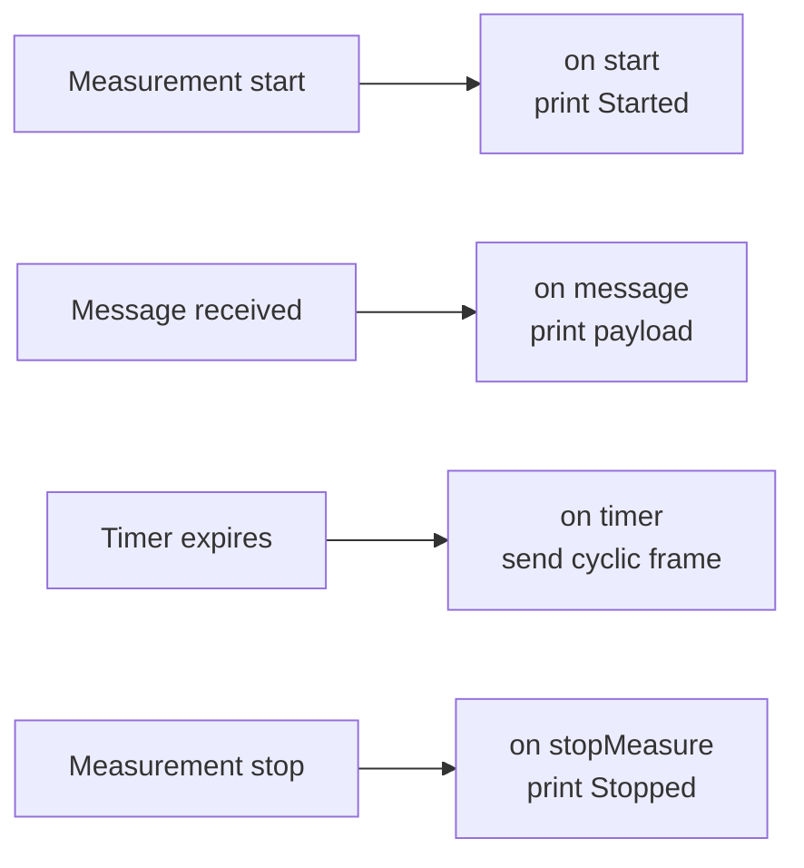

# CAPL Exercise 8 — Logging, Graphics and Your First CAPL Node

This is the final exercise of the CAPL (**Communication Access Programming
Language**, Vector's C-like scripting language for CANoe/CANalyzer) block.
It combines the measurement setup tasks from the previous exercises with the
creation of a first CAPL program node: you will set up a complete measurement
on a real bus *and* write a CAPL node that reacts to that measurement as it
runs.

By the end of this exercise you will be able to:

- build a CANoe/CANalyzer configuration that **observes and logs** live CAN
  (Controller Area Network) traffic from a real ECU (Electronic Control Unit),
- **plot at least two signals of interest** in a Graphics window and watch
  them evolve with real samples,
- write a **CAPL node** that prints `"Started"` / `"Stopped"` around the
  measurement, prints the payload of a received CAN message, and transmits a
  cyclic frame that the connected ECU actually accepts.

The workflow follows the standard test-engineering sequence: observe the bus
first, then script behavior on top of the observed traffic.

## Goal

Build a configuration that:

1. **Observes and logs** the CAN trace coming from the real ECU wired to your
   CANcase interface (the same measurement setup you built in the CANalyzer/IG
   exercise — IG being the *Interactive Generator* used to send frames by
   hand).
2. **Displays at least two signals of interest in a Graphics window**, with
   enough samples to see them move over time.
3. Hosts a **CAPL program node** that:
   - prints `"Started"` when the measurement begins,
   - prints `"Stopped"` when the measurement ends,
   - prints the raw payload of one specific received CAN message,
   - transmits a CAN message at the correct cycle time so the connected ECU
     accepts it without raising an error.

## Setup

- **CANoe or CANalyzer** — a licensed demo version is enough for this
  exercise.
- A **CANcaseXL** (or compatible Vector interface) cabled to the target ECU.
- The **DBC (Database CAN) files** supplied with the exercise, describing the
  platform's BH-CAN and C-CAN networks. Assign the one matching the bus your
  CANcase channel is physically connected to — without a database, the
  Graphics window cannot turn raw frames into named signals.
- A fresh configuration (File → New → CAN template) with the hardware channel
  mapped and the correct bit rate for the bus.

!!! tip "Check the bus first"
    Before writing a single line of CAPL, run a plain measurement and confirm
    traffic shows up in the Trace window. A silent bus almost always means a
    wrong bit rate, a missing termination, or a wrong channel mapping — these
    issues must be corrected before any scripting work begins.

## Steps

### 1. Trace and logging

1. Add a **Trace window** (Configuration → Trace) so you can watch frames
   live, decoded through the DBC.
2. Insert a **Logging block** in the Measurement Setup, point it at a
   destination file (`.asc` is fine here) and set the trigger mode.
3. Start a measurement, let it run a few seconds, stop it, then reopen the
   logged file and confirm frames were actually recorded.

### 2. Graphics window

1. Add a **Graphics window** and drag at least two signals of interest from
   the symbol explorer (the DBC tree) into it. Pick signals that actually
   change — a counter, a speed, a state machine — not constants.
2. Run the measurement long enough to collect visible samples and confirm
   both curves update.

### 3. The CAPL node

Insert a **program node** in the Measurement Setup (right-click on the CAN
bus line → *Insert CAPL Test Module / Program node*) and open the CAPL
Browser. CAPL is purely **event-driven**: instead of a main loop, you write
handlers that fire when something happens. The complete program consists of
four handlers:



A skeleton covering all four requirements:

```c
variables
{
  msTimer cyclicTimer;   // timer driving the cyclic transmission
  message 0x100 txMsg;   // the message we send to the ECU
}

on start
{
  write("Started");
  txMsg.dlc = 8;
  txMsg.byte(0) = 0x00;  // fill payload as required by the ECU
  setTimer(cyclicTimer, 100);   // first send after 100 ms
}

on message 0x1A0   // one specific message of interest from the DBC
{
  write("RX 0x1A0 payload: %02x %02x %02x %02x %02x %02x %02x %02x",
        this.byte(0), this.byte(1), this.byte(2), this.byte(3),
        this.byte(4), this.byte(5), this.byte(6), this.byte(7));
}

on timer cyclicTimer
{
  output(txMsg);
  setTimer(cyclicTimer, 100);   // re-arm: 100 ms cycle time
}

on stopMeasure
{
  write("Stopped");
}
```

The four handlers in detail:

- **`on start` / `on stopMeasure`** bracket the entire measurement — this is
  where the `"Started"` / `"Stopped"` prints belong, not inside a message
  handler.
- **`on message 0x1A0`** fires once per received frame with that identifier.
  Inside it, `this` is the message that triggered the handler, and
  `this.byte(n)` reads its payload byte by byte.
- **Cyclic sending is a self-re-arming timer plus `output()`**: each time the
  timer fires you send the frame and call `setTimer()` again. The cycle time
  must match what the ECU expects for that message — copy it from the DBC's
  message attributes (e.g. 100 ms), because an ECU monitoring that frame will
  raise a timeout error if the period is wrong.

## Expected result

- The Write window shows `Started` at measurement start and `Stopped` at the
  end.
- Every reception of the chosen message prints its 8 payload bytes.
- Your transmitted frame appears in the Trace window at the correct cycle
  time, and the connected ECU reacts to it — no missing-message error, and
  whatever behavior that frame drives actually happens.
- The logging file contains the recorded trace, and the Graphics window shows
  both selected signals evolving with real samples.

## Common mistakes

!!! warning "Watch out for these"
    - **No database assigned**: signals never appear in the symbol explorer
      and the Graphics window stays empty. Attach the DBC to the bus in the
      configuration first.
    - **Wrong cycle time on the transmitted frame**: sending a 100 ms message
      at 10 ms floods the bus; sending it too slowly triggers timeout faults
      in the ECU. Always copy the cycle time from the DBC.
    - **Forgetting to re-arm the timer**: `setTimer()` fires once — without
      the call inside `on timer`, your message goes out exactly one time.
    - **Printing from the wrong handler**: `on stopMeasure` is the correct
      place for "Stopped"; code waiting after some loop will never run,
      because CAPL has no main loop — it only responds to events.
    - **Channel or bit-rate mismatch with the CANcase**: no reception at all,
      or nothing but error frames.

!!! success "Key takeaways"
    - A complete measurement setup combines Trace, Logging, and Graphics
      windows, with a DBC decoding raw frames into named signals.
    - CAPL is event-driven: the four handlers `on start`, `on message`,
      `on timer`, and `on stopMeasure` cover all behaviors required by this
      exercise.
    - Cyclic transmission is implemented with `output()` inside a re-armed
      timer, and the cycle time must match the DBC or the receiving ECU will
      fault.
    - `this.byte(n)` reads the payload of a received frame one byte at a
      time, providing the basis for scripted reactions to bus traffic.

---

## Source material

This article was distilled from the academy lesson materials:

- :material-file-pdf-box: [CAPL Exercise8](../../../../assets/mil2/14_CAPL/CAPL_Exercise/CAPL_Exercise8/CAPL_Exercise8.pdf) — PDF, 18.9 KB

## Downloads

- :material-file: [P332BEV BH CAN R1 20200902 E2A plus CR14698 14830 14888 (1)](../../../../assets/mil2/14_CAPL/CAPL_Exercise/CAPL_Exercise8/P332BEV_BH_CAN_R1_20200902_E2A_plus_CR14698_14830_14888_(1).dbc) — 457.8 KB
- :material-file: [P332BEV C1 CAN R1 20200902 E2A plus CR14698 14830 14888](../../../../assets/mil2/14_CAPL/CAPL_Exercise/CAPL_Exercise8/P332BEV_C1_CAN_R1_20200902_E2A_plus_CR14698_14830_14888.dbc) — 388.8 KB
