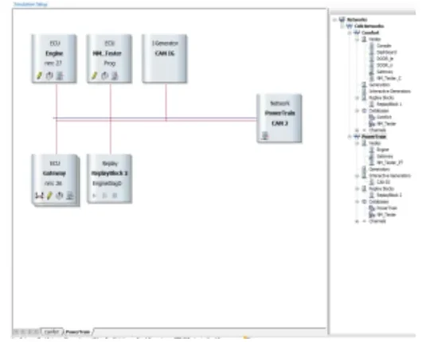
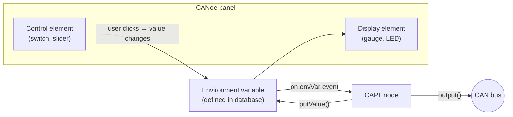

# CAPL In Depth — Language, Events and Functions

Welcome to your deep dive into **CAPL**. You have already met the basics in the
main CAPL lesson; this guide takes you the rest of the way. By the end, you will
be able to write event-driven programs inside CANoe that react to bus traffic,
timers and key presses, talk to the bus symbolically through a database, drive
custom panels, and avoid the four classic traps that bite every newcomer
(static local variables, `cancelTimer()` misuse, `putValue()` loops, and
abusing environment variables).

!!! note "How to read this guide"
    This content intentionally overlaps with the main [CAPL](../../index.md)
    article. Treat it as your second pass over the same ground — the one where
    the details click and the **syntax pitfalls** get explained properly.

## What CAPL is and where it runs

**CAPL** (Communication Access Programming Language) is a C-flavored,
event-driven language that exists only inside the Vector tool environment —
**CANalyzer**, **CANoe** and **vTESTstudio**. Its main job is programming
**network node modules**: the simulated Electronic Control Units (ECUs) that
sit on the buses of a CANoe simulation and behave like real controllers.

What engineers actually use it for:

- analyzing specific messages or data in the traffic;
- creating and modifying the tool's measurement environment;
- building a custom module tester (manufacturing, diagnostic or service tool);
- building a **rest-bus simulation** — a black box that simulates the rest of
  the network around one real ECU;
- programming a **functional gateway** between two different networks.

### CAPL nodes in the Simulation Setup

In CANoe, each network (CAN, LIN, …) gets its own **Simulation Setup** window.
The nodes drawn on a network are programmable with CAPL, and the window shows
every programmed node, the interrupt generators, and the attached
**databases** — DBC for CAN, LDF for LIN, XML for MOST, FIBEX for FlexRay,
ARXML for AUTOSAR.



Three icons on a node block are your daily controls:

| Icon | Action |
|---|---|
| Pencil | Open / edit the node's CAPL program in the CAPL Browser |
| Sheets | Compile the CAPL program |
| Computer | Open the node's panel (does not affect the CAPL program) |

### The CAPL Browser

You write CAPL in the **Vector CAPL Browser**. The tree on the left organizes
your program into fixed sections:

- **includes** — external files;
- **variables** — global declarations;
- **System** — `on start`, `on timer xyz`, and other system events;
- **Value Objects** — `on signal_update xyz` and similar;
- **CAN** — `on message` procedures;
- **Diagnostics** — `on diagRequest` and related;
- **Functions** — user-defined functions.

On the right you get the **CAPL function help** and the **Symbols** view of the
linked database (messages, signals, environment variables) — drag database
objects straight into your code instead of typing names.

## CAPL vs. C: what to unlearn

CAPL's syntax is C, but its execution model is different and its feature set is
deliberately smaller. If you come from C, here is the short list of surprises:

- CAPL is **event based, not interrupt driven** — there is no `main()`.
- Not supported: header files, the preprocessor, `#define` macros, file
  inclusion, conditional compilation, **pointers**, **structures**,
  **enumerations**, **unions**, `typedef`, `sizeof`, `extern`, `register`, and
  the standard C library (CAPL links against dedicated CAPL DLLs instead).
- No string data type: use **character arrays** instead.
- `void` exists only as a function return type.
- On the plus side: you do **not** need to declare a prototype before calling
  a user-defined function.

## Syntax and semantics

### Comments, naming and case

Comments are C-style (`//` and `/* … */`). Names may use letters and digits but
must not start with a digit, and **CAPL is case sensitive** — `value`, `Value`
and `VALUE` are three different objects.

!!! tip "Adopt a naming standard"
    Because everything is case sensitive, pick one naming style and stick to
    it. If CAPL programs are shared in a team, agree on a coding standard
    *before* the inconsistencies start costing debugging time.

### Data types

The basic types are integer, character and floating point. `message`, `timer`
and `msTimer` behave like data types too — declaring one creates a variable
that stores and operates on that kind of data.

| Type | Meaning |
|---|---|
| `char`, `byte` | 8-bit character / byte |
| `int`, `word` | 16-bit integer / word |
| `long`, `dword` | 32-bit integer / double word |
| `float`, `double` | synonyms — both are 64-bit IEEE floating point |
| `message` | CAN message object |
| `timer` | Timer with **second** resolution |
| `msTimer` | Timer with **millisecond** resolution |

Arithmetic runs at 32-bit resolution for integers and 80-bit for floating
point. One quirk worth remembering: `float` **signals defined in a database**
are 32 bits, even though CAPL's own `float` is 64.

### Declaration and initialization rules

- **Global variables** live in the `variables` block and are visible
  everywhere.
- The compiler initializes numeric variables to `0` and strings to null —
  unlike standard C.
- **Message variables** start in the *transmit request* state with the data
  field defaulted to `0`.
- **Timer variables** are *not* initialized — they only exist once armed with
  `setTimer()`, and they must be declared **globally**.
- In event procedures, declare local variables **before any other code**.

!!! warning "CAPL local variables are static"
    Unlike C, local variables in CAPL are **always statically allocated**:
    they are initialized only once — the first time the procedure runs — and
    every later call enters with the value left over from the previous one. A
    function containing `byte value = 10;` prints `10` the first time, but if
    the body sets `value = 35`, it prints `35` on every subsequent call for as
    long as the measurement runs.

    The safe pattern is a separate assignment after the declaration:

    ```c
    myFunc()
    {
        byte value;      // declaration only
        value = 10;      // re-initialized on every call
        ...
    }
    ```

### Casting, arrays and strings

Type conversion works like C, and the order of the cast matters when
truncation is involved:

```c
int v;
v = (1.6 + 1.7);          // 3.3 truncated to int → 3
v = (int)1.6 + (int)1.7;  // 1 + 1 → 2
```

Arrays are indexed from **0** (not 1), can be initialized with `{ … }`, and
`elCount(array)` returns their size. Strings are `char` arrays terminated by
the **null character `\0`** — so a 26-character string needs an array of size
27.

### Constants, operators and control flow

- Constants come in four kinds: integer (decimal or `0x…` hex), floating point
  (must contain a decimal point or exponent), character (`'a'`), and string
  (`"text"`, stored as a `char` array with `\0`).
- There is **no `#define`** — macro constants do not exist. CAPL has no `enum`
  either; for enum-type database attributes, copy the symbolic value into a
  string with `strncpy()`.
- Operators are the familiar C families: arithmetic (`+ - * / %` — but **no
  exponentiation**), assignment, relational, Boolean, bitwise, and
  increment/decrement.
- All C control flow is available: `if` / `if-else`, `switch`/`case`/
  `default` (no match and no `default` = nothing happens), `while`, `do-while`
  (body runs at least once), `for`, plus `break`, `continue` and `return`.

## Events and event procedures

A CAPL program is organized around **event procedures**: blocks bound to a
single event that run only when that event occurs. The event families are:

- **Message events** — `on message`;
- **Timer events** — `on timer`;
- **Keyboard events** — `on key`;
- **Error frame events** — `on errorframe`;
- **CAN controller events** — `on busOff`, `on errorPassive`,
  `on errorActive`, `on warningLimit`;
- **System events** — `on preStart`, `on start`, `on stopMeasurement`;
- **Environment variable events** — `on envVar` (CANoe only).

### The `this` keyword

Inside an event procedure, `this` references the object that triggered the
event — the received message, the changed environment variable, and so on.
Only these procedures may use it: `on message`, `on envVar`, `on key`,
`on errorframe` (only to read the CAN channel number), and the four CAN
controller events.

### Wildcards and precedence

The `*` wildcard works as the parameter of `on key` and `on message`, so one
procedure can handle every key press or every incoming message. When several
procedures could match the same event, CAPL resolves the ambiguity:

1. a procedure with a **specified CAN channel** beats one without;
2. a procedure with a **specific message ID** beats a `*` wildcard.

### Timers

A timer is a programmable relative clock: arm it with a duration, and when it
expires the matching `on timer` procedure runs. Using one is always three
steps:

1. **declare** the timer in the `variables` block;
2. **arm** it with `setTimer()` in an event procedure (any except `preStart`)
   or a user-defined function;
3. **handle** it with an `on timer` procedure.

```c
variables
{
    msTimer tenth_second_clock;   // milliseconds
    timer   one_minute_clock;     // seconds
}

on start
{
    setTimer(tenth_second_clock, 100);  // 100 ms
    setTimer(one_minute_clock, 60);     // 60 s
}
```

A timer fires **once**; the classic periodic pattern is to re-arm it inside
its own handler. Typical uses: send message 100 twenty milliseconds after the
`a` key is pressed, or re-send a cyclic message on every expiry.

`cancelTimer()` stops a running timer — and is a classic source of bugs:

!!! warning "The `cancelTimer()` trap"
    Calling `setTimer()` on a timer that is still running is an error, so the
    instinctive fix is to `cancelTimer()` first and then re-arm. But if the
    re-arm happens in an `on key` handler and the user presses the key *faster
    than the timer period*, the timer is cancelled on every press and never
    expires — the periodic message is never sent. The correct pattern is to
    send the extra message directly in the key handler:

    ```c
    on key 'a'
    {
        output(msg1);   // send immediately; leave the cyclic timer alone
    }
    ```

## Symbolic access to database objects

CAPL code normally talks to the bus **symbolically** through the linked
database, not with raw bytes. The database describes a hierarchy:

- **Network node** — a CAN controller plus transceiver inside an ECU.
- **Message** — a container for a block of data on the bus. Without a
  database, CANoe shows it numerically; with one, it appears by name with its
  data field decoded.
- **Signal** — the actual data exchanged between nodes, encoded inside the
  message's data field. Signals must not overlap, and the database stores the
  conversion from raw value to physical (engineering) units.
- **Environment variable** — a data object global to the CANoe environment,
  used to link panels to CAPL programs (more below).
- **Attribute** — a characteristic of a database object (e.g. a message's
  cycle time); **value tables** map raw values to symbolic names so data
  displays as meaningful text.

### Physical, raw and message-level access

Signal values are generally accessed as **physical values** — the database
scaling is applied automatically. When you need the unscaled number, use the
`.raw` selector; as a last resort, assemble the payload byte by byte on the
message object.


The figure shows the same battery voltage (14.1 V, encoded as 0–18 V with
12-bit resolution) written three ways:

- **physical** — `$EnergyMgmt::BatteryVoltage = 14.1;` lets the database do
  all scaling;
- **raw** — `… .raw = (14.1 - 8) / (18 - 8) * 4096;` skips the range check but
  still uses the signal's position;
- **message base** — pack `msg.byte(0)` / `msg.byte(1)` manually with masks
  and shifts (Motorola format) and call `output(msg);`.

Prefer the highest level that works: the byte-level form is exactly where
endianness and masking mistakes creep in.

## Panels and environment variables

CANoe panels are custom GUIs — switches, gauges, sliders — that you build with
*Home → Panel → New Panel* and bind to CAPL through **environment variables**.



Rules that matter:

- **Every dynamic control** on a panel should be bound to an environment
  variable at creation time. When the user operates it, the variable changes
  and the matching `on envVar` procedure executes in CAPL.
- Environment variables are **defined in the database** — they *cannot* be
  declared in CAPL. Types: `INTEGER`, `FLOAT`, `STRING` or `DATA`.
- The link is bidirectional: when CAPL changes an environment variable, the
  panel controls bound to it update.
- Display-only elements can also attach to a **signal** to show its live
  value.
- At measurement start, CANoe initializes all environment variables to the
  default stored in the database.

!!! warning "Environment variables do not travel on the bus"
    Environment variables are global to the whole CANoe configuration, which
    makes them tempting for exchanging data between simulated nodes. **Do not
    do this.** Panels and environment variables cannot talk to a real ECU —
    the only way onto a CAN network is a CAN message. A simulation that
    "works" through environment variables hides the mistake until the day a
    real ECU replaces a simulated node and the communication silently stops.
    Use environment variables for panel I/O only; use `output()` and messages
    for everything else.

## The CAPL function catalog

### Environment variable functions

| Function | Purpose |
|---|---|
| `putValue()` | Set or **initialize** an environment variable |
| `getValue()` | Read an environment variable |
| `getValueSize()` | Size of an environment variable |
| `callAllOnEnvVar()` | Execute *all* `on envVar` procedures, forcing initialization |

`callAllOnEnvVar()` is normally called in `on start` to bring every
environment variable to its intended starting state.

!!! warning "`putValue()` is for initialization"
    - `putValue()` sets a value but does not generate the change-event
      machinery you might expect at runtime — treat it as an initialization
      tool.
    - **Never** call `putValue(this)` inside an `on envVar` procedure — the
      write re-triggers the same event procedure and you get an infinite loop.

### Panel functions

| Function | Purpose |
|---|---|
| `putValueToControl()` | Assign a value to a multi-display control **without** an environment variable |
| `enableControl()` | Enable/disable panel elements |
| `setControlBackColor()` / `setControlForeColor()` | Change element colors at runtime |
| `makeRGB()` | Compose a color value for the two functions above |

### Message and identifier functions

- `isStdId()` / `isExtId()` — is the received message 11-bit or 29-bit?
- `mkExtId()` — convert an 11-bit identifier into a 29-bit one.
- `output()` — transmit a message from the node (nothing reaches the bus
  without it).

### Byte-order conversion

CAPL provides functions to convert data bytes between **Intel
(little-endian)** and **Motorola (big-endian)** formats. When a database is
linked, byte order is a property of each signal and CANoe converts
automatically — another reason to prefer symbolic access.

### CAN controller control

- `setBtr()` — set/reset the baud rate of a channel; call it **before**
  `resetCanEx()` if the baud rate must change.
- `resetCanEx()` — reset one CAN controller; `resetCan()` — reset all at once.
  Resetting disconnects the controller, so **everything in the transmit and
  receive queues is lost**.

Usually you just restart the measurement to reset controllers; if the
measurement must keep running, implement `on busOff` and reset the controller
from there so the node recovers by itself.

### Logging control

CAPL can start and stop the Logging block programmatically: call
`startLogging()` when your trigger condition occurs. The **pretrigger time**
records bus activity *before* the trigger, the **posttrigger time** keeps
recording *after* logging stops. Lesson example: key `1` starts logging with a
1000 ms pretrigger, key `2` stops it with a 2000 ms posttrigger — ideal for
capturing the context around a fault.

### Math functions

The usual C-style math functions (`sin`, `cos`, the constant `PI`, …) are
available, and you can compose your own:

```c
double x;
x = cos(PI);                  // returns -1

double tangent(double x)      // user-defined function
{
    return sin(x) / cos(x);
}
```

### Write window and keyboard polling

`write()` outputs formatted text to the Write window — your main debugging
tool. Combined with `keypressed()` you can build quick interactive behaviors,
like transmitting a message while a key is held down:

```c
variables
{
    msTimer mytimer;
    message 100 msg;
}

on key F1
{
    setTimer(mytimer, 100);
    write("F1 pressed");
}

on timer mytimer
{
    if (keypressed())            // any key still down?
    {
        setTimer(mytimer, 100);  // keep polling every 100 ms
        output(msg);             // send while the key is pressed
    }
    else write("F1 released");
}
```

### Time, drift and jitter

When a measurement starts, the **system clock** initializes and runs
independently of the Windows timers; every message on the bus gets a timestamp
from the CAN controller, which is what you use for network timing tests.

| Function | Purpose |
|---|---|
| `timeNow()` | Current measurement time |
| `timeDiff()` (or the `TIME` selector) | Time between two messages/events |
| `getLocalTime()` / `getLocalTimeString()` | The Windows clock, when you need wall time |
| `setDrift(d)` | Constant deviation of all node timers, −100 % … +100 % |
| `setJitter(min, max)` | Fluctuation interval for all node timers |
| `getDrift()` / `getJitterMin()` / `getJitterMax()` | Read back the current settings |

!!! tip "Drift and jitter interact"
    Setting `setDrift()` resets the jitter and vice versa — the two functions
    overwrite each other. To apply both a drift and a jitter, call
    `setJitter()` alone with the combined settings.

!!! success "Key takeaways"
    - You can now read any CAPL program: C syntax, event-driven core, no
      `main()` — just event procedures, globals and functions.
    - You know the #1 CAPL gotcha: local variables are **static** — re-assign
      them at the top of the procedure for fresh values on every call.
    - You can drive timers confidently: declare → `setTimer()` → `on timer`,
      re-arm inside the handler, and never shield `setTimer()` with
      `cancelTimer()` in a key handler.
    - You access signals like a pro: physical value first, `.raw` second, byte
      packing last — and environment variables connect **panels to CAPL**,
      never node to node.
    - You have the function catalog in your pocket: `output()` for the bus,
      `putValue()` / `getValue()` / `callAllOnEnvVar()` for environment
      variables, `startLogging()` for capture control, `setDrift()` /
      `setJitter()` for timing robustness tests.

!!! tip "Where to go next"
    Consolidate these concepts with the [CAPL](../../index.md) topic and the
    [CAPL exercises](../../capl-exercise/index.md), and see the tool context
    in [CANoe](../../../canoe/index.md).

---

## Source material

This article was distilled from the academy lesson materials:

- :material-file-pdf-box: [Academy Kineton CAPL2 22 04 21](../../../../assets/mil2/14_CAPL/CAPL_Other/WIP/Academy_Kineton_CAPL2_22_04_21.pdf) — PDF, 235.1 KB
- :material-file-pdf-box: [Academy Kineton CAPL 20 04 21](../../../../assets/mil2/14_CAPL/CAPL_Other/WIP/Academy_Kineton_CAPL_20_04_21.pdf) — PDF, 261.6 KB
