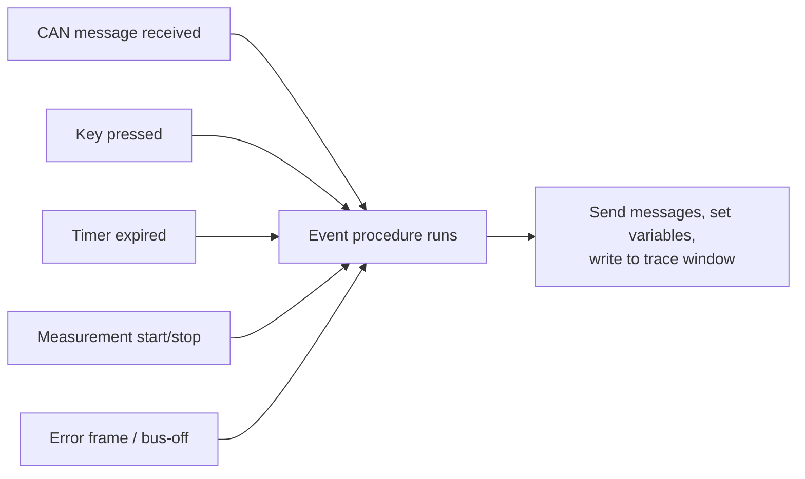
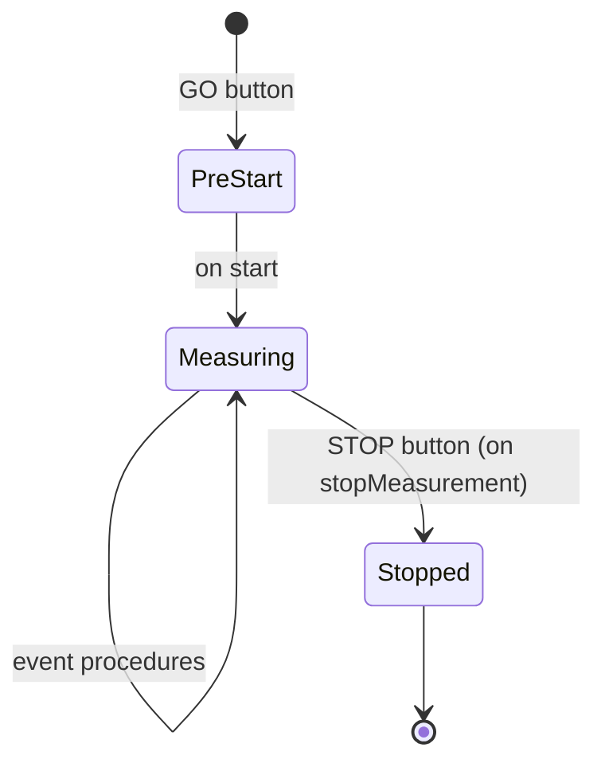
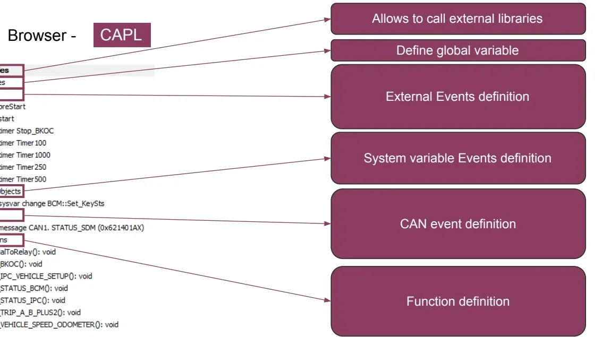
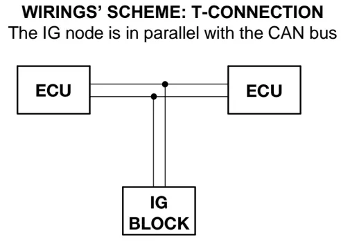
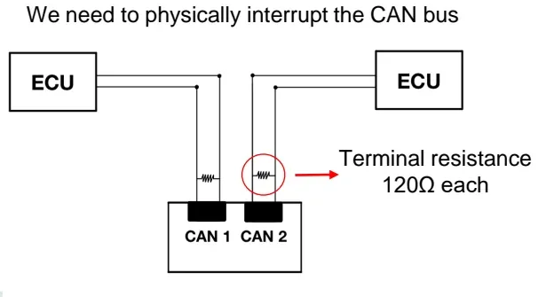
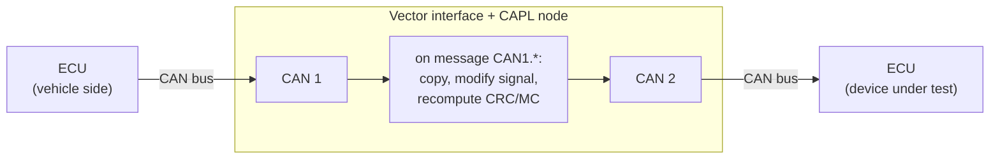

# CAPL — CAN Access Programming Language

**CAPL** (CAN Access Programming Language) is a C-like, event-driven scripting
language built into Vector's **CANalyzer** and **CANoe**. It exists to support
the daily work of a CAN developer and test engineer: with a few lines of CAPL
you can react to bus traffic, generate messages, manipulate signals and build
complete node simulations — the limit is essentially your imagination, the PC's
speed and the available communication hardware.

Typical things CAPL is used for:

- **Analysis** — filter and inspect specific messages or signals in a live
  trace, drive the replay block to re-analyze a recorded log, build custom
  models for a diagnostic tool.
- **Simulation** — emulate one or more ECU nodes (a "black box" rest-bus
  simulation), transmit messages cyclically or on event, react to user actions
  such as a key press, inject error frames or network faults to evaluate the
  ECU's strategy.
- **Gateways and manipulation** — forward or modify traffic between two CAN
  buses, change physical signal values in real time, simulate Loss of
  Communication or implausible data (CRC / message counter faults).

## The event-driven model

CAPL is **procedural but event-controlled**: there is no `main()` loop. You
write *event procedures* — blocks of code that run only when their trigger
occurs — plus global variables and user-defined functions. The three classes of
triggers are:

- **CAN events** — a message is received, an error frame appears, the
  controller changes state;
- **Time events** — a software timer expires;
- **I/O events** — a key is pressed, an environment/system variable changes.





The measurement lifecycle matters because each phase allows different actions:

| Event | Fired when | Typical use | Restrictions |
|---|---|---|---|
| `on preStart` | GO button, before start | Initialize variables, read files, write to the Write window | Cannot send messages or set timers |
| `on start` | Measurement starts | Start timers, send first messages, initialize environment variables | — |
| `on stopMeasurement` | STOP button | Finalize logs, write summary information | — |

Each of these can appear **only once** in a script.

## The CAPL Browser

Scripts are written and compiled in the **CAPL Browser**, opened from
CANalyzer/CANoe via the *Tools* menu or by double-clicking a program node in
the measurement configuration. It organizes the code in a tree so every event
procedure has a well-defined place, and it lets you drag functions, events and
database symbols (messages/signals) directly into the editor.



A CAPL source file has three parts:

1. **Global variable declarations** (`variables { … }`) — plus `includes` for
   external libraries;
2. **Event procedures** (`on message …`, `on timer …`, `on key …`, …);
3. **User-defined functions**, callable from any event procedure.

## Language basics

CAPL syntax is C: blocks in `{ … }`, `if`/`else`, `switch/case/default`,
`for`/`while`/`do-while`, `continue`, `break`, `return`, and the usual
arithmetic, logical and assignment operators (`+ - * / %`, `++ --`, `+= &= |= ^=`,
`! && ||`). Arrays are declared as in C.

### Data types

| Type | Description | Size |
|---|---|---|
| `char` | Character | 8 bit, unsigned |
| `byte` | Byte | 8 bit, unsigned |
| `int` | Integer | 16 bit |
| `word` | Word | 16 bit |
| `long` | Long integer | 32 bit |
| `dword` | Double word | 32 bit |
| `int64` | 64-bit integer | 64 bit |
| `float` / `double` | Floating point | 64 bit |
| `message` | CAN message object | — |
| `timer` | Timer, **second** resolution | max 1799 s |
| `msTimer` | Timer, **millisecond** resolution | max 65535 ms |

Uninitialized variables default to 0 — except timers, which **must** be armed
with `setTimer()` before use.

### The `this` keyword

Inside an event procedure, `this` refers to the object that triggered the
event — the received message, the changed variable, the error frame. It is how
you read what just happened:

```c
on message 0x555
{
    byte val = 0;
    if (this.CAN == 1)          // received on channel 1?
    {
        val = this.byte(0);     // first payload byte
    }
}
```

Useful `this` selectors on messages: `.CAN` (channel), `.dir` (`rx`/`tx`),
`.byte(n)`, signal names, `.id`, `.dlc`, `.time`. On error-state events you can
read `this.errorCountTX` / `this.errorCountRX`.

## Working with messages

### Declaring message objects

If a **DBC database** is linked to the configuration, ID, DLC and signals are
imported automatically and you can use the symbolic name; otherwise declare by
ID and set every property yourself:

```c
variables
{
    message STATUS_BCM msgSTS_BCM;    // from the DBC
    message 0x100     msgRaw;         // by identifier (hex or dec)
    message *         msgAny;         // ID assigned later at runtime
}

on start
{
    msgRaw.DLC = 8;                   // or: message 0x100 msgRaw = {DLC = 8};
    msgAny.id  = 0xFA;
}
```

### Signals: raw vs. physical values

Assigning a signal name writes the **raw** value; appending `.phys` lets CAPL
apply the DBC scaling (`physical = raw * factor + offset`) for you:

```c
message EngData EDMsg;
EDMsg.EngSpeed      = 2500;   // raw value on the bus (0x9C4)
EDMsg.EngSpeed.phys = 5000;   // physical rpm; CAPL computes the raw value
```

To bind a signal to a knob on a panel or another external control, link it to a
**system variable** with the `@sysvar::Namespace::Name` syntax (create the
variable in CANalyzer under *Environment → System Variables → User-defined*,
choosing namespace, name, type, default and min/max):

```c
msgSTS_BCM.RechargeSts = @sysvar::BCM::Set_RechargeSts;
```

### Transmitting: `output()`

Nothing goes on the bus until you call `output()`:

```c
TX_STATUS_BCM()
{
    msgSTS_BCM.VehicleSpeed.phys = @sysvar::BCM::Set_VehicleSpeed;
    msgSTS_BCM.RechargeSts       = 1;
    output(msgSTS_BCM);          // actually transmit
}
```

## Reacting to CAN traffic

`on message` is the workhorse event. The filter can be an ID (decimal or hex),
a DBC name, a channel qualifier, a range, or everything:

```c
on message STATUS_SDM            { /* one DBC message */ }
on message 0x123                 { /* one ID */ }
on message CAN1.123              { /* one ID on channel 1 only */ }
on message CAN2.*                { /* anything on channel 2 */ }
on message 100-200               { /* ID range */ }
on message *                     { /* every message, all buses */ }
```

A common pattern in gateway scripts is to ignore the node's own transmissions:

```c
on message CAN2.*
{
    if (this.dir != rx) return;   // skip frames we transmitted ourselves
    ...
}
```

Error-related events let you build statistics or fault injection:

| Event | Trigger |
|---|---|
| `on errorFrame` | An error frame appears on the bus |
| `on errorActive` / `on errorPassive` | Controller enters the respective state |
| `on busOff` | Controller goes bus-off |
| `on warningLimit` | Error counter crosses the warning limit |

```c
on errorFrame
{
    if (this.CAN == 1 && (timeNow() - preTime) < 100000)
        write("Error frames less than one second apart on channel 1.");
}

output(errorframe);   // you can also *generate* an error frame
```

!!! tip
    Use the error-state events to terminate a measurement cleanly when the bus
    collapses, or to automatically reset after a bus-off — much more robust
    than watching the trace by eye.

## Keyboard events

`on key` turns the keyboard into a test console during a running measurement:

```c
on key 'a'        { ... }   // lowercase a
on key 'A'        { ... }   // Shift+A  (equivalent: on key 0x41)
on key ' '        { ... }   // spacebar (equivalent: on key 0x20)
on key F1         { ... }
on key shiftF1    { ... }
on key ctrlPageDown { ... }
on key *          { ... }   // any key
```

Typical use: arm a fault, trigger a message burst, or print a counter —
e.g. `write("A total of %d messages 0x1A1 counted", counter);`.

## Timers

Timers are programmable clocks for periodic or delayed actions. Three steps:
declare, set, handle.

```c
variables
{
    msTimer myTimer;
    message 0x100 msg;
}

on key 'a'
{
    setTimer(myTimer, 20);        // fire once, 20 ms from now
}

on timer myTimer
{
    output(msg);
    // setTimer(myTimer, 20);     // re-arm manually for a cycle ...
}
```

Use `setTimerCyclic(myTimer, 20)` instead of re-arming by hand for clean
periodic transmission. Remember the ranges: `timer` counts seconds (max 1799),
`msTimer` counts milliseconds (max 65535).

## CAPL gateways and the IG Block

A large part of the lesson is about **manipulating live vehicle traffic during
V&V**. Some maneuvers cannot be reproduced physically — they would endanger the
driver, damage sensors/actuators/wiring, or require conditions the vehicle
cannot easily reach. Instead, you modify the CAN traffic itself: change signal
values, simulate **Loss of Communication (LoC)**, or inject **implausible data**
(message counter / CRC errors) to check that receiving ECUs set the right DTCs.

Two tools cover this, chosen according to the frame type:

### IG Block — for on-event messages

The **Interactive Generator Block (IG)** sends **on-event messages only**. It
is wired in **parallel** with the bus (a T-connection) — the bus is not
interrupted.



Everything is configured interactively in a dialog, **online during a running
measurement**: pick the messages from the project's DBC (ID and DLC are shown),
set the trigger condition that decides when each frame is sent, and edit the
payload either as raw hex in the data field or per-signal in raw/physical
values in the signal list.

### CAPL — for cyclic and cyclic-on-event messages

To touch a **cyclic** frame you must sit *between* the ECUs: the CAN bus is
physically interrupted and routed through two channels of the Vector interface
(an **S-connection**, typically via a Breakout Box). Each resulting stub needs
its own **120 Ω termination**.



The CAPL node then acts as a gateway:

1. **Basic gateway** — overturn frames from one port to the other unchanged
   (transparent forwarding).
2. **Advanced gateway** — modify a specific signal of a specific message in
   flight; forward everything else untouched.



Common applications:

- change a signal of a cyclic or cyclic-on-event message;
- create LoC between two ECUs (simply stop forwarding);
- inject implausible data — corrupt the **CRC**, the **message counter (MC)**,
  set **SNA** or a validity bit;
- change several signals of one bus at the same instant;
- bridge two different buses (e.g. C-CAN and ePT-CAN) — a **double gateway**.

!!! example "What a fault-injection test looks like"
    Goal: make the hybrid control processor (HCP) set
    **U0401 — Implausible Data Received From ECM/PCM "A"**.
    The CAPL gateway forwards the engine message `ENGINE_HYBD_FD_3` but forces
    its CRC signal to 0 (or adds an offset such as +10 to the computed CRC), or
    disturbs the rolling message counter. The receiving ECU detects the
    checksum/counter mismatch and stores the DTC — exactly the fault you wanted
    to verify, without touching a single wire harness pin.

### IG Block vs. CAPL

| | IG Block | CAPL |
|---|---|---|
| Frame types | On-event only | Any: cyclic, cyclic-on-event, on-event |
| Wiring | Parallel tap (T-connection), bus intact | Bus physically cut (S-connection), BoB needed, 120 Ω per stub |
| Effort | Fast, dialog-based, no coding | Requires writing (C-like) code |
| Flexibility | Limited to configured messages/triggers | Limited only by your coding skills; can span two buses at once |

!!! warning "Mind the wiring"
    Choosing CAPL means interrupting the vehicle bus and re-terminating both
    sides with 120 Ω. A missing terminator shows up as error frames and can
    silently invalidate the whole test — check the bus is clean *before*
    blaming the script.

## Panels: a GUI for your simulation

CANalyzer/CANoe can host custom **panels** — graphical control panels with
switches, LEDs, sliders, meters and bitmaps — built in the **Panel Designer**
(*Tools → Panel Designer* in CANalyzer; CANoe ships a stand-alone **Panel
Editor**). From the Toolbox you drop elements onto the panel, then in each
element's properties you bind it to a **system variable, environment variable
or signal** (*Symbol* section) and style it (*Appearance* section).

How panels connect to CAPL:

- A control element writes its bound variable; a CAPL `on sysvar_change` /
  `on envVar` procedure reacts — e.g. reads the new value with
  `getValue(this)` (or `@this`) and sends the corresponding message with
  `output()`.
- Display elements visualize bus data: the CAPL node updates the variable with
  `putValue()` when a message arrives, and the panel (dashboard-style) follows.
- Environment variables are defined in the database with a symbolic name, value
  type (Integer/String/Float/Data), access rights (Read/Write), unit, initial
  value and min/max range.
- Elements support **alarm states**: when the value leaves its valid range, the
  element changes appearance (e.g. a meter changes color).
- Bitmaps must be `.bmp`; a two-state element uses **three** side-by-side
  pictures (unassigned / OFF / ON), an n-state element uses **n+1**.

Finished panels (`.cnp` files) are attached to the configuration via
*Panels → Configure Panels → Add*; afterwards, saving in the editor updates the
loaded panel automatically. Give the panel a proper **title** — it appears on
the taskbar and is needed by CAPL functions such as `putValueToControl()`.

!!! note "CANalyzer vs. CANoe for panels"
    The full Panel Editor is a **CANoe** tool (stand-alone, but most convenient
    when opened from within CANoe because it picks up the configuration's
    databases and variables). In CANalyzer you work with the Panel Designer and
    **system variables**; CANoe additionally offers **environment variables**
    and the `on envVar` event.

## A complete mini-example

Emulating part of a body control module: enable steering-wheel button handling
only when the ignition state (received in `BCM_COMMAND`) says the vehicle is
awake, and forward button presses from environment variables onto the bus:

```c
variables
{
    message BCM_COMMAND bcm;
    message SWC swc;
    int ISWCM = 0;   // steering-wheel control management disabled
}

on message BCM_COMMAND
{
    // Ignition On / Pre-Start / Start / Cranking / Engine-On
    if (this.OperationalModeSts >= 4 && this.OperationalModeSts <= 8)
        ISWCM = 1;
    else
        ISWCM = 0;
}

on envVar Command_11Sts_env   // OK button pressed on the panel
{
    if (ISWCM == 1)
    {
        swc.Command_11Sts = @this;   // take the new variable value
        output(swc);
    }
}
```

!!! success "Key takeaways"
    - CAPL is C-like and **event-driven**: code lives in `on …` procedures
      (message, key, timer, system, error), not in a main loop.
    - `this` is the trigger object; `output()` is the only way onto the bus;
      `.phys` applies DBC scaling automatically.
    - Link a DBC to get symbolic message/signal names; bind signals to
      `@sysvar::…` to drive them from panels.
    - Timers (`timer`/`msTimer`, `setTimer`/`setTimerCyclic`) create cyclic or
      delayed transmissions.
    - For signal manipulation in V&V: **IG Block** for on-event frames
      (parallel tap, no coding), **CAPL gateway** for cyclic frames (bus cut,
      S-connection, 120 Ω terminations) — enabling LoC and CRC/MC fault
      injection such as DTC U0401 scenarios.
    - Panels turn simulations into dashboards: controls write variables CAPL
      reacts to, displays visualize what CAPL publishes.

!!! tip "Where to go next"
    Practice these concepts in the [CAPL exercises](capl-exercise/index.md),
    review the bus fundamentals in [CAN, LIN & Ethernet](../../mil1/can-lin/index.md),
    and see how traces are recorded and analyzed in [CANalyzer](../canalyzer/index.md)
    and [CANoe](../canoe/index.md).

## Sub-sections

- [CAPL Exercise](capl-exercise/index.md)
- [CAPL Other](capl-other/index.md)

---

## Source material

This article was distilled from the academy lesson materials:

- :material-file-pdf-box: [CAPL](../../assets/mil2/14_CAPL/CAPL.pdf) — PDF, 1.6 MB
- :material-file-pdf-box: [CAPL IGBlock](../../assets/mil2/14_CAPL/CAPL_IGBlock.pdf) — PDF, 1.5 MB
- :material-file-pdf-box: [CAPL Introduction](../../assets/mil2/14_CAPL/CAPL_Introduction.pdf) — PDF, 1.5 MB
- :material-file-pdf-box: [CAPL PanelEditor](../../assets/mil2/14_CAPL/CAPL_PanelEditor.pdf) — PDF, 892.8 KB
