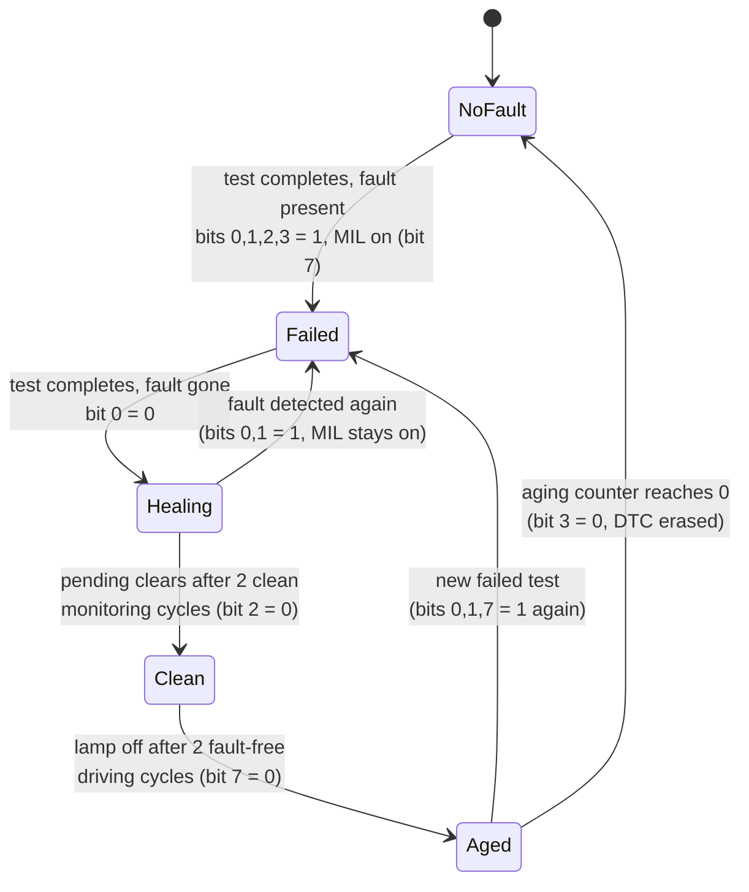

# Exercise 1 — Tracking a DTC Through Its Lifecycle

This pen-and-paper exercise trains you to predict, step by step, what an ECU
answers when a diagnostic tester asks for its fault memory. You follow one
fault — a short circuit to battery (SCB) on the cruise control (CC) button —
through 30 vehicle manoeuvres and derive the ECU's response to the UDS service
`19 02 08` after each one.

It applies the error-memory theory from the
[Diagnosis](../../index.md) lesson: the DTC status byte, monitoring and
driving cycles, MIL management and fault healing.

## Goal

Given a fixed fault model, fill in a table with the exact byte sequence the
ECU returns to `ReadDTCInformation — reportDTCByStatusMask` at every step of
a scripted manoeuvre list. The point is not the bytes themselves but the
*reasoning*: which status bit changes, when, and why.

## The diagnostic request

The tester sends the same request at every step:

```text
19 02 08
 │  │  └─ DTCStatusMask = 0x08 → bit 3 = confirmedDTC
 │  └──── sub-function 0x02 = reportDTCByStatusMask
 └─────── service 0x19 = ReadDTCInformation
```

The ECU answers with every stored DTC whose status byte has bit 3
(`confirmedDTC`) set. The positive response is:

```text
59 02 CF [00 25 00 SS]
 │  │  │   │  │  │  └─ statusOfDTC of the matching DTC
 │  │  │   └──┴──┴──── DTCAndStatusRecord: DTC 00 25 + symptom byte 00
 │  │  └────────────── DTCStatusAvailabilityMask = 0xCF
 │  └───────────────── echo of sub-function 0x02
 └──────────────────── positive response to service 0x19
```

Because bits 4 and 5 are declared *not used* in this exercise, the ECU's
status availability mask is `0xCF` (`1100 1111`). If no stored DTC matches
the mask, the response is just `59 02 CF` with no DTC record.

## The status bits that matter

With bits 4 and 5 unused, six bits of the status byte drive the whole
exercise:

| Bit | Name | Set to 1 when… | Returns to 0 when… |
|---|---|---|---|
| 0 | testFailed | the last completed test result is **Failed** | a test completes with result **Passed** |
| 1 | testFailedThisMonitoringCycle | at least one test failed in the **current** monitoring cycle | a new monitoring cycle starts (key on) |
| 2 | pendingDTC | a test failed in the current or previous monitoring cycle | current **and** previous cycles end fault-free |
| 3 | confirmedDTC | a failed test has completed (the DTC enters the error memory) | the aging counter reaches 0, or `ClearDiagnosticInformation` |
| 6 | testNotCompletedThisMonitoringCycle | default at every key on | a test completes in the current cycle |
| 7 | warningIndicatorRequested | the validated DTC switches the MIL on | the lamp heals after the required fault-free cycles |



## Setup

You need only a spreadsheet (the exercise explicitly asks for an Excel file
where you write the response **bit by bit** for the `DTCStatusMask`) plus the
fault model below, which is fixed for the whole exercise:

| Parameter | Value |
|---|---|
| Enable condition for the monitor | CC button pushed |
| Fault condition | short circuit to battery (SCB) on the CC button |
| MIL strategy | ON-1: lamp on at the **first** driving cycle with the fault validated |
| Lamp healing | after **2** consecutive fault-free driving cycles |
| Setting / healing time | event based (no debounce counters) |
| DTC | `00 25`, symptom byte `00` |
| Unused status bits | 4 and 5 |
| Driving cycle | engine run |
| Monitoring cycle | key on → key off (normally including a driving cycle) |

!!! note "Working assumptions"
    All actions in a step are *completely done* before you evaluate the
    response. The monitor only runs when its enable condition is met: an SCB
    with the button untouched produces **no** test result. The aging counter
    starts at 40 and decrements once per fault-free cycle, so `confirmedDTC`
    never clears within these 30 steps — once the DTC is confirmed, `19 02 08`
    always returns it.

## The manoeuvre script

| # | Manoeuvre | # | Manoeuvre |
|---|---|---|---|
| 1 | Vehicle in speed limitation with cruise control | 16 | Engine run |
| 2 | Key off / key on | 17 | Key off / key on |
| 3 | SCB on CC button | 18 | Engine run |
| 4 | Push CC button | 19 | Key off / key on |
| 5 | Key off / key on | 20 | Engine run |
| 6 | Engine run | 21 | Push CC button |
| 7 | Key off / key on | 22 | SCB on CC button |
| 8 | Push CC button | 23 | Push CC button |
| 9 | Remove SCB on CC button | 24 | Remove SCB on CC button |
| 10 | Push CC button | 25 | Push CC button |
| 11 | Key off / key on | 26 | SCB on CC button |
| 12 | Push CC button | 27 | Push CC button |
| 13 | Engine run, key off, key on | 28 | Engine run, key off, key on |
| 14 | Push CC button | 29 | Remove SCB on CC button |
| 15 | Key off / key on | 30 | Push CC button |

## How to work through each step

For every row, ask these questions in order:

1. **Did a test complete in this step?** Only a *Push CC button* step runs the
   monitor. If yes, the result is Failed when the SCB is present, Passed
   otherwise — update bit 0 accordingly and set bit 6 = 0. A failed test also
   sets bits 1, 2, 3 and (first time, event based) lights the MIL (bit 7).
2. **Did a monitoring cycle boundary cross?** Each key off / key on resets
   bit 1 = 0 and bit 6 = 1, and re-evaluates bit 2: pending clears only after
   the current *and* the previous cycle both end fault-free.
3. **Did a fault-free driving cycle complete?** Count engine runs with no
   fault present since the fault healed; at 2 consecutive ones the MIL goes
   off (bit 7 = 0). Any failed test resets this count.
4. **Is bit 3 set?** Only then does the response carry a DTC record;
   otherwise it is the bare `59 02 CF`.

!!! tip
    Write the status byte as eight binary digits in your spreadsheet and only
    then convert to hex. Most wrong answers in this exercise come from
    converting too early and losing track of a single bit.

## Expected result

A worked solution following the assumptions above (`—` = no DTC record, so
the response is just `59 02 CF`):

| # | Status byte | ECU response | Reason |
|---|---|---|---|
| 1–3 | — | `59 02 CF` | Fault never confirmed; the SCB at step 3 is not even tested (button not pushed) |
| 4 | `8F` | `59 02 CF 00 25 00 8F` | Test fails → bits 0,1,2,3 set, MIL on (bit 7), test completed (bit 6 = 0) |
| 5–7 | `CD` | `59 02 CF 00 25 00 CD` | New cycle: bits 1 = 0, 6 = 1; bit 0 stays 1 (last test failed); engine run with fault present does not heal anything |
| 8–9 | `8F` | `59 02 CF 00 25 00 8F` | Step 8 fails again; removing the SCB (step 9) changes nothing until a new test passes |
| 10 | `8E` | `59 02 CF 00 25 00 8E` | Passed test → bit 0 = 0; bit 1 stays latched for the rest of the cycle |
| 11 | `CC` | `59 02 CF 00 25 00 CC` | New cycle: bits 1 = 0, 6 = 1 |
| 12 | `8C` | `59 02 CF 00 25 00 8C` | Passed test → bit 6 = 0 |
| 13 | `CC` | `59 02 CF 00 25 00 CC` | First fault-free driving cycle (lamp counter 2 → 1); new cycle sets bit 6 |
| 14 | `8C` | `59 02 CF 00 25 00 8C` | Passed test → bit 6 = 0 |
| 15 | `C8` | `59 02 CF 00 25 00 C8` | Current and previous cycles both clean → pending clears (bit 2 = 0) |
| 16–20 | `48` | `59 02 CF 00 25 00 48` | Second fault-free driving cycle (step 16) → MIL heals, bit 7 = 0; only bit 3 and 6 remain |
| 21–22 | `08` | `59 02 CF 00 25 00 08` | Passed test → bit 6 = 0; only `confirmedDTC` remains (aging never completes). The new SCB at step 22 is untested |
| 23–24 | `8F` | `59 02 CF 00 25 00 8F` | Test fails → full fault status and MIL back on immediately (ON-1) |
| 25–26 | `8E` | `59 02 CF 00 25 00 8E` | Passed test clears bit 0; the fresh SCB at step 26 is not tested yet |
| 27 | `8F` | `59 02 CF 00 25 00 8F` | Test fails again |
| 28–29 | `CD` | `59 02 CF 00 25 00 CD` | Engine run with fault present resets the lamp-heal count; new cycle: bits 1 = 0, 6 = 1 |
| 30 | `8C` | `59 02 CF 00 25 00 8C` | Passed test: bits 0 = 0, 6 = 0; MIL still on — it needs 2 fault-free driving cycles to heal |

!!! warning "Bit 0 is sticky until the next completed test"
    Removing the SCB never clears `testFailed` by itself — only a *completed
    test with a Passed result* does. Steps 9, 24 and 29 therefore keep bit 0
    set, and that is exactly what the exercise wants you to notice.

## Common mistakes

- **Reacting to the physical fault instead of the test.** The SCB appearing or
  disappearing (steps 3, 9, 22, 24, 26, 29) changes nothing on its own; the
  monitor must first run with the enable condition met.
- **Forgetting the cycle-boundary bits.** Every key off / key on resets
  `testFailedThisMonitoringCycle` and sets `testNotCompletedThisMonitoringCycle`
  back to 1 — easy to miss in the middle of a long table.
- **Clearing pending too early.** `pendingDTC` survives one clean cycle; it
  clears only when the current *and* previous monitoring cycles are both
  fault-free (here, not before step 15).
- **Confusing monitoring cycles with driving cycles.** Lamp healing counts
  *driving* cycles (engine run); key cycles without an engine run do not
  advance the lamp counter, and a driving cycle with the fault still present
  resets it (step 28).
- **Expecting the DTC to disappear.** `confirmedDTC` clears through aging
  (counter from 40 to 0) or `ClearDiagnosticInformation` — neither happens
  here, so the DTC is reported from step 4 to the end.

!!! success "Key takeaways"
    - `19 02 08` filters the error memory on `confirmedDTC` (mask bit 3); a
      non-matching memory returns `59 02 CF` with no DTC record.
    - Status bits change only on **completed tests** and on **cycle
      boundaries**, never on the physical fault alone.
    - Bit 0 tracks the last test result, bit 1 the current cycle, bit 2 the
      current + previous cycles, bit 3 the error memory itself.
    - MIL management is independent counting: ON-1 at validation, off after 2
      consecutive fault-free driving cycles.
    - Working bit by bit in a spreadsheet beats mental hex arithmetic every
      time.

---

## Source material

This article was distilled from the academy lesson materials:

- :material-file-pdf-box: [Esercizio diagnosi 1](../../../../assets/mil2/17_Diagnosis/17_Diagnosis_Exercises/Exercise_Diagnosi_1/Esercizio_diagnosi_1.pdf) — PDF, 148.9 KB
