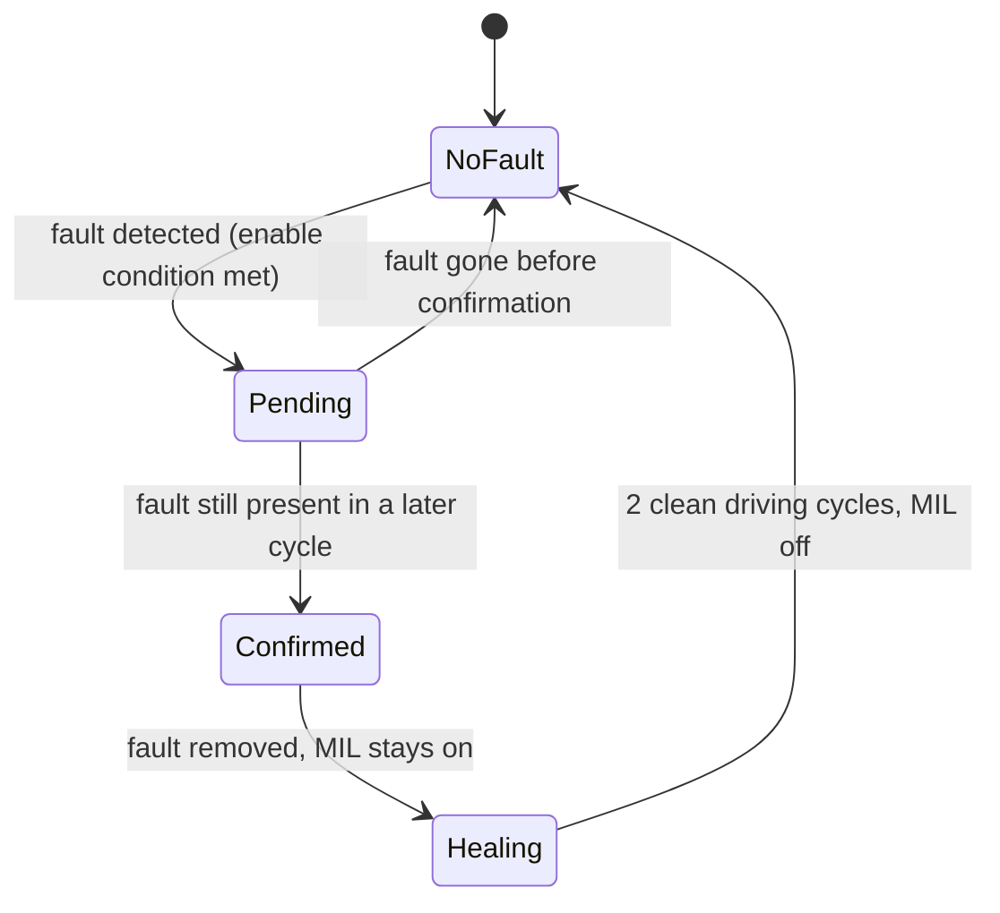

# Diagnosis Exercises

Welcome to your first hands-on diagnostic workbench. Up to now, the
[Diagnosis](../index.md) lesson showed you *how* UDS (Unified Diagnostic
Services) requests and DTC (Diagnostic Trouble Code) status bits are supposed
to behave. Here you stop listening and start predicting: given a scripted
sequence of vehicle manoeuvres, **you decide exactly what the ECU will answer**
when a diagnostic tester queries it — byte by byte.

This is not an academic drill. Reasoning your way through *detected → pending
→ confirmed → healed* is the single most-used diagnostic skill in day-to-day
E/E work, and by the end of this section you will be able to:

- predict an ECU's full reply to a `ReadDTCInformation` request at any point
  in a manoeuvre sequence,
- track every DTC status bit as a fault appears, is confirmed and heals,
- explain why a tester can report "no faults" while a fault is already
  sitting in the ECU, waiting to be confirmed.

## What you'll practice

All of it with concrete byte values, not just concepts:

- **UDS service `0x19` (ReadDTCInformation)** — sub-function `0x02`
  (reportDTCByStatusMask). The request `19 02 08` asks: *"tell me every DTC
  whose status byte has bit 3 (confirmedDTC) set."*
- **The DTC status byte** — the eight bits that describe a fault's life:
  testFailed, testFailedThisOperationCycle, pendingDTC, confirmedDTC,
  testNotCompletedSinceLastClear and friends. You will set and clear each one
  by hand.
- **Fault timing logic** — enable conditions (when the ECU is even allowed to
  look for the fault), setting and healing conditions, event-based
  debouncing, and the difference between a **monitoring cycle** (key on to
  key off) and a **driving cycle** (engine actually running).
- **Warning lamp behavior** — how the MIL (Malfunction Indicator Lamp, the
  "check engine" light) follows the confirmedDTC bit and only goes out after
  a defined number of clean driving cycles.

## Goal

For each of the 30 manoeuvres in Exercise Diagnosi 1, write down the ECU's
**complete response** to the tester request `19 02 08` — including the DTC
status mask expressed bit by bit. If your predicted bits line up with the
fault's true lifecycle across the whole sequence, you have understood how a
real ECU stores and forgets faults.

## Setup

What you are working with:

| Item | What it is |
|---|---|
| [Exercise Diagnosi 1](exercise-diagnosi-1/index.md) | A 30-step manoeuvre script built around a cruise-control (CC) button fault: a short circuit to battery (SCB) that appears, gets pushed, removed, re-inserted and healed across key cycles and engine runs. |
| ISO 14229-1:2020 | The full UDS specification, sitting in the exercise directory as your normative reference. Keep it open at the `DTCStatusAvailabilityMask` table — every answer you write is an 8-bit mask built from those definitions. |
| A spreadsheet | The exercise asks you to log every ECU response in Excel, one row per step, with the status byte expanded into individual bits. |

The exercise's ground rules, straight from the deck:

- **Enable condition:** the ECU only monitors the fault while the CC button
  is pushed.
- **Fault condition:** SCB on the CC button.
- **DTC:** code `00 25`, symptom byte `00`. Status bits 4 and 5 are unused.
- **MIL:** switches on at the first driving cycle with the fault confirmed,
  and heals after **2 clean driving cycles**.
- **Setting and healing are event-based** — no time debounce to simulate.
- **Monitoring cycle** = key on to key off; **driving cycle** = engine run.
- Every manoeuvre counts as fully completed.

## The lifecycle you are tracking

Before you start, fix this picture in your mind — it is the whole exercise in
one diagram:

The request `19 02 08` filters on **bit 3 (confirmedDTC)**: while the fault
is merely *pending*, the ECU legitimately answers "no DTCs". Only once the
fault is confirmed does `00 25` appear in the response — and it only
disappears again after the healing conditions are met.

## Steps

1. **Re-read the Diagnosis lesson first.** You need the UDS service overview,
   the DTC format (2-byte code + 1-byte symptom) and the status-bit map fresh
   in mind before attempting any manoeuvre.
2. **Open ISO 14229-1 at the DTC status bit table** and keep it beside you.
   When in doubt about a bit, the standard wins.
3. **Work the manoeuvres strictly in order.** The reply to step *N* depends
   entirely on the ECU state left behind by steps *1…N−1*. Skipping ahead
   makes the exercise meaningless.
4. **Write every response bit by bit** in your spreadsheet — never just
   "fault yes/no". The learning happens when you watch pending → confirmed →
   healed move through the individual bits.
5. **Sanity-check your solution against the physics of the scenario.** Does
   the MIL light exactly when confirmedDTC sets? Does the DTC vanish from the
   `19 02 08` response only after the 2 required healing driving cycles? Does
   a push of the CC button with no SCB present produce a clean
   testNotCompleted → completed transition?

!!! tip "Why the mask matters"
    A tester sending `19 02 08` only *sees* DTCs whose status byte matches
    the mask — here, bit 3 (confirmedDTC). A pending fault that has not yet
    been confirmed is invisible to that request. Choosing the right status
    mask is the difference between "the ECU looks clean" and "the fault is
    there, just not confirmed yet" — a distinction that matters enormously
    when a customer says the problem "comes and goes".

!!! note "Further diagnosis exercises"
    Once you are comfortable here, more hands-on scenarios — this time with a
    real `.cdd` diagnostic description of the instrument cluster — live in
    the RDI Testing section:
    [Exercise Diagnosi 2](../../rdi-testing/rdi-testing/exercise-diagnosi-2/index.md)
    and
    [Exercise Diagnosi 3](../../rdi-testing/rdi-testing/exercise-diagnosi-3/index.md).

!!! success "Key takeaways"
    - You can now predict an ECU's exact reply to `19 02 08` at any point in
      a fault scenario — that is real diagnostic reasoning, not theory.
    - The DTC status byte is the whole story: pending at detection, confirmed
      after repetition, healed only after the required clean cycles.
    - "No DTCs in the response" never means "no fault" — it only means
      "nothing matches your status mask".
    - ISO 14229-1 is your permanent desk companion: every byte you wrote in
      this exercise is defined there.

## Sub-sections

- [Exercise Diagnosi 1](exercise-diagnosi-1/index.md)

---

## Source material

This article was distilled from the academy lesson materials:

- :material-file-pdf-box: [ISO14229 1 2020](../../../assets/mil2/17_Diagnosis/17_Diagnosis_Exercises/ISO14229_1_2020.pdf) — PDF, 7.2 MB
