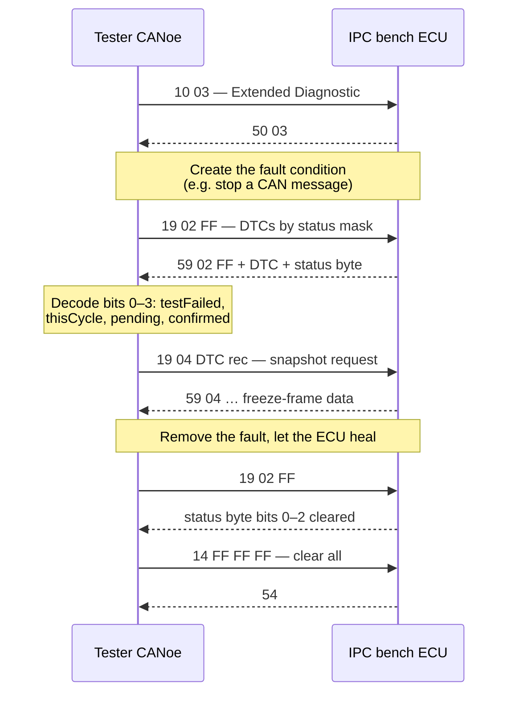

# Exercise 7 — Diagnostic Exercise (IPC)

This exercise is the capstone of the RDI (Read Data Identifier) testing
lessons. It combines the skills practiced so far — opening diagnostic sessions,
reading and writing identifiers, driving outputs, working with the fault
memory — into **one complete diagnostic session against a real ECU**
(electronic control unit).

This exercise has no instruction sheet. The exercise material is the diagnostic
database itself: `D2956_IPC_E2A_R10_332BEV.cdd`, the CANdelaStudio diagnostic
description (CDD) of the **IPC — Instrument Panel Cluster** — of the 332 BEV
platform. Extracting all required information from a CDD is a standard task on
real projects.

**Skills practiced:** navigating a diagnostic database, then executing a full
session on the bench — session control, security unlock, live data reads,
output control, and the complete fault-memory cycle.

## Goal

Starting from the CDD alone, by the end of this exercise you will be able
to:

1. Navigate the database and extract its contents: sessions, security levels,
   RDIs (data identifiers), IOLIs (input/output control items), routines and
   DTCs (diagnostic trouble codes).
2. Open a diagnostic session on the academy bench IPC and unlock it with
   SecurityAccess.
3. Read live and identification RDIs, interpret the raw hexadecimal response,
   and write writable RDIs with read-back verification.
4. Drive a cluster output through an IOLI and cross-check it against the
   corresponding RDI.
5. Run the full fault-memory workflow: create a fault, read the DTC status
   byte, retrieve the snapshot, heal the fault, and clear the memory.

## The diagnostic database at a glance

Everything below is extracted from the IPC's CDD. Use these tables as a
reference, and verify every value against the database yourself: checking
extracted data against the CDD is part of the exercise.

### Communication parameters

| Parameter | Value | Meaning |
|---|---|---|
| Bus speed (HS / PWT) | 500 kbit/s | Diagnostic CAN on the bench |
| Bus speed (LS) | 50 kbit/s | Low-speed body CAN variant |
| P2_max | 50 ms | Max time the ECU may take to answer |
| P2\*_max (P2Ex) | 5000 ms | Extended time after a `0x78` "response pending" NRC (negative response code) |
| S3 tester / ECU | 4000 / 5000 ms | Session keep-alive timing |
| STmin | 0 ms | Minimum separation time (ISO-TP flow control) |

### Diagnostic sessions (service `0x10`)

| Sub-function | Session |
|---|---|
| `0x01` | Default |
| `0x02` | Programming |
| `0x03` | Extended Diagnostic |
| `0x04` | Safety System Diagnostic |
| `0x40` | Vehicle Manufacturer End Of Line |

SecurityAccess (`0x27`) works as a seed/key challenge: sub-function `0x01`
requests the **Level 1 seed**, `0x02` sends back the computed **key**. Separate
seed/key pairs exist for VIN (vehicle identification number) write-unlock and
for Plant Mode unlocking.

### Services implemented by the IPC

| SID | Service | Used for |
|---|---|---|
| `0x10` | DiagnosticSessionControl | Switching sessions |
| `0x11` | ECUReset | `0x01` hard, `0x02` key-off-on, `0x03` soft reset |
| `0x27` | SecurityAccess | Seed/key unlock |
| `0x28` | CommunicationControl | `0x00`–`0x03` enable/disable Rx/Tx |
| `0x85` | ControlDTCSetting | `0x01` on / `0x02` off |
| `0x22` | ReadDataByIdentifier | Reading RDIs |
| `0x2E` | WriteDataByIdentifier | Writing RDIs (VIN, PROXI, …) |
| `0x2F` | InputOutputControlByIdentifier | IOLI: driving telltales, buzzer, needles |
| `0x31` | RoutineControl | Routines (start / stop / requestResults) |
| `0x19` | ReadDTCInformation | Fault memory readout, snapshots |
| `0x14` | ClearDiagnosticInformation | Clearing the fault memory |
| `0x3E` | TesterPresent | Keeping a non-default session alive |
| `0x01`–`0x09` | OBD modes | Emission-related legislated services |

### A sample of the RDI list (service `0x22`)

These DIDs (data identifiers) are the ones used during the
exercise:

| DID | Name | Content |
|---|---|---|
| `0xF190` | VIN | Original vehicle identification number (17 ASCII chars) |
| `0xF1B0` | VIN_Current | Currently stored VIN |
| `0xF18C` | EcuSerialNumber | ECU serial number |
| `0xF1A0` | IdentificationCode | C.I.S. — chassis identification code |
| `0x1000` / `0x1001` | Engine_Speed / Livello_carburante | Engine speed, fuel level |
| `0x1002` | Vehicle_Speed | Vehicle speed |
| `0x1004` / `0x1005` | Battery_voltage_30 / External_temperature | Battery voltage (KL30), outside temperature |
| `0x2001` | Odometer | Total kilometres |
| `0x0101` | Distance_to_service | Distance remaining to next service |
| `0x2023` / `0x2024` | PROXI_Data / Read_ECU_PROXI_Data | Variant (PROXI) configuration |
| `0x2029` / `0x3FFF` | Logistic_mode / Plant_Mode_status | Logistic and plant mode status |

### IOLIs (service `0x2F`) and routines (service `0x31`)

IOLIs are how a tester takes over cluster outputs — needles, telltales, the
buzzer — instead of waiting for the car to produce the stimulus. The CDD shows
which sub-services each item supports: typically `returnControlToECU` (`0x00`)
and `shortTermAdjustment` (`0x03`), with `resetToDefault` (`0x01`) on a few
items:

| ID | IOLI | Notes |
|---|---|---|
| `0x556A` | Vehicle_speed_cluster | Inject a vehicle speed value; used for the speed simulation |
| `0x557B` | Autocheck | Full gauge sweep / self-test |
| `0x5573` / `0x5543` | Buzzer / Bargraph | Acoustic and bargraph display tests |
| `0x5572` | Dimming_display | Display dimming |
| `0x5559` / `0x555A` / `0x5556` | Turn signals, front fog lamps | Telltales |
| `0x5568` / `0x5569` | Reset_Odometer / Reset_Service_Information | Reset actions (resetToDefault) |

Routines: `0x2000` Original_VIN_Lock, `0x2001` Original_VIN_Unlock (write the
VIN with `0x2E` between unlock and lock), plus the programming routines
`0xFF00` FlashErase and `0xFF01` checkProgrammingDependencies_FlashChecksum.

!!! warning "Do not touch the programming path"
    `0xFF00` FlashErase and the Download services exist in the database because
    the IPC is flashable. On the academy bench **never** start FlashErase, and
    never enter the Programming session unless the instructor asks: erasing the
    flash bricks the bench ECU.

### Fault memory (services `0x19` / `0x14`)

The CDD defines 44 DTCs. Every code ends with a **failure type byte** that
indicates *how* the fault was detected:

| Suffix | Meaning | Example |
|---|---|---|
| `0x64` | Signal plausibility failure | `D40864` — `BRAKE1.VehicleSpeedVSOSig` implausible |
| `0x86` | Signal invalid | `D70086` — BCM signal invalid |
| `0x87` | Missing message | `D70087` — BCM missing message, `C01087` — B-CAN missing message |
| `0x88` | Bus off | `C01088` — B-CAN bus off |
| `0x08` | Bus signal/message failure | `D80108` — LIN IPC failure, `C08008` — Ethernet bus failure |

Other codes worth knowing: `900044`–`900047` (ECU data/program/calibration
memory and watchdog failures) and `A20664` (current VIN missing/mismatch). Each
DTC record in the CDD also carries its maturation conditions — for example,
detection enabled with the key not in CRANK and 10 V < Vbatt < 16 V — so check
a DTC's enabling conditions *before* trying to force it; otherwise the fault
cannot be set.

## Setup

- Academy bench with the **IPC** powered and connected to the diagnostic CAN
  (Controller Area Network).
- **CANalyzer/CANoe** with a diagnostic console configured on the IPC's CDD —
  the description file does the request/response decoding for you.
- **CANdelaStudio** (the free viewer is enough) to browse the CDD offline:
  sessions, DIDs, the DTC table with maturation conditions, IOLI sub-services.
- Optional: the CAN database (DBC) of the bench, if you want to stimulate the
  cluster with real traffic instead of IOLI injection.

## Step-by-step procedure

The overall procedure is:

### 1. Mine the database

Open the CDD and build the four lists required for the exercise: RDIs, DTCs
(with their failure type bytes and set/clear conditions), IOLIs (with enabled
sub-services), and routines. Identify which diagnostic service each list maps
to; the tables above serve as a reference. Thorough preparation here reduces
trial-and-error at the bench.

### 2. Connect and unlock

Switch the IPC to **Extended Diagnostic** session (`10 03`) and verify the
positive response (`50 03`). If you plan to write anything, run the seed/key
sequence: request the seed with `27 01`, compute the key with the Level 1
algorithm, send it with `27 02`. Keep the session alive with TesterPresent
(`3E 00`) during pauses — the ECU drops back to Default after S3 (5 s)
without tester traffic.

### 3. Read identification and live RDIs

Request a few RDIs and decode the hexadecimal answers **by hand**, then
compare the result with the tool's interpretation: `22 F190` (VIN — 17 ASCII
bytes), `22 F18C`, `22 F1A0`. Then read the live ones: `22 1002` (Vehicle_Speed), `22 1004`
(battery voltage), `22 1005` (external temperature), `22 2001` (odometer).
Apply the conversion defined in the CDD for each DID.

### 4. Stimulate and re-read

Now put the bench in a state that changes the RDI content. The controlled way
to do it for speed is the IOLI `0x556A` Vehicle_speed_cluster with
`shortTermAdjustment`: inject **60 km/h**, then read back `22 1002` and check
that the RDI follows the injected value. Repeat at **150 km/h, 250 km/h and
600 km/h**; the last value is out of range — record how the cluster responds
to it.

When finished, return control of the output: `2F 556A 00`
(returnControlToECU).

### 5. Write RDIs

Pick three writable DIDs (e.g. service/odometer-related values, or the VIN
after the `0x31 2001` unlock), write them with `0x2E`, then read them back with
`0x22` and verify the content matches what was sent. Restore the original
values at the end and,
if you unlocked the VIN, lock it again with routine `0x2000`.

### 6. Full fault-memory cycle

1. Choose a DTC whose set condition you can reproduce on the bench — a
   *missing message* DTC such as `D7xx87` is the easiest: stop the
   relevant message on the CAN.
2. Read the fault memory with `19 02 FF` and decode the **status byte** of your
   DTC: bit 0 = testFailed, bit 1 = testFailedThisOperationCycle, bit 2 =
   pendingDTC, bit 3 = confirmedDTC.
3. Read the **snapshot** (freeze frame) attached to the DTC with `19 04` — for
   this platform the snapshot carries environment data such as the vehicle
   speed at fault detection.
4. Remove the fault condition and determine which actions bring bits 0, 1 and
   2 back to 0 (healing over operation cycles vs. explicit clearing), then
   clear the memory with `14 FF FF FF` and verify with a final `19 02` that
   the DTC is gone.

## Expected result

- All four lists extracted from the CDD match the tables above.
- Every read RDI is decoded to a physical value, including the 600 km/h corner
  case.
- Written RDIs read back identical; original values restored at the end.
- The fault you created shows a coherent status byte (pending → confirmed) and
  a readable snapshot; after healing and `0x14`, the memory is empty.

## Common mistakes

The following mistakes are common in this exercise:

- **Working in Default session.** Writes, IOLI and routines are refused with
  NRC `0x7F` (serviceNotSupportedInActiveSession) until you send `10 03`.
- **Skipping SecurityAccess.** Writable DIDs answer NRC `0x33`
  (securityAccessDenied) until the Level 1 seed/key has succeeded.
- **Session timeout.** Long pauses drop you back to Default; send `3E 00`
  periodically or accept re-entering the session.
- **Forgetting returnControlToECU.** Leaving `0x556A` under shortTermAdjustment
  invalidates every later speed-related reading until control is returned.
- **Reading the DTC status byte as a plain number.** It is a bitmask: decode it
  bit by bit, and check the DTC's maturation conditions in the CDD before
  assuming a fault should have set.
- **Ignoring P2/P2\*.** A first answer of `7F .. 78` is not an error — the ECU
  has up to 5000 ms to produce the real response.

!!! success "Key takeaways"
    - The CDD is the single source of truth: sessions, DIDs, sub-services,
      DTCs and their conditions are all extracted from it.
    - The canonical bench workflow is: session (`0x10`) → security (`0x27`) →
      read/write RDIs (`0x22`/`0x2E`) → IOLI (`0x2F`) → fault memory
      (`0x19`/`0x14`) → restore everything.
    - DTC codes encode meaning: the trailing failure type byte (`0x64`,
      `0x86`, `0x87`, `0x88`, …) tells you *how* the fault was detected.
    - Leave the ECU as found: control returned, values
      restored, fault memory cleared.
    - The exercise covers a complete diagnostic session — the same workflow
      used on production projects — starting from the diagnostic database
      alone.

!!! tip "Where this fits"
    This exercise combines the earlier drills — [Exercise
    2](../exercise-diagnosi-2/index.md) (RDIs and DTCs) and [Exercise
    3](../exercise-diagnosi-3/index.md) (IOLIs and routines) — into one full
    session, on the same IPC database used in the [RDI
    Testing](../index.md) lesson.

---

## Source material

This article was distilled from the academy lesson materials:

- :material-file-pdf-box: [Exercise 7 - Diagnostic Exercise](../../../../assets/mil2/18_RDI_Testing/18_RDI_Testing/Exercise_7___Diagnostic_exercise/Exercise_7___Diagnostic_Exercise.pdf) — PDF, 21.1 KB

## Downloads

- :material-file: [D2956 IPC E2A R10 332BEV](../../../../assets/mil2/18_RDI_Testing/18_RDI_Testing/Exercise_7___Diagnostic_exercise/D2956_IPC_E2A_R10_332BEV.cdd) — 2.6 MB
