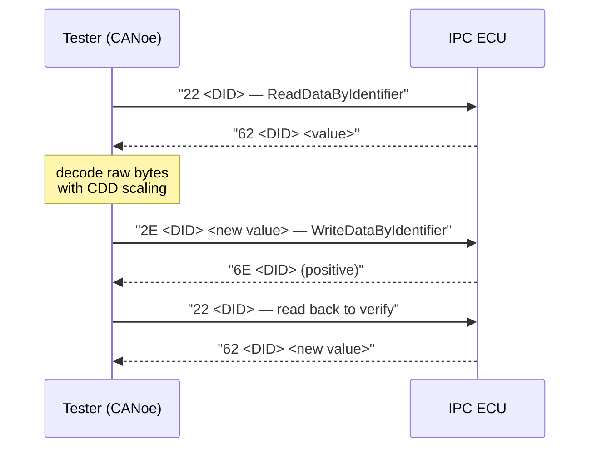
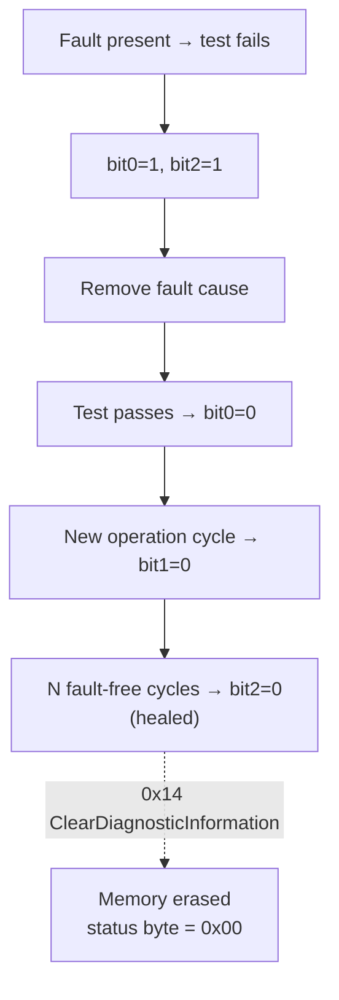

# Exercise: RDI and DTC Diagnostics on the IPC Cluster

This bench exercise puts the UDS diagnostic theory into practice on a real ECU:
the **instrument panel cluster (IPC)** of the P332 BEV platform, described by the
CANdela database `D2956_IPC_E2A_R10_332BEV.cdd`. You will explore the diagnostic
database, read and write data identifiers (RDIs), inject faults, watch the DTC
status byte evolve, and retrieve snapshot data — the full daily workflow of a
diagnostics engineer.

## Goal

By the end of the exercise you should be able to:

- navigate a **CDD (CANdela Diagnostic Description)** database and extract the
  complete lists of RDIs, DTCs (with their DTC tables), I/O controls and routines;
- associate each of those elements with the UDS service used to access it;
- **read an RDI** and decode its raw hexadecimal response into a physical value;
- **write RDIs** and verify the write by reading the value back;
- create a fault, read the **DTC status byte**, and drive bits 0, 1 and 2 back to
  zero with the correct maneuvers;
- clear the fault memory and retrieve the **snapshot (freeze frame)** stored with
  a DTC.

## Setup

| Item | Details |
|---|---|
| Bench | Academy bench with the IPC ECU powered and wired to the CAN network |
| Diagnostic tool | CANoe/CANalyzer with the Diagnostics Console (or equivalent UDS tester) |
| Database | `D2956_IPC_E2A_R10_332BEV.cdd` loaded into the diagnostic session |
| Signal injection | Bench means to stimulate inputs (e.g. simulated vehicle speed) and to provoke faults |

!!! warning "Work on the bench, not on a vehicle"
    Every maneuver here — writing identifiers, clearing fault memory — is done on
    the academy bench ECU. Writing RDIs or clearing DTCs on a real vehicle can
    alter configuration or erase evidence needed for troubleshooting.

## Step 1 — Explore the diagnostic database

Open the CDD in the CANdela viewer (or the diagnostics console's database view)
and extract four lists:

1. **All RDIs (Read Data Identifiers)** — the 16-bit identifiers the ECU exposes
   for reading: VIN, software/hardware versions, vehicle speed, odometer, telltale
   states, etc.
2. **All DTCs with their DTC table** — each fault code with its meaning, the
   associated failure type byte and its debounce/healing parameters.
3. **All I/O controls** — the actuators/outputs that can be overridden for
   testing (e.g. forcing telltales or gauge pointers).
4. **All routines** — parametrized procedures started/stopped on demand
   (self-tests, calibration routines, …).

## Step 2 — Map elements to diagnostic services

For each list from Step 1, identify the UDS service that operates on it:

| Element | UDS service | Positive response |
|---|---|---|
| Read an RDI | `0x22` ReadDataByIdentifier | `0x62` |
| Write an RDI | `0x2E` WriteDataByIdentifier | `0x6E` |
| Read DTCs / status / snapshots | `0x19` ReadDTCInformation | `0x59` |
| Clear fault memory | `0x14` ClearDiagnosticInformation | `0x54` |
| Override an I/O | `0x2F` InputOutputControlByIdentifier | `0x6F` |
| Start/stop a routine | `0x31` RoutineControl | `0x71` |

!!! note "Response SID = request SID + 0x40"
    A positive response always carries the request service ID plus `0x40`
    (`0x22` → `0x62`). If you see `0x7F` instead, it is a **negative response**:
    `0x7F <original SID> <NRC>` — decode the NRC (e.g. `0x31` requestOutOfRange)
    before assuming the ECU is broken.

## Step 3 — Read and interpret an RDI

1. Pick an RDI from the list and send `ReadDataByIdentifier` with its DID.
2. Decode the response: `62 <DID hi> <DID lo> <data bytes…>`. Apply the scaling,
   offset and unit defined for that identifier in the CDD to turn the raw bytes
   into a physical value.
3. Change the vehicle conditions on the bench so that the chosen RDI's content
   actually changes, and read it again to confirm.

### Vehicle speed sweep

Choose the RDI carrying the vehicle speed and run the full sweep, recording the
raw response and the decoded value at each point:

| Simulated speed | What to do |
|---|---|
| 60 km/h | Request the RDI, decode the hex value, verify it matches |
| 150 km/h | Repeat |
| 250 km/h | Repeat |
| 600 km/h | Repeat — observe carefully |

!!! tip "600 km/h is a trap — on purpose"
    600 km/h is beyond any plausible range for this signal. Depending on the
    CDD definition you will get the signal's saturation value, an
    "invalid/not available" pattern (e.g. all bits set), or a negative response.
    The point of the step is to check how the ECU and the conversion formula
    behave **at and beyond the valid range** — exactly what you must do when
    testing a diagnostic specification.

## Step 4 — Write RDIs

1. Select **three writable RDIs** from the database (the CDD marks which
   identifiers support `WriteDataByIdentifier` — read-only ones will answer
   with NRC `0x31` requestOutOfRange).
2. Write new content with service `0x2E`, building the payload from the DID plus
   the correctly formatted data bytes.
3. **Verify each write** by reading the same RDI back with `0x22` and comparing
   the returned bytes with what you sent.

## Step 5 — Fault, status byte, healing and snapshot

### Create the fault and read the status byte

1. Provoke a fault condition on the bench (e.g. disconnect or short a monitored
   line — pick a DTC from the list whose cause you can reproduce).
2. Read the DTC with `0x19 0x02` (reportDTCByStatusMask) and look at its
   **status byte**.

### Heal bits 0, 1 and 2

| Bit | Name | How to drive it to 0 |
|---|---|---|
| 0 | testFailed | Remove the fault cause; the monitoring test runs again and passes |
| 1 | testFailedThisOperationCycle | Complete the current operation cycle and start a new one (key off/on) with the test passing |
| 2 | pendingDTC | Let the ECU count fault-free operation cycles until the DTC "heals" (matures) per its CDD parameters |

### Clear the memory and get the snapshot

1. **Before clearing**, identify which snapshot record is attached to your DTC:
   query `0x19 0x04` (reportDTCSnapshotRecordByDTCNumber) with the DTC number —
   the freeze frame captures ECU state (speed, voltage, counters, …) at the
   moment the fault was detected.
2. Note the snapshot content.
3. Clear the fault memory with `0x14` ClearDiagnosticInformation.
4. Read the DTCs again: the entry — and its snapshot — must be gone.

!!! warning "Snapshots die with the clear"
    `0x14` erases DTCs **and their snapshot/extended data**. In real
    troubleshooting you always download snapshots *before* clearing — once
    cleared, the evidence is unrecoverable.

## Expected results

- Four complete lists extracted from the CDD (RDIs, DTCs + DTC table, I/O,
  routines), each mapped to its UDS service.
- A log of the speed sweep showing raw hex responses and correctly decoded
  values at 60 / 150 / 250 km/h, plus documented out-of-range behavior at
  600 km/h.
- Three RDIs written and verified by read-back.
- A description of the fault creation, the status byte at fault time, the
  maneuvers that cleared bits 0–2, the snapshot content, and a clean fault
  memory at the end.

## Common mistakes

- **Forgetting the `+0x40` response SID** and misreading a positive response as
  garbage — or missing that `0x7F` means negative response.
- **Decoding raw bytes without the CDD conversion** (factor/offset/byte order) —
  the hex value is not the physical value.
- **Trying to write a read-only RDI** — check the CDD; expect NRC `0x31`.
- **Clearing the fault memory before reading the snapshot**, losing it forever.
- **Confusing bit 2 (pendingDTC) with bit 3 (confirmedDTC)** — pending heals by
  itself after fault-free cycles; confirmed only disappears with an explicit
  clear.
- Declaring the ECU faulty when the 600 km/h test returns an invalid value —
  out-of-range behavior must be checked against the specification first.

!!! success "Key takeaways"
    - The CDD database is the contract: RDIs, DTCs, I/O and routines, each
      bound to a UDS service (`0x22`/`0x2E`/`0x19`/`0x14`/`0x2F`/`0x31`).
    - Always decode responses with the database's scaling — and always probe
      boundary values (600 km/h) to see saturation and invalid-value handling.
    - Writes are only proven by read-back.
    - The DTC status byte tells the fault's life story; bits 0–2 clear through
      specific healing maneuvers, not by magic.
    - Grab snapshots **before** `ClearDiagnosticInformation` — clearing wipes
      the evidence.

---

## Source material

This article was distilled from the academy lesson materials:

- :material-file-pdf-box: [Esercizio diagnosi 2](../../../../assets/mil2/18_RDI_Testing/18_RDI_Testing/Exercise_Diagnosi_2/Esercizio_diagnosi_2.pdf) — PDF, 44.0 KB

## Downloads

- :material-file: [D2956 IPC E2A R10 332BEV](../../../../assets/mil2/18_RDI_Testing/18_RDI_Testing/Exercise_Diagnosi_2/D2956_IPC_E2A_R10_332BEV.cdd) — 2.6 MB
