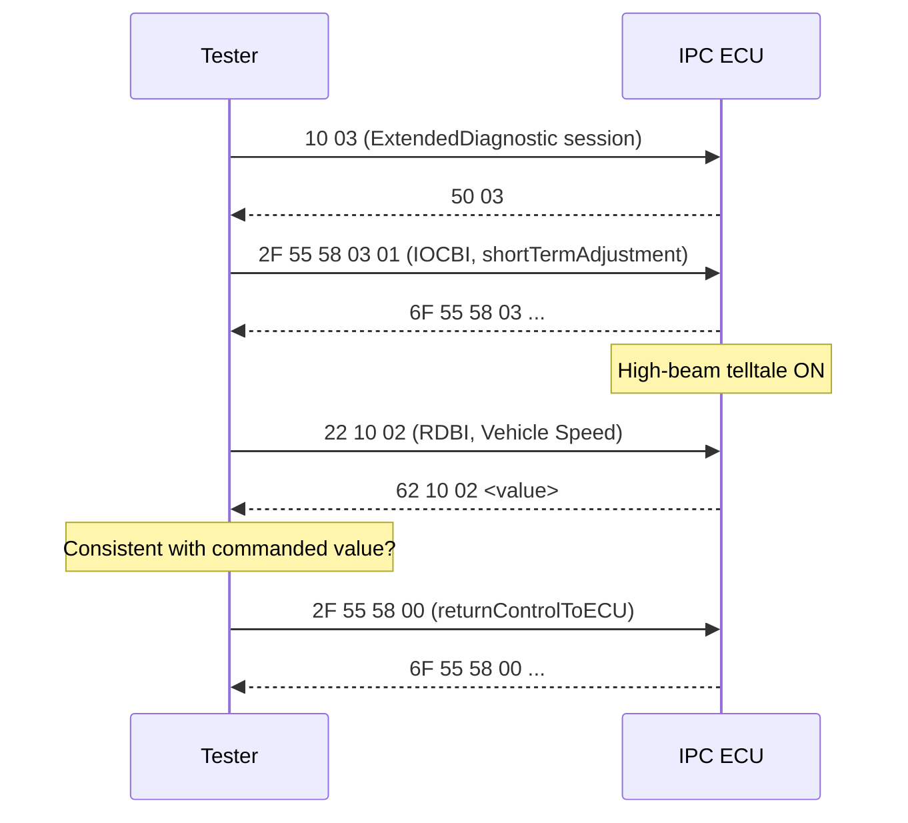
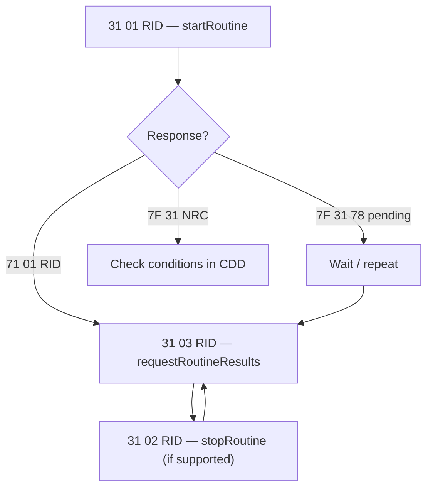

# Exercise 3 — IOLI and Routine Control on the IPC

This bench exercise moves from *reading* diagnostic data to *controlling* the
ECU. Working against the instrument panel cluster (IPC) through its CANdela
diagnostic description (`D2956_IPC_E2A_R10_332BEV.cdd`), you will:

1. explore the CDD and build three inventories: all data identifiers (RDIs),
   all input/output lines (IOLIs) and all routines;
2. take control of one IOLI with **InputOutputControlByIdentifier (0x2F)** and
   cross-check the effect through the matching RDI;
3. execute one routine with **RoutineControl (0x31)**, including its start,
   stop and results sub-functions.

## Goal

Learn to navigate a CDD as the single source of truth for an ECU's diagnostic
interface, and to drive the two "actuation" services of UDS — I/O control and
routine control — respecting the sessions, sub-functions and enabling
conditions the CDD declares.

## Setup

- The academy bench with the IPC ECU powered and connected over CAN.
- A diagnostic tester (CANoe/CANalyzer with a diagnostic console, or an
  equivalent UDS tool) loaded with `D2956_IPC_E2A_R10_332BEV.cdd`.
- The exercise sheet (`Esercizio_diagnosi_3_Ioli_Routine.pdf`).

## The three services in one look

| Service | SID | Positive response | Purpose |
|---|---|---|---|
| ReadDataByIdentifier | `0x22` | `0x62` | Read an RDI: a named data record (sensor value, counter, identification) |
| InputOutputControlByIdentifier | `0x2F` | `0x6F` | Override an IOLI: force an output (telltale, buzzer, gauge) to a state |
| RoutineControl | `0x31` | `0x71` | Start/stop an internal ECU procedure and fetch its results |

Any request can be refused with `7F <SID> <NRC>`; the CDD lists which negative
response codes each service may return.

## Part 1 — Map the CDD

Before touching the bus, extract the three inventories from the database. The
IPC CDD is a real Stellantis document, so the lists are long — here are
representative entries to recognize what you are looking at.

**RDIs (read with `0x22`)** — live data, memories and identification:

| DID | Meaning |
|---|---|
| `0x1002` | Vehicle Speed |
| `0x1000` | Engine Speed |
| `0x1004` | Battery voltage (+30) |
| `0x1005` | External temperature |
| `0x2001` | Odometer |
| `0xF190` | VIN |

**IOLIs (controlled with `0x2F`)** — mostly cluster outputs, ideal for visual
verification on the bench:

| DID | Output |
|---|---|
| `0x5558` | High beam headlamp indication |
| `0x5559` / `0x555A` | Left / right turn signal lamp indication |
| `0x5573` | Buzzer |
| `0x5572` | Dimming display |
| `0x557B` | Autocheck (full gauge/LED/display sweep) |
| `0x556A` | Vehicle speed cluster (pointer) |

**Routines (driven with `0x31`)**:

| RID | Routine |
|---|---|
| `0x2000` | Original VIN Lock |
| `0x2001` | Original VIN Unlock |
| `0xFF00` | FlashErase |
| `0xFF01` | checkProgrammingDependencies / FlashChecksum |

!!! tip "Note the sessions"
    Each CDD entry records in which diagnostic sessions it may be executed.
    The IOLIs are executable in **ExtendedDiagnostic (`0x03`)** and the
    end-of-line session, not in Default; `FlashErase` requires the
    **Programming session (`0x02`)**. If the tool answers
    `7F 2F 7E` (subFunctionNotSupportedInActiveSession) or `7F 2F 7F`
    (serviceNotSupportedInActiveSession), you are in the wrong session —
    switch with `DiagnosticSessionControl` (`10 03` → expect `50 03`) and keep
    it alive with Tester Present (`3E 00`) while you work.

## Part 2 — Control an IOLI

Service `0x2F` supports four sub-functions (control options); verify in the
CDD which of them the chosen IOLI actually enables:

| Option byte | Sub-function | Effect |
|---|---|---|
| `0x00` | returnControlToECU | Give the output back to normal application control |
| `0x01` | resetToDefault | Restore the default state |
| `0x02` | freezeCurrentState | Hold the current state |
| `0x03` | shortTermAdjustment | Force a specific value/state (the one you will use most) |

Procedure:

1. Enter the ExtendedDiagnostic session (`10 03`).
2. Pick one IOLI from your inventory — the **high beam telltale (`0x5558`)**
   or the **buzzer (`0x5573`)** are good first choices because you can see or
   hear the result immediately.
3. Read its CDD entry: allowed control options, the control-state encoding,
   and any enabling conditions.
4. Force the output with `shortTermAdjustment`, e.g.
   `2F 55 58 03 01` → expect `6F 55 58 03 …` and the telltale lit.
5. **Cross-check with the matching RDI**: read back the corresponding data
   identifier with `0x22` (for example, drive the speed pointer via
   `0x556A`, then read `Vehicle Speed 0x1002`) and confirm the value the ECU
   reports is coherent with what you commanded.
6. Always finish with `returnControlToECU` (`2F 55 58 00`), so the cluster
   resumes normal behavior.

## Part 3 — Run a routine

RoutineControl (`0x31`) has three sub-functions; the CDD tells you which ones
each routine enables (for example `FlashErase` supports all three, while
`Original VIN Lock` only supports *start*):

| Sub-function | Code | Purpose |
|---|---|---|
| startRoutine | `0x01` | Launch the routine, optionally with a control option record |
| stopRoutine | `0x02` | Interrupt a running routine |
| requestRoutineResults | `0x03` | Fetch the routine status record / final result |

Procedure:

1. Choose a routine from your Part 1 inventory and read its CDD entry
   carefully: required session, enabling conditions, option record layout
   (e.g. `FlashErase` takes a start/stop address pair).
2. Command the start: `31 01 <RID> <options>` → expect
   `71 01 <RID> <status>`. A long-running routine may first answer
   `7F 31 78` (requestCorrectlyReceived-ResponsePending) — keep waiting for
   the final response.
3. Request the report: `31 03 <RID>` → `71 03 <RID> <statusRecord>` and
   verify the result the tool decodes.
4. If the CDD declares a stop sub-function, command `31 02 <RID>`, verify the
   response, then fetch the report again with `31 03`.

!!! warning "Respect enabling conditions — and think before you erase"
    Routines change ECU state: `Original VIN Lock` permanently locks the VIN
    against further updates, and `FlashErase`/`FlashChecksum` belong to the
    reprogramming flow. On the bench, follow the CDD conditions exactly, and
    never send `FlashErase` outside the Programming session it is designed
    for.

## Expected results

- Three complete inventories (RDI, IOLI, routines) extracted from the CDD.
- A physical IOLI (telltale, buzzer, gauge or the full `Autocheck` sweep,
  which drives all pointers 0 → full scale → 0 in about 4 s per direction,
  lights every LED and display segment, and activates the buzzer) actuated
  and released cleanly, with the RDI cross-check confirming coherence.
- One routine executed through start → results (→ stop → results where
  supported), with every response verified in the tool.

## Common mistakes

- **Working in the Default session.** I/O control and routines are gated —
  enter the session the CDD requires and keep it with Tester Present.
- **Skipping `returnControlToECU`.** An IOLI left forced makes every
  subsequent measurement unreliable; always hand control back.
- **Assuming sub-functions exist.** Not every IOLI supports all four control
  options and not every routine supports stop/results — read the CDD entry,
  do not guess from the standard.
- **Panicking at `7F xx 78`.** It is not an error, just "response pending";
  wait for the final positive response.
- **Misreading NRCs.** `0x22` conditionsNotCorrect and `0x33`
  securityAccessDenied mean the ECU refuses *now*, not that your syntax is
  wrong (`0x13` incorrectMessageLengthOrInvalidFormat) — decode the NRC
  before retrying.

!!! success "Key takeaways"
    - The CDD is the contract: identifiers, sub-functions, sessions and
      enabling conditions all come from it, not from memory.
    - `0x22` reads (RDI), `0x2F` actuates one I/O line (IOLI), `0x31` runs
      whole ECU procedures — with start/stop/results sub-functions.
    - Verify an actuation two ways: the positive response *and* a physical or
      RDI cross-check.
    - End every actuation session by restoring control to the ECU.

!!! tip "Where this leads"
    The service mechanics used here are covered in
    [Diagnosis](../../../diagnosis/index.md), and the previous bench exercise
    is [Exercise Diagnosi 2](../exercise-diagnosi-2/index.md).

---

## Source material

This article was distilled from the academy lesson materials:

- :material-file-pdf-box: [Esercizio diagnosi 3 Ioli Routine](../../../../assets/mil2/18_RDI_Testing/18_RDI_Testing/Exercise_Diagnosi_3/Esercizio_diagnosi_3_Ioli_Routine.pdf) — PDF, 42.5 KB

## Downloads

- :material-file: [D2956 IPC E2A R10 332BEV](../../../../assets/mil2/18_RDI_Testing/18_RDI_Testing/Exercise_Diagnosi_3/D2956_IPC_E2A_R10_332BEV.cdd) — 2.6 MB
