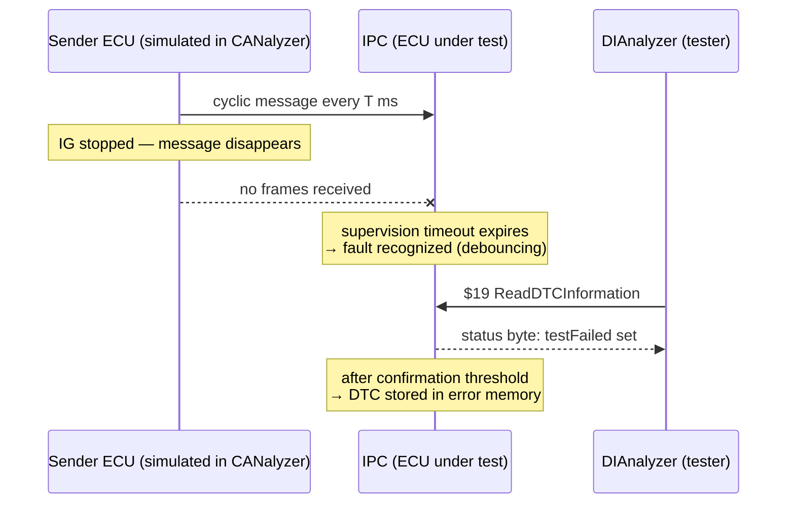

# Exercise: Missing Message Fault

In this exercise you simulate one of the most common network faults an ECU has to
detect — the **missing message**: a cyclic CAN frame that the instrument panel
cluster (IPC) expects to receive simply stops arriving. You will inject the fault
with CANalyzer and watch the IPC's diagnostic reaction in DIAnalyzer, tracking the
evolution of the DTC **status byte** across driving cycles and documenting every
transition with screenshots.

The reference diagnostic description is `D2956_IPC_E2A_R10_332BEV.cdd` — the IPC
diagnostic specification for the 332 BEV platform.

## Goal

- Navigate a real **CDD file** in CANdelaStudio and identify a DTC that supervises
  the reception of a CAN message.
- Reproduce the fault on the bus by making the supervised message disappear in
  CANalyzer.
- Read the fault status in DIAnalyzer and explain **why the status byte changes**
  at each step: fault recognition, confirmation, healing and the effect of a new
  driving cycle.

## Background: how a missing message fault works

ECUs continuously *supervise* the cyclic messages they depend on. The receiving
software knows each message's expected period, and a supervision function counts
the time since the last reception. If no frame arrives within a timeout (typically
a multiple of the nominal cycle time, plus a debounce or *maturation* time defined
in the DTC table), the fault is recognized:

The **status byte** returned with service `$19` encodes the life cycle of the DTC.
The bits you will watch in this exercise are:

| Bit | Name | Meaning for this exercise |
|---|---|---|
| 0 | testFailed | The fault is present **right now** (message still missing) |
| 1 | testFailedThisOperationCycle | The fault was seen at least once in this driving cycle |
| 3 | confirmedDTC | The fault matured and was stored in error memory |
| 6 | testNotCompletedThisOperationCycle | The monitor has not yet run (or finished) in this cycle |
| 7 | warningIndicatorRequested | A telltale/warning is requested (if configured for this DTC) |

A **driving (operation) cycle** runs from key-on to key-off, and the ECU only
finishes its power-down sequence after the *power latch* time. Status byte bits 1
and 6 are re-evaluated at each new cycle — that is exactly the evolution you are
asked to describe.

## Setup

| Item | Purpose |
|---|---|
| `D2956_IPC_E2A_R10_332BEV.cdd` | Diagnostic description of the IPC — your specification for DTCs, DIDs and supported messages |
| **CANdelaStudio** (Vector) | Opens the CDD; download and install it first — the free Viewer edition is enough to browse the file |
| **CANalyzer** | Simulates the rest of the bus: you will transmit the supervised message cyclically and then stop it |
| **DIAnalyzer** | Diagnostic tester: reads DTC status with service `$19` and shows the status byte |
| IPC hardware / bench setup | The ECU under test, wired to the CAN channel used by CANalyzer |

## Step-by-step procedure

1. **Explore the CDD.** Open `D2956_IPC_E2A_R10_332BEV.cdd` in CANdelaStudio.
   In the chapter tree, find the DTC/event list and look for a fault that
   supervises a *received* message (missing message / timeout supervision).
   Note down: the DTC code, its description, the CAN message it monitors, the
   enabling conditions, and the maturation and healing parameters.
2. **Identify the message to simulate.** In the CDD (and, if available, the bus
   DBC), find the supervised message's CAN identifier and its nominal cycle time.
   This is what you must reproduce in CANalyzer.
3. **Baseline in CANalyzer.** Configure the measurement on the IPC's CAN channel.
   Use an Interactive Generator (IG) block to transmit the supervised message
   cyclically at its expected period. Start the measurement and verify in the
   Trace window that the frame is on the bus.
4. **Confirm the healthy state.** In DIAnalyzer, read the DTC status (service
   `$19`). The DTC should show no `testFailed` and no `confirmedDTC` bit — or not
   appear in error memory at all. Screenshot this as your reference point.
5. **Inject the fault.** Stop the IG block so the message disappears from the bus.
   Wait at least the supervision timeout plus the debounce time, then read the
   status again: bit 0 (`testFailed`) is now set. Screenshot and comment.
6. **Wait for confirmation.** Keep the fault present until the confirmation
   criteria are met: the DTC is stored in error memory and bit 3
   (`confirmedDTC`) sets — in the academy's examples a fully confirmed fault with
   warning request reads `8F`. Screenshot and explain the difference from the
   previous reading.
7. **Heal the fault.** Restart the cyclic transmission in CANalyzer. Read the
   status repeatedly: `testFailed` clears (the message is back), while
   `confirmedDTC` typically remains — e.g. `8E`, "healing conditions met after
   the fault was confirmed".
8. **Cross a driving cycle.** Perform a key-off, **wait for the power latch time**
   so the IPC really shuts down, then key-on again. Read the status: bit 1
   (`testFailedThisOperationCycle`) and bit 6 (`testNotCompletedThisOperationCycle`)
   reflect the new cycle — you may see values like `8C` or `88` while the monitor
   re-runs. Repeat key cycles with the message present until the status byte
   settles to `08`/healed or the DTC ages out, per the CDD.
9. **Document.** For every status byte change, take a DIAnalyzer screenshot and a
   CANalyzer trace snapshot, and write one or two lines explaining *why* the byte
   changed (timeout expired, confirmation threshold reached, new cycle started,
   healing conditions met).

## Expected result

A plausible evolution of the status byte for this exercise:

| Step | Bus state | Driving cycle | Typical status byte | Reason |
|---|---|---|---|---|
| Baseline | message present | 1 | no fault / `00` | monitor runs, message received |
| Fault injected | message missing | 1 | bit 0 set (e.g. `09`) | supervision timeout expired |
| Confirmed | message missing | 1 | `8F` (if warning configured) | confirmation threshold reached, DTC stored |
| Fault healed | message present | 1 | `8E` | healing conditions met, still confirmed |
| New cycle | message present | 2 | `8C` / `88` | not failed this cycle; monitor re-running or passed |

!!! warning "Your exact bytes may differ"
    The precise hex values depend on the DTC's configuration in this CDD —
    whether a warning indicator is requested, whether the monitor can run at
    key-on, and the confirmation thresholds. Always justify each reading against
    the CDD, not against this table.

## Common mistakes

- **Reading the status too early.** Right after stopping the message the
  supervision timeout and debounce have not elapsed yet — the fault looks absent
  and you conclude the test failed. Wait for the timeout plus maturation time.
- **Skipping the power latch time.** A quick key-off/key-on without waiting for
  the ECU to shut down fully does **not** start a clean new operation cycle, so
  bits 1 and 6 will not behave as expected.
- **Confusing "missing message" with "invalid signal value".** This exercise
  removes the whole frame from the bus; sending the message with a bad signal
  value is a different DTC (plausibility/range check) with different timing.
- **Forgetting the IG is still running.** If you re-enable transmission in
  CANalyzer before taking the "fault present" screenshot, the fault heals
  immediately and your evidence is gone.
- **Judging against a generic table.** The academy's status byte examples
  (`8F`, `8E`, `88`, …) come from another ECU's DTC table — use them as patterns,
  but confirm everything against the IPC's CDD.

!!! success "Key takeaways"
    - Missing-message supervision is timeout-based: the receiver detects that an
      expected cyclic frame stopped arriving.
    - CANalyzer plays the role of the rest of the bus — start and stop the
      Interactive Generator to inject and heal the fault.
    - The DTC status byte tells the fault's story: `testFailed` now, confirmed
      and stored, healed, and re-evaluated every driving cycle.
    - Respect debounce times and the power latch time, and anchor every
      observation in the CDD.

!!! tip "Where this leads"
    The DTC life cycle you observe here is validated systematically in the
    [Diagnosis Process](../../../../mil4/diagnosis-process/index.md) lesson, and the
    tester side — reading parameters with service `$22` — is covered in
    [RDI Testing](../index.md).

---

## Source material

This article was distilled from the academy lesson materials:

- :material-file-pdf-box: [Missing Message](../../../../assets/mil2/18_RDI_Testing/18_RDI_Testing/Exercise_Missing_Message/Missing_Message.pdf) — PDF, 32.7 KB

## Downloads

- :material-file: [D2956 IPC E2A R10 332BEV](../../../../assets/mil2/18_RDI_Testing/18_RDI_Testing/Exercise_Missing_Message/D2956_IPC_E2A_R10_332BEV.cdd) — 2.6 MB
