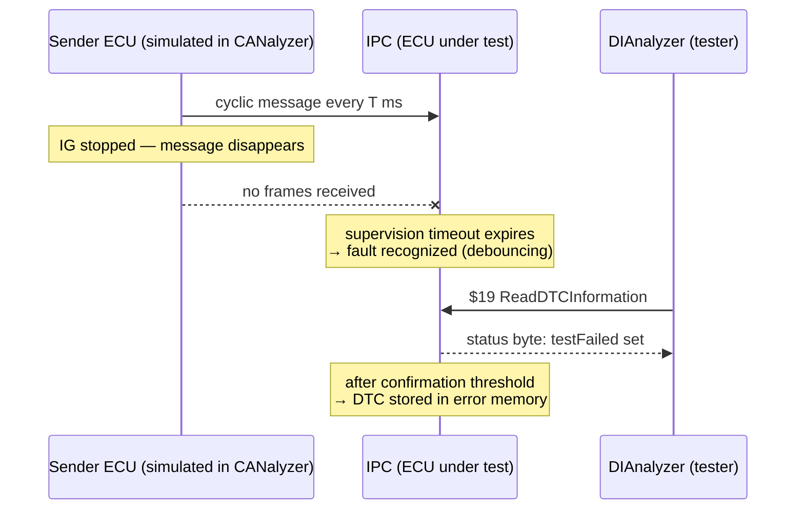

# Exercise: The Missing Message

Welcome to your first hands-on diagnostic exercise. Up to now you have read about
faults and DTCs (Diagnostic Trouble Codes); here you will *cause* one on purpose
and watch an ECU react to it, step by step. This is one of the most common
scenarios in real vehicle testing, and once you have driven it yourself, the
whole DTC life cycle stops being a table in a spec and becomes something you
have seen with your own eyes.

**What you'll be able to do after this exercise:**

- find a *missing-message supervision* fault inside a real diagnostic
  specification (a CDD file),
- inject that fault on the CAN (Controller Area Network) bus using CANalyzer,
- read the fault's **status byte** in DIAnalyzer and explain every bit change,
- document a test like a professional: screenshots, traces, and a reason for
  each transition.

**What you'll practice:** CAN bus simulation (CANalyzer), diagnostic testing
(DIAnalyzer), and reading diagnostic specifications (CANdelaStudio).

The scenario: an ECU expects a cyclic CAN message that simply... stops arriving.
Your reference is `D2956_IPC_E2A_R10_332BEV.cdd`, the diagnostic description of
the **IPC — Instrument Panel Cluster** for the 332 BEV platform.

## Goal

Detect and document the full life cycle of a missing-message fault:

1. Navigate a real **CDD (CANdela Diagnostic Description)** file in
   CANdelaStudio and identify a DTC that supervises the reception of a CAN
   message.
2. Reproduce the fault on the bus by making the supervised message disappear in
   CANalyzer.
3. Read the fault status in DIAnalyzer with service `$19` and explain **why the
   status byte changes** at each step: fault recognition, confirmation, healing,
   and the effect of a new driving cycle.

## Background: how a missing-message fault works

ECUs don't just passively consume the messages they receive — they keep an eye
on them. The receiving software knows each cyclic message's expected period, and
a *supervision function* counts the time since the last frame arrived. If
nothing comes in within a timeout (typically a multiple of the nominal cycle
time, plus a *debounce* — also called *maturation* — time defined in the DTC
table), the fault is recognized.

The **status byte** you read back with service `$19` is where the whole story
lives. Each bit answers one question about the fault's life. The ones that
matter here:

| Bit | Name | What it tells you |
|---|---|---|
| 0 | testFailed | The fault is present **right now** (message still missing) |
| 1 | testFailedThisOperationCycle | The fault was seen at least once in this driving cycle |
| 3 | confirmedDTC | The fault matured and was stored in error memory |
| 6 | testNotCompletedThisOperationCycle | The monitor has not yet run (or finished) in this cycle |
| 7 | warningIndicatorRequested | A telltale/warning lamp is requested (if configured for this DTC) |

One more concept before you start: a **driving (operation) cycle** runs from
key-on to key-off — and key-off is only *really* over after the ECU finishes its
power-down sequence, at the end of the **power latch time**. Bits 1 and 6 are
re-evaluated at each new cycle, which is exactly the evolution you will be
describing in your report.

## Setup

| Item | Purpose |
|---|---|
| `D2956_IPC_E2A_R10_332BEV.cdd` | Diagnostic description of the IPC — your specification for DTCs, DIDs and supported messages |
| **CANdelaStudio** (Vector) | Opens the CDD; download and install it first — the free Viewer edition is enough to browse the file |
| **CANalyzer** | Plays the rest of the bus: you will transmit the supervised message cyclically, then stop it |
| **DIAnalyzer** | The diagnostic tester: reads DTC status with service `$19` and shows the status byte |
| IPC hardware / bench setup | The ECU under test, wired to the CAN channel used by CANalyzer |

## Steps

Work through these in order — each one builds on the previous, and your
screenshots will tell the story in sequence.

1. **Explore the CDD.** Open `D2956_IPC_E2A_R10_332BEV.cdd` in CANdelaStudio.
   In the chapter tree, find the DTC/event list and look for a fault that
   supervises a *received* message (missing message / timeout supervision).
   Write down: the DTC code, its description, the CAN message it monitors, the
   enabling conditions, and the maturation and healing parameters. These numbers
   are your ground truth for everything that follows.
2. **Identify the message to simulate.** In the CDD (and, if available, the bus
   DBC), find the supervised message's CAN identifier and its nominal cycle
   time. That is exactly what you must reproduce in CANalyzer.
3. **Baseline in CANalyzer.** Configure the measurement on the IPC's CAN
   channel. Use an **Interactive Generator (IG)** block to transmit the
   supervised message cyclically at its expected period. Start the measurement
   and verify in the Trace window that the frame is actually on the bus.
4. **Confirm the healthy state.** In DIAnalyzer, read the DTC status with
   service `$19`. The DTC should show no `testFailed` and no `confirmedDTC` bit
   — or not appear in error memory at all. Take a screenshot: this is your
   reference point.
5. **Inject the fault.** Stop the IG block so the message disappears from the
   bus. Now be patient: wait at least the supervision timeout **plus** the
   debounce time, then read the status again. Bit 0 (`testFailed`) is now set.
   Screenshot it and note why it changed.
6. **Wait for confirmation.** Keep the fault present until the confirmation
   criteria from the CDD are met: the DTC is stored in error memory and bit 3
   (`confirmedDTC`) sets. In the academy's examples a fully confirmed fault with
   a warning request reads `8F`. Screenshot and explain what changed since step
   5.
7. **Heal the fault.** Restart the cyclic transmission in CANalyzer and read the
   status repeatedly. `testFailed` clears — the message is back — while
   `confirmedDTC` typically remains set, giving values like `8E`: healing
   conditions met after the fault was confirmed. The ECU doesn't forget
   immediately; that's by design.
8. **Cross a driving cycle.** Perform a key-off, **wait for the power latch
   time** so the IPC truly shuts down, then key-on again. Read the status: bit 1
   (`testFailedThisOperationCycle`) and bit 6
   (`testNotCompletedThisOperationCycle`) now reflect the new cycle — expect
   values like `8C` or `88` while the monitor re-runs. Repeat key cycles with
   the message present until the status byte settles to `08`/healed or the DTC
   ages out, per the CDD.
9. **Document everything.** For every status byte change, take a DIAnalyzer
   screenshot and a CANalyzer trace snapshot, and write one or two lines
   explaining *why* the byte changed: timeout expired, confirmation threshold
   reached, new cycle started, healing conditions met. This write-up is the real
   deliverable of the exercise.

## Expected result

Here is a plausible evolution of the status byte as you walk through the steps:

| Step | Bus state | Driving cycle | Typical status byte | Why |
|---|---|---|---|---|
| Baseline | message present | 1 | no fault / `00` | monitor runs, message received |
| Fault injected | message missing | 1 | bit 0 set (e.g. `09`) | supervision timeout expired |
| Confirmed | message missing | 1 | `8F` (if warning configured) | confirmation threshold reached, DTC stored |
| Fault healed | message present | 1 | `8E` | healing conditions met, still confirmed |
| New cycle | message present | 2 | `8C` / `88` | not failed this cycle; monitor re-running or passed |

!!! warning "Your exact bytes may differ"
    The precise hex values depend on this DTC's configuration in the CDD —
    whether a warning indicator is requested, whether the monitor can run at
    key-on, and what the confirmation thresholds are. Always justify each
    reading against the CDD, not against this table. If your bytes differ but
    your reasoning matches the spec, your test is correct.

## Common mistakes (and how to avoid them)

- **Reading the status too early.** Right after you stop the message, the
  supervision timeout and debounce haven't elapsed yet — the fault looks absent
  and it feels like the test failed. Wait for the timeout plus maturation time
  before concluding anything.
- **Skipping the power latch time.** A quick key-off/key-on flicker does **not**
  start a clean new operation cycle — the ECU never fully shut down, so bits 1
  and 6 won't behave as you expect.
- **Confusing "missing message" with "invalid signal value".** This exercise
  removes the whole frame from the bus. Sending the frame with a bad signal
  value is a *different* DTC (plausibility/range check) with different timing —
  don't mix them up.
- **Forgetting the IG is still running.** If transmission is already back on
  when you take your "fault present" screenshot, the fault has healed and your
  evidence is gone. Check the IG state before every capture.
- **Judging against a generic table.** The academy's example bytes (`8F`, `8E`,
  `88`, …) come from another ECU's DTC table. Use them as patterns to recognize,
  but confirm everything against the IPC's own CDD.

!!! success "Key takeaways"
    - Missing-message supervision is timeout-based: the receiver *notices* when
      an expected cyclic frame stops arriving — and you just proved it.
    - CANalyzer plays the rest of the bus: the Interactive Generator is your
      switch for injecting and healing the fault.
    - The DTC status byte tells the fault's whole story: `testFailed` right now,
      `confirmedDTC` stored in memory, healing, and re-evaluation every driving
      cycle.
    - Debounce times and the power latch time are real — respect them, and your
      results will be reproducible.
    - Anchor every observation in the CDD, and you can defend every byte in your
      report.

!!! tip "Where this leads"
    The DTC life cycle you observed here is validated systematically in the
    [Diagnosis Process](../../../../mil4/diagnosis-process/index.md) lesson, and
    the tester side — reading parameters with service `$22` — is covered in
    [RDI Testing](../index.md).

---

## Source material

This article was distilled from the academy lesson materials:

- :material-file-pdf-box: [Missing Message](../../../../assets/mil2/18_RDI_Testing/18_RDI_Testing/Exercise_Missing_Message/Missing_Message.pdf) — PDF, 32.7 KB

## Downloads

- :material-file: [D2956 IPC E2A R10 332BEV](../../../../assets/mil2/18_RDI_Testing/18_RDI_Testing/Exercise_Missing_Message/D2956_IPC_E2A_R10_332BEV.cdd) — 2.6 MB
